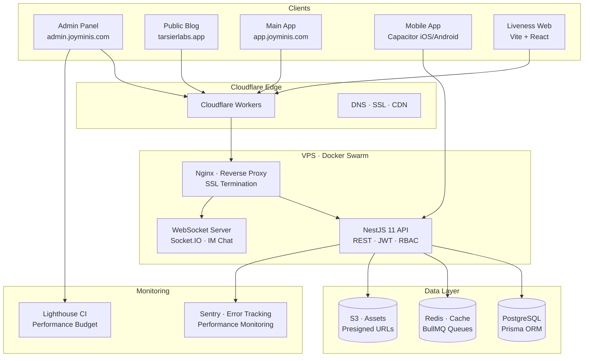
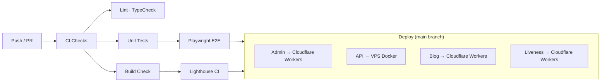

<div align="center">

# 🏗️ JoyMini Backend Platform Nest Monorepo

**Production-grade full-stack e-commerce platform** — Admin dashboard, public blog with mobile app, real-time chat, AI-powered features, and more.

[]()
[](https://www.typescriptlang.org/)
[](https://nextjs.org/)
[](https://react.dev/)
[](https://nestjs.com/)
[](https://www.prisma.io/)
[](https://www.postgresql.org/)
[](https://www.docker.com/)
[](https://cloudflare.com/)
[](https://yarnpkg.com/)
[](https://turbo.build/)
[](https://sentry.io/)

**Live Demos:** [Admin Panel](https://admin.joyminis.com) · [Main App](https://app.joyminis.com) · [Public Blog](https://tarsierlabs.app) · [Blog Admin](https://admin.tarsierlabs.app) · [API Health](https://api.joyminis.com/api/v1/health)

</div>

---

## 📋 Table of Contents

- [Overview](#-overview)
- [Technical Challenges & Solutions](#-technical-challenges--solutions)
- [System Architecture](#-system-architecture)
- [Tech Stack](#-tech-stack)
- [Monorepo Structure](#-monorepo-structure)
- [Quick Start](#-quick-start)
- [Available Commands](#-available-commands)
- [CI/CD Pipeline](#-cicd-pipeline)
- [Testing Strategy](#-testing-strategy)
- [Documentation](#-documentation)
- [My Role](#-my-role)

---

## ✨ Overview

JoyMini Nest is a **production-grade e-commerce platform** built as a monorepo. It serves as both an operational admin system and a public-facing content platform with native mobile support.

**Live URLs:** [`admin.joyminis.com`](https://admin.joyminis.com) Admin Dashboard · [`app.joyminis.com`](https://app.joyminis.com) Main App OAuth & Mobile Entry · [`tarsierlabs.app`](https://tarsierlabs.app) Public Blog · [`admin.tarsierlabs.app`](https://admin.tarsierlabs.app) Blog Admin

**What makes this project stand out:**

- **Full-stack monorepo** — 4 apps + 5 shared packages orchestrated by Turborepo
- **Hybrid rendering** — SSR/CSR strategically applied per page for optimal performance
- **Multi-platform** — Web admin, public blog, mobile app (Capacitor), liveness verification
- **Internationalized** — 6 languages with zero-flicker hydration
- **AI integration** — Content moderation, comment filtering, image recognition
- **Real-time** — WebSocket-based customer service chat
- **Enterprise-grade** — RBAC, audit logging, Sentry monitoring, Lighthouse CI

---

## 🧠 Technical Challenges & Solutions

> _The following are real technical problems I encountered and solved while building this project. Each includes the problem, my approach, and the key implementation details._

---

### 1. Zero-Flicker Theme & i18n Hydration in Next.js 15

**Problem:** Next.js server-renders HTML before React hydrates on the client. During that gap, the browser renders with default styles — then JavaScript loads, reads `localStorage`, and applies the user's theme. This causes a visible **white flash** FOUC on every page load.

**Solution:** Inline critical-path script in `<head>` that runs **before any React code**:

```html
<script>
  (function () {
    try {
      var s = JSON.parse(localStorage.getItem("app-store") || "{}");
      var t = (s.state && s.state.theme) || "dark";
      document.documentElement.classList.add(t);
    } catch (e) {
      document.documentElement.classList.add("dark");
    }
  })();
</script>
```

**Key details:**

- Script reads from the same Zustand `persist` key (`app-store`) to stay in sync
- Uses `suppressHydrationWarning` on `<html>` to avoid React mismatch warnings
- SSR-safe Zustand storage: returns empty `{getItem, setItem, removeItem}` when `typeof window === 'undefined'`
- Theme color meta tags respect `prefers-color-scheme` for mobile browser chrome

**Files:** [`layout.tsx`](apps/admin-next/src/app/layout.tsx:78) · [`useAppStore.ts`](apps/admin-next/src/store/useAppStore.ts:43)

---

### 2. Enterprise-Grade HTTP Client with Race Condition Prevention

**Problem:** In a single-page admin app with aggressive data fetching, multiple concurrent requests can cause:

- Duplicate POST requests creating duplicate records
- Race conditions on token refresh (multiple 401s triggering parallel refresh calls)
- No retry mechanism for transient network failures
- No Sentry instrumentation for debugging API issues

**Solution:** A custom `HttpClient` class wrapping Axios with:

```
┌─────────────────────────────────────────────────────────┐
│                    HttpClient                            │
├─────────────────────────────────────────────────────────┤
│ Request Deduplication                                    │
│   • Non-GET requests keyed by method+url+params          │
│   • Duplicate requests abort the previous via AbortController │
│   • Map<string, AbortController> for cleanup             │
├─────────────────────────────────────────────────────────┤
│ Token Refresh (Single-Fly Pattern)                       │
│   • Concurrent 401s share one refreshPromise             │
│   • Only one actual refresh request is made              │
│   • All queued requests retry with the new token         │
├─────────────────────────────────────────────────────────┤
│ Exponential Backoff Retry                                │
│   • 3 retries max, delay: 1s → 2s → 4s (capped at 30s) │
│   • Only retries on network errors and 5xx responses     │
│   • Disabled in test environment for deterministic tests │
├─────────────────────────────────────────────────────────┤
│ Sentry Performance Instrumentation                       │
│   • Every request creates a Sentry span                  │
│   • Custom span attributes for debugging                 │
└─────────────────────────────────────────────────────────┘
```

**Files:** [`http.ts`](apps/admin-next/src/api/http.ts:17)

---

### 3. SSR-Safe State Management with Zustand

**Problem:** Zustand's `persist` middleware uses `localStorage` by default, which crashes during SSR because `localStorage` doesn't exist on the server. Also, the persisted state needs to be selectively synced (not all state should persist).

**Solution:** Custom SSR-safe storage adapter + selective persistence:

```typescript
storage: createJSONStorage(() => {
  if (typeof window === 'undefined') {
    return { getItem: () => null, setItem: () => {}, removeItem: () => {} };
  }
  return localStorage;
}),
partialize: (state) => ({
  theme: state.theme,
  lang: state.lang,
  isSidebarCollapsed: state.isSidebarCollapsed,
}),
```

**Key details:**

- `partialize` ensures only theme, language, and sidebar state persist — not auth tokens or transient UI state
- Auth tokens are stored separately in `localStorage` + synced to cookies for middleware access
- `useIsClient` hook guards all browser-API-dependent code

**Files:** [`useAppStore.ts`](apps/admin-next/src/store/useAppStore.ts:16) · [`useAuthStore.ts`](apps/admin-next/src/store/useAuthStore.ts:24)

---

### 4. Dual CI/CD Pipeline (GitHub Actions + GitLab CI)

**Problem:** The project needed to support both GitHub and GitLab CI simultaneously during migration, with identical behavior across both platforms.

**Solution:** Modular pipeline architecture with shared configuration:

```
GitHub Actions                          GitLab CI
┌─────────────────┐                    ┌─────────────────┐
│ ci.yml           │                    │ .gitlab-ci.yml   │
│ deploy-*.yml     │                    │ includes:        │
│   (standalone)   │                    │   ci-checks.yml  │
└─────────────────┘                    │   build-*.yml    │
                                        │   deploy-*.yml   │
                                        └─────────────────┘
```

**Key details:**

- GitLab CI uses `include: local` for modular pipeline files in `.gitlab/` directory
- Both pipelines share the same stages: `check → e2e → build → deploy`
- Self-hosted runner support for Docker builds
- Husky + Lint-Staged for pre-commit quality gates

**Files:** [`.github/workflows/`](.github/workflows/) · [`.gitlab/`](.gitlab/) · [`.husky/`](.husky/)

---

### 5. Docker Layer Caching for Yarn 4 Monorepo

**Problem:** In a monorepo with Yarn 4 PnP, Docker builds were slow because every code change invalidated the entire `node_modules` layer. Also, the dev container needed to detect `yarn.lock` changes without manual intervention.

**Solution:** Two-layer caching strategy:

```dockerfile
# Dockerfile.base: Layer 1 — dependency declarations only
COPY package.json yarn.lock .yarnrc.yml ./
COPY .yarn ./.yarn
COPY apps/*/package.json ./apps/*/package.json
COPY packages/*/package.json ./packages/*/package.json
RUN yarn install  # Cached unless lock file changes
```

Plus runtime dependency hash checking in `compose.yml`:

```bash
LOCK_HASH=$(md5sum /app/yarn.lock | cut -d' ' -f1)
CACHE=/app/node_modules/.backend-install-hash
if [ ! -f "$CACHE" ] || [ "$(cat $CACHE)" != "$LOCK_HASH" ]; then
  yarn workspaces focus @lucky/api
  echo "$LOCK_HASH" > "$CACHE"
fi
```

**Files:** [`Dockerfile.base`](Dockerfile.base:1) · [`compose.yml`](compose.yml:32)

---

### 6. Monorepo Shared Package Build Order & Race Conditions

**Problem:** In a Turborepo monorepo, shared packages (`@lucky/shared`, `@repo/ui`) must be built before consuming apps. Docker's parallel startup caused ENOTEMPTY errors when multiple containers tried to build the same package simultaneously.

**Solution:** Dedicated shared-packages builder service + Turborepo dependency graph:

```yaml
# compose.yml
shared-packages-builder:
  build: Dockerfile.base
  command: >
    node /app/packages/shared/scripts/build.js &&
    node /app/packages/ui/scripts/build.js
```

Plus Turborepo `dependsOn` in `turbo.json` ensures local builds respect the same order:

```json
{
  "pipeline": {
    "build": {
      "dependsOn": ["^build"],
      "outputs": ["dist/**"]
    }
  }
}
```

**Files:** [`compose.yml`](compose.yml:66) · [`packages/shared/scripts/build.js`](packages/shared/scripts/build.js)

---

### 7. Multi-Language i18n with Route-Param Locale

**Problem:** The admin panel needs 6 languages (EN, ZH, JA, KO, FR, DE) with the locale in the URL path (`/[locale]/path`). Challenges include: SSR locale detection from headers, client-side locale switching without page reload, and keeping query keys in sync with the current locale for cache invalidation.

**Solution:** `next-intl` with custom configuration:

- Locale in route params: `/[locale]/dashboard/orders`
- SSR locale detection from `Accept-Language` header, synced to route params
- All TanStack Query `queryKey` arrays include the current locale for automatic cache isolation
- Language switching updates both the URL and the query client cache
- Zero-flicker via the inline script approach (see Challenge #1)

**Files:** [`i18n/request.ts`](apps/admin-next/src/i18n/request.ts) · [`i18n/`](apps/admin-next/src/i18n/)

---

### 8. OAuth Deep-Link Flow for Mobile Apps

**Problem:** OAuth flows (Google, Facebook, Apple) on mobile apps require redirecting to the system browser, then returning to the app via a custom URL scheme. This creates challenges around state management, token delivery, and error handling across app restarts.

**Solution:** Deep-link OAuth architecture:

```
Mobile App → System Browser → OAuth Provider
    ↑                              |
    |    (deep link with tokens)    |
    └──────────────────────────────┘
```

- Backend generates a one-time code linked to the OAuth state parameter
- After OAuth success, the backend redirects to the app's custom URL scheme with the code
- Mobile app exchanges the code for tokens via the backend API
- Error states (user cancellation, network failure) are handled via a dedicated error page

**Files:** [`docs/read/features/oauth-deep-link/`](docs/read/features/oauth-deep-link/)

---

### 9. Video HLS Transcoding with Aspect Ratio Preservation

**Problem:** The blog system uploads and transcodes user videos to HLS (HTTP Live Streaming) for adaptive bitrate streaming. The original implementation hardcoded 16:9 resolutions (`854x480`, `1280x720`, `1920x1080`), causing non-16:9 videos (e.g., 4:3, 1:1, vertical 9:16) to be **stretched or deformed** after transcoding. This is especially critical for mobile-uploaded vertical videos.

**Solution:** Dynamic aspect ratio detection + preservation pipeline:

```
Upload (MP4) → ffprobe (width, height) → Compute aspect ratio →
Dynamic quality targets → ffmpeg scale filter with force_original_aspect_ratio=decrease
                                   ↓
                          HLS (m3u8 + .ts segments)
                                   ↓
                         Cloudflare R2 → Blog Frontend
```

**Key implementation details:**

1. **ffprobe dimension detection** — Before transcoding, probe both `width` AND `height` from the source video stream (previously only detected height):

   ```typescript
   const probeDimensions = execSync(
     `ffprobe -v error -select_streams v:0 -show_entries stream=width,height -of csv=p=0 "${inputPath}"`,
   ).trim();
   const [sourceWidthStr, sourceHeightStr] = probeDimensions.split(",");
   ```

2. **Dynamic quality target computation** — Target heights are computed from the source aspect ratio instead of hardcoded:

   ```typescript
   const sourceAspectRatio = sourceWidth / sourceHeight;
   const targetWidth = Math.min(qt.targetWidth, sourceWidth); // Clamp to source
   const computedHeight = Math.round(targetWidth / sourceAspectRatio);
   const targetHeight = Math.min(computedHeight, sourceHeight); // No upscaling
   ```

3. **`force_original_aspect_ratio=decrease`** — The ffmpeg `scale` filter flag ensures the video fits within the target resolution box while maintaining its original aspect ratio (padding with letterbox/pillarbox as needed):

   ```
   -vf "scale=${resolution}:force_original_aspect_ratio=decrease"
   ```

4. **H.264 even dimension constraint** — The H.264 encoder requires even width/height for 4:2:0 chroma subsampling. Any odd dimension will cause encoder errors, so dimensions are snapped down:

   ```typescript
   const evenWidth = targetWidth % 2 === 0 ? targetWidth : targetWidth - 1;
   const evenHeight = targetHeight % 2 === 0 ? targetHeight : targetHeight - 1;
   ```

5. **Dimension clamping** — No upscaling: if the source is smaller than the target quality tier, the source dimensions are used as the ceiling. A 480p source won't be upscaled to 1080p.

6. **Quality tier selection** — Only generates tiers that make sense for the source:
   - `480p` (854px wide): always generated (base tier)
   - `720p` (1280px wide): always generated
   - `1080p` (1920px wide): only generated if source height ≥ 1080px

7. **Async processing via BullMQ** — Transcoding runs in a background worker queue, freeing the API for other requests. The `MediaProcessor` worker handles all media processing jobs with progress tracking and failure logging.

**Files:** [`media-processor.service.ts`](apps/api/src/common/media/media-processor.service.ts:194) · [`media.processor.ts`](apps/api/src/common/media/media.processor.ts:156) · [`media-processor.constants.ts`](apps/api/src/common/media/media-processor.constants.ts) · [`HlsVideoPlayer.tsx`](apps/frontend-blog/src/components/blog/HlsVideoPlayer.tsx:18) · [`frontend-blog.ts`](apps/frontend-blog/src/lib/types/frontend-blog.ts) · [`media.ts`](apps/frontend-blog/src/lib/utils/media.ts) · [`blog-video-system-architecture.md`](docs/blog/architecture/blog-video-system-architecture.md)

**Architecture docs:** [`blog-system-architecture.md`](docs/blog/architecture/blog-system-architecture.md#23-video-hls-transcoding-pipeline) · [`blog-video-system-architecture.md`](docs/blog/architecture/blog-video-system-architecture.md)

---

## 🏛️ System Architecture



---

## 🛠️ Tech Stack

| Layer                | Technologies                                                                                               |
| -------------------- | ---------------------------------------------------------------------------------------------------------- |
| **Frontend (Admin)** | Next.js 15, React 19, TypeScript 5.5, Tailwind CSS, Framer Motion, Zustand, TanStack Query/Table, Recharts |
| **Frontend (Blog)**  | Next.js 15, React 19, Emotion, Capacitor 6 (iOS/Android), PWA                                              |
| **Backend API**      | NestJS 11, Prisma 6, PostgreSQL, Redis, BullMQ, Socket.IO, Passport.js                                     |
| **Shared Packages**  | `@lucky/shared` (types/constants/utils), `@repo/ui` (component library), shared ESLint/TS configs          |
| **Infrastructure**   | Docker, Docker Compose, Nginx, Cloudflare Workers, VPS                                                     |
| **CI/CD**            | GitHub Actions, GitLab CI, Husky, Lint-Staged, Commitlint                                                  |
| **Monitoring**       | Sentry (error tracking + performance), Lighthouse CI, Playwright E2E                                       |
| **AI/ML**            | Google Gemini (content moderation), AWS Rekognition (liveness), Vertex AI                                  |
| **Auth**             | JWT (access + refresh tokens), OAuth 2.0 (Google, Facebook, Apple), RBAC                                   |
| **i18n**             | next-intl, 6 languages (EN, ZH, JA, KO, FR, DE)                                                            |

---

## 📁 Monorepo Structure

```
lucky-nest-monorepo/
├── apps/
│   ├── admin-next/          # Admin dashboard (Next.js 15)
│   │   ├── src/app/         # App Router + layouts
│   │   ├── src/api/         # Axios HTTP client with retry + Sentry spans
│   │   ├── src/store/       # Zustand stores (auth, app, toast)
│   │   ├── src/views/       # Page-level view components
│   │   ├── src/i18n/        # 6-language translations
│   │   └── src/components/  # Shared UI components
│   │
│   ├── api/                 # Backend API (NestJS 11)
│   │   ├── src/admin/       # Admin controllers/services/modules
│   │   ├── src/client/      # Client-facing endpoints
│   │   ├── prisma/          # Schema + migrations
│   │   └── scripts/         # Seed + CLI tools
│   │
│   ├── admin-blog/          # Blog CMS admin dashboard (Next.js 15)
│   │   ├── src/app/         # App Router + layouts
│   │   ├── src/i18n/        # 6-language translations
│   │   └── src/components/  # Blog CMS UI components
│   │
│   ├── frontend-blog/       # Public blog (Next.js + Capacitor)
│   │   ├── src/lib/         # Hooks, API clients, utilities
│   │   ├── android/         # Capacitor Android project
│   │   └── scripts/         # Build + deploy scripts
│   │
│   └── liveness-web/        # Liveness check (Vite + React)
│
├── packages/
│   ├── shared/              # Shared types, constants, utilities
│   ├── ui/                  # UI component library (React)
│   │   ├── src/components/  # BaseSelect, Modal, MediaUploader, SwipeableList
│   │   ├── src/form/        # Form system (validation, fields, theming)
│   │   └── src/ui/          # Shadcn-style primitives
│   ├── eslint-config/       # Shared ESLint configurations
│   ├── typescript-config/   # Shared TypeScript configurations
│   └── config/              # Code generation utilities
│
├── deploy/                  # Deployment scripts
├── docs/                    # Documentation
├── nginx/                   # Nginx configuration
├── docker/                  # Dockerfiles
└── scripts/                 # Utility scripts
```

---

## 🚀 Quick Start

### Prerequisites

- **Node.js** >= 18
- **Yarn** 4.x (`corepack enable && corepack prepare yarn@4 --activate`)
- **Docker** & **Docker Compose** (for local backend)

### 1. Clone & Install

```bash
git clone https://github.com/MrBigPorter/lucky-nest-monorepo.git
cd lucky-nest-monorepo
corepack enable
yarn install
```

### 2. Start Backend (Docker)

```bash
# Start PostgreSQL, Redis, and NestJS API
docker compose --env-file deploy/.env.dev up -d --build

# Run database migrations
docker exec -it lucky-backend-dev sh -lc "yarn workspace @lucky/api prisma migrate deploy"

# Seed demo data
docker exec -it lucky-backend-dev sh -lc "yarn workspace @lucky/api seed"
```

### 3. Start Frontend

```bash
# Admin panel (port 4001)
yarn workspace @lucky/admin-next dev

# Public blog (port 3000)
yarn workspace @lucky/frontend-blog dev
```

### 4. Access

| Service     | URL                                 |
| ----------- | ----------------------------------- |
| Admin Panel | http://localhost:4001               |
| Public Blog | http://localhost:3000               |
| API         | http://localhost:3000/api           |
| API Health  | http://localhost:3000/api/v1/health |

---

## 📋 Available Commands

### Development

| Command                                   | Description                            |
| ----------------------------------------- | -------------------------------------- |
| `yarn dev`                                | Start all apps in dev mode (Turborepo) |
| `yarn dev:admin`                          | Admin panel only                       |
| `yarn dev:api`                            | API only                               |
| `yarn workspace @lucky/admin-next dev`    | Admin panel (standalone)               |
| `yarn workspace @lucky/frontend-blog dev` | Blog (standalone)                      |

### Build & Lint

| Command            | Description              |
| ------------------ | ------------------------ |
| `yarn build`       | Build all apps           |
| `yarn build:admin` | Admin panel only         |
| `yarn lint`        | Lint all workspaces      |
| `yarn check-types` | TypeScript type checking |
| `yarn format`      | Prettier formatting      |

### Docker

| Command            | Description            |
| ------------------ | ---------------------- |
| `yarn docker:up`   | Start dev environment  |
| `yarn docker:down` | Stop dev environment   |
| `yarn docker:prod` | Start production stack |
| `yarn docker:logs` | View logs              |

### Database

| Command            | Description              |
| ------------------ | ------------------------ |
| `yarn pr:m:new`    | Create new migration     |
| `yarn pr:m:deploy` | Apply pending migrations |
| `yarn pr:studio`   | Open Prisma Studio       |
| `yarn db:seed:dev` | Seed demo data           |

### Testing

| Command                                 | Description                  |
| --------------------------------------- | ---------------------------- |
| `yarn test`                             | Run all tests                |
| `yarn workspace @lucky/admin-next test` | Admin tests (Vitest)         |
| `yarn workspace @lucky/api test`        | API tests (Jest)             |
| `yarn workspace @lucky/admin-next e2e`  | Playwright E2E tests         |
| `yarn perf:lighthouse`                  | Lighthouse performance audit |

### Deploy

| Command                   | Description                |
| ------------------------- | -------------------------- |
| `yarn deploy:backend`     | Deploy API to VPS          |
| `yarn deploy:admin`       | Deploy admin to Cloudflare |
| `yarn deploy:quick`       | Quick deploy (both)        |
| `yarn rollback:backend`   | Rollback API               |
| `yarn rollback:admin:dns` | Rollback admin DNS         |

---

## 🔄 CI/CD Pipeline

The project uses **both GitHub Actions and GitLab CI** for maximum flexibility.



- **GitHub Actions**: [`ci.yml`](.github/workflows/ci.yml), [`deploy-admin-cloudflare.yml`](.github/workflows/deploy-admin-cloudflare.yml), [`deploy-backend.yml`](.github/workflows/deploy-backend.yml), [`playwright.yml`](.github/workflows/playwright.yml), [`lighthouse-ci.yml`](.github/workflows/lighthouse-ci.yml)
- **GitLab CI**: Modular pipeline in [`.gitlab/`](.gitlab/) directory
- **Pre-commit**: Husky + Lint-Staged for automatic linting and formatting

---

## 🧪 Testing Strategy

| Layer             | Tool                              | Scope                                     |
| ----------------- | --------------------------------- | ----------------------------------------- |
| **Unit Tests**    | Vitest (frontend), Jest (backend) | Components, hooks, services, utilities    |
| **E2E Tests**     | Playwright                        | Critical user flows (login, checkout)     |
| **Performance**   | Lighthouse CI                     | Performance budgets, regression detection |
| **Type Checking** | TypeScript `--noEmit`             | Full-stack type safety                    |

Testing standards and guidelines are documented in [`docs/read/testing/`](docs/read/testing/).

---

## 📚 Documentation

The project has extensive documentation organized by role:

| Audience             | Documents                                                                                                                                                                      |
| -------------------- | ------------------------------------------------------------------------------------------------------------------------------------------------------------------------------ |
| **New Developers**   | [Getting Started](docs/read/getting-started/) · [Onboarding](docs/read/getting-started/ONBOARDING_CN.md)                                                                       |
| **Architecture**     | [System Design](ARCHITECTURE_CN.md) · [Admin SSR/CSR](docs/read/architecture/) · [NestJS API](docs/read/architecture/NESTJS_API_ARCHITECTURE_CN.md)                            |
| **Operations**       | [Runbook](RUNBOOK.md) · [Deploy Quickstart](docs/read/getting-started/DEPLOY_QUICKSTART_CN.md)                                                                                 |
| **Features**         | [Feature Index](docs/read/features/FEATURES_CN.md) · [Lucky Draw](docs/read/features/LUCKY_DRAW_DESIGN_CN.md) · [IM Chat](docs/read/features/IM_SUPPORT_REALTIME_CN.md)        |
| **Testing**          | [Standards](docs/read/testing/TESTING_STANDARDS_CN.md) · [API Testing](docs/read/testing/TESTING_API_CN.md)                                                                    |
| **Blog**             | [Blog Docs](docs/blog/) · [System Architecture](docs/blog/architecture/blog-system-architecture.md) · [Video System](docs/blog/architecture/blog-video-system-architecture.md) |
| **AI Collaboration** | [Constitution](docs/ai-constitution-detailed.md) · [Project Rules](.clinerules)                                                                                                |

---

## 👤 My Role

As the **founder and solo developer** of this project, I:

- 🏛️ **Architected** the entire monorepo structure (Yarn 4 + Turborepo)
- 🎨 **Built** the admin dashboard from scratch ([`admin.joyminis.com`](https://admin.joyminis.com), Next.js 15, React 19, Tailwind CSS)
- ⚙️ **Developed** the backend API ([`api.joyminis.com`](https://api.joyminis.com/api/v1/health), NestJS 11, Prisma 6, PostgreSQL)
- 📱 **Created** the public blog with Capacitor mobile app ([`tarsierlabs.app`](https://tarsierlabs.app), iOS/Android)
- 🌐 **Deployed** the main app entry point ([`app.joyminis.com`](https://app.joyminis.com), OAuth callbacks, mobile deep-link)
- 🔐 **Implemented** authentication (JWT, OAuth 2.0, RBAC)
- 🌐 **Set up** internationalization (6 languages, zero-flicker hydration)
- 🚀 **Designed** CI/CD pipelines (GitHub Actions + GitLab CI)
- 🐳 **Containerized** the entire stack (Docker, Docker Compose, Nginx)
- 📊 **Integrated** monitoring (Sentry, Lighthouse CI)
- 🤖 **Added** AI features (Gemini moderation, AWS Rekognition)
- 📝 **Wrote** comprehensive documentation (30+ documents)

---

## 📄 License

This project is private and not licensed for public use.

---

<div align="center">

**Built with** ❤️ **using** Next.js · NestJS · Prisma · Docker · Cloudflare

</div>
