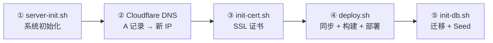

# Lucky Nest 运维手册

> 一站式运维手册：新服务器部署 → 日常运维 → 故障排查。全流程覆盖。

---

## 📋 快速索引

| 场景 | 跳到 |
|------|------|
| 🆕 **新服务器从零部署** | [第一章 →](#part-1-新服务器部署) |
| 🚀 **部署后端代码** | [§2.1](#21-方式-1git-push-自动部署推荐) |
| 🔙 **紧急回滚** | [§2.6](#26-回滚操作) |
| ☁️ **Cloudflare DNS 切流/回滚** | [§2.7](#27-cloudflare-dns-管理) |
| 🔧 **改了 .env.prod 配置** | [§3.3](#33-改了配置后怎么做) |
| 🔄 **重启后端** | [§2.5](#25-容器管理) |
| 🗄️ **数据库迁移 / Seed** | [§4.1](#41-数据库迁移) / [§4.3](#43-seed-数据) |
| 💾 **备份 / 恢复数据库** | [§4.4](#44-备份数据库) / [§4.5](#45-恢复数据库) |
| 🔒 **SSL 证书续期** | [§5.1](#51-证书续期) |
| 👀 **查看日志 / 监控** | [§6.1](#61-查看日志) / [§6.3](#63-监控告警) |
| ✅ **验证 Blog 缓存** | [§6.5](#65-blog-缓存验证) |
| 🛠️ **Makefile 开发命令** | [§9.7](#97-makefile-开发命令) |
| 🚀 **GitHub Actions CI/CD** | [§2.9](#29-github-actions-部署控制) |
| ⚠️ **出问题了** | [Part 8 →](#part-8-故障排查) |
| 📖 **命令速查** | [Part 9 →](#part-9-命令速查) |

---

# Part 1: 新服务器部署

> 目标：从一台全新 Ubuntu 22.04 VPS 到完整运行生产环境。
> 预计：首次约 30-45 分钟（含 DNS 等待）。

## 1.1 前置准备

| 项目 | 说明 |
|------|------|
| VPS | Ubuntu 22.04, 8GB+ RAM, root 访问 |
| 域名 DNS | Cloudflare 管理，可修改 A 记录 |
| 本地 Mac | 已安装 Docker、有本项目代码 |
| 邮箱 | Let's Encrypt 证书注册用 |

## 1.2 配置 SSH 免密码登录（一次性）

```bash
# 检查是否已有密钥
ls -la ~/.ssh/

# 如果没有，生成新密钥（一路 Enter）
ssh-keygen -t ed25519 -C "your@email.com"

# 复制公钥到服务器（需输入一次密码）
ssh-copy-id root@<VPS_IP>

# 验证（以后不再问密码）
ssh root@<VPS_IP> "echo 'OK'"
```

**推荐**：配置 SSH 别名（编辑 `~/.ssh/config`）：
```
Host lucky
    HostName <VPS_IP>
    User root
    IdentityFile ~/.ssh/id_ed25519
```
之后用 `ssh lucky` 即可连接。

## 1.3 部署流程图



> ③ 必须在 ② 之后（会检查 DNS 解析）。

## 1.4 五步部署

### ① 服务器初始化

**脚本**：[`deploy/server-init.sh`](deploy/server-init.sh)

```bash
scp deploy/server-init.sh root@<新IP>:/root/
ssh root@<新IP> "chmod +x /root/server-init.sh && /root/server-init.sh"
```

自动完成：系统更新 → Swap 2GB → Docker → UFW 防火墙 → Fail2Ban → 项目目录 → Certbot → coturn（可选）。

**内存预算**（8GB 服务器）：
| 组件 | 内存 |
|------|------|
| OS + Docker | ~500 MB |
| 后端 (Node + ffmpeg) | ≤2 GB |
| PostgreSQL | ≤2 GB |
| Redis | ≤512 MB |
| Nginx | ≤64 MB |
| Swap 兜底 | 2 GB |

### ② Cloudflare DNS

| 记录 | 类型 | 值 | 代理 |
|------|------|----|------|
| `api.joyminis.com` | A | 新 IP | 仅 DNS（灰云） |

生效验证：`dig api.joyminis.com +short @1.1.1.1`

### ③ SSL 证书

**脚本**：[`deploy/init-cert.sh`](deploy/init-cert.sh)

```bash
ssh root@<新IP> "CERT_EMAIL='your@email.com' bash /opt/lucky/deploy/init-cert.sh"
```

自动：验证 DNS → 停止 nginx → certbot 申请 → 复制到 `/opt/lucky/certs/` → 重启 nginx。

### ④ 本地全量部署

**脚本**：[`deploy/deploy.sh`](deploy/deploy.sh)

```bash
export VPS_IP=<新IP>
./deploy/deploy.sh
```

| 参数 | 作用 |
|------|------|
| `--backend` | 仅后端（当前默认全量） |
| `--quick` | 跳过构建，仅重启 |
| `--sync` | 仅同步配置文件 |

流程：同步配置文件 → 本地构建 linux/amd64 镜像 → 压缩传输到 VPS → Prisma 迁移 → 启动服务 → 健康检查 → 失败自动回滚。

### ⑤ 数据库初始化

**脚本**：[`deploy/init-db.sh`](deploy/init-db.sh)

```bash
ssh root@<新IP> "bash /opt/lucky/deploy/init-db.sh"
```

完成后创建管理员：
```bash
ssh root@<新IP> "docker exec -it lucky-backend-prod \
  node /app/apps/api/dist/cli/cli/create-admin.js"
```

## 1.5 后续维护 cron

```bash
# 监控（每 5 分钟）
ssh lucky "(crontab -l 2>/dev/null; echo '*/5 * * * * /opt/lucky/deploy/monitor.sh >> /var/log/lucky-monitor.log 2>&1') | crontab -"

# 备份（每天凌晨 3 点）
ssh lucky "(crontab -l 2>/dev/null; echo '0 3 * * * /opt/lucky/deploy/backup.sh >> /var/log/lucky-backup.log 2>&1') | crontab -"

# 证书续期（每周一 3:00）
ssh lucky "(crontab -l 2>/dev/null; echo '0 3 * * 1 /opt/lucky/deploy/renew-cert.sh >> /var/log/lucky-cert-renew.log 2>&1') | crontab -"
```

---

# Part 2: 部署

> **核心原则**：大多数时候你只需要 `git push`。

## 2.1 方式 1：`git push` 自动部署（推荐）

```bash
git add .
git commit -m "改了啥"
git push
```

GitHub Actions 自动：检查代码 → 构建镜像 → 推送到 GHCR → SSH 到 VPS → 拉取镜像 → 重启后端 → 健康检查。

> ⚠️ 只有改了 `apps/api/**` 或 `packages/shared/**` 才会触发。改前端不会触发后端 CI。

## 2.2 方式 2：本地手动部署（网络慢时备用）

```bash
# 全量部署
VPS_IP=<IP> ./deploy/deploy.sh

# 仅后端
VPS_IP=<IP> ./deploy/deploy.sh --backend

# 仅前端 admin-next
VPS_IP=<IP> ./deploy/deploy.sh --admin

# 跳过构建，仅重启
VPS_IP=<IP> ./deploy/deploy.sh --quick

# 仅同步配置文件
VPS_IP=<IP> ./deploy/deploy.sh --sync
```

## 2.3 如何强制触发部署

如果 CI 显示 ✅ 绿色但线上还是旧代码（`appleboy/ssh-action` 的 bug）:

```bash
# 方式 A：去 GitHub → Actions → "🚀 Master Deployment Control" → Run workflow

# 方式 B：SSH 强制重建
ssh lucky 'cd /opt/lucky && BACKEND_IMAGE=ghcr.io/mrbigporter/lucky-backend-prod:latest docker compose -f compose.prod.yml --env-file deploy/.env.prod up -d --no-build --force-recreate backend'

# 方式 C：推送空 commit
git commit --allow-empty -m "chore: force backend deploy"
git push
```

## 2.4 如何改配置（环境变量）

参见 [§3.3](#33-改了配置后怎么做)。

## 2.5 容器管理

```bash
# 查看所有容器
ssh lucky 'docker ps -a'

# 重启后端
ssh lucky 'cd /opt/lucky && docker compose -f compose.prod.yml restart backend'

# 强制重建（改配置后用）
ssh lucky 'cd /opt/lucky && docker compose -f compose.prod.yml --env-file deploy/.env.prod up -d --no-build --force-recreate backend'

# 查看当前运行版本
ssh lucky 'docker inspect lucky-backend-prod --format "{{.Config.Image}}"'

# 停止所有
ssh lucky 'cd /opt/lucky && docker compose -f compose.prod.yml down'

# 查看资源使用
ssh lucky 'docker stats --no-stream'
```

## 2.6 回滚操作

**脚本**：[`deploy/rollback.sh`](deploy/rollback.sh)

当新部署导致服务异常时，快速回滚到上一个可用版本。

```bash
# 交互输入 VPS IP
./deploy/rollback.sh

# 或者预设 VPS IP
VPS_IP=<IP> ./deploy/rollback.sh

# 参数说明：
#   --backend    仅回滚后端
#   --admin      仅回滚前端 admin-next
#   --db         恢复数据库备份
```

**容器回滚**（`--backend` / `--admin`）：
- 本地 SSH 到 VPS → `docker compose up -d --no-build --force-recreate`
- 重新启动**上一个已拉取的镜像**（不回退镜像版本）
- 等待 8 秒后检查服务状态

**数据库回滚**（`--db`）：
```bash
VPS_IP=<IP> ./deploy/rollback.sh --db
```
- 列出 `/opt/lucky/backups/` 下最近的 5 个备份
- 交互确认后，解压最新备份并 `pg_restore --clean`
- 重启后端容器

> ⚠️ 数据库回滚会覆盖当前数据，操作前请确认！

## 2.7 Cloudflare DNS 管理

用于在 `admin.joyminis.com` 的 DNS 解析在 **VPS** 与 **Cloudflare Workers** 之间切换。

### 正向切流（VPS → Workers）

**脚本**：[`deploy/switch-admin-cloudflare.sh`](deploy/switch-admin-cloudflare.sh)

```bash
# 默认 dry-run（仅预览，不实际修改）
bash deploy/switch-admin-cloudflare.sh

# 实际执行
bash deploy/switch-admin-cloudflare.sh --execute
```

**必填环境变量**（在调用前 `export`）：
| 变量 | 说明 |
|------|------|
| `CLOUDFLARE_API_TOKEN` | Cloudflare API 令牌 |
| `CLOUDFLARE_ZONE_ID` | 域名 Zone ID |
| `CLOUDFLARE_DNS_RECORD_ID` | DNS 记录 ID |
| `CF_SWITCH_TARGET` | 目标值（Workers 域名或 VPS IP） |

**可选环境变量**：
| 变量 | 默认值 | 说明 |
|------|--------|------|
| `CF_RECORD_NAME` | `admin.joyminis.com` | DNS 记录名 |
| `CF_SWITCH_TYPE` | `CNAME` | `A` 或 `CNAME` |

### 反向回滚（Workers → VPS）

**脚本**：[`deploy/cloudflare-rollback.sh`](deploy/cloudflare-rollback.sh)

```bash
# 默认 dry-run
bash deploy/cloudflare-rollback.sh

# 实际执行
bash deploy/cloudflare-rollback.sh --execute
```

**必填环境变量**：
| 变量 | 说明 |
|------|------|
| `CLOUDFLARE_API_TOKEN` | Cloudflare API 令牌 |
| `CLOUDFLARE_ZONE_ID` | 域名 Zone ID |
| `CLOUDFLARE_DNS_RECORD_ID` | DNS 记录 ID |
| `CF_ROLLBACK_TARGET` | 回滚目标值 |

**安全保护**：回滚脚本会拒绝将 `admin.joyminis.com` 指向 `api.joyminis.com`。

### Makefile 快捷方式

```bash
# dry-run 模式
make switch-admin-dns
make rollback-admin-dns

# 预设环境变量
CLOUDFLARE_API_TOKEN=<token> CLOUDFLARE_ZONE_ID=<zone> CLOUDFLARE_DNS_RECORD_ID=<id> CF_SWITCH_TARGET=<target> make switch-admin-dns
```

## 2.8 Blog Cloudflare 部署

**脚本**：[`deploy/blog-cloudflare.sh`](deploy/blog-cloudflare.sh)

将前端 Blog 部署到 Cloudflare Workers（open-next 模式，非 VPS）：

```bash
# 本地执行
bash deploy/blog-cloudflare.sh
```

支持指定环境：
```bash
DOMAIN=blog-dev.joyminis.com bash deploy/blog-cloudflare.sh
```

CI 自动部署：参见 [`deploy-blog-cloudflare.yml`](.github/workflows/deploy-blog-cloudflare.yml)。

## 2.9 GitHub Actions 部署控制

**工作流**：[`.github/workflows/deploy-master.yml`](.github/workflows/deploy-master.yml)

| 工作流文件 | 用途 |
|-----------|------|
| [`deploy-master.yml`](.github/workflows/deploy-master.yml) | **手动触发**的 master 分支部署总控 |
| [`deploy-backend.yml`](.github/workflows/deploy-backend.yml) | 后端 API 自动 CI/CD（push 触发） |
| [`deploy-admin-cloudflare.yml`](.github/workflows/deploy-admin-cloudflare.yml) | Admin 前端 Cloudflare 自动部署 |
| [`deploy-blog-cloudflare.yml`](.github/workflows/deploy-blog-cloudflare.yml) | Blog 前端 Cloudflare 自动部署 |
| [`deploy-admin-blog-cloudflare.yml`](.github/workflows/deploy-admin-blog-cloudflare.yml) | Admin+Blog 联合 Cloudflare 部署 |
| [`ci.yml`](.github/workflows/ci.yml) | 全量 CI（lint + type-check + test） |
| [`playwright.yml`](.github/workflows/playwright.yml) | E2E 测试 |
| [`lighthouse-ci.yml`](.github/workflows/lighthouse-ci.yml) | 性能审计 |

### 手动触发部署

```bash
# 去 GitHub → Actions → "🚀 Master Deployment Control" → Run workflow
```

可选参数：
- **runner**: `ubuntu-latest`（GitHub 托管）或 `self-hosted`（本地 Mac 算力）
- **deploy_admin_cloudflare**: ☁️ 是否部署 Admin 到 Cloudflare
- **deploy_api**: ⚙️ 是否部署后端到 VPS

### CI 自动触发

| 触发条件 | 触发的工作流 |
|---------|-------------|
| push 到 `apps/api/**` / `packages/shared/**` | deploy-backend.yml |
| push 到 `apps/admin-next/**` | deploy-admin-cloudflare.yml |
| push 到 `apps/frontend-blog/**` | deploy-blog-cloudflare.yml |
| 任意 push + PR | ci.yml（lint + type-check） |

---

# Part 3: 配置管理

## 3.1 配置文件在哪

| 文件 | 用途 | 是否提交 Git |
|------|------|-------------|
| [`deploy/.env.dev`](deploy/.env.dev) | 开发环境 | ❌ |
| [`deploy/.env.prod`](deploy/.env.prod) | **生产环境**（密码、API Key 等） | ❌ |
| [`deploy/.env.example`](deploy/.env.example) | 配置模板 | ✅ |

## 3.2 关键配置项速查

| 用途 | 变量 | 位置（行号） |
|------|------|-------------|
| 数据库连接 | `DATABASE_URL` | [`deploy/.env.prod:25`](deploy/.env.prod:25) |
| Redis 连接 | `REDIS_URL` | [`deploy/.env.prod:26`](deploy/.env.prod:26) |
| JWT 密钥 | `JWT_SECRET` | [`deploy/.env.prod:43`](deploy/.env.prod:43) |
| Gemini API Key | `GOOGLE_GEMINI_API_KEY` | [`deploy/.env.prod:99`](deploy/.env.prod:99) |
| Groq API Key | `GROQ_API_KEY` | [`deploy/.env.prod:100`](deploy/.env.prod:100) |
| DeepSeek API Key | `DEEPSEEK_API_KEY` | [`deploy/.env.prod:101`](deploy/.env.prod:101) |
| CORS 域名 | `CORS_ORIGIN` | [`deploy/.env.prod:31`](deploy/.env.prod:31) |
| TURN 密钥 | `TURN_SECRET` | [`deploy/.env.prod:115`](deploy/.env.prod:115) |
| 内存限制 | `NODE_OPTIONS` | [`compose.prod.yml:41`](compose.prod.yml:41) |
| 容器内存 | `memory: 2G` | [`compose.prod.yml:46`](compose.prod.yml:46) |
| PG 优化参数 | `shared_buffers` | [`compose.prod.yml:153`](compose.prod.yml:153) |

## 3.3 改了配置后怎么做

> ⚠️ **最容易犯的错**：`docker restart` 不会重新读取 .env！

```bash
# 步骤 1：修改本地的 deploy/.env.prod

# 步骤 2：传到 VPS
scp deploy/.env.prod lucky:/opt/lucky/deploy/

# 步骤 3：让 Docker 重新读取配置
ssh lucky 'cd /opt/lucky && docker compose -f compose.prod.yml --env-file deploy/.env.prod up -d --no-build --force-recreate backend'
```

---

# Part 4: 数据库

## 4.1 数据库迁移

改了 `schema.prisma` 后，需要运行迁移。CI 部署会自动执行，手动方式：

```bash
ssh lucky 'cd /opt/lucky && docker run --rm \
  --network lucky_app \
  --env-file deploy/.env.prod \
  --entrypoint "" \
  ghcr.io/mrbigporter/lucky-backend-prod:latest \
  ./node_modules/.bin/prisma migrate deploy \
    --schema=apps/api/prisma/schema.prisma'
```

## 4.2 基线操作（P3005 错误时）

**场景**：数据库已有表但无迁移记录，报错 `P3005`。

**脚本**：[`deploy/baseline-db.sh`](deploy/baseline-db.sh)

```bash
ssh lucky 'bash /opt/lucky/deploy/baseline-db.sh'
```

此操作把所有已存在的迁移标记为"已应用"，之后 `prisma migrate deploy` 只跑增量。

## 4.3 Seed 数据

**脚本**：[`deploy/init-db.sh`](deploy/init-db.sh)（含 Seed 步骤）

```bash
# 迁移 + Seed
ssh lucky 'bash /opt/lucky/deploy/init-db.sh'

# 仅迁移
ssh lucky 'bash /opt/lucky/deploy/init-db.sh --migrate-only'
```

**注意**：Seed 需要 `/opt/lucky/apps/api` 目录存在。先运行 `deploy.sh` 后再执行。

## 4.4 备份数据库

**脚本**：[`deploy/backup.sh`](deploy/backup.sh)

```bash
ssh lucky 'bash /opt/lucky/deploy/backup.sh'
```

备份文件保存在 `/opt/lucky/backups/backup_YYYYMMDD_HHMMSS.dump.gz`，保留 30 天。

## 4.5 恢复数据库

```bash
# 找到备份文件
ssh lucky 'ls -lh /opt/lucky/backups/'

# 解压并恢复
ssh lucky 'gunzip -c /opt/lucky/backups/backup_20260101_000000.dump.gz | docker exec -i lucky-db-prod pg_restore -U lucky_prod -d lucky_prod --no-owner --no-privileges --clean'
```

> ⚠️ 恢复会丢失备份后的数据！

---

# Part 5: SSL 证书

## 5.1 证书续期

**脚本**：[`deploy/renew-cert.sh`](deploy/renew-cert.sh)

```bash
# 手动续期
ssh lucky 'bash /opt/lucky/deploy/renew-cert.sh'
```

**自动续期**：每周一 03:00 通过 cron 运行，仅当证书剩余 <30 天时续期。

## 5.2 证书路径

| 文件 | 路径 | 权限 |
|------|------|------|
| 证书文件 | `/opt/lucky/certs/server.crt` | 644 |
| 私钥 | `/opt/lucky/certs/server.key` | 600 |
| Let's Encrypt 源 | `/etc/letsencrypt/live/api.joyminis.com/` | - |

## 5.3 Nginx 挂载

[`compose.prod.yml:90`](compose.prod.yml:90)：
```yaml
- ./certs:/etc/nginx/certs
```

---

# Part 6: 监控 & 日志

## 6.1 查看日志

```bash
# 后端日志（最近 50 行）
ssh lucky 'docker logs --tail=50 lucky-backend-prod'

# 实时日志（Ctrl+C 退出）
ssh lucky 'docker logs -f --tail=50 lucky-backend-prod'

# Nginx 日志
ssh lucky 'docker logs --tail=50 lucky-nginx-prod'

# DB 日志
ssh lucky 'docker logs --tail=50 lucky-db-prod'
```

## 6.2 验证部署

```bash
curl https://api.joyminis.com/api/v1/health
# 预期：{"code":10000,"message":"success","data":{"ok":true}}
```

## 6.3 监控告警

**脚本**：[`deploy/monitor.sh`](deploy/monitor.sh)

每 5 分钟检查（通过 cron）：
- 4 个容器是否运行（backend / db / redis / nginx）
- API 健康检查
- 内存使用 >85%
- 磁盘使用 >85%
- Swap 使用 >50%

告警日志：`/var/log/lucky-alerts.log`

```bash
# 查看最新告警
ssh lucky 'tail -20 /var/log/lucky-alerts.log'

# 查看监控日志
ssh lucky 'tail -20 /var/log/lucky-monitor.log'
```

## 6.4 系统资源

```bash
# 磁盘 & 内存
ssh lucky 'df -h && echo "---" && free -h'

# 容器内存
ssh lucky 'docker stats --no-stream'
```

## 6.5 Blog 缓存验证

**脚本**：[`deploy/verify-blog-cache.sh`](deploy/verify-blog-cache.sh)

验证 Cloudflare Workers 部署后各缓存层是否正常工作：

```bash
# 验证生产环境
bash deploy/verify-blog-cache.sh

# 验证测试环境
bash deploy/verify-blog-cache.sh blog-dev.joyminis.com
```

检查项：
| 检查 | 说明 | 预期 |
|------|------|------|
| HTTP 状态码 | 基本可达性 | 200 |
| Cloudflare Edge Cache | `cf-cache-status` 头部 | HIT |
| Cache-Control | 浏览器缓存头部 | `max-age=3600` |
| 静态资源缓存 | JS/CSS 边缘缓存 | HIT |
| KV ISR 缓存 | 响应时间对比（首次 vs 后续） | 后续应显著更快 |
| Content-Encoding | 压缩头部 | zstd/br/gzip |
| 安全头部 | HSTS / X-Frame-Options | 正确设置 |

### Makefile 快捷方式

```bash
make verify-blog-cache
```

## 6.6 TURN/STUN 服务器

**安装脚本**：[`deploy/install-turn.sh`](deploy/install-turn.sh)

用于 WebRTC 音视频通信的 coturn 服务器。

```bash
# 在 VPS 上安装
ssh lucky 'TURN_SECRET="<your-random-secret>" bash /opt/lucky/deploy/install-turn.sh'
```

安装完成后的配置同步：
```bash
# 1. 在 deploy/.env.prod 中设置
TURN_SECRET=<同上面相同的密钥>
TURN_URL=turn:<TURN_DOMAIN_OR_IP>:3478?transport=udp

# 2. 同步配置到 VPS 并重启后端
scp deploy/.env.prod lucky:/opt/lucky/deploy/
ssh lucky 'cd /opt/lucky && docker compose -f compose.prod.yml --env-file deploy/.env.prod up -d --no-build --force-recreate backend'
```

验证：
```bash
ssh lucky 'ss -lntup | grep 3478'
ssh lucky 'tail -n 100 /var/log/turnserver.log'
```

> 可选：在 Cloudflare 添加 `turn.joyminis.com` A 记录指向 VPS IP，然后设置 `TURN_URL=turn:turn.joyminis.com:3478?transport=udp`。

---

# Part 7: Nginx

## 7.1 配置文件

| 文件 | 用途 |
|------|------|
| [`nginx/nginx.prod.conf`](nginx/nginx.prod.conf) | 主要配置（API 网关） |
| [`nginx/whitelist.conf`](nginx/whitelist.conf) | IP 白名单 |

## 7.2 改了 Nginx 配置后

```bash
# 1. 传到 VPS
scp nginx/nginx.prod.conf lucky:/opt/lucky/nginx/
scp nginx/whitelist.conf lucky:/opt/lucky/nginx/

# 2. 校验语法
ssh lucky 'docker exec lucky-nginx-prod nginx -t'

# 3. 重载（test successful 后）
ssh lucky 'docker exec lucky-nginx-prod nginx -s reload'
```

---

# Part 8: 故障排查

| 症状 | 可能原因 | 解决 |
|------|---------|------|
| 接口 404 | 后端未运行 | `docker ps` 检查 → `docker compose restart backend` |
| AI 只有 Gemini | API Key 没生效 | 见 [§3.3](#33-改了配置后怎么做) |
| 容器频繁挂 (OOM) | 内存不足 | `docker stats` 检查 → 调大 [`compose.prod.yml:46`](compose.prod.yml:46) 的 `memory` |
| CI ✅ 但代码没更新 | appleboy SSH bug | 见 [§2.3](#23-如何强制触发部署) |
| 证书到期 | 续期失败 | `bash /opt/lucky/deploy/renew-cert.sh` 手动续期 |
| 数据库连不上 | 容器挂了 | `docker ps` → `docker logs lucky-db-prod` |
| 迁移报 P3005 | 迁移历史缺失 | 见 [§4.2](#42-基线操作p3005-错误时) |
| SSH 连不上 | 防火墙 / 网络 | 检查 UFW 22 端口、VPS 控制台 |
| 本地 deploy.sh 卡住 | 网络慢 | Ctrl+C → 改用 `git push` CI 部署 |
| 新部署后服务异常 | 新代码有 bug | 见 [§2.6](#26-回滚操作) 回滚 |
| admin.joyminis.com 访问不了 | DNS 指向错误 | 见 [§2.7](#27-cloudflare-dns-管理) 检查 DNS |
| Blog 502/504 | Workers 缓存问题 | `bash deploy/verify-blog-cache.sh` 检查缓存状态 |
| 视频通话不行 | TURN 没配好 | 检查 [§6.6](#66-turnstun-服务器) 确认 coturn 运行 |

---

# Part 9: 命令速查

## 9.1 部署相关

| 你要做什么 | 命令 |
|-----------|------|
| 部署后端 | `git push` 或 `VPS_IP=<IP> ./deploy/deploy.sh --backend` |
| 部署前端 admin | `VPS_IP=<IP> ./deploy/deploy.sh --admin` |
| 仅同步配置 | `./deploy/deploy.sh --sync` |
| 跳过构建重启 | `VPS_IP=<IP> ./deploy/deploy.sh --quick` |
| 强制重建 | `ssh lucky 'cd /opt/lucky && docker compose -f compose.prod.yml up -d --no-build --force-recreate backend'` |
| 强制触发 CI | `git commit --allow-empty -m "chore: force deploy" && git push` |
| 回滚容器 | `VPS_IP=<IP> ./deploy/rollback.sh` |
| 回滚数据库 | `VPS_IP=<IP> ./deploy/rollback.sh --db` |

## 9.2 容器 & 日志

| 你要做什么 | 命令 |
|-----------|------|
| 查看所有容器 | `ssh lucky 'docker ps -a'` |
| 查看后端日志 | `ssh lucky 'docker logs --tail=50 lucky-backend-prod'` |
| 实时日志 | `ssh lucky 'docker logs -f --tail=50 lucky-backend-prod'` |
| 重启后端 | `ssh lucky 'cd /opt/lucky && docker compose -f compose.prod.yml restart backend'` |
| 查看运行版本 | `ssh lucky 'docker inspect lucky-backend-prod --format "{{.Config.Image}}"'` |
| 容器资源 | `ssh lucky 'docker stats --no-stream'` |
| 进入容器 | `ssh lucky 'docker exec -it lucky-backend-prod sh'` |
| TURN 日志 | `ssh lucky 'tail -n 100 /var/log/turnserver.log'` |

## 9.3 Nginx

| 你要做什么 | 命令 |
|-----------|------|
| 校验配置 | `ssh lucky 'docker exec lucky-nginx-prod nginx -t'` |
| 重载配置 | `ssh lucky 'docker exec lucky-nginx-prod nginx -s reload'` |
| 查看日志 | `ssh lucky 'docker logs --tail=50 lucky-nginx-prod'` |

## 9.4 数据库

| 你要做什么 | 命令 |
|-----------|------|
| 运行迁移 | 见 [§4.1](#41-数据库迁移) |
| 基线操作 | `ssh lucky 'bash /opt/lucky/deploy/baseline-db.sh'` |
| 备份 | `ssh lucky 'bash /opt/lucky/deploy/backup.sh'` |
| 创建管理员 | `ssh lucky 'docker exec -it lucky-backend-prod node /app/apps/api/dist/cli/cli/create-admin.js'` |

## 9.5 SSL

| 你要做什么 | 命令 |
|-----------|------|
| 首次申请 | `ssh lucky "CERT_EMAIL='your@email.com' bash /opt/lucky/deploy/init-cert.sh"` |
| 手动续期 | `ssh lucky 'bash /opt/lucky/deploy/renew-cert.sh'` |

## 9.6 系统

| 你要做什么 | 命令 |
|-----------|------|
| 查看磁盘/内存 | `ssh lucky 'df -h && echo "---" && free -h'` |
| 查看告警 | `ssh lucky 'tail -20 /var/log/lucky-alerts.log'` |
| 新服务器初始化 | 见 [§1.4](#14-五步部署) |

## 9.7 Makefile 开发命令

**文件**：[`Makefile`](Makefile)

### 初始化 & Docker

| 命令 | 用途 |
|------|------|
| `make setup` | 首次 clone 后运行（创建 .env 软链接 + 生成开发证书） |
| `make generate-certs` | 生成多域名 SAN 开发自签名证书 |
| `make up` | 启动全套开发环境 |
| `make up-infra` | 仅启动基础设施（DB + Redis + API + Nginx） |
| `make down` | 停止所有容器 |
| `make restart` | 重启所有服务 |
| `make build` | 重新构建镜像 |
| `make ps` | 查看运行状态 |
| `make logs` | 查看所有服务日志 |
| `make log s=backend` | 查看指定服务日志 |
| `make clean` | 清理容器和未使用的镜像 |
| `make wipe` | ⚠️ 彻底清理（包括数据库数据卷） |

### 本地前端开发

| 命令 | 用途 |
|------|------|
| `make dev-admin` | 启动 Admin 后台（先 `make up-infra`） |
| `make dev-blog` | 启动 Blog 前台（Turbopack, 先 `make up-infra`） |

### 数据库

| 命令 | 用途 |
|------|------|
| `make exec-api` | 进入后端容器 Shell |
| `make migrate` | 运行 Prisma 结构迁移 |
| `make seed` | 重置数据库并运行 Seed |
| `make prisma-studio` | 打开 Prisma Studio |

### 代码质量

| 命令 | 用途 |
|------|------|
| `make check` | 运行全量 lint |
| `make type-check` | 全量 TypeScript 严格类型检查 |
| `make fix` | 自动修复（prettier + eslint --fix） |
| `make audit` | 按严重程度分类的警告报告 |

### 生产部署

| 命令 | 用途 |
|------|------|
| `make deploy VPS_IP=<IP>` | 全量部署（后端 + 前端） |
| `make deploy-backend VPS_IP=<IP>` | 仅部署后端 |
| `make deploy-admin VPS_IP=<IP>` | 仅部署前端 admin-next |
| `make deploy-quick VPS_IP=<IP>` | 跳过构建，仅重启 |
| `make deploy-sync VPS_IP=<IP>` | 仅同步配置文件 |

### 回滚

| 命令 | 用途 |
|------|------|
| `make rollback VPS_IP=<IP>` | 回滚容器（后端 + 前端） |
| `make rollback-backend VPS_IP=<IP>` | 仅回滚后端 |
| `make rollback-db VPS_IP=<IP>` | ⚠️ 恢复数据库备份 |

### Cloudflare

| 命令 | 用途 |
|------|------|
| `make switch-admin-dns` | 切换 admin DNS 到 Cloudflare（dry-run） |
| `make rollback-admin-dns` | 回滚 admin DNS 到 VPS（dry-run） |
| `make verify-blog-cache` | 验证 blog 缓存状态 |

### 生产日志

| 命令 | 用途 |
|------|------|
| `make logs-prod VPS_IP=<IP>` | 查看 VPS 所有服务日志 |
| `make logs-backend VPS_IP=<IP>` | 查看后端日志 |
| `make logs-nginx VPS_IP=<IP>` | 查看 Nginx 日志 |
| `make logs-db VPS_IP=<IP>` | 查看数据库日志 |
| `make logs-turn VPS_IP=<IP>` | 查看 TURN 服务器日志 |

### 博客发布

| 命令 | 用途 |
|------|------|
| `make publish-blog-docs API_URL=<url>` | 将 docs/blog/articles/ 发布到博客 |
| `make publish-blog-docs-dry-run` | 预览发布内容 |

## 9.8 Cloudflare DNS

| 你要做什么 | 命令 |
|-----------|------|
| DNS 切流预览 | `bash deploy/switch-admin-cloudflare.sh` |
| DNS 切流执行 | `bash deploy/switch-admin-cloudflare.sh --execute` |
| DNS 回滚预览 | `bash deploy/cloudflare-rollback.sh` |
| DNS 回滚执行 | `bash deploy/cloudflare-rollback.sh --execute` |
| 验证 Blog 缓存 | `bash deploy/verify-blog-cache.sh` |
| Blog Cloudflare 部署 | `bash deploy/blog-cloudflare.sh` |

## 9.9 TURN 服务器

| 你要做什么 | 命令 |
|-----------|------|
| 安装 coturn | `ssh lucky 'TURN_SECRET=<secret> bash /opt/lucky/deploy/install-turn.sh'` |
| 检查端口 | `ssh lucky 'ss -lntup \| grep 3478'` |
| 查看日志 | `ssh lucky 'tail -n 100 /var/log/turnserver.log'` |

---

## 附录：相关脚本索引

| 脚本 | 用途 | 位置 |
|------|------|------|
| 服务器初始化 | 一次性 VPS 环境配置 | [`deploy/server-init.sh`](deploy/server-init.sh) |
| SSL 证书申请 | 首次申请 Let's Encrypt | [`deploy/init-cert.sh`](deploy/init-cert.sh) |
| SSL 证书续期 | 定时续期（cron） | [`deploy/renew-cert.sh`](deploy/renew-cert.sh) |
| 本地部署 | 构建 + 同步 + 部署 | [`deploy/deploy.sh`](deploy/deploy.sh) |
| 紧急回滚 | 容器/数据库快速回滚 | [`deploy/rollback.sh`](deploy/rollback.sh) |
| Cloudflare DNS 切流 | admin 域名正向切流 | [`deploy/switch-admin-cloudflare.sh`](deploy/switch-admin-cloudflare.sh) |
| Cloudflare DNS 回滚 | admin 域名反向回滚 | [`deploy/cloudflare-rollback.sh`](deploy/cloudflare-rollback.sh) |
| Blog Cloudflare 部署 | 部署 Blog 到 Cloudflare Workers | [`deploy/blog-cloudflare.sh`](deploy/blog-cloudflare.sh) |
| 数据库初始化 | 迁移 + Seed | [`deploy/init-db.sh`](deploy/init-db.sh) |
| 数据库基线 | 修复 P3005 错误 | [`deploy/baseline-db.sh`](deploy/baseline-db.sh) |
| 数据库备份 | 每日备份（cron） | [`deploy/backup.sh`](deploy/backup.sh) |
| 监控 | 每 5 分钟检查服务 | [`deploy/monitor.sh`](deploy/monitor.sh) |
| Blog 缓存验证 | 验证 Cloudflare 各缓存层 | [`deploy/verify-blog-cache.sh`](deploy/verify-blog-cache.sh) |
| TURN 服务器安装 | coturn 安装配置 | [`deploy/install-turn.sh`](deploy/install-turn.sh) |
| 开发命令 | 本地开发 Makefile 命令 | [`Makefile`](Makefile) |
| 生产编排 | Docker Compose 生产配置 | [`compose.prod.yml`](compose.prod.yml) |
| Nginx 配置 | API 网关 | [`nginx/nginx.prod.conf`](nginx/nginx.prod.conf) |
| 环境变量 | 生产环境配置 | [`deploy/.env.prod`](deploy/.env.prod) |
| CI/CD 部署控制 | 手动触发 master 部署 | [`.github/workflows/deploy-master.yml`](.github/workflows/deploy-master.yml) |
| CI/CD 后端自动部署 | push 触发后端 CI | [`.github/workflows/deploy-backend.yml`](.github/workflows/deploy-backend.yml) |
| CI/CD Admin 自动部署 | push 触发 Admin Cloudflare | [`.github/workflows/deploy-admin-cloudflare.yml`](.github/workflows/deploy-admin-cloudflare.yml) |
| CI/CD Blog 自动部署 | push 触发 Blog Cloudflare | [`.github/workflows/deploy-blog-cloudflare.yml`](.github/workflows/deploy-blog-cloudflare.yml) |
