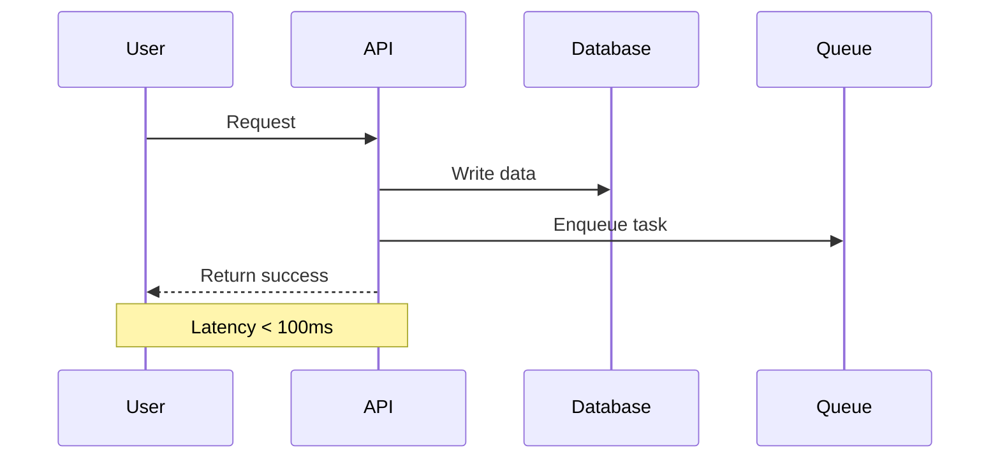

# Technical Document Standard Template v1.0

> JoyMini Nest Monorepo — Unified Technical Documentation Standard

---

## 🔰 About

This is the standard template for all technical documentation in this project. Every new feature implementation, architecture design, and bug fix **must** follow this template.

The template distills the **7-Layer Golden Structure** extracted from the project's best existing documents — proven in production to be the most effective structure for engineering teams.

---

# {Feature Name} — Technical Implementation

## 📋 Problem Statement

> What problem are we solving? Why is this necessary?

1. Problem 1: detailed description
2. Problem 2: detailed description
3. Problem 3: detailed description

---

## 🎯 Root Cause Analysis

> Why does this problem exist? What is the fundamental cause?

| Surface symptom | Root cause |
|----------------|------------|
| {What the user sees} | {The technical root cause} |

> 💡 Don't stop at the symptom — dig until you find the root cause.

---

## Solution Options

> What options were considered? Which was chosen and why?

| Option | Implementation cost | Running cost | Quality | Pros / Cons |
|--------|-------------------|-------------|---------|-------------|
| Option A | High | High | ⭐⭐⭐ | List pros & cons |
| Option B | Medium | Low | ⭐⭐⭐⭐ | List pros & cons |
| **Chosen** | **Low** | **Zero** | **⭐⭐⭐⭐⭐** | **Rationale** |

> You must list at least 2 alternatives and explain why they were rejected.

---

## 🏗️ System Architecture

> What does the overall design look like?

```
┌─────────────────┐     ┌─────────────────┐     ┌─────────────────┐
│   Input Layer   │────▶│  Processing     │────▶│   Output Layer  │
└─────────────────┘     └─────────────────┘     └─────────────────┘
```

### Core Components

1. **Component 1** — Responsibility, boundary definition
2. **Component 2** — Responsibility, boundary definition
3. **Component 3** — Responsibility, boundary definition

---

## 🔄 Complete Workflow

> How does data flow? What does each step do?



---

## ⚙️ Implementation Details

> Key implementation points, edge cases, and security considerations

### Core Features

- {Feature 1: explanation}
- {Feature 2: explanation}
- {Feature 3: explanation}
- ⚠️ {Known limitation: edge case description}

### Database Changes

| Field | Type | Description |
|-------|------|-------------|
| {field} | {type} | {description} |

### Key Code

```typescript
// The 5-10 most critical lines showing the implementation principle
```

---

## 📊 Cost & Performance

> Production running costs and performance metrics

| Scenario | Avg latency | Monthly cost |
|----------|-----------|-------------|
| 100 req/day | < 100ms | $0.00 |
| 1,000 req/day | < 150ms | $0.00 |
| 10,000 req/day | < 200ms | ~$3 / month |

---

## 🚀 Future Extensibility

> What can be done in the future?

1. Extension 1: description
2. Extension 2: description
3. Extension 3: description

---

## 📝 Deployment Notes

> What needs attention when going live?

1. Environment variable: `{ENV_VAR}`
2. Startup verification steps
3. Rollback plan
4. Monitoring metrics

---

**Document version**: 1.0
**Created**: {YYYY-MM-DD}
**Author**: {name}
**Status**: ✅ Implemented / 🚧 In Progress / ⏳ Planned
