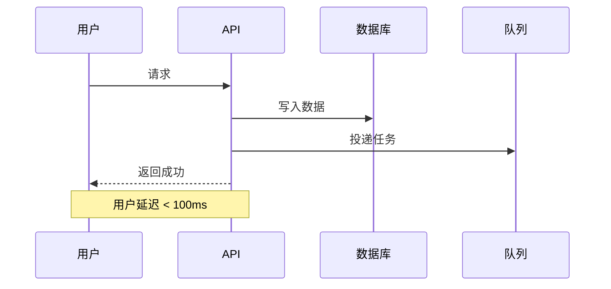

# 技术文档标准模板 v1.0

> JoyMini Nest Monorepo 统一技术文档规范

---

## 🔰 说明

这是项目统一的技术文档标准模板。所有新功能实现、架构设计、问题修复都必须按照此模板编写文档。

此模板是基于项目现有优秀文档抽象出的 **七层黄金结构**，经过实战验证是最适合技术团队的文档结构。

---

# {功能名称} 技术实现文档

## 📋 问题描述

> 我们遇到了什么问题？为什么要做这个？

1.  问题1：具体描述
2.  问题2：具体描述
3.  问题3：具体描述

---

## 🎯 根因分析

> 为什么会有这个问题？根本原因是什么？

| 表层现象           | 深层根因             |
| ------------------ | -------------------- |
| {用户能看到的现象} | {技术层面的根本原因} |

> 💡 不要停留在表面现象，必须挖到最底层的根因

---

## 方案选型

> 我们考虑了哪些方案？最终选择了什么？为什么？

| 方案         | 实现成本 | 运行成本 | 质量           | 优缺点           |
| ------------ | -------- | -------- | -------------- | ---------------- |
| 方案 A       | 高       | 高       | ⭐⭐⭐         | 优缺点列表       |
| 方案 B       | 中       | 低       | ⭐⭐⭐⭐       | 优缺点列表       |
| **最终方案** | **低**   | **零**   | **⭐⭐⭐⭐⭐** | **选择核心理由** |

> 必须列出至少 2 个备选方案，并说明不选的理由

---

## 🏗️ 系统架构

> 整体设计是什么样的？

```
┌─────────────────┐     ┌─────────────────┐     ┌─────────────────┐
│   输入层        │────▶│   处理层        │────▶│   输出层        │
└─────────────────┘     └─────────────────┘     └─────────────────┘
```

### 核心组件

1.  **组件 1** - 职责说明，边界定义
2.  **组件 2** - 职责说明，边界定义
3.  **组件 3** - 职责说明，边界定义

---

## 🔄 完整工作流程

> 数据是怎么流动的？每个环节做什么？



---

## ⚙️ 技术实现细节

> 关键实现点、边界条件、安全考虑

### 核心特性

- {特性1：具体说明}
- {特性2：具体说明}
- {特性3：具体说明}
- ⚠️ {已知限制：边界条件}

### 数据库变更

| 字段名  | 类型   | 说明          |
| ------- | ------ | ------------- |
| {field} | {type} | {description} |

### 关键代码

```typescript
// 最核心的 5-10 行代码，说明实现原理
```

---

## 📊 成本与性能

> 生产环境运行成本和性能指标

| 场景          | 平均延迟 | 月度运行成本 |
| ------------- | -------- | ------------ |
| 100 请求/天   | < 100ms  | ¥ 0.00       |
| 1000 请求/天  | < 150ms  | ¥ 0.00       |
| 10000 请求/天 | < 200ms  | 约 ¥ 3 / 月  |

---

## 🚀 扩展能力

> 未来可以做什么？

1.  扩展功能 1：说明
2.  扩展功能 2：说明
3.  扩展功能 3：说明

---

## 📝 部署注意事项

> 上线时需要注意什么？

1.  环境变量配置：`{ENV_VAR}`
2.  启动验证步骤
3.  回滚方案
4.  监控指标

---

**文档版本**: 1.0
**创建时间**: {YYYY-MM-DD}
**作者**: {name}
**状态**: 已实现 / 🚧 开发中 / ⏳ 规划中
