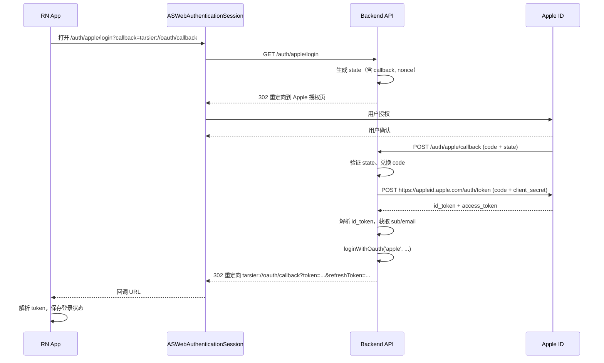

# Apple Sign In with Apple — OAuth 配置文档

## 概述

Apple 登录仅用于 **iOS App（React Native）**，通过 `ASWebAuthenticationSession` 打开后端授权的 OAuth 网页流程，不涉及 Web 前端。

## Apple Developer Console 配置

| 配置项 | 值 |
|--------|-----|
| Service ID | `$(APPLE_SERVICE_ID)` |
| Domains | `$(APPLE_DOMAIN)` |
| Return URLs | `$(APPLE_RETURN_URL)` |
| Team ID | `$(APPLE_TEAM_ID)` |
| Key ID | `$(APPLE_KEY_ID)` |

## 环境变量配置

### 部署环境（[`deploy/.env.dev`](../deploy/.env.dev) / [`deploy/.env.prod`](../deploy/.env.prod)）

```env
# Apple OAuth回调
APPLE_REDIRECT_URI=$(APPLE_REDIRECT_URI_DEV)
#APPLE_REDIRECT_URI=$(APPLE_REDIRECT_URI_PROD)

# Apple OAuth
APPLE_CLIENT_ID=$(APPLE_SERVICE_ID)
APPLE_TEAM_ID=$(APPLE_TEAM_ID)
APPLE_KEY_ID=$(APPLE_KEY_ID)
APPLE_PRIVATE_KEY=$(APPLE_PRIVATE_KEY_ONE_LINE)
```

> **注意**: 私钥在 `.env` 中必须写成**单行**，用 `\n` 表示换行。代码中通过 `.replace(/\\n/g, '\n')` 转换为真实换行符后再传给 `jwt.sign()`。

### API 本地开发环境（[`apps/api/.env`](../apps/api/.env)）

```env
# Apple
APPLE_TEAM_ID=$(APPLE_TEAM_ID)
APPLE_KEY_ID=$(APPLE_KEY_ID)
APPLE_PRIVATE_KEY=$(APPLE_PRIVATE_KEY_ONE_LINE)
APPLE_CLIENT_ID=$(APPLE_SERVICE_ID)
```

### 前端构建环境（[`apps/frontend-blog/.env.production`](../apps/frontend-blog/.env.production)）

```env
NEXT_PUBLIC_APPLE_CLIENT_ID=$(APPLE_SERVICE_ID)
```

## OAuth 流程

### 完整流程



### 后端接口

| 路由 | 方法 | 控制器 | 说明 |
|------|------|--------|------|
| `/auth/apple/login` | GET | [`appleLogin()`](../apps/api/src/client/auth/oauth-deeplink.controller.ts:154) | 发起授权，重定向到 Apple |
| `/auth/apple/callback` | POST | [`appleCallback()`](../apps/api/src/client/auth/oauth-deeplink.controller.ts:331) | 处理 Apple form_post 回调 |
| `/api/v1/auth/oauth/apple` | POST | [`loginWithAppleOauth()`](../apps/api/src/client/auth/auth.controller.ts:161) | RN App 直接传 idToken 登录（备选） |

### 关键代码

#### 1. 生成 Apple Client Secret (ES256 JWT)

在 [`generateAppleClientSecret()`](../apps/api/src/client/auth/oauth-deeplink.controller.ts:705) 中：

```typescript
private generateAppleClientSecret(): string {
  const privateKey = (
    this.configService.get<string>('APPLE_PRIVATE_KEY') || ''
  ).replace(/\\n/g, '\n');  // .env 中 \n 是字面字符，需转真实换行

  const claims = {
    iss: teamId,       // Team ID
    iat: now,
    exp: now + 30天,
    aud: 'https://appleid.apple.com',
    sub: clientId,     // Service ID
  };

  return jwt.sign(claims, privateKey, { algorithm: 'ES256', keyid: keyId });
}
```

#### 2. 兑换 Apple authorization code

在 [`exchangeAppleCode()`](../apps/api/src/client/auth/oauth-deeplink.controller.ts:663) 中：

```typescript
const response = await fetch('https://appleid.apple.com/auth/token', {
  method: 'POST',
  body: new URLSearchParams({
    code,
    client_id: clientId,
    client_secret: this.generateAppleClientSecret(),
    redirect_uri: redirectUri,
    grant_type: 'authorization_code',
  }),
});
```

## RN App 集成

使用 iOS 原生 `ASWebAuthenticationSession`，无需第三方 SDK。

```typescript
// 打开授权页
const authUrl = `${API_URL}/auth/apple/login?callback=tarsier://oauth/callback`;
const callbackUrl = await NativeModules.ASAuthSession.startAuth(
  authUrl,
  'tarsier',    // 自定义 URL Scheme
  true,
);

// 解析回调 URL 获取 token
const params = parseQueryParams(callbackUrl);
// callbackUrl = tarsier://oauth/callback?token=xxx&refreshToken=xxx
```

## 常见问题

### 私钥格式错误

```
Error: secretOrPrivateKey must be an asymmetric key when using ES256
```

**原因**: `.env` 文件中 `APPLE_PRIVATE_KEY` 的 `\n` 是字面字符，`jwt.sign()` 需要真实换行符。

**解决**: 代码中 `.replace(/\\n/g, '\n')` 转换（已在 `generateAppleClientSecret()` 中实现）。

### 回调失败

确认 Apple Developer Console 的 Return URL 与 `APPLE_REDIRECT_URI` 环境变量一致。

## 参考

- [Apple Sign In with Apple Docs](https://developer.apple.com/sign-in-with-apple/)
- [Generate and Validate Tokens](https://developer.apple.com/documentation/sign_in_with_apple/generate_and_validate_tokens)
- [`oauth-deeplink.controller.ts`](../apps/api/src/client/auth/oauth-deeplink.controller.ts)
- [`auth.controller.ts`](../apps/api/src/client/auth/auth.controller.ts)
