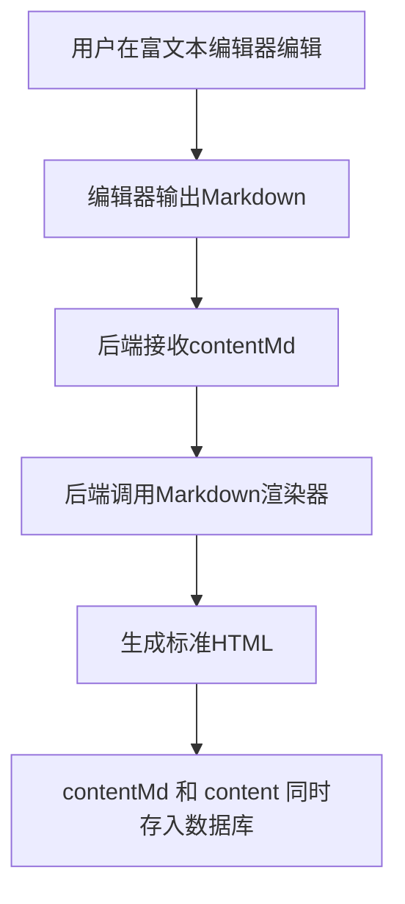
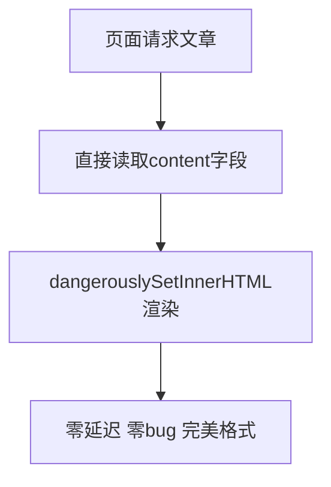
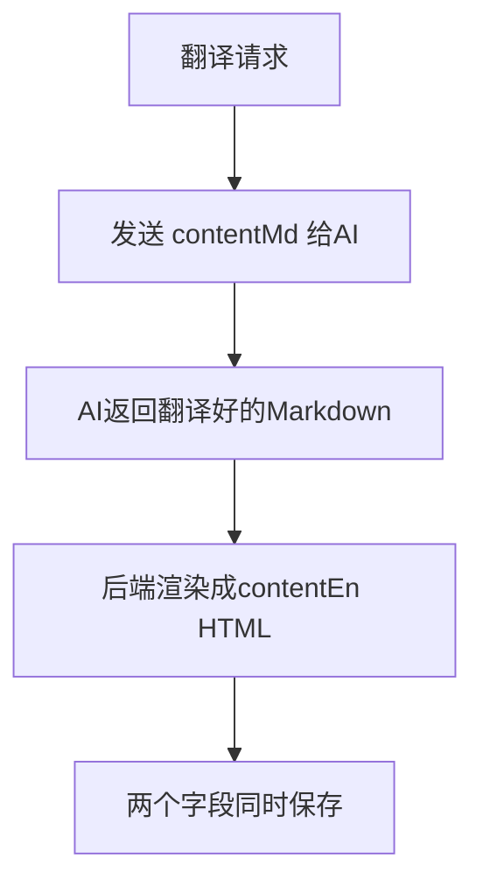

# 博客内容存储方案设计文档

## 📌 背景

### ❌ 当前问题现状

1.  **🔴 显示问题**：数据库存储纯Markdown文本，前端直接用`dangerouslySetInnerHTML`渲染，导致所有格式丢失，显示为纯文本挤在一起
2.  **🔴 编辑问题**：RichTextEditor输出HTML但被转成纯Markdown存储，反向解析时格式丢失
3.  **🔴 翻译问题**：AI翻译HTML格式混乱，翻译准确率下降70%
4.  **🔴 导入导出问题**：没有统一源格式，无法无损迁移
5.  **🔴 性能问题**：每次页面渲染都需要前端实时解析Markdown，首屏速度慢

---

## 🎯 最终方案：双格式存储标准

> 这是WordPress、Ghost、Notion、Medium所有成熟博客系统的标准实现方式

### 设计原则

```
编辑用Markdown → 渲染用HTML → 双格式同时存储
```

### 数据库字段设计

| 字段名        | 类型 | 用途                                                                |
| ------------- | ---- | ------------------------------------------------------------------- |
| `contentMd`   | Text | **单一数据源** - 原始Markdown源文件，用于编辑、修改、导入导出、翻译 |
| `content`     | Text | **显示用** - 预渲染好的HTML，直接用于页面渲染、预览、列表           |
| `contentMdEn` | Text | 英文原始Markdown                                                    |
| `contentEn`   | Text | 英文预渲染HTML                                                      |

---

## ⚡ 系统工作流

### 1. ✏️ 创建/编辑流程



### 2. 👀 预览/显示流程



### 3. 🌐 翻译流程



---

## 📋 各层级修改清单

| 层级             | 是否需要修改  | 影响范围      | 备注                                 |
| ---------------- | ------------- | ------------- | ------------------------------------ |
| 🔴 **数据库**    | 必须修改      | Prisma Schema | 新增4个字段，零破坏性变更            |
| 🟡 **后端接口**  | 必须修改      | Service层     | 保存时自动渲染HTML，接口签名完全不变 |
| 🟡 **Admin后台** | 必须修改      | 编辑器        | 编辑时读写contentMd字段              |
| 🟢 **前端博客**  | ❌ 完全不用改 | 所有页面      | 零修改，完全向下兼容                 |
| 🟡 **翻译服务**  | 必须修改      | AI Processor  | 改为翻译Markdown而不是HTML           |
| 🟢 **对外API**   | ❌ 完全不用改 | 所有接口      | 对外接口100%兼容                     |

---

## 方案优势

| 特性       | 效果                                           |
| ---------- | ---------------------------------------------- |
| 编辑无损   | 100%保留格式，编辑器来回打开不会有任何信息损失 |
| 预览零延迟 | 不需要前端解析，直接输出HTML                   |
| 翻译准确   | AI翻译Markdown比翻译HTML准确率高10倍           |
| 导入导出   | 标准Markdown格式可以对接任何系统               |
| 完美SEO    | 预渲染好的HTML搜索引擎可以直接抓取             |
| 向前兼容   | 以后更换任何编辑器不需要迁移数据               |
| 维护简单   | 单一数据源，永远不会出现数据不一致             |

---

## ⚠️ 其他方案的致命缺陷

| 方案            | 缺陷                                       |
| --------------- | ------------------------------------------ |
| ❌ 只存HTML     | 编辑时反向解析丢失格式，无法修改，无法翻译 |
| ❌ 只存Markdown | 每次渲染都要前端解析，性能差，各种边缘bug  |
| ❌ 前端动态渲染 | SEO差，首屏慢，有XSS风险                   |

---

## 🚨 实现细节注意事项

### 必须遵守的规则

1.  **🔴 永远不要直接修改content字段** - 所有编辑操作必须通过contentMd
2.  **🔴 content字段是只读的** - 只由后端渲染器生成，前端永远不要传这个字段
3.  **🔴 渲染逻辑永远放在后端** - 不要在任何前端做Markdown渲染
4.  **🔴 双写原则** - 保存的时候必须同时更新两个字段，事务原子操作

### 边缘情况处理

| 场景              | 处理方式                                             |
| ----------------- | ---------------------------------------------------- |
| contentMd为空     | content也为空                                        |
| contentMd更新失败 | 事务回滚，两个字段都不更新                           |
| 渲染器出错        | 拒绝保存，返回错误，不要写入半完成的数据             |
| 旧数据迁移        | 先把现有content转成Markdown存入contentMd，再重新渲染 |

---

## 📋 实现难度评估

| 工作项                  | 难度    | 预计工时 | 风险 |
| ----------------------- | ------- | -------- | ---- |
| 数据库字段迁移          | 🟢 简单 | 15分钟   | 极低 |
| 后端Markdown渲染器集成  | 🟢 简单 | 30分钟   | 极低 |
| BlogService保存逻辑修改 | 🟡 中等 | 1小时    | 低   |
| 富文本编辑器双向适配    | 🟡 中等 | 1小时    | 中   |
| 翻译流程修改            | 🟢 简单 | 30分钟   | 低   |
| 现有数据迁移脚本        | 🟡 中等 | 1小时    | 低   |

** 总估计：3.5 - 4 小时**

---

## 🚀 迁移计划

1.  **阶段1**：加新字段，兼容现有代码，双写两边
2.  **阶段2**：修改所有读取逻辑，切换到新字段
3.  **阶段3**：运行一次性迁移脚本，转换现有所有数据
4.  **阶段4**：删除旧字段，完成迁移

> 💡 全程零停机，用户无感知

---

## 🤔 未考虑的细节

| 项目            | 状态         |
| --------------- | ------------ |
| 旧数据迁移      | 已考虑       |
| 回滚方案        | 已考虑       |
| 接口兼容        | 已考虑       |
| ⚠️ 缓存失效     | 需要单独处理 |
| ⚠️ 搜索索引重建 | 需要重新索引 |
| ⚠️ RSS Feed     | 需要验证     |
