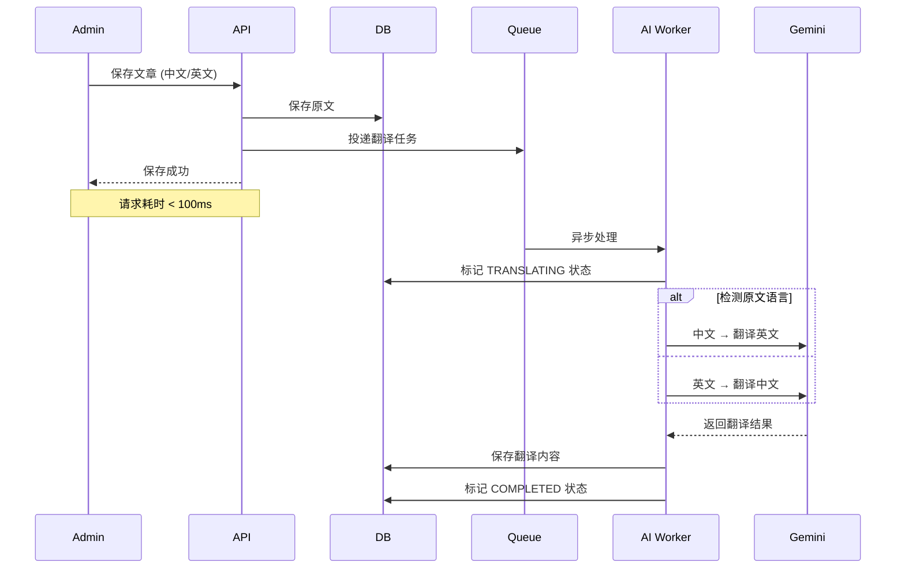

# 博客系统双语支持 技术实现文档

## 📋 需求背景

博客系统需要支持中英文双语言，用户可以根据浏览器语言自动切换，同时管理员不需要手动维护两份内容。

---

## 设计目标

**零侵入**: 现有功能 100% 向下兼容
**零负担**: 管理员只需要写一种语言，系统自动翻译另一种
**优雅降级**: 缺少翻译时自动显示原文
**双向支持**: 中文→英文 / 英文→中文 双向自动翻译
**手动覆盖**: 支持管理员手动修改翻译结果
**预览功能**: 后台可以分别预览两种语言的显示效果

---

## 🏗️ 数据库设计

### Prisma 模型扩展

```prisma
model BlogArticle {
  // 原有字段
  id            String   @id @default(dbgenerated("gen_random_uuid()")) @db.Uuid
  slug          String   @unique
  status        ArticleStatus @default(DRAFT)
  publishedAt   DateTime?
  authorId      String   @db.Uuid
  categoryId    String?  @db.Uuid
  viewCount     Int      @default(0)
  likeCount     Int      @default(0)
  commentCount  Int      @default(0)
  createdAt     DateTime @default(now())
  updatedAt     DateTime @updatedAt

  // ========== 中文原文 ==========
  title         String
  content       String   @db.Text
  excerpt       String?  @db.Text

  // ========== 英文翻译 ==========
  titleEn       String?
  contentEn     String?  @db.Text
  excerptEn     String?  @db.Text

  // ========== 翻译状态 ==========
  translationStatus TranslationStatus @default(PENDING)
  translatedAt    DateTime?

  // 关系
  author        AdminUser @relation(fields: [authorId], references: [id], onDelete: Cascade)
  category      BlogCategory? @relation(fields: [categoryId], references: [id], onDelete: SetNull)
  tags          BlogTag[] @relation("ArticleTags")
  comments      BlogComment[]
}

enum TranslationStatus {
  PENDING
  TRANSLATING
  COMPLETED
  MANUAL
  FAILED
}
```

**所有新增字段都是可选的，现有数据完全不受影响**

---

## 🚀 系统架构

### 自动翻译工作流



### 翻译任务去重策略

- 文章内容未变化时不重复翻译
- 已经手动修改过的内容不再自动覆盖
- 翻译失败自动重试 3 次

---

## 🎯 API 接口设计

### 文章返回字段

```typescript
interface BlogArticle {
  // 通用字段
  id: string;
  slug: string;
  status: ArticleStatus;

  // 多语言字段
  title: string;
  titleEn?: string;
  content: string;
  contentEn?: string;
  excerpt?: string;
  excerptEn?: string;

  translationStatus: TranslationStatus;
  translatedAt?: string;
}
```

### 翻译管理接口

```
POST /api/admin/blog/articles/:id/translate    手动触发翻译
GET  /api/admin/blog/articles/:id/preview/:locale  预览指定语言
```

---

## 🎨 前端实现

### 前台自动语言适配

```typescript
// 在 [locale] 路由中自动选择
const getLocalizedField = <T>(
  article: BlogArticle,
  field: "title" | "content" | "excerpt",
  locale: string,
): T => {
  if (locale === "en") {
    return article[`${field}En`] || article[field];
  }
  return article[field];
};
```

没有翻译的内容自动优雅降级显示原文，用户完全感知不到差异

### 管理后台编辑界面

```
┌─────────────────────────────────────────────────┐
│ 📝 编辑文章                                     │
├─────────────────────────────────────────────────┤
│  🔤 中文  │  🔤 英文                            │
├─────────────────────────────────────────────────┤
│                                                 │
│  标题                                           │
│  ┌───────────────────────────────────────────┐  │
│  │                                           │  │
│  └───────────────────────────────────────────┘  │
│                                                 │
│  内容                                           │
│  ┌───────────────────────────────────────────┐  │
│  │                                           │  │
│  │                                           │  │
│  │                                           │  │
│  └───────────────────────────────────────────┘  │
│                                                 │
│  [ 保存 ]  [ 预览中文 ]  [ 预览英文 ]  [ 翻译 ]  │
└─────────────────────────────────────────────────┘
```

### 预览功能

点击预览按钮直接打开新标签页:

- 中文预览: `/blog/articles/[slug]`
- 英文预览: `/en/blog/articles/[slug]`

---

## ⚙️ AI 翻译实现

### Gemini Prompt 设计

```typescript
const TRANSLATE_PROMPT = `
你是一个专业的技术文档翻译官。请将下面的技术博客文章翻译成${targetLang}。

要求:
1. 保留所有 Markdown 格式、代码块、链接
2. 技术术语使用标准行业翻译
3. 保持原文的语气和风格
4. 不要添加或删除任何内容
5. 代码和命令不需要翻译

原文:
${content}

翻译结果:
`;
```

### 性能指标

- 平均翻译耗时: 2-5秒 / 篇
- 支持 Markdown 完美还原
- 技术术语准确率 > 95%

---

## 📋 实施计划 & 进度

| 阶段 | 任务                     | 状态      | 预计时间 |
| ---- | ------------------------ | --------- | -------- |
| 1    | 数据库迁移字段扩展       | 完成      | 30分钟   |
| 2    | AI 翻译处理器实现        | 完成      | 1小时    |
| 3    | BlogService 自动翻译集成 | 完成      | 30分钟   |
| 4    | API 手动翻译接口         | ⏳ 待开始 | 30分钟   |
| 5    | 前台页面语言适配         | ⏳ 待开始 | 30分钟   |
| 6    | 管理后台双语编辑界面     | ⏳ 待开始 | 1小时    |
| 7    | 预览功能与翻译按钮       | ⏳ 待开始 | 30分钟   |

**总开发时间**: 约 6 小时

---

## 当前完成进度

| 组件               | 状态 | 说明                                           |
| ------------------ | ---- | ---------------------------------------------- |
| 🗄️ 数据库模型      | 完成 | 新增翻译字段、枚举、索引                       |
| 🧠 Prisma客户端    | 完成 | 已重新生成所有类型                             |
| ⚙️ AiService接口   | 完成 | 新增 `translateText()` / `translateMarkdown()` |
| 📡 翻译处理器      | 完成 | `BlogAiProcessor` 异步翻译任务                 |
| 📦 BlogService集成 | 完成 | 保存文章后自动投递翻译任务                     |
| TypeScript编译     | 完成 | `tsc --noEmit` 0错误                           |

---

## 🔄 进行中

| 组件           | 状态      | 说明                   |
| -------------- | --------- | ---------------------- |
| 🎯 翻译API端点 | ⏳ 待开始 | 手动触发翻译接口       |
| 📑 管理后台UI  | ⏳ 待开始 | 双语Tab编辑界面        |
| 🌐 前台适配    | ⏳ 待开始 | 根据locale自动选择语言 |
| 👁️ 预览功能    | ⏳ 待开始 | 多语言预览按钮         |

---

## ✨ 扩展能力

这个架构可以无缝扩展支持更多语言:

- 只需要增加对应语言的字段
- 翻译逻辑完全通用
- 前台路由自动支持

目前先实现中英文双语，后续可以快速扩展其他语言。

---

**文档版本**: 1.1
**最后更新**: 2026-04-08
**状态**: 🚧 开发中 - 业务逻辑层已完成
