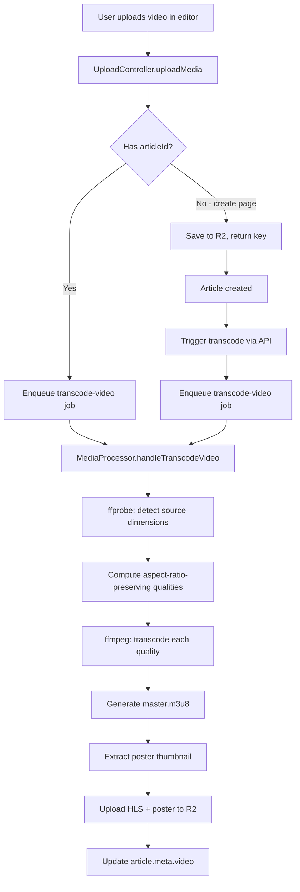
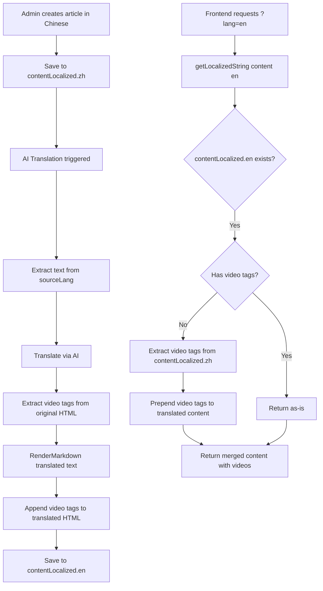

# Blog System Architecture — Final Summary

> **Last updated:** 2026-04-26
> This document consolidates all development work, architecture decisions, bugs fixed, and current implementation status for the Lucky Nest Blog system.

---

## 1. Project Overview

### 1.1 Architecture Layers

```
┌─────────────────────────────────────────────────────────────┐
│                  FRONTEND (frontend-blog)                    │
│  Next.js 15 App Router / SSR + ISR / Tailwind CSS / hls.js  │
│  Components: HeroSection, HlsVideoPlayer, BlurhashImage,    │
│  ArticleCard, CategoryFilter, PopularArticles, LoadMore     │
├─────────────────────────────────────────────────────────────┤
│                  ADMIN PANEL (admin-next)                    │
│  Next.js 15 App Router / Quill RichTextEditor               │
│  BlogArticleModal, ArticleForm, BlogTranslationProgress     │
├─────────────────────────────────────────────────────────────┤
│                  API LAYER (api / NestJS)                    │
│  BlogController / FrontendBlogController                    │
│  BlogService / FrontendBlogService / BlogAiProcessor        │
│  MediaProcessor / UploadController / UploadService          │
├─────────────────────────────────────────────────────────────┤
│                  INFRASTRUCTURE                              │
│  PostgreSQL + Prisma ORM                                    │
│  Redis + BullMQ (media-processor, blog-ai queues)           │
│  Cloudflare R2 (public bucket for media storage)            │
│  ffmpeg (HLS transcoding) / Sharp (image processing)        │
└─────────────────────────────────────────────────────────────┘
```

### 1.2 Key Technologies

| Layer              | Technology              | Purpose                                 |
| ------------------ | ----------------------- | --------------------------------------- |
| Backend framework  | NestJS 10               | RESTful API server                      |
| ORM                | Prisma 5                | PostgreSQL data access                  |
| Queue              | BullMQ + Redis          | Async media processing + AI translation |
| Media processing   | ffmpeg + Sharp          | HLS transcoding + image compression     |
| Storage            | Cloudflare R2           | Public media file hosting               |
| Frontend framework | Next.js 15 (App Router) | SSR blog frontend                       |
| Admin framework    | Next.js 15 (App Router) | Admin panel (separate app)              |
| State management   | TanStack Query          | Client-side data fetching + caching     |
| Video playback     | hls.js                  | HLS adaptive streaming in browser       |
| Rich text editor   | Quill (react-quill)     | Article content editing                 |
| i18n               | next-intl               | Multi-locale support                    |
| Styling            | Tailwind CSS            | Utility-first responsive design         |

---

## 2. Media Processing Pipeline

### 2.1 Upload Flow

```
User uploads file
    │
    ▼
UploadController.uploadMedia()
    │
    ├── Image → Save to R2 → Enqueue compress-image job
    │
    └── Video → Save to R2 → Enqueue transcode-video job
                            │
                            ▼
                    MediaProcessor (BullMQ Worker)
                    concurrency=2, attempts=3
```

### 2.2 Image Compression Pipeline

**Tool:** Sharp (Node.js native)

**Files:**

- [`media-processor.service.ts`](apps/api/src/common/media/media-processor.service.ts) — `compressImage()` method
- [`media.processor.ts`](apps/api/src/common/media/media.processor.ts) — `handleCompressImage()` handler

**Process:**

1. Download original from R2
2. Generate WebP variants: thumbnail 300w, medium 800w, large 1600w
3. Generate JPEG fallback: large 1600w
4. Generate BlurHash string from image pixels (Canvas-based, no external deps)
5. Upload all variants to R2
6. Update article `meta` with variant URLs + blurhash

**Output structure in R2:**

```
uploads/blog/images/{articleId}/
  ├── original.jpg
  ├── large.webp (1600px)
  ├── medium.webp (800px)
  ├── thumbnail.webp (300px)
  └── large.jpg (1600px, JPEG fallback)
```

**BlurHash in meta:**

```json
{
  "images": {
    "blurhash": "LFE.@D9F01WB~qMxRjNG01T2NWWB",
    "large": { "webp": "...", "jpg": "..." },
    "medium": { "webp": "...", "jpg": "..." },
    "thumbnail": { "webp": "...", "jpg": "..." }
  }
}
```

### 2.3 Video HLS Transcoding Pipeline

**Tool:** ffmpeg via fluent-ffmpeg

**Files:**

- [`media-processor.service.ts`](apps/api/src/common/media/media-processor.service.ts) — `transcodeVideoToHls()` method
- [`media.processor.ts`](apps/api/src/common/media/media.processor.ts) — `handleTranscodeVideo()` handler

**Process:**

1. Download original video from R2
2. Detect source dimensions via ffprobe (width + height)
3. Compute target qualities preserving aspect ratio (see section 2.3.1)
4. For each quality level:
   - Compute height from aspect ratio: `height = width / aspectRatio`
   - Clamp to source dimensions (no upscaling)
   - Ensure even dimensions (H.264 requirement)
   - Transcode with `force_original_aspect_ratio=decrease`
5. Generate master playlist (master.m3u8) referencing all quality variants
6. Extract poster thumbnail (1-second frame at 1280 width, auto-height)
7. Upload all files to R2
8. Update article `meta.video` with hlsUrl, poster, duration, qualities

**Output structure in R2:**

```
uploads/blog/videos/{articleId}/
  ├── master.m3u8
  ├── 480p/
  │   ├── playlist.m3u8
  │   └── segment-001.ts, segment-002.ts, ...
  ├── 720p/
  │   ├── playlist.m3u8
  │   └── segment-001.ts, ...
  └── 1080p/ (if source >= 1080p)
      ├── playlist.m3u8
      └── segment-001.ts, ...
```

**meta.video structure:**

```json
{
  "video": {
    "hlsUrl": "https://cdn.../master.m3u8",
    "poster": "https://cdn.../poster.jpg",
    "duration": 120.5,
    "qualities": ["480p", "720p", "1080p"],
    "status": "completed"
  }
}
```

#### 2.3.1 Aspect Ratio Preservation (Critical Fix)

**Problem:** Original code hardcoded 16:9 resolutions (`854:480`, `1280:720`, `1920:1080`) in the ffmpeg `scale` filter, causing non-16:9 videos (9:16 vertical, 1:1 square, 21:9 ultrawide) to be stretched/deformed.

**Fix applied in** [`media-processor.service.ts`](apps/api/src/common/media/media-processor.service.ts:194):

```typescript
// Before: Hardcoded 16:9 resolutions
const resolutions = ["854:480", "1280:720", "1920:1080"];
// ffmpeg -vf "scale=854:480"  ← forces 16:9 regardless of source

// After: Dynamic aspect-ratio-preserving computation
const sourceAspectRatio = sourceWidth / sourceHeight;
const targetWidth = Math.min(qualityTargetWidth, sourceWidth);
const computedHeight = Math.round(targetWidth / sourceAspectRatio);
const targetHeight = Math.min(computedHeight, sourceHeight);
// Ensure even dimensions for H.264
const evenWidth = targetWidth % 2 === 0 ? targetWidth : targetWidth - 1;
const evenHeight = targetHeight % 2 === 0 ? targetHeight : targetHeight - 1;
// ffmpeg -vf "scale=720:1280:force_original_aspect_ratio=decrease"
```

**Edge cases handled:**

- Source smaller than target quality → clamps to source dimensions (no upscaling)
- Odd pixel dimensions → rounded down to even (H.264 requirement)
- Vertical videos (9:16) → correctly transcoded as 480x854 instead of 854x480
- All aspect ratios (1:1, 4:3, 21:9, etc.) → preserved

### 2.4 File Size Protection

To prevent OOM crashes from large uploads:

| Protection              | Location                                                                                | Threshold                   |
| ----------------------- | --------------------------------------------------------------------------------------- | --------------------------- |
| Upload controller limit | [`upload.controller.ts`](apps/api/src/common/upload/upload.controller.ts:38)            | Images: 20MB, Videos: 200MB |
| Multer hard cap         | [`upload.controller.ts`](apps/api/src/common/upload/upload.controller.ts:40)            | 200MB                       |
| Worker image skip       | [`media.processor.ts`](apps/api/src/common/media/media.processor.ts:57)                 | > 50MB skipped              |
| Worker video skip       | [`media.processor.ts`](apps/api/src/common/media/media.processor.ts:57)                 | > 500MB skipped             |
| Sharp dimension limit   | [`media-processor.service.ts`](apps/api/src/common/media/media-processor.service.ts:31) | Max 4000px width/height     |

### 2.5 Create Page Video Transcoding Fix

**Problem:** When creating a new article, videos uploaded via the editor had no `articleId`, so the `transcode-video` job was never enqueued.

**Solution:**

1. Create page tracks uploaded video keys in a `useRef`
2. After article creation succeeds, calls `POST /admin/blog/articles/:id/trigger-video-transcode` for each tracked key
3. Backend enqueues the `transcode-video` job via existing BullMQ queue

**Files:**

- [`create/page.tsx`](<apps/admin-next/src/app/(dashboard)/blog/articles/create/page.tsx>) — track video keys, trigger after creation
- [`blog.service.ts`](apps/api/src/blog/blog.service.ts) — `triggerVideoTranscode()` method
- [`blog.controller.ts`](apps/api/src/blog/blog.controller.ts) — `POST :id/trigger-video-transcode` endpoint

### 2.6 Video Backfill for Existing Articles

**Problem:** Articles created before the HLS pipeline existed still serve raw MP4 files.

**Solution:** Admin API endpoint `POST /admin/blog/articles/backfill-videos` that:

1. Queries articles with video `coverImage` but no `meta.video.hlsUrl`
2. Enqueues `transcode-video` jobs for eligible articles
3. Sets `meta.video.status = 'pending'` during processing

**Files:**

- [`blog.service.ts`](apps/api/src/blog/blog.service.ts) — `findArticlesWithVideoCovers()` + `backfillVideoTranscode()`
- [`blog.module.ts`](apps/api/src/blog/blog.module.ts) — registers `MEDIA_PROCESSOR_QUEUE`
- [`blog.controller.ts`](apps/api/src/blog/blog.controller.ts) — backfill endpoint
- [`dto/backfill-videos.dto.ts`](apps/api/src/blog/dto/backfill-videos.dto.ts) — DTO

---

## 3. Frontend Blog Component Architecture

### 3.1 Homepage Structure

```
page.tsx (SSR)
  ├── fetchArticles() - Latest articles list
  ├── fetchFeaturedArticles() - Featured articles (hero section)
  │
  └── page.client.tsx (Client Component)
      ├── CategoryFilter - Scrollable category tabs
      ├── HeroSection - Featured article showcase
      │   ├── Main card: HlsVideoPlayer / BlurhashImage + title overlay
      │   └── Side cards: Thumbnail + title overlay
      ├── ArticleCard grid (2/3 width) + PopularArticles sidebar (1/3)
      │   ├── ArticleCard.tsx - Cover media + title/excerpt/meta
      │   │   ├── HlsVideoPlayer (for video covers)
      │   │   ├── BlurhashImage (for image covers)
      │   │   └── Gradient placeholder (for text-only articles)
      │   └── PopularArticles.tsx - Ranked top-5 sidebar
      └── LoadMore - Pagination button
```

### 3.2 Key Components

| Component          | File                                                                                | Purpose                                            |
| ------------------ | ----------------------------------------------------------------------------------- | -------------------------------------------------- |
| `HeroSection`      | [`HeroSection.tsx`](apps/frontend-blog/src/components/blog/HeroSection.tsx)         | Featured article display with carousel             |
| `HlsVideoPlayer`   | [`HlsVideoPlayer.tsx`](apps/frontend-blog/src/components/blog/HlsVideoPlayer.tsx)   | HLS playback via hls.js with poster + play overlay |
| `BlurhashImage`    | [`BlurhashImage.tsx`](apps/frontend-blog/src/components/blog/BlurhashImage.tsx)     | Canvas-based BlurHash rendering, no external deps  |
| `ArticleCard`      | [`ArticleCard.tsx`](apps/frontend-blog/src/components/blog/ArticleCard.tsx)         | Blog article card with media/text layout           |
| `CategoryFilter`   | [`CategoryFilter.tsx`](apps/frontend-blog/src/components/blog/CategoryFilter.tsx)   | Scrollable category tabs with progress bar         |
| `PopularArticles`  | [`PopularArticles.tsx`](apps/frontend-blog/src/components/blog/PopularArticles.tsx) | Top-5 ranked sidebar                               |
| `LoadMore`         | [`LoadMore.tsx`](apps/frontend-blog/src/components/blog/LoadMore.tsx)               | Pagination with loading spinner                    |
| `SanitizedContent` | [`SanitizedContent.tsx`](apps/frontend-blog/src/components/SanitizedContent.tsx)    | DOMPurify HTML sanitization via next/dynamic       |

### 3.3 Admin Panel Components

| Component                 | File                                                                                        | Purpose                                         |
| ------------------------- | ------------------------------------------------------------------------------------------- | ----------------------------------------------- |
| `BlogArticleModal`        | [`BlogArticleModal.tsx`](apps/admin-next/src/views/blog/BlogArticleModal.tsx)               | Article create/edit modal with localized fields |
| `ArticleForm`             | [`ArticleForm.tsx`](apps/admin-next/src/views/blog/ArticleForm.tsx)                         | Article form with RichTextEditor integration    |
| `BlogTranslationProgress` | [`BlogTranslationProgress.tsx`](apps/admin-next/src/views/blog/BlogTranslationProgress.tsx) | AI translation progress per article             |

### 3.4 Split Link Navigation (Card Click Behavior)

**Problem:** In `ArticleCard` and `HeroSection`, clicking the video area navigated to the article detail page, making it impossible to play/pause videos.

**Solution:** Split the card link — video/cover area is standalone (no navigation), text content (title/excerpt/meta) is wrapped in `<Link>` for navigation.

**Files modified:**

- [`ArticleCard.tsx`](apps/frontend-blog/src/components/blog/ArticleCard.tsx) — cover media outside Link, text inside Link
- [`HeroSection.tsx`](apps/frontend-blog/src/components/blog/HeroSection.tsx) — main card + side cards: media standalone, text overlay in Link

---

## 4. Content Rendering & DOMPurify

### 4.1 Article Detail Page Rendering

```
page.tsx (SSR) → fetch article by slug
  │
  ▼
page.client.tsx (Client Component)
  │
  ├── Cover image section
  │   ├── HLS video available → HlsVideoPlayer with poster
  │   ├── Video cover (no HLS) → VideoWithOverlay (native <video>)
  │   ├── Image cover → BlurhashImage or next/Image
  │   └── No cover → Gradient placeholder
  │
  ├── Article header (title, author, date, category, tags)
  │
  ├── Video hero section (if meta.video.hlsUrl exists)
  │   └── HlsVideoPlayer (inline video player)
  │
  └── Article content
      └── SanitizedContent (DOMPurify via next/dynamic ssr:false)
          └── Renders sanitized HTML with allowed tags
              including <video>, <figure>, , <iframe>, etc.
```

### 4.2 DOMPurify SSR Fix

**Problem:** Dynamic `import('dompurify')` inside `useEffect` caused Turbopack to pre-resolve the module during SSR, failing with `module factory is not available`.

**Solution:** Isolated DOMPurify into a separate component loaded via `next/dynamic` with `{ ssr: false }`.

**Files:**

- [`SanitizedContent.tsx`](apps/frontend-blog/src/components/SanitizedContent.tsx) — client-only component wrapping DOMPurify
- [`page.client.tsx`](apps/frontend-blog/src/app/[locale]/articles/[slug]/page.client.tsx) — uses dynamic import with `ssr: false`

### 4.3 Allowed HTML Tags & Attributes

```typescript
ALLOWED_TAGS: [
  "h1",
  "h2",
  "h3",
  "h4",
  "h5",
  "h6",
  "p",
  "br",
  "strong",
  "em",
  "u",
  "s",
  "blockquote",
  "code",
  "pre",
  "ul",
  "ol",
  "li",
  "a",
  "img",
  "video",
  "source",
  "iframe",
  "figure",
  "figcaption",
  "table",
  "thead",
  "tbody",
  "tr",
  "th",
  "td",
  "div",
  "span",
  "hr",
  "sub",
  "sup",
  "mark",
  "del",
  "ins",
];
ALLOWED_ATTR: [
  "href",
  "target",
  "rel",
  "src",
  "alt",
  "title",
  "width",
  "height",
  "class",
  "style",
  "controls",
  "autoplay",
  "loop",
  "muted",
  "poster",
  "playsinline",
  "preload",
  "frameborder",
  "allowfullscreen",
  "allow",
  "type",
];
```

---

## 5. i18n & Multilingual Content

### 5.1 Architecture

- **i18n library:** next-intl with locale in route params (`/[locale]/path`)
- **Supported locales:** zh, en, ja, ko (or more)
- **Content storage:** Prisma JSON fields (`contentLocalized`, `titleLocalized`)
- **Locale resolution:** HTTP headers + route params sync

### 5.2 Content Localization Flow

```
Admin creates article (Chinese)
  → content stored in article.content
  → contentLocalized['zh'] saved with full HTML (including video tags)

AI Translation triggered
  → blog-ai.processor.ts extracts source text from contentLocalized['zh']
  → Translates via AI
  → Saves translated HTML to contentLocalized['en']
    ⚠️ renderMarkdown() strips video tags → video content lost
    ✅ Fixed: video tags now preserved and appended after translation

Frontend requests /api/articles/:slug?lang=en
  → FrontendBlogService.getLocalizedString('content', 'en')
    ✅ Fixed: merges video tags from contentLocalized['zh'] into translated content
  → Returns HTML with translated text + original video tags
```

### 5.3 Bug: Video Tags Lost in Translation

**Root cause:** [`blog-ai.processor.ts`](apps/api/src/blog/processors/blog-ai.processor.ts:847) called `renderMarkdown(contentTranslated)` which stripped `<video>` and `<figure>` tags.

**Fix 1 (Runtime):** [`frontend-blog.service.ts`](apps/api/src/blog/frontend/frontend-blog.service.ts:418) `getLocalizedString()` now extracts video tags from `contentLocalized['zh']` and prepends them to translated content when the target locale has no video tags.

**Fix 2 (Preventive):** [`blog-ai.processor.ts`](apps/api/src/blog/processors/blog-ai.processor.ts:847) now extracts video tags from original HTML before translation and appends them to the translated HTML.

**Video tag extraction regex:**

```typescript
/<figure[^>]*>[\s\S]*?<video[\s\S]*?<\/video>[\s\S]*?<\/figure>|<video[\s\S]*?<\/video>/gi;
```

### 5.4 Bug: Modal Update Not Triggering for Untranslated Articles

**Root cause:** [`BlogArticleModal.tsx`](apps/admin-next/src/views/blog/BlogArticleModal.tsx) set empty strings `''` for untranslated locale keys. The Zod schema `localizedStringSchema.min(1)` rejected these empty strings, causing `zodValidation.parse()` to throw before the API call.

**Fix:** Removed the loop that set `''` for untranslated locales. Changed content assignment to:

```typescript
if (content) {
  contentLocalized[locale.code] = content;
}
```

### 5.5 Bug: Title/Excerpt Empty in Modal for Untranslated Articles

**Root cause:** When opening an untranslated article in the admin modal, `fetchAndInit` read `titleLocalized['en']` which was empty.

**Fix:** Used `*LocalizedFull` fields (which include the original Chinese content as fallback) instead of the per-locale fields.

---

## 6. Admin Editor UX

### 6.1 RichTextEditor Video Embedding

**Files:**

- [`ArticleForm.tsx`](apps/admin-next/src/views/blog/ArticleForm.tsx) — wraps RichTextEditor with form integration
- [`BlogArticleModal.tsx`](apps/admin-next/src/views/blog/BlogArticleModal.tsx) — modal with localized form fields

**Video insertion flow:**

1. User clicks video button in Quill toolbar
2. Upload dialog opens, file selected
3. Upload sent to `POST /admin/upload/image` (with `articleId` if editing)
4. Server returns `{ url: hlsOrMp4Url, key: r2Key }`
5. Quill `Html5VideoBlot` inserts `<video>` tag with `src={url}`
6. If `articleId` was provided, backend enqueues `transcode-video` job

### 6.2 RichTextEditor Content Fix (Race Condition)

**Problem:** Three conflicting mechanisms caused content flickering/replacement:

1. `value` prop from parent updates content
2. `dangerouslyPasteHTML()` in `useEffect` overwrites editor content
3. User edits trigger `onChange` which updates parent state

**Fix:**

- Eliminated redundant `dangerouslyPasteHTML` by using `value` prop exclusively
- Guarded `watch` subscription in `ArticleForm` during form reset
- Added defensive content overwrite guard in `BlogArticleModal`

### 6.3 Upload Progress Indicator

**Files:**

- [`http.ts`](apps/admin-next/src/api/http.ts) — `upload()` supports `onProgress` callback via XMLHttpRequest
- [`index.ts`](apps/admin-next/src/api/index.ts) — `uploadMedia()` passes progress callback through
- [`BlogArticleModal.tsx`](apps/admin-next/src/views/blog/BlogArticleModal.tsx) — shows progress bar during upload

---

## 7. HLS Video Playback

### 7.1 HlsVideoPlayer Component

**File:** [`HlsVideoPlayer.tsx`](apps/frontend-blog/src/components/blog/HlsVideoPlayer.tsx)

**Key features:**

- Uses `hls.js` for HLS playback in browsers that don't natively support HLS
- Falls back to native `<video>` for Safari (native HLS support)
- Poster image shown before playback starts
- Play overlay button (clickable, not `pointer-events-none`)
- Error state with retry message
- Loading state with spinner
- `autoPlay` + `muted` support for muted autoplay

### 7.2 Poster Image Fix

**Problem:** `ArticleCard` and `HeroSection` used the `coverImage` URL (a video URL) as the `<video>` poster attribute, which the browser cannot display.

**Fix:** Use `meta.video.poster` (JPEG thumbnail generated during transcoding) as the poster, falling back to `coverImage` only if it's an actual image.

**Files:**

- [`ArticleCard.tsx`](apps/frontend-blog/src/components/blog/ArticleCard.tsx) — uses `meta?.video?.poster`
- [`HeroSection.tsx`](apps/frontend-blog/src/components/blog/HeroSection.tsx) — uses `meta?.video?.poster`, checks `isVideoUrl()` for fallback
- [`frontend-blog.ts`](apps/frontend-blog/src/lib/types/frontend-blog.ts) — added `poster?: string` to video type

### 7.3 Cache & Black Box Fix

**Issues addressed:**

1. **ISR cache too long:** Article detail page had `revalidate = 3600` (1hr) — reduced to `60` (match homepage)
2. **React Query staleTime too long:** 1hr → 5min
3. **Poster used video URL:** Fixed to use `meta.video.poster`
4. **Play button not clickable:** Removed `pointer-events-none`, added `onClick` handler that calls `video.play()`
5. **No muted autoplay attempt:** Added `autoPlay={true} muted={true}` on article detail page

---

## 8. Featured Articles & 404 Error Fix

### 8.1 Featured Article System

- `article.featured` boolean field toggles featured status
- `article.meta.featuredOrder` controls display order in HeroSection
- `GET /v1/frontend/blog/featured` endpoint returns featured articles
- HeroSection displays featured articles as main + side cards

### 8.2 4040 Error Root Cause

**Problem:** Featured articles navigated to 4040 error page when clicked from HeroSection.

**Root cause:** `HeroSection` used `Link` from `next/link` instead of `@/navigation` (next-intl). The `next/link` Link does NOT auto-prepend the locale prefix (`/articles/...` vs `/en/articles/...`), while `@/navigation` Link does.

**Fix:** Changed `import Link from 'next/link'` to `import { Link } from '@/navigation'` in [`HeroSection.tsx`](apps/frontend-blog/src/components/blog/HeroSection.tsx).

---

## 9. Rich Text Editor Known Issues

See [`docs/blog/development/RICH_TEXT_EDITOR_KNOWN_ISSUES.md`](docs/blog/development/RICH_TEXT_EDITOR_KNOWN_ISSUES.md) for full list.

Key resolved issues:

- Video tag insertion via `Html5VideoBlot`
- Content race condition between `value` prop and `dangerouslyPasteHTML`
- DOMPurify SSR incompatibility (resolved via `next/dynamic`)

---

## 10. Data Flow Diagrams

### 10.1 Video Upload & Transcoding



### 10.2 Content Localization with Video Preservation



---

## 11. Complete Bug Fixes & Issues Log

| #   | Issue                                         | Root Cause                                                 | Fix                                                 | Status |
| --- | --------------------------------------------- | ---------------------------------------------------------- | --------------------------------------------------- | ------ |
| 1   | Video HLS transcoding deformed                | Hardcoded 16:9 resolutions in ffmpeg scale filter          | Dynamic aspect-ratio-preserving computation         | ✅     |
| 2   | Create page video not transcoded              | No articleId at upload time                                | Track video keys, trigger after creation            | ✅     |
| 3   | Video tags lost in translation                | renderMarkdown strips HTML tags                            | Preserve video tags in processor + query-time merge | ✅     |
| 4   | Modal Update not working                      | Empty strings for untranslated locales fail Zod validation | Remove empty string assignment, guard content       | ✅     |
| 5   | Title/excerpt empty for untranslated          | Reading per-locale field directly                          | Use \*LocalizedFull with fallback                   | ✅     |
| 6   | RichTextEditor content race condition         | value prop + dangerouslyPasteHTML + useEffect conflict     | Eliminate redundant pasteHTML, guard form reset     | ✅     |
| 7   | DOMPurify SSR crash                           | Turbopack pre-resolves dynamic import                      | next/dynamic with ssr:false                         | ✅     |
| 8   | Featured article 404 error                    | HeroSection uses next/link without locale prefix           | Switch to @/navigation Link                         | ✅     |
| 9   | Video poster black/blank                      | Video URL used as poster attribute                         | Use meta.video.poster with image fallback           | ✅     |
| 10  | HLS black box - play not working              | pointer-events-none on overlay, no play handler            | Clickable overlay calls video.play()                | ✅     |
| 11  | HLS black box - stale cache                   | 1hr ISR + 1hr React Query cache                            | Reduced to 60s / 5min                               | ✅     |
| 12  | Card click navigates instead of playing video | Entire card wrapped in Link                                | Split link: media standalone, text navigates        | ✅     |
| 13  | Media pipeline dead code                      | articleId never passed to upload                           | Added articleId to UploadFolderDto + chain          | ✅     |
| 14  | Variants uploaded to wrong bucket             | uploadToPublicBucket not used                              | Created uploadToPublicBucket method                 | ✅     |
| 15  | No-image article crashes                      | undefined src passed to next/image                         | Optional src + gradient placeholder                 | ✅     |
| 16  | Large files cause OOM                         | No size limits                                             | Added multi-layer file size protection              | ✅     |
| 17  | Circular dependency Upload↔MediaProcessor     | Module cross-import                                        | Extracted queue name constant                       | ✅     |
| 18  | Docker react-blurhash install hang            | Native addon not compatible                                | Inline Canvas-based BlurHash                        | ✅     |
| 19  | React 18→19 upgrade breakage                  | Missing direct deps                                        | Added lucide-react, framer-motion                   | ✅     |
| 20  | placehold.co not in next/image config         | Missing remotePatterns                                     | Added to next.config.ts                             | ✅     |

---

## 12. Files Architecture

### 12.1 Backend (api)

```
apps/api/src/
├── blog/
│   ├── blog.controller.ts          — Admin blog endpoints
│   ├── blog.module.ts              — Blog module + BullMQ queue registration
│   ├── blog.service.ts             — Blog CRUD + backfill + trigger transcode
│   ├── dto/
│   │   ├── create-article.dto.ts   — DTO with featured + meta fields
│   │   ├── backfill-videos.dto.ts  — Backfill limit DTO
│   │   └── trigger-video-transcode.dto.ts — Trigger DTO
│   ├── frontend/
│   │   ├── frontend-blog.controller.ts — Public blog endpoints
│   │   └── frontend-blog.service.ts    — Public queries + getLocalizedString
│   └── processors/
│       └── blog-ai.processor.ts    — AI translation with video preservation
│
├── common/
│   ├── media/
│   │   ├── media-processor.module.ts    — Module registration
│   │   ├── media-processor.service.ts   — Sharp + ffmpeg logic
│   │   ├── media-processor.constants.ts — Queue name constant
│   │   ├── media.processor.ts           — BullMQ WorkerHost
│   │   └── media.service.ts            — Media query service
│   ├── upload/
│   │   ├── upload.controller.ts    — File upload with size limits + articleId
│   │   ├── upload.service.ts       — R2 upload + enqueue processing
│   │   └── dto/upload-folder.dto.ts — ArticleId field
│   └── services/
│       ├── language.service.ts     — Locale resolution
│       └── language-detection.service.ts — Language detection
```

### 12.2 Frontend (frontend-blog)

```
apps/frontend-blog/src/
├── app/[locale]/
│   ├── page.tsx                    — SSR: fetch articles + featured
│   ├── page.client.tsx             — Homepage composition
│   └── articles/[slug]/
│       ├── page.tsx                — SSR: fetch article by slug
│       └── page.client.tsx         — Article detail + DOMPurify
│
├── components/
│   ├── blog/
│   │   ├── HeroSection.tsx         — Featured article carousel
│   │   ├── HlsVideoPlayer.tsx      — HLS playback with hls.js
│   │   ├── BlurhashImage.tsx       — Canvas BlurHash rendering
│   │   ├── ArticleCard.tsx         — Article card with split link
│   │   ├── CategoryFilter.tsx      — Category tabs
│   │   ├── PopularArticles.tsx     — Top-5 sidebar
│   │   └── LoadMore.tsx            — Pagination
│   └── SanitizedContent.tsx        — DOMPurify via next/dynamic
│
├── lib/
│   ├── api/frontendBlogApi.ts      — API client
│   ├── hooks/useFrontendArticles.ts — React Query hooks
│   ├── types/frontend-blog.ts      — Types with meta.video
│   └── utils/media.ts              — isVideoUrl etc.
│
├── middleware.ts                   — Locale redirect + detection
└── i18n.config.ts                  — next-intl config
```

### 12.3 Admin Panel (admin-next)

```
apps/admin-next/src/
├── views/blog/
│   ├── BlogArticleModal.tsx        — Article create/edit modal
│   ├── BlogCategoryModal.tsx       — Category management
│   ├── BlogTagModal.tsx            — Tag management
│   ├── BlogCommentModal.tsx        — Comment management
│   ├── BlogTranslationProgress.tsx — Translation progress
│   ├── ArticleForm.tsx             — RichTextEditor form wrapper
│   └── components/
│       └── TranslationProgressCard.tsx
│
├── api/
│   ├── http.ts                     — HTTP client with upload + progress
│   └── index.ts                    — API methods
│
└── i18n/                           — Locale files (en, zh, ja, ko, etc.)
```

---

## 13. Key Technical Decisions

### Why HLS instead of MP4 streaming?

- Adaptive bitrate switching based on network conditions
- Instant start (first 2-4 second segment loads fast)
- Industry standard (YouTube, Netflix)
- hls.js enables cross-browser support

### Why BullMQ instead of immediate processing?

- Non-blocking upload — user gets instant response
- Queue backpressure — prevents server overload
- Retry logic — failed jobs retry up to 3 times
- Concurrency control — max 2 simultaneous transcode jobs

### Why Canvas-based BlurHash instead of react-blurhash?

- Docker build compatibility (no native addon compilation)
- Zero external dependencies
- Full control over rendering
- Smaller bundle size

### Why next/dynamic for DOMPurify?

- Turbopack static analysis breaks on `import('dompurify')` even in useEffect
- `ssr: false` creates separate client-only chunk
- Avoids server-side reference to browser-only APIs (window, document)

### Why `@/navigation` Link instead of `next/link`?

- Auto-prepends locale prefix from route params
- Prevents 404 errors from locale-missing URLs
- Consistent with next-intl i18n architecture
- No need for manual locale extraction in every component

---

## 14. Verification Checklist

Before each deployment:

- [ ] TypeScript check: `yarn workspace @lucky/api check-types`
- [ ] TypeScript check: `yarn workspace @lucky/frontend-blog check-types`
- [ ] Lint: `yarn workspace @lucky/api lint`
- [ ] Lint: `yarn workspace @lucky/frontend-blog lint`
- [ ] Verify HLS video plays across aspect ratios (16:9, 9:16, 1:1, 21:9)
- [ ] Verify translated articles display inline videos
- [ ] Verify article detail page loads with correct locale
- [ ] Verify featured articles navigate without 404
- [ ] Verify image BlurHash renders on article cards
- [ ] Verify upload progress bar shows during file upload
