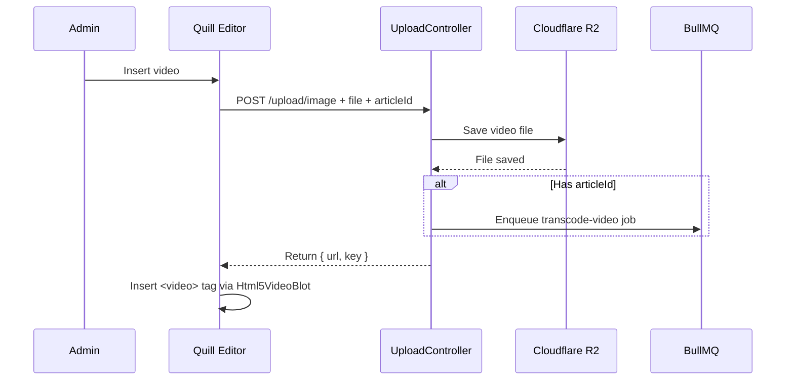
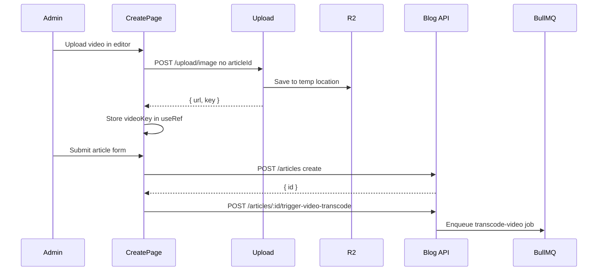
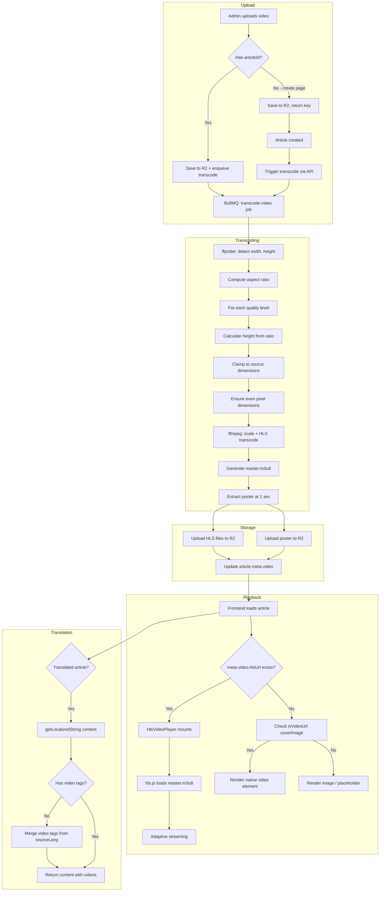

# Blog Video System Architecture

> **Last updated:** 2026-04-26
> This document covers the complete video pipeline: upload, transcoding, storage, frontend playback, and all resolved issues.

---

## 1. Overview

The blog video system enables admins to upload videos that are automatically transcoded to HLS adaptive streaming format, with poster thumbnail generation. Videos are playable on the frontend blog homepage (hero section, article cards) and detail pages, supporting all aspect ratios.

```
Admin Upload → R2 Storage → BullMQ Transcoding → HLS Playback
                              │
                              ├── ffprobe dimension detection
                              ├── ffmpeg HLS with aspect ratio preservation
                              └── Poster thumbnail extraction
```

---

## 2. Core Files

### 2.1 Backend Processing

| File                                                                                     | Role                                            |
| ---------------------------------------------------------------------------------------- | ----------------------------------------------- |
| [`media-processor.service.ts`](apps/api/src/common/media/media-processor.service.ts)     | ffmpeg HLS transcoding logic, poster extraction |
| [`media.processor.ts`](apps/api/src/common/media/media.processor.ts)                     | BullMQ WorkerHost: handles transcode-video jobs |
| [`media-processor.constants.ts`](apps/api/src/common/media/media-processor.constants.ts) | Queue name constant                             |
| [`upload.controller.ts`](apps/api/src/common/upload/upload.controller.ts)                | File upload endpoint with articleId passthrough |
| [`upload.service.ts`](apps/api/src/common/upload/upload.service.ts)                      | R2 upload + media processor queue enqueue       |

### 2.2 Admin Panel

| File                                                                                     | Role                                                               |
| ---------------------------------------------------------------------------------------- | ------------------------------------------------------------------ |
| [`BlogArticleModal.tsx`](apps/admin-next/src/views/blog/BlogArticleModal.tsx)            | Article edit modal — uploads with articleId                        |
| [`ArticleForm.tsx`](apps/admin-next/src/views/blog/ArticleForm.tsx)                      | RichTextEditor + video embed via Html5VideoBlot                    |
| [`create/page.tsx`](<apps/admin-next/src/app/(dashboard)/blog/articles/create/page.tsx>) | Create page — tracks video keys, triggers transcode after creation |

### 2.3 Frontend

| File                                                                                     | Role                                                              |
| ---------------------------------------------------------------------------------------- | ----------------------------------------------------------------- |
| [`HlsVideoPlayer.tsx`](apps/frontend-blog/src/components/blog/HlsVideoPlayer.tsx)        | HLS playback via hls.js with poster + play overlay                |
| [`ArticleCard.tsx`](apps/frontend-blog/src/components/blog/ArticleCard.tsx)              | Article card — shows HLS video or poster                          |
| [`HeroSection.tsx`](apps/frontend-blog/src/components/blog/HeroSection.tsx)              | Featured article hero — HLS video with poster                     |
| [`page.client.tsx`](apps/frontend-blog/src/app/[locale]/articles/[slug]/page.client.tsx) | Article detail — inline video hero + DOMPurify for content videos |
| [`SanitizedContent.tsx`](apps/frontend-blog/src/components/SanitizedContent.tsx)         | DOMPurify sanitization allowing video/iframe tags                 |

### 2.4 API / Services

| File                                                                              | Role                                               |
| --------------------------------------------------------------------------------- | -------------------------------------------------- |
| [`blog.service.ts`](apps/api/src/blog/blog.service.ts)                            | triggerVideoTranscode, backfillVideoTranscode      |
| [`blog.controller.ts`](apps/api/src/blog/blog.controller.ts)                      | POST trigger-video-transcode, POST backfill-videos |
| [`frontend-blog.service.ts`](apps/api/src/blog/frontend/frontend-blog.service.ts) | getLocalizedString with video tag merging          |
| [`blog-ai.processor.ts`](apps/api/src/blog/processors/blog-ai.processor.ts)       | Translation processor with video tag preservation  |

---

## 3. Video Upload Flow



### 3.1 Create Page Flow (No articleId)

When creating a new article, the article doesn't exist yet:



---

## 4. HLS Transcoding Pipeline

### 4.1 Step-by-Step Process

```
handleTranscodeVideo(job)
  │
  ├── 1. Check file size (< 500MB)
  ├── 2. Download original from R2 to /tmp
  ├── 3. ffprobe: detect source width + height
  ├── 4. Compute quality targets with aspect ratio preservation
  ├── 5. For each quality level:
  │     ├── Compute height: round(targetWidth / aspectRatio)
  │     ├── Clamp to source dimensions
  │     ├── Ensure even width/height (H.264 requirement)
  │     ├── mkdir quality directory
  │     └── ffmpeg: scale + transcode to HLS segments
  ├── 6. Generate master.m3u8 playlist
  ├── 7. Extract poster thumbnail (1s frame)
  ├── 8. Upload all files to R2
  └── 9. Update article.meta.video
```

### 4.2 Aspect Ratio Preservation

**The critical fix** that prevents video deformation.

```typescript
// Before (broken): Hardcoded 16:9
const resolutions = ["854:480", "1280:720", "1920:1080"];
// ffmpeg -vf "scale=1280:720"
// → 9:16 vertical video becomes stretched to 16:9!
// → 21:9 ultrawide becomes cropped/stretched to 16:9!

// After (fixed): Dynamic aspect ratio
const sourceAspectRatio = sourceWidth / sourceHeight;
const targetWidth = Math.min(qt.targetWidth, sourceWidth);
const computedHeight = Math.round(targetWidth / sourceAspectRatio);
const targetHeight = Math.min(computedHeight, sourceHeight);
const evenWidth = targetWidth % 2 === 0 ? targetWidth : targetWidth - 1;
const evenHeight = targetHeight % 2 === 0 ? targetHeight : targetHeight - 1;
// ffmpeg -vf "scale=720:1280:force_original_aspect_ratio=decrease"
// → 9:16 vertical video correctly transcodes as 480x854
// → 21:9 ultrawide correctly transcodes as 1280x548
```

**Source dimension detection:**

```typescript
// Old: Only detected height (assumed 16:9)
ffprobe -v error -select_streams v:0 -show_entries stream=height

// New: Detects both width and height
ffprobe -v error -select_streams v:0 -show_entries stream=width,height -of csv=p=0
```

### 4.3 Quality Targets

| Quality | Target Width | Bandwidth | Condition                     |
| ------- | ------------ | --------- | ----------------------------- |
| 480p    | 854px        | 800kbps   | Always generated              |
| 720p    | 1280px       | 2800kbps  | Always generated              |
| 1080p   | 1920px       | 5000kbps  | Only if source height >= 1080 |

Each target width is clamped to `Math.min(targetWidth, sourceWidth)` to prevent upscaling.

### 4.4 Output Structure in R2

```
uploads/blog/videos/{articleId}/
  ├── master.m3u8              # Master playlist referencing all qualities
  ├── poster.jpg               # 1-second thumbnail frame
  ├── 480p/
  │   ├── playlist.m3u8        # 480p variant playlist
  │   ├── segment-001.ts
  │   └── segment-002.ts ...
  ├── 720p/
  │   ├── playlist.m3u8
  │   ├── segment-001.ts
  │   └── segment-002.ts ...
  └── 1080p/ (conditional)
      ├── playlist.m3u8
      ├── segment-001.ts
      └── segment-002.ts ...
```

### 4.5 master.m3u8 Structure

```m3u8
#EXTM3U
#EXT-X-STREAM-INF:BANDWIDTH=800000,RESOLUTION=480x854
480p/playlist.m3u8
#EXT-X-STREAM-INF:BANDWIDTH=2800000,RESOLUTION=720x1280
720p/playlist.m3u8
#EXT-X-STREAM-INF:BANDWIDTH=5000000,RESOLUTION=1080x1920
1080p/playlist.m3u8
```

Note: Resolution values are the actual computed dimensions (e.g., 480x854 for vertical video), NOT hardcoded 16:9.

### 4.6 Poster Extraction

```typescript
// Extracts frame at 1-second mark, width=1280, auto height
ffmpeg -i {inputPath} -ss 00:00:01 -vframes 1 -vf "scale=1280:-1" {outputPath}
```

The `scale=1280:-1` already auto-calculates height based on aspect ratio, so poster extraction was never affected by the 16:9 bug.

---

## 5. meta.video Data Structure

Stored in the `BlogArticle.meta` JSON field:

```typescript
// Full structure after successful transcoding
{
  video: {
    hlsUrl: "https://cdn.joyminis.com/uploads/blog/videos/{id}/master.m3u8",
    poster: "https://cdn.joyminis.com/uploads/blog/videos/{id}/poster.jpg",
    duration: 120.5,          // seconds
    qualities: ["480p", "720p"],
    status: "completed"       // "pending" | "processing" | "completed" | "failed"
  }
}
```

### 5.1 Status Transitions

```
pending → processing → completed
                   ↓
                 failed (retry up to 3 times)
```

---

## 6. Frontend Video Playback

### 6.1 HlsVideoPlayer Component

**File:** [`HlsVideoPlayer.tsx`](apps/frontend-blog/src/components/blog/HlsVideoPlayer.tsx)

**Props:**

```typescript
interface HlsVideoPlayerProps {
  hlsUrl: string;
  poster?: string;
  className?: string;
  autoPlay?: boolean;
  muted?: boolean;
}
```

**Behavior:**

1. On mount, creates `hls.js` instance
2. Attaches to `<video>` element
3. Loads master.m3u8 URL
4. On `MANIFEST_PARSED`: detach hls.js for browsers with native HLS (Safari), attach for others
5. Shows clickable play overlay (SVG icon) when not playing
6. Shows poster image when available
7. Shows loading spinner during buffering
8. Shows error state with retry option on failure

### 6.2 Video Rendering Locations

| Location                   | Component                    | Condition                                        |
| -------------------------- | ---------------------------- | ------------------------------------------------ |
| HeroSection main card      | `HlsVideoPlayer`             | `article.meta?.video?.hlsUrl` exists             |
| HeroSection side cards     | `HlsVideoPlayer`             | `article.meta?.video?.hlsUrl` exists             |
| ArticleCard cover          | `HlsVideoPlayer`             | `isVideoUrl(coverImage)` + `meta?.video?.hlsUrl` |
| ArticleCard cover (no HLS) | Native `<video>`             | `isVideoUrl(coverImage)` no hlsUrl               |
| Detail page hero           | `HlsVideoPlayer`             | `article.meta?.video?.hlsUrl` exists             |
| Detail page hero (no HLS)  | `VideoWithOverlay`           | `isVideoUrl(coverImage)` no hlsUrl               |
| Detail page content        | DOMPurify-rendered `<video>` | `content` contains video HTML tags               |

### 6.3 Poster Resolution Logic

```typescript
// Priority order for poster image:
1. meta.video.poster           // Generated JPEG thumbnail (best)
2. coverImage (if non-video)   // Original image URL
3. undefined                   // No poster (fallback)
```

**Critical fix:** Do NOT use a video URL as the `<video>` poster attribute — browsers cannot display video files as poster images.

---

## 7. Video in Translated Content

### 7.1 The Problem

When AI translation processes an article:

1. Source content (Chinese) has `<video>` and `<figure>` HTML tags
2. Translation extracts only markdown text, sends to AI
3. Translated result is rendered via `renderMarkdown()` → produces text-only HTML
4. **Video tags are lost** in the translated version

### 7.2 Fix 1: Query-Time Merge

**File:** [`frontend-blog.service.ts`](apps/api/src/blog/frontend/frontend-blog.service.ts:418)

When requesting content in a non-source locale, `getLocalizedString()` checks if the translated content is missing video tags. If so, it extracts video tags from `contentLocalized['zh']` and prepends them.

```typescript
if (field === "content") {
  const sourceContent = localizedField["zh"] || entity["content"] || "";
  const localizedValue = localizedField[locale];
  if (
    sourceContent &&
    typeof sourceContent === "string" &&
    typeof localizedValue === "string" &&
    /<video[\s\S]*?<\/video>/i.test(sourceContent) &&
    !/<video[\s\S]*?<\/video>/i.test(localizedValue)
  ) {
    const videoBlocks = sourceContent.match(
      /<figure[^>]*>[\s\S]*?<video[\s\S]*?<\/video>[\s\S]*?<\/figure>|<video[\s\S]*?<\/video>/gi,
    );
    if (videoBlocks && videoBlocks.length > 0) {
      return videoBlocks.join("\n") + "\n" + localizedValue;
    }
  }
}
```

### 7.3 Fix 2: Translation-Time Prevention

**File:** [`blog-ai.processor.ts`](apps/api/src/blog/processors/blog-ai.processor.ts:847)

Before saving translated content, video tags are extracted from the original HTML and appended to the translated output:

```typescript
const originalHtml = sourceContent || article.content || "";
const videoTags = (originalHtml.match(videoTagRegex) || []).join("\n");

// When saving:
contentLocalized[targetLang] = (() => {
  const translatedHtml = this.renderMarkdown(contentTranslated);
  return videoTags ? translatedHtml + "\n" + videoTags : translatedHtml;
})();
```

---

## 8. Complete Bug History

| #   | Bug                                         | Root Cause                                           | Fix                                                                  | File(s)                                                                                                                                                                        |
| --- | ------------------------------------------- | ---------------------------------------------------- | -------------------------------------------------------------------- | ------------------------------------------------------------------------------------------------------------------------------------------------------------------------------ |
| 1   | **Aspect ratio deformation**                | Hardcoded 16:9 resolutions in ffmpeg scale filter    | Dynamic aspect ratio computation from source dimensions              | [`media-processor.service.ts:226`](apps/api/src/common/media/media-processor.service.ts:226)                                                                                   |
| 2   | **Create page no transcoding**              | upload() called without articleId                    | Track video keys in useRef, trigger transcode after article creation | [`create/page.tsx`](<apps/admin-next/src/app/(dashboard)/blog/articles/create/page.tsx>), [`blog.service.ts`](apps/api/src/blog/blog.service.ts)                               |
| 3   | **Translated articles missing videos**      | renderMarkdown strips HTML video tags                | Query-time merge + translation-time preservation                     | [`frontend-blog.service.ts:418`](apps/api/src/blog/frontend/frontend-blog.service.ts:418), [`blog-ai.processor.ts:847`](apps/api/src/blog/processors/blog-ai.processor.ts:847) |
| 4   | **Video poster black/blank**                | Video URL used as poster attribute                   | Use meta.video.poster with image-only fallback                       | [`ArticleCard.tsx`](apps/frontend-blog/src/components/blog/ArticleCard.tsx), [`HeroSection.tsx`](apps/frontend-blog/src/components/blog/HeroSection.tsx)                       |
| 5   | **Black box - no playback**                 | pointer-events-none on play overlay, stale ISR cache | Clickable play overlay, reduced cache from 1hr to 60s                | [`HlsVideoPlayer.tsx`](apps/frontend-blog/src/components/blog/HlsVideoPlayer.tsx), [`page.tsx`](apps/frontend-blog/src/app/[locale]/articles/[slug]/page.tsx)                  |
| 6   | **Card click navigates instead of playing** | Entire ArticleCard wrapped in Link                   | Split Link: media standalone, text only navigates                    | [`ArticleCard.tsx`](apps/frontend-blog/src/components/blog/ArticleCard.tsx), [`HeroSection.tsx`](apps/frontend-blog/src/components/blog/HeroSection.tsx)                       |
| 7   | **Media pipeline dead code**                | articleId never passed to upload endpoint            | Added articleId to UploadFolderDto + full chain                      | [`upload.controller.ts`](apps/api/src/common/upload/upload.controller.ts), [`upload.service.ts`](apps/api/src/common/upload/upload.service.ts)                                 |
| 8   | **Variants uploaded to wrong bucket**       | Used private bucket for public media                 | Created uploadToPublicBucket() method                                | [`upload.service.ts`](apps/api/src/common/upload/upload.service.ts)                                                                                                            |
| 9   | **Large videos cause OOM**                  | No file size checks before processing                | Check file size before download: max 500MB                           | [`media.processor.ts:57`](apps/api/src/common/media/media.processor.ts:57)                                                                                                     |
| 10  | **DOMPurify SSR crash**                     | Turbopack resolves dynamic import statically         | next/dynamic with ssr:false                                          | [`SanitizedContent.tsx`](apps/frontend-blog/src/components/SanitizedContent.tsx)                                                                                               |

---

## 9. Data Flow Diagram

### Complete Video Lifecycle



---

## 10. Key Technical Decisions

### Why HLS?

| Aspect            | MP4 Direct                                      | HLS                                       |
| ----------------- | ----------------------------------------------- | ----------------------------------------- |
| Starting playback | Must download entire file or use Range requests | Starts in 2-4 seconds (first .ts segment) |
| Adaptive quality  | Not possible                                    | Switches quality based on network         |
| Browser support   | Native everywhere                               | Native Safari + hls.js for others         |
| Storage           | Single file                                     | Multiple segments + playlists             |
| Industry standard | Legacy                                          | YouTube, Netflix, all major platforms     |

### Why force_original_aspect_ratio=decrease?

Without this ffmpeg flag, `scale=720:1280` would stretch the video to fill exactly 720x1280 pixels. With the flag, ffmpeg scales down to fit within the target box while preserving aspect ratio, adding letterbox/pillarbox bars if needed.

### Why separate dimension clamping?

The `targetWidth` is clamped to `sourceWidth` to prevent upscaling low-resolution videos. A 640x480 video should not be transcoded to 1280x720 (would be blurry upscaled mess). Instead, the 480p target width of 854 is clamped to 640, and the height is computed from the actual aspect ratio.

### Why even dimensions?

The H.264 encoder requires even width and height for chroma subsampling (4:2:0). Odd dimensions cause encoder errors or automatic rounding, which can produce unexpected results. The fix ensures both width and height are even before passing to ffmpeg.
