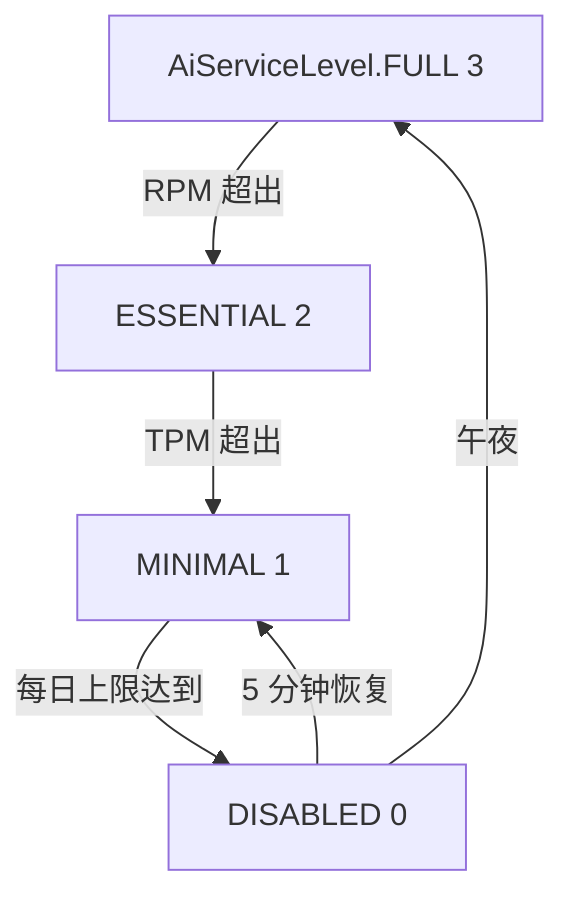
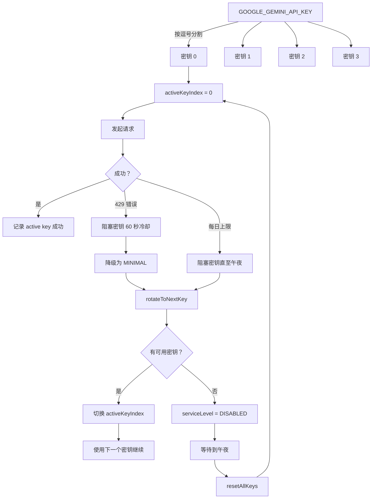
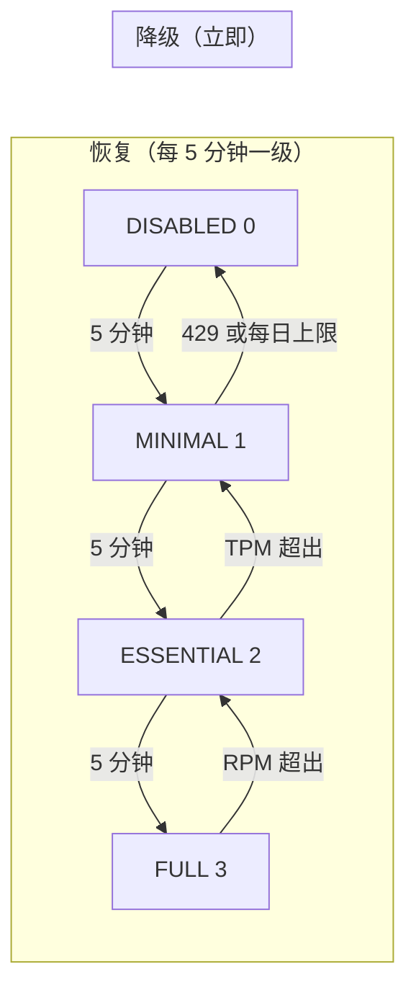
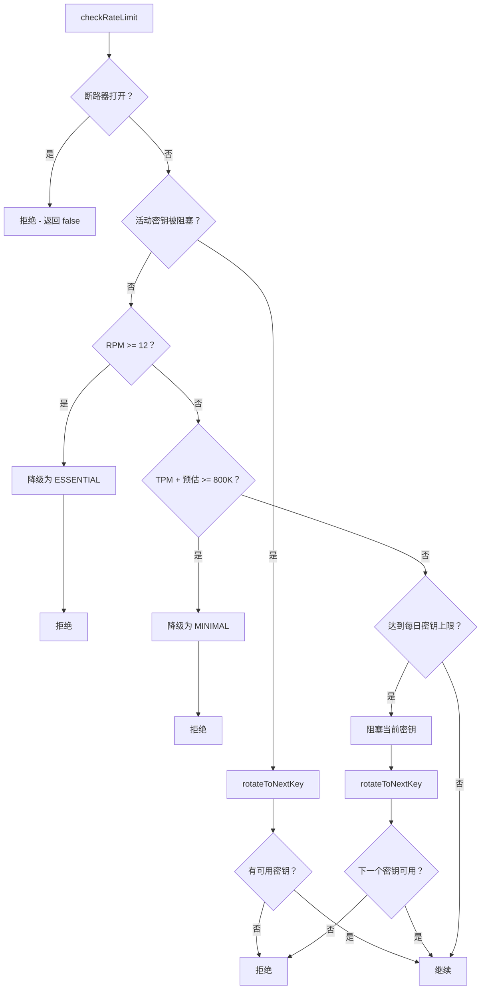

# AI 服务迁移：Vertex AI 到 Google AI Studio — 成本控制与多密钥轮换

**Date:** 2026-05-02  
**Tags:** `NestJS` `Google AI Studio` `Gemini` `LLM` `Cost Control` `Circuit Breaker` `Rate Limiting` `Multi-Key Rotation` `TypeScript`  
**Code Reference:** [`ai.service.ts`](apps/api/src/common/ai/ai.service.ts) | [`kyc-provider.service.ts`](apps/api/src/common/kyc-provider/kyc-provider.service.ts) | [`blog.service.ts`](apps/api/src/blog/blog.service.ts) | [`blog-ai.processor.ts`](apps/api/src/blog/processors/blog-ai.processor.ts)

---

## 目录

1. [问题：每天 28 美元的 AI 成本冲击](#1-问题每天-28-美元的-ai-成本冲击)
2. [解决方案概览](#2-解决方案概览)
3. [第一阶段：SDK 迁移 — Vertex AI → Google AI Studio](#3-第一阶段sdk-迁移--vertex-ai--google-ai-studio)
4. [第二阶段：硬性每日预算上限](#4-第二阶段硬性每日预算上限)
5. [第三阶段：多密钥轮换](#5-第三阶段多密钥轮换)
6. [架构：迁移前后对比](#6-架构迁移前后对比)
7. [弹性模式](#7-弹性模式)
8. [修改的文件](#8-修改的文件)
9. [关键要点](#9-关键要点)

---

## 1. 问题：每天 28 美元的 AI 成本冲击

该平台使用 Gemini 2.5 Flash 支持三个关键功能：

- **博客翻译** — 将文章、分类和标签批量翻译为多种语言
- **内容审核** — 评论垃圾/有害内容检测
- **KYC OCR** — 通过图像理解进行身份证件文本提取

最初，博客 AI 管道和 KYC OCR 都使用 **Vertex AI**（`@google-cloud/vertexai` SDK），通过服务账户 JSON 文件进行身份验证，采用**按用量付费**模式。系统中存在两个独立的 Gemini 客户端：

| 服务 | 文件 | 客户端 |
|---------|------|--------|
| 博客 AI | [`ai.service.ts`](apps/api/src/common/ai/ai.service.ts) | 独立的 `VertexAI` 实例 |
| KYC OCR | [`kyc-provider.service.ts`](apps/api/src/common/kyc-provider/kyc-provider.service.ts) | 独立的 `VertexAI` 实例 |

**导火索：** 管理员一次性批量翻译了大量文章，导致 Gemini Token 消耗激增。Vertex AI 在一天内产生了 28 美元费用，且**没有预算控制、没有速率限制、没有断路器**。两个独立的客户端之间也没有共享的预算感知机制。

此外，GCP 计费意外未绑定，导致 403 `BILLING_DISABLED` 错误，使整个 AI 子系统瘫痪。

---

## 2. 解决方案概览

解决方案分三个阶段执行：

```mermaid
flowchart LR
    subgraph Phase1[Phase 1: SDK 迁移]
        A[Vertex AI] -->|@google-cloud/vertexai| B[Google AI Studio]
        B -->|@google/generative-ai| C[API Key 认证]
    end
    
    subgraph Phase2[Phase 2: 预算控制]
        D[每日 800K Token 上限] --> E[服务级别降级]
        E --> F[断路器]
        F --> G[午夜自动重置]
    end
    
    subgraph Phase3[Phase 3: 多密钥]
        H[4 个 API 密钥] --> I[每个密钥每日预算]
        I --> J[耗尽时自动轮换]
        J --> K[429 时自动轮换]
        K --> L[总计 3.2M Token/天]
    end
    
    C --> D
    G --> H
```

---

## 3. 第一阶段：SDK 迁移 — Vertex AI → Google AI Studio

### 为什么选择 Google AI Studio？

| 方面 | Vertex AI | Google AI Studio |
|--------|-----------|-----------------|
| **定价** | 按用量付费 | **免费套餐**（Gemini 2.5 Flash） |
| **认证** | 服务账户 JSON | 简单的 API 密钥 |
| **速率限制** | 项目级别，可配置 | 15 RPM，1M TPM，1500 RPD ⚠️ |
| **SDK** | `@google-cloud/vertexai` | `@google/generative-ai` |
| **实际限制** | — | 12 RPM，800K TPM，每密钥每天 800K<br/>（官方限制之下保留 20% 安全缓冲） |

### 变更内容

**依赖**（[`apps/api/package.json`](apps/api/package.json)）：
```diff
- "@google-cloud/vertexai": "^1.10.0"
+ "@google/generative-ai": "^0.21.0"
```

**环境变量**（[`apps/api/.env`](apps/api/.env)、[`deploy/.env.dev`](deploy/.env.dev)、[`deploy/.env.prod`](deploy/.env.prod)）：
```diff
- GOOGLE_VISION_CREDENTIALS={"type":"service_account",...}
+ GOOGLE_GEMINI_API_KEY=AIzaSy...
```

**SDK 用法**（[`ai.service.ts`](apps/api/src/common/ai/ai.service.ts)）：
```typescript
// Before: Vertex AI
import { VertexAI } from '@google-cloud/vertexai';
const vertexAI = new VertexAI({ project, location });
const model = vertexAI.getGenerativeModel({ model: 'gemini-2.5-flash' });

// After: Google AI Studio
import { GoogleGenerativeAI, HarmCategory, HarmBlockThreshold } from '@google/generative-ai';
const genAI = new GoogleGenerativeAI(apiKey);
const model = genAI.getGenerativeModel({
  model: 'gemini-2.5-flash',
  safetySettings: [
    { category: HarmCategory.HARM_CATEGORY_HATE_SPEECH, threshold: HarmBlockThreshold.BLOCK_NONE },
    // ...
  ],
});
```

### KYC 服务提供者整合

迁移之前，[`KycProviderService`](apps/api/src/common/kyc-provider/kyc-provider.service.ts) 维护着**自己的**独立 Vertex AI 客户端：

```typescript
// Before: KycProviderService 拥有自己的 Gemini 客户端
private vertexAI?: VertexAI;
private geminiModel?: GenerativeModel;
```

迁移之后，它将所有 Gemini 调用委托给共享的 [`AiService`](apps/api/src/common/ai/ai.service.ts)：

```typescript
// After: KycProviderService 注入 AiService
constructor(
  @Inject(AiService) private aiService: AiService,
) {}

// OCR 调用委托给 AiService
const text = await this.aiService.generateContentFromImage(prompt, imageBuffer, 'image/jpeg');
```

这一整合意味着**所有 AI 流量都通过单一服务**，实现了统一的预算控制。

---

## 4. 第二阶段：硬性每日预算上限

### 服务级别降级

系统实现了四级降级链路：



| 级别 | 值 | 允许的功能 | 触发条件 |
|-------|-------|-----------------|---------|
| `FULL` | 3 | 所有 AI 功能 | 正常运行 |
| `ESSENTIAL` | 2 | 仅评论审核 | RPM 限制（12/分钟） |
| `MINIMAL` | 1 | 仅关键审核 | TPM 限制（800K/分钟） |
| `DISABLED` | 0 | 无 AI 功能 | 每日上限（800K）或所有密钥耗尽 |

### 每日预算执行

```typescript
// checkRateLimit() 中的硬性上限检查
if (activeKey.dailyTokens + estimatedTokens >= this.LIMITS.DAILY_PER_KEY) {
  activeKey.blocked = true;
  activeKey.blockedReason = 'daily_exhausted';
  this.rotateToNextKey(); // 尝试下一个密钥
  return false;
}
```

### 队列集成

**入队**侧（[`blog.service.ts`](apps/api/src/blog/blog.service.ts)）和 **处理**侧（[`blog-ai.processor.ts`](apps/api/src/blog/processors/blog-ai.processor.ts)）都检查服务级别：

```typescript
// blog.service.ts — 入队前检查
if (this.aiService.getServiceLevel() === AiServiceLevel.DISABLED) {
  throw new BadRequestException('AI 服务当前因每日预算限制已禁用');
}

// blog-ai.processor.ts — 处理时快速失败
if (this.aiService.getServiceLevel() === AiServiceLevel.DISABLED) {
  this.logger.warn(`跳过翻译 — AI 服务已禁用`);
  return;
}
```

### 断路器

针对非 429 故障（如网络错误、API 变更）：

```typescript
private readonly LIMITS = {
  FAILURE_THRESHOLD: 5,           // 连续 5 次失败
  CIRCUIT_BREAKER_DURATION: 900000, // 15 分钟冷却
};
```

---

## 5. 第三阶段：多密钥轮换

### 动机

Google AI Studio 的免费套餐有每密钥限制：
- **每分钟 15 次请求**（代码应用 20% 缓冲 → 12 RPM）
- **每分钟 1M Token**（代码应用 20% 缓冲 → 800K TPM）
- **每天 1500 次请求**

使用单一密钥时，大量批量翻译很快就会耗尽每日预算。通过使用 **4 个 API 密钥**并自动轮换，我们将每日容量提升至 **3.2M Token**。

### 架构



### 数据结构

```typescript
interface GeminiKeyInstance {
  keySuffix: string;       // 最后 4 位，用于日志记录
  genAI: GoogleGenerativeAI;
  model: GenerativeModel;
  dailyTokens: number;     // 每密钥每日用量
  blocked: boolean;        // 耗尽或限速时为 true
  blockedReason: string | null;
  blockedUntil: number;    // 阻塞过期的时间戳
}

private keyInstances: GeminiKeyInstance[] = [];
private activeKeyIndex = 0;
```

### 轮换逻辑

```typescript
private rotateToNextKey(): boolean {
  const totalKeys = this.keyInstances.length;
  const startIndex = this.activeKeyIndex;
  
  for (let attempt = 0; attempt < totalKeys; attempt++) {
    const candidateIndex = (startIndex + 1 + attempt) % totalKeys;
    const candidate = this.keyInstances[candidateIndex];
    
    if (!candidate.blocked && candidate.dailyTokens < this.LIMITS.DAILY_PER_KEY) {
      this.activeKeyIndex = candidateIndex;
      return true;
    }
  }
  
  // 所有密钥已耗尽
  this.serviceLevel = AiServiceLevel.DISABLED;
  return false;
}
```

### 密钥轮换触发条件

| 事件 | 操作 | 冷却时间 | 副作用 |
|-------|--------|---------|-------------|
| HTTP 429（限速） | 阻塞当前密钥，轮换 | 每密钥 60 秒 | 服务级别 → MINIMAL |
| 每日 Token 上限达到 | 阻塞当前密钥，轮换 | 直至午夜 | — |
| 非 429 故障 | 断路器打开 | 15 分钟 | 服务级别 → DISABLED |

### 午夜重置

`resetCounters()` 方法通过 `setInterval` **每 1 秒**运行一次，处理多个关注点：

```typescript
private resetCounters() {
  const now = Date.now();

  // 1. 重置每分钟计数器（RPM/TPM），每 60 秒
  if (now >= this.usageCounter.resetAt) {
    this.usageCounter.requests = 0;
    this.usageCounter.tokens = 0;
    this.usageCounter.resetAt = now + 60000;
  }

  // 2. 所有密钥的午夜重置
  const today = new Date().toISOString().slice(0, 10);
  if (this.currentDate !== today) {
    this.currentDate = today;
    for (const key of this.keyInstances) {
      key.dailyTokens = 0;
      key.blocked = false;
      key.blockedReason = null;
      key.blockedUntil = 0;
    }
    this.activeKeyIndex = 0;
    if (this.serviceLevel === AiServiceLevel.DISABLED) {
      this.serviceLevel = AiServiceLevel.FULL;
    }
  }

  // 3. 解除已冷却完成的 429 阻塞密钥
  for (const key of this.keyInstances) {
    if (key.blocked && key.blockedUntil > 0 && now >= key.blockedUntil) {
      key.blocked = false;
      key.blockedReason = null;
      key.blockedUntil = 0;
    }
  }

  // 4. 自动恢复服务级别（每 5 分钟恢复一级）
  if (now - this.levelUpdatedAt > 300000 &&
      this.serviceLevel < AiServiceLevel.FULL) {
    this.serviceLevel = Math.min(this.serviceLevel + 1, AiServiceLevel.FULL);
    this.levelUpdatedAt = now;
  }

  // 5. 冷却到期时关闭断路器
  if (this.circuitBreaker.openUntil > 0 &&
      now >= this.circuitBreaker.openUntil) {
    this.circuitBreaker.openUntil = 0;
    this.circuitBreaker.consecutiveFailures = 0;
  }
}
```

恢复阶梯沿降级路径反向进行：



### 容量对比

| 指标 | 单密钥 | 4 密钥 |
|--------|-----------|--------|
| 每日 Token 预算 | 800k | **3.2M** |
| 每日请求数（估算） | ~1,500 | **~6,000** |
| 429 恢复 | 5 分钟断路器 | **每密钥 60 秒冷却** |
| 总成本 | 免费 | 免费 |

---

## 5a. 速率限制检查 — 完整决策链

`checkRateLimit()` 方法协调所有弹性层。请求在到达 Google API 之前需要经过此链路：



检查优先级确保 **断路器** > **密钥可用性** > **RPM** > **TPM** > **每日预算**：

```typescript
private checkRateLimit(estimatedTokens: number): boolean {
  // 1. 断路器打开？
  if (this.circuitBreaker.openUntil > Date.now()) return false;

  const activeKey = this.keyInstances[this.activeKeyIndex];

  // 2. 活动密钥被阻塞 → 尝试轮换
  if (activeKey?.blocked) {
    return this.rotateToNextKey();
  }

  // 3. 每分钟请求配额（12 RPM，所有密钥共享）
  if (this.usageCounter.requests >= this.LIMITS.RPM) {
    if (this.serviceLevel > AiServiceLevel.ESSENTIAL) {
      this.serviceLevel = AiServiceLevel.ESSENTIAL;
    }
    return false;
  }

  // 4. 每分钟 Token 配额（800K TPM，共享）
  if (this.usageCounter.tokens + estimatedTokens >= this.LIMITS.TPM) {
    if (this.serviceLevel > AiServiceLevel.MINIMAL) {
      this.serviceLevel = AiServiceLevel.MINIMAL;
    }
    return false;
  }

  // 5. 每密钥每日预算（每密钥 800K）
  if (activeKey &&
      activeKey.dailyTokens + estimatedTokens >= this.LIMITS.DAILY_PER_KEY) {
    activeKey.blocked = true;
    activeKey.blockedReason = 'daily_exhausted';
    return this.rotateToNextKey();
  }

  return true; // 所有检查通过
}
```

**20% 安全缓冲**（12 RPM vs 官方 15，800K TPM vs 官方 1M）确保即使在突发流量下，系统也不会触及 Google 的硬性限制。

---

## 6. 架构：迁移前后对比

### 迁移前

```
┌─────────────────────────────────────────────────────────────┐
│                          迁移前                               │
├─────────────────────────────────────────────────────────────┤
│                                                              │
│  ┌──────────────────────┐    ┌──────────────────────────┐   │
│  │    AiService          │    │   KycProviderService      │   │
│  │  (Vertex AI 客户端)    │    │  (Vertex AI 客户端)       │   │
│  │  - 无速率限制         │    │  - 无速率限制             │   │
│  │  - 无预算上限         │    │  - 无预算上限             │   │
│  │  - 无断路器           │    │  - 无断路器               │   │
│  └──────────┬───────────┘    └──────────┬───────────────┘   │
│             │                           │                    │
│             ▼                           ▼                    │
│      ┌──────────────┐          ┌──────────────┐             │
│      │  Vertex AI   │          │  Vertex AI   │             │
│      │  (按量付费)   │          │  (按量付费)   │             │
│      └──────────────┘          └──────────────┘             │
│                                                              │
│  💥 问题：每天 $28，无控制，双客户端                           │
└─────────────────────────────────────────────────────────────┘
```

### 迁移后

```
┌─────────────────────────────────────────────────────────────┐
│                          迁移后                               │
├─────────────────────────────────────────────────────────────┤
│                                                              │
│  ┌──────────────────────────────────────────────────────┐   │
│  │                    AiService                          │   │
│  │  (Google AI Studio — 单一统一客户端)                   │   │
│  │                                                       │   │
│  │  ┌─────────────────────────────────────────────────┐  │   │
│  │  │           密钥轮换管理器                         │  │   │
│  │  │  密钥[0] │ 密钥[1] │ 密钥[2] │ 密钥[3]           │  │   │
│  │  │  800k   │  800k   │  800k   │  800k              │  │   │
│  │  └─────────────────────────────────────────────────┘  │   │
│  │                                                       │   │
│  │  ┌─────────────────────────────────────────────────┐  │   │
│  │  │             弹性层                               │  │   │
│  │  │  速率限制 │ 断路器 │ 自动恢复                     │  │   │
│  │  └─────────────────────────────────────────────────┘  │   │
│  └──────────────────────┬───────────────────────────────┘   │
│                         │                                    │
│              ┌──────────┴──────────┐                        │
│              ▼                     ▼                         │
│  ┌──────────────────┐  ┌──────────────────────┐            │
│  │  博客服务         │  │  KycProviderService   │            │
│  │  (注入)           │  │  (注入)               │            │
│  └──────────────────┘  └──────────────────────┘            │
│                                                              │
│  ✅ $0/天，3.2M Token 预算，自动轮换                          │
└─────────────────────────────────────────────────────────────┘
```

---

## 7. 弹性模式

### 模式 1：优雅降级

当日预算耗尽时，系统不会崩溃——而是优雅降级：

1. **博客翻译 API** 返回 `400 BadRequestException`，附带清晰的错误信息
2. **BullMQ 队列工作者** 静默跳过处理（无错误日志）
3. **评论审核** 回退到安全默认值（全部通过）
4. **KYC OCR** 返回 null，触发回退到人工审核

### 模式 2：午夜自动恢复

所有计数器在午夜自动重置。服务级别自动恢复到 `FULL`，无需人工干预。

### 模式 3：每密钥 429 冷却

与全局断路器会阻断**所有**流量 15 分钟不同，每密钥 429 处理仅阻塞受影响的密钥 60 秒，并立即轮换到下一个可用密钥，将中断影响最小化。

此外，发生 429 时服务级别会**降级为 `MINIMAL`**——这作为一个背压信号：即使轮换了密钥，也只有最关键的功能（评论审核、KYC OCR）可以执行，直到计数器恢复。

### 模式 4：共享预算感知

所有消费者（[`blog.service.ts`](apps/api/src/blog/blog.service.ts)、[`blog-ai.processor.ts`](apps/api/src/blog/processors/blog-ai.processor.ts)、[`kyc-provider.service.ts`](apps/api/src/common/kyc-provider/kyc-provider.service.ts)）在发起调用前都检查同一个 `AiService.getServiceLevel()`。没有哪个消费者能单独超出预算。

---

## 8. 修改的文件

| 文件 | 变更 |
|------|--------|
| [`apps/api/package.json`](apps/api/package.json) | 替换 `@google-cloud/vertexai` → `@google/generative-ai` |
| [`apps/api/.env`](apps/api/.env) | 替换 `GOOGLE_VISION_CREDENTIALS` → `GOOGLE_GEMINI_API_KEY` |
| [`deploy/.env.dev`](deploy/.env.dev) | 相同环境变量变更 |
| [`deploy/.env.prod`](deploy/.env.prod) | 相同环境变量变更 |
| [`apps/api/src/common/ai/ai.service.ts`](apps/api/src/common/ai/ai.service.ts) | 完全重写：SDK 更换、每日预算上限、多密钥轮换、断路器 |
| [`apps/api/src/common/kyc-provider/kyc-provider.service.ts`](apps/api/src/common/kyc-provider/kyc-provider.service.ts) | 移除自己的 Vertex AI 客户端，注入 `AiService` |
| [`apps/api/src/blog/blog.service.ts`](apps/api/src/blog/blog.service.ts) | 添加入队前预算检查 |
| [`apps/api/src/blog/processors/blog-ai.processor.ts`](apps/api/src/blog/processors/blog-ai.processor.ts) | 添加处理时快速失败检查 |

---

## 9. 关键要点

1. **两个独立的 Gemini 客户端**是无节制支出的根本原因——整合到单一的 `AiService` 对于预算控制至关重要。

2. **Google AI Studio 的免费套餐**（Gemini 2.5 Flash）配合适当的速率限制和密钥轮换，足以支撑生产工作负载。从 Vertex AI 迁移后立即节省了每天 28 美元。

3. **多密钥轮换**可线性扩展免费套餐容量。使用 4 个密钥，每日预算从 800K 提升至 3.2M Token——全部仍然免费。

4. **优雅降级**优于硬性失败。服务级别系统（FULL → ESSENTIAL → MINIMAL → DISABLED）确保系统以可预测的方式降级，而不是抛出难以理解的错误信息。

5. **队列集成**在入队时和处理时都提供了防止预算超支的纵深防御。

6. **断路器模式**防止级联故障。非 429 故障（连续 5 次）触发 15 分钟冷却并进入 DISABLED 服务级别；而 429 错误触发每密钥轮换（60 秒冷却）**并**立即将服务级别降级为 MINIMAL，作为背压信号。
