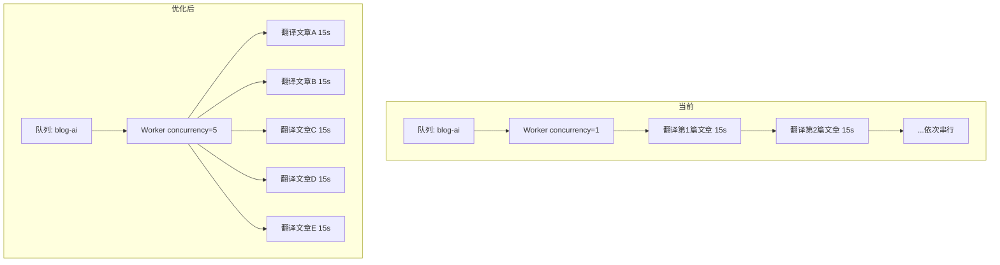

> **前置阅读：** 本文是翻译系统性能优化的专项分析。建议先阅读 [翻译系统演进实录](docs/blog/articles/api/translation-system-evolution.md) 了解翻译体系全貌，以及 [BullMQ 后台任务体系](docs/blog/articles/api/bullmq-background-jobs-queue-architecture.md) 了解队列基础设施。

## 1. 概述

翻译系统经过 [AI 驱动翻译引擎](docs/blog/articles/api/ai-powered-translation-engine.md) 的架构设计、[多 Provider 抽象层](docs/blog/articles/api/ai-service-multi-provider-abstraction-layer.md) 的构建以及 [翻译系统演进](docs/blog/articles/api/translation-system-evolution.md) 的持续运维优化后，大部分功能层面的问题已经解决。但在性能方面，有一个根本性的瓶颈一直未被触及——**Worker 并发度**。

本文聚焦于翻译系统的**并行度优化**，分析了从串行处理到并发处理的完整优化路径，记录了每一步的决策依据和实际效果。

```
┌──────────────────────────────────────────────────────────┐
│                    优化前（串行）                          │
│  ┌─────────┐   ┌─────────┐   ┌─────────┐                │
│  │ 文章 A   │──▶│ 文章 B   │──▶│ 文章 C   │──▶ ...       │
│  │ 15-30s  │   │ 15-30s  │   │ 15-30s  │               │
│  └─────────┘   └─────────┘   └─────────┘                │
│                 总耗时 = 篇数 × 单篇耗时                    │
├──────────────────────────────────────────────────────────┤
│                    优化后（并发）                          │
│  ┌─────────┐  15-30s                                     │
│  │ 文章 A   │──▶                                          │
│  ┌─────────┐  15-30s                                     │
│  │ 文章 B   │──▶                                          │
│  ┌─────────┐  15-30s          总耗时 ≈ 单篇耗时            │
│  │ 文章 C   │──▶                                          │
│  ┌─────────┐  15-30s                                     │
│  │ 文章 D   │──▶                                          │
│  ┌─────────┐  15-30s                                     │
│  │ 文章 E   │──▶                                          │
└──────────────────────────────────────────────────────────┘
```

## 2. 现状分析

### 2.1 技术架构

翻译系统的请求链路如下：

```
[用户点击翻译] → [API Controller] → [BlogService.queueFullLocaleTranslation()]
                                   → [BullMQ Queue: blog-ai]
                                     → [BlogAiProcessor (Worker)]
                                       → [AI Service (DeepSeek/Groq/Gemini)]
                                         → [Prisma DB 保存结果]
```

核心是 [`BlogAiProcessor`](apps/api/src/blog/processors/blog-ai.processor.ts) 这个 Worker，它消费 `blog-ai` 队列中的翻译任务，调用 AI Service 完成翻译后写入数据库。

### 2.2 核心瓶颈：concurrency=1

通过代码审查，发现翻译系统的根本瓶颈在于 Processor 装饰器的配置：

```typescript
// 优化前：apps/api/src/blog/processors/blog-ai.processor.ts
@Processor('blog-ai', {
  concurrency: 1,  // ← ★★★ 串行处理：一次只翻译一篇文章！
  limiter: {
    max: 60,
    duration: 60000,
  },
})
```

**`concurrency: 1` 意味着无论队列中有多少任务等待，Worker 每次只处理一个任务。** 所有翻译任务在队列中排队，一个完成后下一个才开始。

#### 典型性能数据

| 场景 | 单篇耗时 | 100 篇文章总耗时 |
|------|---------|-----------------|
| 当前（concurrency=1） | 10-30s | **~16-50 分钟** |
| 优化后（concurrency=5） | 10-30s | **~3-10 分钟** |
| 优化后（concurrency=10） | 10-30s | **~1.5-5 分钟** |

### 2.3 为什么当前是串行的？

通过分析提交历史和代码注释，串行配置的原因有三：

1. **历史原因**：早期使用 **Groq/Gemini 免费 API**，这些 API 有严格的速率限制（RPM=5, TPM=10,000）。串行 + 延迟是最安全的策略，可以最大程度避免 429 错误。

2. **配置滞后**：系统已经迁移到 **DeepSeek 付费 API**（价格 $0.14/M tokens，约为 Gemini 付费版的 1/10），代码中有多处注释提到 *"DeepSeek 付费 API 无速率限制"*，但 concurrency 参数没有同步调整。

3. **保守策略**：担心并发调用导致 API 429 错误或触发熔断器，因此一直未调整。

### 2.4 其他次要瓶颈

除了核心的 concurrency 限制外，还存在几个次要瓶颈：

| 问题 | 位置 | 影响 |
|------|------|------|
| `interRequestDelay = 50ms` | [`blog-ai.processor.ts:29`](apps/api/src/blog/processors/blog-ai.processor.ts:29) | 每篇文章内部多个 API 调用间的人为延迟 |
| `delay: index * 600` 任务投递间隔 | [`blog.service.ts:1558`](apps/api/src/blog/blog.service.ts:1558) | 批量投递时每个任务间隔 600ms |
| 单语言逐语言翻译 | 前端调用 `translateArticle()` | 每次只翻译一个目标语言，语言间串行 |
| 翻译缓存仅限单 Worker 内存 | [`blog-ai.processor.ts:30`](apps/api/src/blog/processors/blog-ai.processor.ts:30) | 多个 Worker 间不共享缓存 |

## 3. 优化方案

### 3.1 方案一：提高 Worker 并发度（高收益，低风险）

这是最直接、收益最高的优化——修改 Processor 装饰器的 `concurrency` 值：

```typescript
// 优化后：apps/api/src/blog/processors/blog-ai.processor.ts:17
@Processor('blog-ai', {
  concurrency: 5,       // 同时处理 5 篇文章
  limiter: {
    max: 100,           // 提高到 100，适应 5 倍并发
    duration: 60000,
  },
})
```

**风险分析：**

| 风险点 | 评估 | 说明 |
|--------|------|------|
| DeepSeek API 限流 | ✅ 低风险 | 付费 API 无速率限制 |
| 数据库连接池 | ✅ 低风险 | 连接池通常支持 10+ 并发写入 |
| AI 熔断器状态 | ⚠️ 需监控 | 需要观察是否触发熔断 |
| Prisma 连接池 | ⚠️ 需确认 | 可能需要调整 `connection_limit` |

**建议值：**
- 安全起步：`concurrency: 5`
- 激进模式：`concurrency: 10`
- 需根据 API 响应时间和数据库负载动态调整

### 3.2 方案二：多语言并行翻译（中收益，中风险）

当前流程是逐语言串行翻译：

```
翻译完所有文章到 EN → 翻译完所有文章到 JA → 翻译完所有文章到 KO → ...
```

优化为同时启动多个语言的批量翻译，每个语言独立消费队列：

```typescript
// 当前：串行语言
await queueFullLocaleTranslation('en');  // 等全部完成
await queueFullLocaleTranslation('ja');  // 再开始
await queueFullLocaleTranslation('ko');

// 优化：并行投递所有语言
await Promise.all([
  queueFullLocaleTranslation('en'),
  queueFullLocaleTranslation('ja'),
  queueFullLocaleTranslation('ko'),
]);
```

结合方案一的 concurrency=5，如果有 3 个语言并行，则实际并发度 = 5 × 3 = 15。

**风险：**
- ⚠️ 需要确保 AI 服务能处理更高的吞吐量
- ⚠️ 需要确认数据库连接池上限

### 3.3 方案三：一篇文章一次翻译所有目标语言（高收益，中等风险）

当前每篇文章每个目标语言需要一次 AI API 调用。如果启用 5 种语言，同一篇文章需要调用 AI 5 次。

优化为一次 Prompt 生成所有语言的翻译：

```typescript
// Prompt 示例
"Translate this article to ALL the following languages: en, ja, ko, fr, de.
Return the translations for each language in the following format..."
```

**优点：**
- 减少了 API 调用次数
- 利用 AI 的上下文理解，可能提高翻译一致性
- 文章内容只需传输一次

**风险：**
- ⚠️ Prompt 更复杂，输出格式解析更困难
- ⚠️ 长文章 + 多语言可能导致 Token 超限
- ⚠️ 如果一种语言失败，整个批次失败

### 3.4 方案四：消除内部不必要的延迟（低收益，低风险）

与方案一配合的辅助优化：

1. **降低 `interRequestDelay`**：对于 DeepSeek 付费 API，50ms 延迟已不是保护 API 的必要措施，可降低到 20ms 或移除

2. **降低批量投递间隔**：`delay: index * 600` 是为兼容 Groq 免费 API 的保守配置，可降低到 `200ms`

3. **使用 Redis 共享缓存**：替代内存缓存，使多个 Worker 实例共享翻译缓存，减少重复翻译

```typescript
// 优化后
private readonly interRequestDelay = 20; // 从 50ms 降低到 20ms
```

```typescript
// 优化后：blog.service.ts
for (const [index, article] of articles.entries()) {
  await this.blogAiQueue.add('translate-article', {
    articleId: article.id,
    targetLang,
    sourceLang: defaultSourceLang,
  }, {
    delay: index * 200, // 从 600ms 降低到 200ms
    attempts: 3,
    backoff: { type: 'exponential', delay: 5000 },
  });
}
```

## 4. 渐进式优化路线

### Phase 1（立即执行，低风险高回报）

| # | 修改 | 文件 | 预期提升 |
|---|------|------|---------|
| 1 | `concurrency: 1` → `concurrency: 5` | [`blog-ai.processor.ts:18`](apps/api/src/blog/processors/blog-ai.processor.ts:18) | **5x** |
| 2 | `interRequestDelay: 50` → `20` | [`blog-ai.processor.ts:29`](apps/api/src/blog/processors/blog-ai.processor.ts:29) | ~10% |
| 3 | 批量投递间隔 `600ms` → `200ms` | [`blog.service.ts:1558`](apps/api/src/blog/blog.service.ts:1558) | 投递速度提升 3 倍 |

### Phase 2（观察后执行）

| # | 修改 | 预期提升 |
|---|------|---------|
| 4 | 如果 Phase 1 稳定，将 concurrency 提升到 10 | **10x** |
| 5 | 多语言并行投递（`Promise.all`） | 语言数倍 |
| 6 | 添加 Redis 共享翻译缓存 | 减少重复翻译 |

### Phase 3（长期优化）

| # | 修改 | 预期提升 |
|---|------|---------|
| 7 | 多语言一次性翻译（方案三） | 3-5x |
| 8 | 考虑独立的翻译微服务或 Lambda | 弹性伸缩 |

## 5. 架构对比图



## 6. 监控指标

优化后应关注以下指标，确保并发提升不会引入新的稳定性问题：

| 指标 | 说明 | 告警阈值 |
|------|------|---------|
| 队列等待时间 | 任务从创建到开始处理的时间 | > 60s |
| AI API 响应时间 | 是否因并发增加而变慢 | > 30s |
| 错误率（429/503） | 限流或服务不可用错误 | > 5% |
| 数据库连接池使用率 | 是否达到连接池上限 | > 80% |
| 翻译完成率 | 每分钟完成任务数 | 低于预期值 |

## 7. 总结

翻译系统的性能优化是一个典型的**配置滞后于架构演进**的案例：

1. **根本瓶颈**：`concurrency: 1` 的串行配置，与 DeepSeek 付费 API 的能力不匹配
2. **核心修复**：将 concurrency 从 1 提高到 5，配合降低内部延迟，实现约 **5 倍** 的吞吐量提升
3. **渐进路线**：从低风险的并发度调整开始，逐步推进到多语言并行、多语言一次性翻译等更激进的优化

**核心经验**：在系统架构升级后，需要同步审查配套的基础设施配置。迁移到付费 API 后释放了速率限制，但 Worker 配置没有同步更新，导致"有高速路却只能开 20km/h"的尴尬局面。这个案例也提醒我们，技术债务不仅存在于代码逻辑中，也存在于**配置参数**中。

## 8. 相关文档

- [AI 驱动翻译引擎：Gemini 多层弹性架构](docs/blog/articles/api/ai-powered-translation-engine.md)
- [AI 服务迁移：Vertex AI 到 Google AI Studio](docs/blog/articles/api/ai-service-migration-vertex-ai-to-ai-studio.md)
- [AI 多 Provider 抽象层](docs/blog/articles/api/ai-service-multi-provider-abstraction-layer.md)
- [翻译系统演进实录](docs/blog/articles/api/translation-system-evolution.md)
- [API 后台任务体系 — BullMQ 队列架构与 Worker 实现](docs/blog/articles/api/bullmq-background-jobs-queue-architecture.md)
