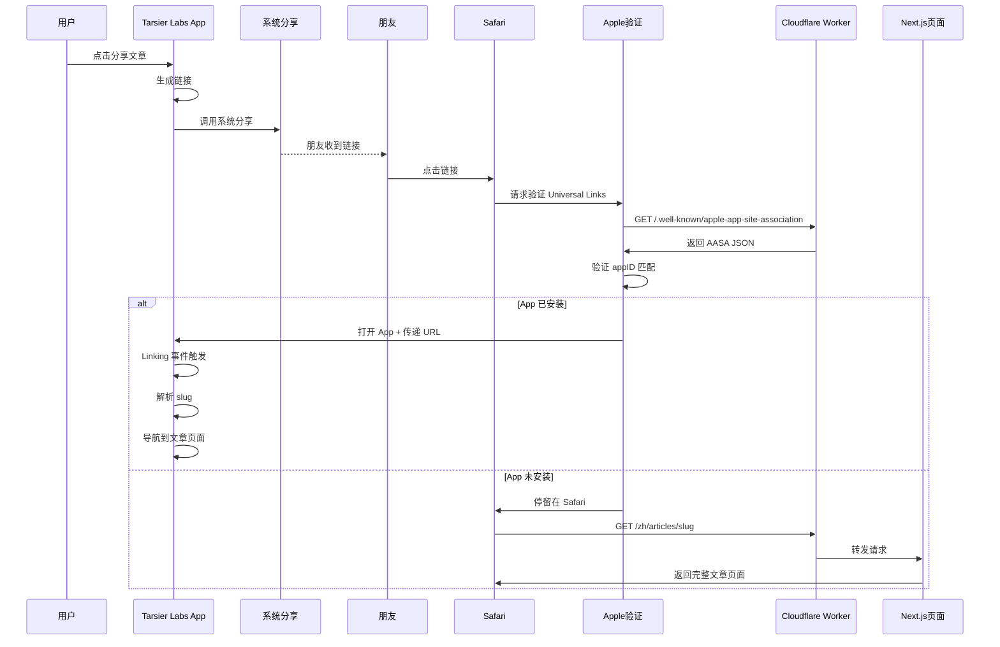

# Apple Universal Links 实战：从分享链接到一键打开 App 的完整实现

> 文章分享功能看起来简单——生成一个链接，用户点了打开就行。但当你想让这个链接在手机上能直接打开 App 而不是先跳到浏览器时，事情就没那么简单了。本文记录从零实现 Apple Universal Links 的全过程，涵盖 Worker 路由处理、AASA 文件配置、RN 端事件监听，以及踩坑记录。

---

## 1. 背景：为什么需要 Universal Links？

### 1.1 分享的终极体验

Tarsier Labs App 的文章分享功能有一个核心需求：用户把文章链接分享到 WhatsApp/Telegram/微信，接收方点击链接后——

- **如果 App 已安装** → 直接打开 App 并跳转到对应文章
- **如果 App 未安装** → 停留在 Safari 显示文章页面

这就是 Apple Universal Links 要解决的问题。对比几种方案：

| 方案                | 优点                                 | 缺点                                    | 结论        |
| ------------------- | ------------------------------------ | --------------------------------------- | ----------- |
| **Universal Links** | Apple 官方方案，无弹窗确认，无缝跳转 | 需要服务端 AASA 文件，HTTPS 必须        | ✅ **选择** |
| **URL Scheme**      | 实现简单，兼容性好                   | 会弹出确认对话框，未安装时无法 fallback | 备选        |
| **Custom Protocol** | 完全自定义                           | 无法直接回退到 Web，用户体验差          | 不推荐      |

### 1.2 系统架构

```
分享链路全景
├── 1. 分享端（Tarsier Labs App）
│   ├── 生成 Universal Link: https://blog.joyminis.com/zh/articles/{slug}
│   └── 调用系统分享 API 发送链接
├── 2. 服务端（Cloudflare Worker）
│   ├── AASA 文件：/.well-known/apple-app-site-association
│   ├── Content-Type: application/json（Apple 严格校验）
│   └── 缓存策略：CDN 缓存 1 小时
├── 3. Apple 验证层
│   ├── iOS 启动时/链接点击前下载 AASA
│   ├── 验证 appID（TeamID.BundleID）是否匹配
│   └── 匹配 → 打开 App，不匹配 → 停留在 Safari
└── 4. 接收端（Tarsier Labs App）
    ├── Linking.getInitialURL() → 处理冷启动
    ├── Linking.addEventListener('url') → 处理运行时点击
    └── 解析 slug → 导航到文章页面
```

---

## 2. 分享链接格式

### 2.1 链接结构

文章分享链接使用博客的标准 URL 格式：

```
https://blog.joyminis.com/{locale}/articles/{slug}
```

示例：

```
https://blog.joyminis.com/zh/articles/how-to-use-universal-links
https://blog.joyminis.com/en/articles/ios-development-tips
```

### 2.2 参数说明

| 参数     | 说明         | 示例                         |
| -------- | ------------ | ---------------------------- |
| `locale` | 语言代码     | `zh`, `en`, `ja`             |
| `slug`   | 文章唯一标识 | `how-to-use-universal-links` |

### 2.3 链接生成方式（RN App 端）

分享链接不在后端生成，而是在 **RN App 端直接拼接 URL 字符串**，然后调用系统分享 API。不需要后端接口，不需要生成中间页：

```typescript
// 分享文章时拼接 URL
const locale = "zh"; // 当前语言，从 i18n 获取
const slug = article.slug;
const shareUrl = `https://blog.joyminis.com/${locale}/articles/${slug}`;

// 调用系统分享
import Share from "react-native-share";

Share.open({
  url: shareUrl,
  title: article.title,
  message: article.description,
});
```

**为什么文章分享不需要后端生成链接？** 因为每篇文章本身就是 `blog.joyminis.com` 上的一个真实页面——OG 元数据、内容、预览全部都在页面里。分享链接就是文章自己的 URL，不需要像产品分享那样通过后端生成 `share.html` 中间页。

为什么选择 `blog.joyminis.com` 而不是买个新域名 `tarsier.app`？原因很简单：**博客域名已经有完整的 HTTPS 配置、OG 元数据和 Cloudflare Worker 部署流水线，直接用零额外成本**。

---

## 3. OG 元数据：分享预览

这是整个系统中最"省心"的部分——文章页面已经有了完整的 OG 元数据：

```
位置：apps/frontend-blog/src/app/[locale]/articles/[slug]/page.client.tsx:87-105
```

```typescript
const structuredData = useMemo(() => ({
  '@context': 'https://schema.org',
  '@type': 'Article',
  headline: article.title,
  description: article.description,
  image: article.coverImage,
  datePublished: article.createdAt,
  author: { ... }
}), [article]);
```

当链接分享到社交平台时，平台爬虫会自动抓取这些 OG 信息生成预览卡片——标题、描述、封面图，不需要任何后端改动。

---

## 4. 服务端：AASA 文件与 Worker 路由

### 4.1 AASA 文件内容

Apple 通过访问 `https://blog.joyminis.com/.well-known/apple-app-site-association` 获取 AASA 文件来验证域名与 App 的关联：

```json
{
  "applinks": {
    "apps": [],
    "details": [
      {
        "appID": "PK28T343BP.com.tarsier.labs",
        "paths": ["*", "NOT /_next/*", "NOT /__/*"]
      },
      {
        "appID": "PK28T343BP.com.tarsier.labs.dev",
        "paths": ["*", "NOT /_next/*", "NOT /__/*"]
      }
    ]
  }
}
```

关键字段说明：

- `appID`：格式为 `{TeamID}.{BundleID}`，`PK28T343BP` 来自 Xcode 项目的 `DEVELOPMENT_TEAM`
- `com.tarsier.labs` — production 构建的 Bundle ID
- `com.tarsier.labs.dev` — dev/debug 构建的 Bundle ID（通过 Firebase 分发）
- `paths`：使用 `"*"` 通配所有路径，排除 Next.js 内部路由 `/_next/*` 和调试路由 `/__/*`

> **踩坑**：因为博客所有页面都有 locale 前缀（`/{locale}/...`），如果用 `/articles/*` 这种精确路径，Apple 的路径前缀匹配会匹配不了 `/zh/articles/slug`。所以必须用 `"*"` 通配，在 App 端的 Linking handler 里按需处理。

> **踩坑**：AASA 文件名必须没有 `.json` 扩展名，就是 `apple-app-site-association`。如果加了扩展名，Apple 会忽略这个文件。

### 4.2 两个 AASA 文件（两个部署路径）

由于存在两种部署方式，AASA 文件需要放在两个位置：

| 环境           | 域名                  | 部署方式                         | 文件位置                                                                                                                                                                         | 说明                                                      |
| -------------- | --------------------- | -------------------------------- | -------------------------------------------------------------------------------------------------------------------------------------------------------------------------------- | --------------------------------------------------------- |
| **Production** | blog.joyminis.com     | Cloudflare Worker                | [`apps/frontend-blog/public/.well-known/apple-app-site-association`](/Volumes/MySSD/work/JoyMini_Nest_Monorepo/apps/frontend-blog/public/.well-known/apple-app-site-association) | 随代码一起部署，OpenNext 构建时同步到 R2，Worker 路由返回 |
| **Dev**        | blog-dev.joyminis.com | Cloudflare Tunnel → Docker Nginx | [`nginx/html/.well-known/apple-app-site-association`](/Volumes/MySSD/work/JoyMini_Nest_Monorepo/nginx/html/.well-known/apple-app-site-association)                               | Nginx 直接读取静态文件                                    |

**为什么需要两份？**

```
流量路径对比：

Production (blog.joyminis.com):
  用户 → Cloudflare Edge → Worker (OpenNext) → R2 (静态资源)
  所以 AASA 必须在 apps/frontend-blog/public/ 下，随 Worker 部署

Dev (blog-dev.joyminis.com):
  用户 → Cloudflare Tunnel → localhost:80 → Docker Nginx
  所以 AASA 在 nginx/html/ 下，Nginx 直接读取
```

### 4.3 Dev 环境测试 Universal Links（可选）

如果需要本地开发时测试 Universal Links，流程如下：

**前提条件：**

- AASA 文件已包含 `PK28T343BP.com.tarsier.labs.dev` 条目
- RN 项目配置了 Debug/Staging Build Variant
- 通过 Firebase App Distribution 分发 dev 包

**RN 项目配置步骤：**

| 步骤                             | 操作                             | 说明                        |
| -------------------------------- | -------------------------------- | --------------------------- |
| 1. Xcode 添加 Associated Domains | `applinks:blog-dev.joyminis.com` | Debug 配置下添加            |
| 2. Xcode 改 Bundle ID            | `com.tarsier.labs.dev`           | 区分 dev 和 production      |
| 3. 构建 Debug 包                 | `yarn ios --configuration Debug` | 通过 Xcode 或 Firebase 分发 |
| 4. 安装到手机                    | 通过 Xcode 或 Firebase           | iOS 会下载 AASA 验证        |

**验证方法：**

```bash
# Dev 环境的 AASA 也应该能访问
curl -s -D - https://blog-dev.joyminis.com/.well-known/apple-app-site-association | head -20
```

> **注意**：dev 环境的 Universal Links 仅对安装了 dev 包（Bundle ID: `com.tarsier.labs.dev`）的设备有效。production 包（App Store）只认 `com.tarsier.labs`，不会受 dev 域名影响。

### 4.4 Worker 路由处理

Worker 需要在请求到达时先检查路径是否为 AASA 文件，直接从 R2 读取并返回正确的内容类型：

**fetch 入口**（[`worker.ts:229-235`](/Volumes/MySSD/work/JoyMini_Nest_Monorepo/apps/frontend-blog/src/worker.ts:229)）：

```typescript
if (url.pathname === "/.well-known/apple-app-site-association") {
  const aasaResponse = await this.serveAASA(env);
  if (aasaResponse) {
    return this.addHeaders(aasaResponse, securityHeaders);
  }
}
```

**serveAASA 方法**（[`worker.ts:435-454`](/Volumes/MySSD/work/JoyMini_Nest_Monorepo/apps/frontend-blog/src/worker.ts:435)）：

```typescript
async serveAASA(env: Env): Promise<Response | null> {
  try {
    const object = await env.R2_STORAGE.get(
      '.well-known/apple-app-site-association',
    );
    if (!object) return null;

    const headers = new Headers();
    headers.set('Content-Type', 'application/json');
    headers.set('Cache-Control', 'public, max-age=3600');

    return new Response(object.body, {
      headers,
      status: 200,
    });
  } catch (error) {
    console.warn('AASA serve error:', error);
    return null;
  }
}
```

> **踩坑**：`Content-Type` 必须是 `application/json`。如果返回了错误的 Content-Type（比如 `application/octet-stream`），Apple 会静默忽略 AASA 文件，Universal Links 不生效也不会报错——调试起来非常痛苦。

---

## 5. iOS App 端配置

### 5.1 Associated Domains

在 Xcode 中添加 Associated Domains capability：

```
applinks:blog.joyminis.com
```

配置后，iOS 系统会在 App 启动时自动下载 `https://blog.joyminis.com/.well-known/apple-app-site-association` 验证关联关系。验证通过后，用户点击该域名的链接时系统会直接打开 App。

### 5.2 React Native Linking 事件监听

RN 端需要同时处理两种场景：**冷启动**（App 被杀掉后通过 Universal Link 打开）和**热启动**（App 在后台运行时点击链接）：

```typescript
import { Linking } from "react-native";

// App.tsx 或入口文件
useEffect(() => {
  // 1. 冷启动：App 被杀掉后通过 Universal Link 打开
  Linking.getInitialURL().then((url) => {
    if (url) handleUniversalLink(url);
  });

  // 2. 热启动：App 在后台运行，点击 Universal Link
  const subscription = Linking.addEventListener("url", (event) => {
    handleUniversalLink(event.url);
  });

  return () => subscription.remove();
}, []);

function handleUniversalLink(url: string) {
  // url 示例：https://blog.joyminis.com/zh/articles/how-to-use-universal-links
  const regex = /\/(zh|en|ja|ko|fr|de)\/articles\/([^/]+)/;
  const match = url.match(regex);

  if (match) {
    const locale = match[1];
    const slug = match[2];

    // 导航到文章页面
    navigation.navigate("ArticleDetail", { slug, locale });
  }
}
```

### 5.3 分享链接生成

```typescript
// 分享文章时生成 Universal Link
const locale = "zh"; // 当前语言
const slug = article.slug;
const shareUrl = `https://blog.joyminis.com/${locale}/articles/${slug}`;

import Share from "react-native-share";

Share.open({
  url: shareUrl,
  title: article.title,
  message: article.description,
});
```

---

## 6. 完整数据流



---

## 7. 验证方法

### 7.1 服务端验证

```bash
# 1. 验证 AASA 文件可访问
curl -s -D - https://blog.joyminis.com/.well-known/apple-app-site-association | head -20

# 2. 检查 Content-Type
curl -s -D - https://blog.joyminis.com/.well-known/apple-app-site-association | grep -i content-type
# 应输出: content-type: application/json

# 3. 验证 JSON 格式
curl -s https://blog.joyminis.com/.well-known/apple-app-site-association | python3 -m json.tool

# 4. 验证 Bundle ID
curl -s https://blog.joyminis.com/.well-known/apple-app-site-association \
  | python3 -c "import sys,json; d=json.load(sys.stdin); print(d['applinks']['details'][2]['appID'])"
# 应输出: PK28T343BP.com.tarsier.labs
```

### 7.2 iOS 端验证

1. 打开 iOS Simulator 或真机
2. 在 Notes App 中输入 `https://blog.joyminis.com/zh/articles/test-slug`
3. 长按链接 → 应显示 "Open in Tarsier Labs"
4. 点击链接 → App 应自动打开并跳转到对应页面

### 7.3 成功指标

| 指标          | 目标值           | 验证方法                 |
| ------------- | ---------------- | ------------------------ |
| AASA 可访问性 | 200 OK           | curl 返回 HTTP 200       |
| Content-Type  | application/json | curl 检查响应头          |
| App 安装检测  | 准确识别         | 安装/卸载 App 测试       |
| 冷启动跳转    | < 2 秒           | Linking.getInitialURL    |
| 热启动跳转    | < 1 秒           | Linking.addEventListener |

---

## 8. 踩坑实录

### 8.1 AASA 文件无扩展名

**问题**：AASA 文件加了 `.json` 后缀，Apple 忽略文件，Universal Links 不生效。

**修复**：文件名必须是 `apple-app-site-association`，不带任何扩展名。

### 8.2 Content-Type 陷阱

**问题**：Worker 从 R2 读取文件时，默认返回的 Content-Type 是 `application/octet-stream`，Apple 静默忽略。

**修复**：显式设置 `headers.set('Content-Type', 'application/json')`。

### 8.3 Apple CDN 缓存

**问题**：修改 AASA 文件后，测试时 Apple 仍然使用旧版本。

**原因**：Apple CDN 缓存 AASA 文件长达 24 小时。

**缓解措施**：

- 重启 iOS 设备可以触发清除缓存
- 在 iOS 15+ 上可以使用 `swcutil` 命令行工具清除
- 开发期间可以设置 Cache-Control: no-cache 临时调试

### 8.4 Bundle ID 不一致

**问题**：`capacitor.config.ts` 中的 `appId` 是 `com.tarsier.labs`，但 AASA 文件中配置的是 `com.tarsier.blog`。

**修复**：统一为 `com.tarsier.labs`，与 Xcode 项目中的 `PRODUCT_BUNDLE_IDENTIFIER` 保持一致。

---

## 9. 相关文件清单

| 文件                                                                                                                                                                                                     | 用途                                |
| -------------------------------------------------------------------------------------------------------------------------------------------------------------------------------------------------------- | ----------------------------------- |
| [`nginx/html/.well-known/apple-app-site-association`](/Volumes/MySSD/work/JoyMini_Nest_Monorepo/nginx/html/.well-known/apple-app-site-association)                                                       | Dev 环境 AASA（Docker Nginx）       |
| [`apps/frontend-blog/public/.well-known/apple-app-site-association`](/Volumes/MySSD/work/JoyMini_Nest_Monorepo/apps/frontend-blog/public/.well-known/apple-app-site-association)                         | Production 环境 AASA（Worker 部署） |
| [`apps/frontend-blog/src/worker.ts:229-235`](/Volumes/MySSD/work/JoyMini_Nest_Monorepo/apps/frontend-blog/src/worker.ts:229)                                                                             | Worker AASA 路由检查                |
| [`apps/frontend-blog/src/worker.ts:435-454`](/Volumes/MySSD/work/JoyMini_Nest_Monorepo/apps/frontend-blog/src/worker.ts:435)                                                                             | Worker serveAASA 方法               |
| [`apps/frontend-blog/src/app/[locale]/articles/[slug]/page.client.tsx:87-105`](/Volumes/MySSD/work/JoyMini_Nest_Monorepo/apps/frontend-blog/src/app/%5Blocale%5D/articles/%5Bslug%5D/page.client.tsx:87) | 文章 OG metadata                    |

---

## 10. 总结

Universal Links 虽然实现起来不算复杂——一个 AASA 文件 + 一个 Worker 路由 + 一段 RN 代码——但有几个容易踩的坑：

1. **AASA 文件格式**：无扩展名 + 正确 Content-Type，两个缺一不可
2. **Apple 缓存**：AASA 文件更新后要等很久才能生效，测试时要有耐心
3. **Team ID 和 Bundle ID**：必须与 Xcode 项目完全一致，一点都不能错
4. **路径匹配**：`paths` 配置要覆盖所有需要打开 App 的 URL，漏掉一个就得手动跳转

选择 `blog.joyminis.com` 作为 Universal Links 的域名是最省心的方案——博客已有的 HTTPS、Worker、部署流水线全部复用，不需要额外购买域名和配置证书。

---

_相关文档：_

- [Cloudflare Worker 架构与 OpenNext 部署](./nextjs-platform-adapter-pattern.md)
- [Next.js PWA 实现](frontend/nextjs-pwa-installable-offline-blog.md)
- [Flutter Deep Link 与 OAuth 全局处理](../flutter/deep-link-oauth-global-handler.md)
