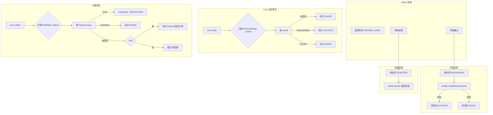
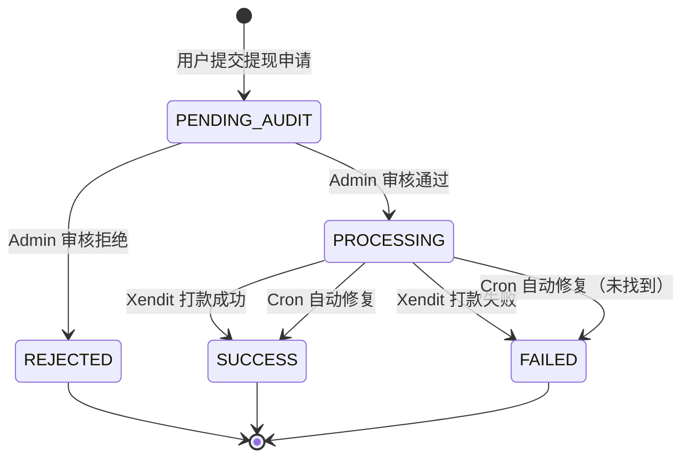

# 财务审计系统：NestJS Xendit 打款 + @DistributedLock + Cron 幽灵订单自动修复

## 1. 背景：金融系统的三大核心挑战

在涉及资金操作的系统中，三个问题最为关键：

1. **重复操作**：Admin 误点两次"审核通过"导致重复打款
2. **状态不一致**：第三方打款成功但数据库未更新（"钱出去了，状态没变"）
3. **幽灵订单**：用户付款但系统未收到回调，订单永远卡在待处理状态

我们的财务审计系统 [`FinanceService`](apps/api/src/admin/finance/finance.service.ts) + [`FinanceTask`](apps/api/src/admin/finance/finance.task.ts) 通过**分布式锁 + 严格状态机 + Cron 自动修复**完美解决了这三个问题。

---

## 2. 系统架构



---

## 3. 核心难点 1：防重复打款 — @DistributedLock

### 问题

```
Admin 点击"审核通过"按钮
  ↓
第一次请求：状态改为 PROCESSING，调用 Xendit 打款
  ↓ (网络延迟) 
第二次请求：此时状态还未更新成功，再次读取为 PENDING_AUDIT
  ↓
两笔打款同时发出！→ 财务损失
```

### 解决方案

```typescript
// 文件: finance.service.ts 第 308 行
@DistributedLock('withdraw_audit_lock:{0.withdrawId}', 10000)
async auditWithdraw(dto: AuditWithdrawDto, adminId: string) {
```

这个自定义装饰器 [`DistributedLock`](apps/api/src/common/decorators/distributed-lock.decorator.ts) 实现了 Redis 分布式锁：

```typescript
// Key 模式解析
'withdraw_audit_lock:{0.withdrawId}' 
// 第 0 个参数 (dto) 的 withdrawId 属性
// 实际 Key: lock:withdraw_audit_lock:wdraw_xxx123
```

**分布式锁 + 状态机双保险**：

```typescript
// 文件: finance.service.ts 第 324-339 行
const updateResult = await this.prismaService.withdrawOrder.updateMany({
  where: {
    withdrawId,
    withdrawStatus: WITHDRAW_STATUS.PENDING_AUDIT, // ← 只能审核待审核状态
  },
  data: {
    withdrawStatus: WITHDRAW_STATUS.PROCESSING,
    auditorId: adminId,
    auditedAt: new Date(),
  },
});

if (updateResult.count === 0) {
  throw new BadRequestException('Withdrawal order already processed');
}
```

即使分布式锁偶尔失效（如 Redis 宕机后锁自动释放），**状态机约束仍会阻止重复审核**——`updateMany` 的 `where` 条件要求状态只能是 `PENDING_AUDIT`，一旦被改为 `PROCESSING`，后续请求的 `updateMany` 会返回 `count: 0`。

三种防护层的对比：

| 防护层 | 作用 | 防御场景 |
|--------|------|----------|
| @DistributedLock | 应用层互斥 | 同一时间片内的并发请求 |
| 状态机 where 条件 | 数据库层校验 | 跨时间片的重复请求 |
| 人工审计日志 | 追溯与问责 | 所有操作留有记录 |

### 手动调账的分布式锁

```typescript
// 文件: finance.service.ts 第 105 行
@DistributedLock('manual_adjust_lock:{0.userId}', 5000)
async manualAdjust(dto: ManualAdjustmentDto, query: { adminId: string; ip: string }) {
```

针对同一个用户的连续调账操作，锁 Key 是 5 秒。此外还有**3 秒内重复拦截**：

```typescript
// 文件: finance.service.ts 第 137-149 行
const lastTx = await ctx.walletTransaction.findFirst({
  where: {
    userId,
    relatedType: RelatedType.ADMIN_ADJUST,
    createdAt: { gte: TimeHelper.getTimeAgo(3, 'second') },
  },
});

if (lastTx) {
  throw new BadRequestException(
    'A recent adjustment was made. Please wait a moment.',
  );
}
```

---

## 4. 核心难点 2：审核拒绝 — 冻结金额回退

提现审核通过触发 Xendit 打款，而审核拒绝需要回退冻结金额：

```typescript
// 文件: finance.service.ts 第 384-455 行
return this.prismaService.$transaction(async (ctx) => {
  // 1. 状态改为 REJECTED
  const res = await ctx.withdrawOrder.updateMany({
    where: {
      withdrawId,
      withdrawStatus: WITHDRAW_STATUS.PENDING_AUDIT,
    },
    data: {
      withdrawStatus: WITHDRAW_STATUS.REJECTED,
      rejectReason: remark,
    },
  });

  if (res.count === 0) {
    throw new BadRequestException('Order status has changed');
  }

  // 2. 退回冻结金额
  const wallet = await ctx.userWallet.findUnique({
    where: { userId: order.userId },
  });

  const amount = new Prisma.Decimal(order.withdrawAmount);
  await ctx.userWallet.update({
    where: { userId: order.userId, frozenBalance: { gte: amount } },
    data: {
      realBalance: { increment: amount },
      frozenBalance: { decrement: amount },
    },
  });

  // 3. 记录退款流水
  await ctx.walletTransaction.create({
    data: {
      transactionNo: OrderNoHelper.generate(BizPrefix.REFUND),
      userId: order.userId,
      walletId: wallet.id,
      transactionType: TRANSACTION_TYPE.REFUND,
      balanceType: BALANCE_TYPE.CASH,
      amount: amount,
      beforeBalance: wallet.realBalance,
      afterBalance: wallet.realBalance.plus(amount),
      description: `Withdraw rejected: ${remark}`,
      relatedId: order.withdrawId,
      relatedType: RelatedType.WITHDRAWAL,
    },
  });
  
  return ctx.withdrawOrder.update({
    where: { withdrawId },
    data: { withdrawStatus: WITHDRAW_STATUS.REJECTED },
  });
});
```

注意：全部操作在同一个 Prisma 事务中，要么全部成功要么全部回滚。`frozenBalance: { gte: amount }` 乐观锁防止冻结金额在被审核过程中已被解冻。

---

## 5. 核心难点 3：幽灵订单 — Cron 自动修复

### 5.1 充值幽灵订单

```typescript
// 文件: finance.task.ts 第 28-84 行
@Cron(CronExpression.EVERY_10_MINUTES)
async handleStuckOrders() {
  await this.lockService.runWithLock('cron:stuck_recharges', 60000, async () => {
    const timeThreshold = TimeHelper.toDate(dayjs().subtract(30, 'minute'));
    
    // 找出 30 分钟前创建的 PENDING 充值订单
    const stuckOrders = await this.prismaService.rechargeOrder.findMany({
      where: {
        rechargeStatus: RECHARGE_STATUS.PENDING,
        createdAt: { lt: timeThreshold },
      },
      take: 20,
      orderBy: { createdAt: 'asc' },
    });
    
    for (const order of stuckOrders) {
      // 调用 syncRechargeStatus 去 Xendit 查询真实状态
      const result = await this.financeService.syncRechargeStatus(
        order.rechargeId, 'SYSTEM_BOT',
      );
      await new Promise((resolve) => setTimeout(resolve, 500)); // 礼貌间隔
    }
  });
}
```

**为什么 Redis 锁用 60 秒但 Cron 每 10 分钟执行？** 锁 TTL 只是为了**任务互斥**（多实例同时启动时只有一台执行），60 秒足够扫描完 20 条订单。下一次 Cron 触发时锁早已释放。

`syncRechargeStatus` 的幽灵订单判定逻辑：

```
Xendit 查无此单？
  ├── 订单创建 > 1 小时 → 标记 FAILED（幽灵订单清理）
  └── 订单创建 < 1 小时 → 抛异常（可能回调还在路上）
```

### 5.2 提现幽灵订单

```typescript
// 文件: finance.task.ts 第 92-204 行
@Cron(CronExpression.EVERY_5_MINUTES)
async handleStuckWithdrawals() {
  await this.lockService.runWithLock('cron:stuck_withdrawals', 300000, async () => {
    const timeThreshold = TimeHelper.toDate(dayjs().subtract(10, 'minute'));
    
    // 找出 10 分钟前更新但仍是 PROCESSING 的提现单
    const stuckOrders = await this.prismaService.withdrawOrder.findMany({
      where: {
        withdrawStatus: WITHDRAW_STATUS.PROCESSING,
        updatedAt: { lt: timeThreshold },
      },
      take: 20,
    });

    for (const order of stuckOrders) {
      // 去 Xendit 查询这笔打款
      const xenditData = await this.paymentService.getDisbursementByExternalId(
        order.withdrawNo,
      );

      if (!xenditData) {
        // 断电发生在“改库为Processing之后” + “发Xendit请求之前”
        // 钱没出去 → 标记 FAILED
        await this.prismaService.withdrawOrder.update({
          where: { withdrawId: order.withdrawId },
          data: { withdrawStatus: WITHDRAW_STATUS.FAILED },
        });
      } else if (xenditData.status === 'SUCCEEDED') {
        // 断电发生在“Xendit请求已发”之后
        // 钱已出去 → 标记 SUCCESS
        await this.prismaService.withdrawOrder.update({
          where: { withdrawId: order.withdrawId },
          data: { withdrawStatus: WITHDRAW_STATUS.SUCCESS },
        });
      } else if (xenditData.status === 'FAILED') {
        await this.prismaService.withdrawOrder.update({
          where: { withdrawId: order.withdrawId },
          data: { withdrawStatus: WITHDRAW_STATUS.FAILED },
        });
      }
    }
  });
}
```

**为什么提现 Cron 用 5 分钟间隔 + 300 秒锁？**

| Cron | 间隔 | 锁 TTL | 说明 |
|------|------|--------|------|
| 充值修复 | 10min | 60s | 锁只是用来竞聘执行权，持锁者完成后释放 |
| 提现修复 | 5min | 300s | 同一实例连续执行，锁 TTL 覆盖全部 20 条订单处理时间 |

提现修复的 300 秒锁 TTL 设计是为了确保：如果订单处理到一半实例崩溃，**锁在 5 分钟后自动释放**，另一台实例可以接替继续。而 5 分钟的 Cron 间隔确保了最多 5 分钟就能发现一次卡单。

---

## 6. 状态机设计

提现订单的完整状态机：



**为什么需要 `PENDING_AUDIT` → `PROCESSING` 的中间状态？** 这是"两阶段提交"在应用层的体现——先锁定订单防止重复处理，再调用第三方 API，避免长时间事务锁表。

---

## 7. 人工调账（Manual Adjust）

```typescript
// 文件: finance.service.ts 第 105-247 行
@DistributedLock('manual_adjust_lock:{0.userId}', 5000)
async manualAdjust(dto: ManualAdjustmentDto, query: { adminId: string; ip: string }) {
  return this.prismaService.$transaction(async (ctx) => {
    // 1. 验证管理员和用户存在
    // 2. 3秒内防重复
    // 3. 原子更新余额（加/扣）
    // 4. 记录交易流水
    // 5. 记录管理员操作日志
  });
}
```

安全措施清单：

| 措施 | 实现 |
|------|------|
| 分布式锁 | `@DistributedLock('manual_adjust_lock:{0.userId}', 5000)` |
| 防重复调账 | 3 秒内相同用户检查 |
| 乐观锁扣款 | `where { realBalance: { gte: amount } }` |
| Audit Trail | `walletTransaction` 记录 before/after |
| 操作日志 | `adminOperationLog` 记录操作人、IP、金额 |
| 精度安全 | 入口处 `new Prisma.Decimal(amountNum)` 防止浮点误差 |

---

## 8. Xendit 集成

```typescript
// 文件: finance.service.ts 第 349-356 行
const bankCode = order.withdrawMethod === 1 ? 'PH_GCASH' : 'PH_PAYMAYA';
xenditResp = await this.paymentService.createDisbursement({
  orderNo: order.withdrawNo,
  amount: amount.toNumber(),
  bankCode: bankCode,
  accountName: order?.accountName || '',
  accountNumber: order?.withdrawAccount || '',
  description: `Withdrawal for ${order.withdrawNo}`,
});
```

收款方式映射：

| 提现方式 | bankCode | 说明 |
|---------|----------|------|
| 1 | PH_GCASH | GCash 电子钱包 |
| 2 | PH_PAYMAYA | PayMaya 电子钱包 |

`createDisbursement` 调用不在 Prisma 事务内执行，避免长时间的网络 I/O 占用数据库连接。

---

## 9. 性能与可靠性指标

| 操作 | 耗时 | 说明 |
|------|------|------|
| 审核通过（仅改状态） | ~5ms | `updateMany` + 分布式锁 |
| 审核通过（含 Xendit 打款） | ~800ms | 含网络 I/O，不在事务内 |
| 审核拒绝（含资金回退） | ~20ms | 事务内 3 次写操作 |
| Cron 充值扫描 | ~3s（20 条 × 500ms 间隔） | 限速避免 Xendit API 限流 |
| Cron 提现扫描 | ~3s（20 条 × 500ms 间隔） | 同上 |
| 手动调账 | ~15ms | 事务内 4 次写操作 |

---

## 10. 总结

这套财务审计系统的设计核心在于**多层防御**：

1. **分布式锁**防重复打款和调账
2. **严格状态机**确保订单不会从已处理状态回退
3. **Cron 自动修复**兜底"钱出去了状态没变"的幽灵订单
4. **完整 Audit Trail**每笔资金变动都有流水记录，可追溯可审计
5. **操作日志**记录管理员所有财务操作，支持审计追责

> 金融系统的核心不是代码的正确性，而是容错性——当一切正常时系统可靠不难，难的是在断电、网络超时、并发碰撞时仍然保持数据一致性。
