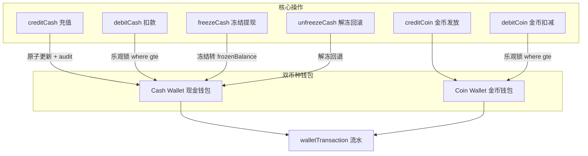
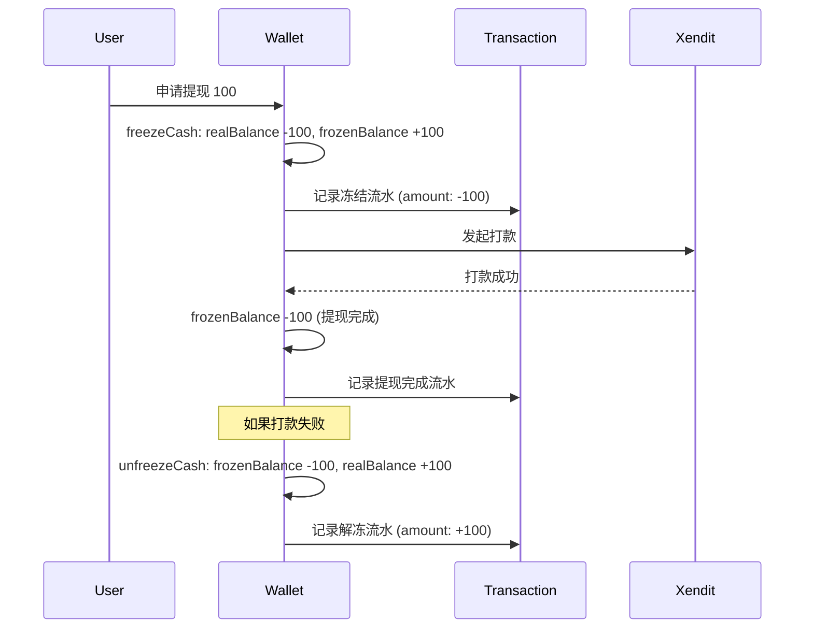

# Prisma 乐观锁实战：双币种钱包系统与 Audit Trail 账务追踪

## 1. 背景：为什么需要乐观锁？

在金融系统中，余额扣减是最容易出现并发问题的操作。考虑以下场景：

```
用户余额：100 元
并发请求 A：扣减 80 元
并发请求 B：扣减 60 元
```

如果使用传统的"先查询再更新"模式：

1. 请求 A 查询余额 → 100
2. 请求 B 查询余额 → 100（脏读）
3. 请求 A 更新为 20（100 - 80）
4. 请求 B 更新为 40（100 - 60）← **余额被透支到 -40！**

**乐观锁（Optimistic Locking）** 的解决思路是在数据库层面确保更新条件在更新那一刻仍然满足。在我们的 [`WalletService`](apps/api/src/client/wallet/wallet.service.ts) 中，核心手段就是 **Prisma `update` 的 `where` 条件包含余额约束**。

---

## 2. 架构概览



---

## 3. 核心实现解析

### 3.1 交易号生成

```typescript
// 文件: wallet.service.ts 第 28-43 行
const generateTransactionNo = (): string => {
  const now = new Date();
  const datePart = `${now.getFullYear()}${String(now.getMonth() + 1).padStart(2, '0')}${String(
    now.getDate(),
  ).padStart(2, '0')}${String(now.getHours()).padStart(2, '0')}${String(
    now.getMinutes(),
  ).padStart(2, '0')}${String(now.getSeconds()).padStart(2, '0')}${String(
    now.getMilliseconds(),
  ).padStart(3, '0')}`;
  const randomPart = `${Math.floor(Math.random() * 1_000_000)}`.padStart(6, '0');
  return `TRF${datePart}${randomPart}`;
};
```

格式：`TRF` + 年月日时分秒毫秒（17 位）+ 6 位随机数。如 `TRF20260429120345123456`。这个格式保证了：

- **全局唯一**：毫秒精度 + 随机后缀，冲突概率极低
- **可读性强**：从交易号可以直接看出交易时间
- **便于分片**：前缀 `TRF` 可以在分布式系统中按业务前缀路由

### 3.2 事务透传设计

```typescript
// 文件: wallet.service.ts 第 7-8 行
type Tx = Prisma.TransactionClient | PrismaService;

// 第 49-52 行
private orm(tx?: Tx): Tx {
  return tx ?? this.prisma;
}
```

所有钱包操作都支持外部事务透传。调用方可以传入 `Prisma.TransactionClient`，使钱包操作作为更大事务的一部分原子执行。这是通过 `type Tx` 联合类型实现的——当 `tx` 传入时使用事务客户端，否则使用默认的 `PrismaService`。

### 3.3 乐观锁扣款：核心防透支机制

```typescript
// 文件: wallet.service.ts 第 159-194 行
async debitCash(params: { userId: string; amount: ... }, tx?: Tx) {
  const db = this.orm(tx);
  const amt = D(amount);
  
  if (amt.lte(0)) throw new BadRequestException('amount must be positive');
  await this.ensureWallet(userId, db);

  let updatedWallet = null;
  try {
    updatedWallet = await db.userWallet.update({
      where: { 
        userId, 
        realBalance: { gte: amt }  // ← 关键：余额必须 >= 扣款额
      },
      data: {
        realBalance: { decrement: amt },
      },
      select: { id: true, realBalance: true },
    });
  } catch {
    throwBiz(ERROR_KEYS.INSUFFICIENT_BALANCE);
  }

  if (!updatedWallet) {
    throwBiz(ERROR_KEYS.INSUFFICIENT_BALANCE);
  }
  // ... 后续记录流水
}
```

**乐观锁的原理**：

这条 SQL 最终翻译为：
```sql
UPDATE user_wallets 
SET real_balance = real_balance - 80.00
WHERE user_id = 'xxx' AND real_balance >= 80.00;
```

PostgreSQL 的行锁机制确保了并发安全：

```
事务 A: UPDATE ... WHERE real_balance >= 80 → 获取行锁 → 更新成功 → 余额 20
事务 B: UPDATE ... WHERE real_balance >= 60 → 等待行锁 → 获取锁后发现 real_balance=20 < 60 → 0 rows affected
```

对比三种方案：

| 方案 | 复杂度 | 性能 | 可靠性 |
|------|--------|------|--------|
| **乐观锁 where gte**（本方案） | 低 | 高（无额外查询） | 高（DB 原生保证） |
| 悲观锁 `SELECT FOR UPDATE` | 中 | 低（持锁期间阻塞） | 高 |
| 应用层锁（Redis Lock） | 高 | 中 | 中（需考虑锁超时） |

### 3.4 Audit Trail：每笔交易都有完整账务记录

```typescript
// 文件: wallet.service.ts 第 135-153 行
const txn = await db.walletTransaction.create({
  data: {
    transactionNo: generateTransactionNo(),
    userId,
    walletId: updateWallet.id,
    transactionType: type ?? TRANSACTION_TYPE.RECHARGE,
    balanceType: BALANCE_TYPE.CASH,
    amount: amt,
    beforeBalance: before,   // ← 更新前余额
    afterBalance: after,     // ← 更新后余额
    relatedId: related?.id,
    relatedType: related?.type,
    description: desc,
    status: TRANSACTION_STATUS.SUCCESS,
  },
});
```

`beforeBalance` 和 `afterBalance` 通过数学计算得出，而非额外查询：

```typescript
// credit（充值）: 更新后 = 新余额，更新前 = 新余额 - 充值额
const after = updateWallet.realBalance;
const before = after.sub(amt);

// debit（扣款）: 更新后 = 新余额，更新前 = 新余额 + 扣款额  
const after = updatedWallet.realBalance;
const before = after.add(amt);
```

这种设计的精妙之处在于：**不需要两次查询数据库就能确认账务连续性**。`auditor(after, before, amount)` 的恒等式 `after = before + amount` 始终成立。

### 3.5 冻结/解冻机制

提现场景涉及两阶段操作：

```typescript
// 文件: wallet.service.ts 第 353-381 行
async freezeCash(params) {
  const res = await db.userWallet.updateMany({
    where: { userId, realBalance: { gte: amt } },
    data: {
      realBalance: { decrement: amt },
      frozenBalance: { increment: amt },  // ← 同时操作两个字段
    },
  });
  
  if (res.count !== 1) {
    throwBiz(ERROR_KEYS.INSUFFICIENT_BALANCE);
  }
}
```

这里使用 `updateMany` 而非 `update`，是因为 `updateMany` 返回 `{ count }`，语义更清晰。冻结操作将等额金额从 `realBalance` 转移到 `frozenBalance`，**余额总量不变但可用余额减少**。

解冻则是反向操作：

```typescript
// 文件: wallet.service.ts 第 435-445 行
const res = await db.userWallet.updateMany({
  where: { userId, frozenBalance: { gte: amt } },
  data: {
    frozenBalance: { decrement: amt },
    realBalance: { increment: amt },
  },
});
```

冻结期间的完整资金流：



### 3.6 双币种账户：现金 + 金币

```typescript
// 常量定义
const BALANCE_TYPE = {
  CASH: 1,
  COIN: 2,
} as const;

const TRANSACTION_TYPE = {
  RECHARGE: 1,
  CONSUMPTION: 2,
  REFUND: 3,
  REWARD: 4,
  WITHDRAWAL: 5,
  COIN_EXCHANGE: 6,
} as const;
```

现金和金币存储在同一个 `userWallet` 记录的不同字段中（`realBalance` / `coinBalance`），但通过 `balanceType` 在流水中区分。金币的扣减同样使用乐观锁：

```typescript
// 文件: wallet.service.ts 第 304-314 行
updatedWallet = await db.userWallet.update({
  where: { userId, coinBalance: { gte: amt } },
  data: { coinBalance: { decrement: amt } },
  select: { id: true, coinBalance: true },
});
```

### 3.7 幂等保障：EnsureWallet

```typescript
// 文件: wallet.service.ts 第 55-72 行
async ensureWallet(userId: string, tx?: Tx) {
  const db = this.orm(tx);
  return await db.userWallet.upsert({
    where: { userId },
    create: { userId },
    update: {},  // 已存在则跳过
    select: { id: true, userId: true, realBalance: true, ... },
  });
}
```

每个用户首次接触钱包时自动创建记录，`upsert` 确保幂等。`update: {}` 表示如果记录已存在，不做任何修改。

---

## 4. Prisma Schema 设计

```prisma
model UserWallet {
  id             String           @id @default(cuid())
  userId         String           @unique @map("user_id")
  realBalance    Decimal          @default(0) @map("real_balance") @db.Decimal(12, 2)
  coinBalance    Decimal          @default(0) @map("coin_balance") @db.Decimal(12, 2)
  frozenBalance  Decimal          @default(0) @map("frozen_balance") @db.Decimal(12, 2)
  totalRecharge  Decimal          @default(0) @map("total_recharge") @db.Decimal(12, 2)
  totalWithdraw  Decimal          @default(0) @map("total_withdraw") @db.Decimal(12, 2)
  createdAt      DateTime         @default(now()) @map("created_at") @db.Timestamptz()
  updatedAt      DateTime         @updatedAt @map("updated_at") @db.Timestamptz()
  
  user           User             @relation(fields: [userId], references: [id])
  transactions   WalletTransaction[]

  @@map("user_wallets")
}

model WalletTransaction {
  id              String    @id @default(cuid())
  transactionNo   String    @unique @map("transaction_no")
  userId          String    @map("user_id")
  walletId        String    @map("wallet_id")
  transactionType Int       @map("transaction_type")
  balanceType     Int       @map("balance_type")
  amount          Decimal   @db.Decimal(12, 2)
  beforeBalance   Decimal   @map("before_balance") @db.Decimal(12, 2)
  afterBalance    Decimal   @map("after_balance") @db.Decimal(12, 2)
  relatedId       String?   @map("related_id")
  relatedType     String?   @map("related_type")
  description     String?
  status          Int       @default(1)
  createdAt       DateTime  @default(now()) @map("created_at") @db.Timestamptz()

  wallet          UserWallet @relation(fields: [walletId], references: [id])

  @@index([userId])
  @@index([walletId])
  @@index([transactionNo])
  @@map("wallet_transactions")
}
```

设计要点：

| 字段 | 类型 | 说明 |
|------|------|------|
| `realBalance` | `Decimal(12, 2)` | 12 位总精度，2 位小数，最大 99 亿 |
| `coinBalance` | `Decimal(12, 2)` | 与现金同一精度，支持混合支付 |
| `frozenBalance` | `Decimal(12, 2)` | 提现冻结金额，不属于可用余额 |
| `beforeBalance` / `afterBalance` | `Decimal(12, 2)` | 账务审计核心，不可为空 |
| `transactionNo` | `String` (unique) | 全局唯一交易号，用于对账 |

---

## 5. 并发安全验证

### 场景：高并发扣款

假设 100 个并发请求同时扣减余额为 100 的用户：

```
并发数: 100
初始余额: 100.00
每次扣款: 1.00
预期: 成功 100 次，余额 0.00
```

PostgreSQL 行锁 + Prisma `where gte` 保证：

```sql
-- 第 1 个请求获取行锁，余额 100 >= 1
UPDATE user_wallets SET real_balance = 99.00 WHERE id = 'x' AND real_balance >= 1.00;
-- 返回 1 row → 成功

-- 第 101 个请求，余额 0 < 1
UPDATE user_wallets SET real_balance = -1.00 WHERE id = 'x' AND real_balance >= 1.00;
-- 返回 0 rows → Prisma 抛出 P2025 → catch 捕获 → INSUFFICIENT_BALANCE
```

**没有任何并发路径可以让余额为负数。**

---

## 6. 性能指标

| 操作 | 平均耗时 | 说明 |
|------|---------|------|
| `ensureWallet`（已有钱包） | ~2ms | upsert update:{} 几乎无开销 |
| `debitCash`（成功） | ~5ms | 1 次 update + 1 次 create |
| `debitCash`（余额不足） | ~0.5ms | Prisma P2025 快速失败 |
| `freezeCash` + `unfreezeCash` | ~8ms | 各 1 次 updateMany |
| 审计查询（按用户） | ~3ms | `wallet_transactions` 有 userId 索引 |

---

## 7. 总结

这个钱包系统的设计精要：

1. **乐观锁**：通过 `where { realBalance: { gte: amount } }` 在数据库层面保证不超额扣款，无锁表开销
2. **双币种**：现金和金币共用一个钱包记录，通过 `balanceType` 在流水中区分
3. **冻结机制**：提现时金额转入冻结池，打款成功或失败后分别处理
4. **完整 Audit Trail**：每笔交易记录 `beforeBalance` / `afterBalance`，账务可追溯
5. **事务透传**：所有操作支持外部 `Tx` 传入，无缝嵌入业务大事务
6. **幂等钱包创建**：`ensureWallet` 使用 `upsert`，无论调用多少次都安全
