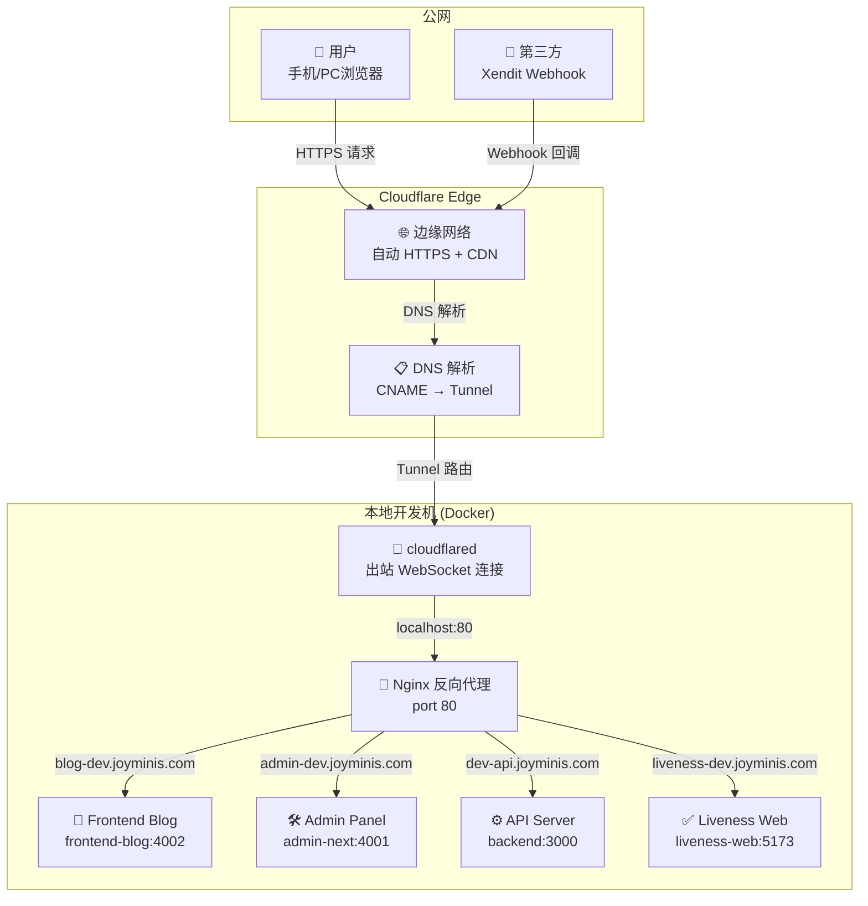

# Cloudflare Tunnel 实战指南：从零搭建开发环境公网访问

> 本地开发的服务如何让公网访问？本文将结合实际项目经验，从场景痛点出发，一步步教你用 Cloudflare Tunnel 搭建安全、免费、稳定的开发环境公网访问方案。

---

## 1. 场景痛点：为什么本地开发需要公网访问

在日常开发中，我们经常会遇到"服务跑在 localhost，但外部无法访问"的困境。以下 4 个场景是实际开发中最高频的需求：

### 1.1 Webhook 回调调试

第三方支付（Xendit、Stripe、PayPal 等）的回调机制要求提供一个**可公网访问的 URL**。当用户完成支付后，支付网关会主动向这个 URL 发送 POST 请求通知支付结果。

**实际案例**：我们的项目集成 Xendit 支付，当用户完成存款后，Xendit 需要回调 `https://dev-api.joyminis.com/api/v1/payment/webhook/xendit` 来通知后端订单状态。如果这个地址不可达，订单就会一直卡在"处理中"，需要靠人工手动同步或依赖 10 分钟一次的 Cron 兜底任务。

```typescript
// Xendit webhook handler entry
@Post('xendit')
@HttpCode(200)
async handleWebhook(@Body() payload: unknown, @Headers('x-auth-token') token: string) {
  // 如果 URL 不可达，这里的代码永远不会执行
  return this.clientWalletService.handleUniversalWebhook(payload);
}
```

### 1.2 移动端测试

移动端 App（Flutter / React Native）在开发阶段需要连接后端的 API 进行联调。模拟器可以访问 `10.0.2.2` 映射到宿主机，但**真机测试**就要求后端有一个真实可达的地址。

```dart
// Flutter App 开发环境配置
class ApiConfig {
  // ❌ 真机无法访问
  // static const baseUrl = 'http://localhost:3000';
  
  // ✅ 通过 Tunnel 暴露
  static const baseUrl = 'https://dev-api.joyminis.com';
}
```

### 1.3 PC 端跨设备调试

不同操作系统（Windows / macOS / Linux）的浏览器兼容性测试、响应式布局验证，都需要在真实设备上访问开发中的页面。

### 1.4 对外演示

给客户或产品经理预览开发进度，不需要部署到生产环境，一个临时的公网地址就能解决问题。

### 传统方案的局限性

| 方案 | 问题 |
|------|------|
| **公网 IP + 端口映射** | 成本高，配置复杂，存在安全风险 |
| **ngrok 免费版** | 域名随机不可控，每分钟限制 1 个连接，速度慢 |
| **自建 VPN** | 需要一台公网服务器，维护成本高 |
| **DMZ 主机** | 安全风险大，配置复杂 |

---

## 2. 方案选型：为什么选择 Cloudflare Tunnel

### 2.1 技术原理

Cloudflare Tunnel（原 Argo Tunnel）的核心原理非常简单：

```
用户请求 → Cloudflare Edge → WebSocket 长连接 → cloudflared 客户端 → 本地服务
```

`cloudflared` 客户端在你的本地机器上建立一条 **出站的 WebSocket 连接** 到 Cloudflare 的边缘网络。由于连接是从内网主动发起的，完全**不需要开放任何防火墙端口**。

这是"零信任"安全模型的一种实践：不信任任何网络边界，所有访问都经过身份验证和授权。

### 2.2 方案对比

| 特性 | ngrok Free | Cloudflare Tunnel | 自建 VPN |
|------|-----------|-------------------|----------|
| **价格** | 有限免费（1 连接/分钟） | 完全免费 | 需服务器成本 |
| **域名** | 随机临时域名 | 自有域名 | 自有域名 |
| **HTTPS** | 自动 | 自动 | 需手动配置 |
| **速度** | 较慢 | 快（全球边缘网络） | 取决于服务器 |
| **带宽** | 严格限制 | 无限制 | 无限制 |
| **配置复杂度** | 简单 | 中等 | 复杂 |
| **端口开放** | 不需要 | 不需要 | 需要 |
| **多域名支持** | 付费功能 | 原生支持 | 需要反向代理 |

### 2.3 核心优势

1. **免费额度充足** — 不限流量、不限连接数
2. **自动 HTTPS** — Cloudflare 自动签发和续期证书
3. **自有域名** — 使用自己的域名，DNS 管理在 Cloudflare Dashboard
4. **全球加速** — Cloudflare 边缘网络就近接入
5. **零信任安全** — 无需开放端口，降低攻击面
6. **多服务支持** — 一个 Tunnel 可以暴露多个域名到不同本地服务

---

## 3. 整体架构

以我们 JoyMini Nest Monorepo 的真实项目为例，一个 Tunnel 同时暴露了 4 个子域名到不同的本地服务：



### 域名映射关系

| Cloudflare 域名 | 本地 Nginx 路由 | 后端服务 | 用途 |
|----------------|----------------|---------|------|
| `blog-dev.joyminis.com` | `frontend-blog:4002` | Next.js | 前端博客 |
| `admin-dev.joyminis.com` | `admin-next:4001` | Next.js | 管理后台 |
| `dev-api.joyminis.com` | `backend:3000` | NestJS | API 服务 + Webhook |
| `liveness-dev.joyminis.com` | `liveness-web:5173` | Vite | 活体检测 |

### 数据流详解

1. **用户**在浏览器访问 `https://dev-api.joyminis.com`
2. **DNS 解析**：Cloudflare DNS 将域名解析到边缘网络（通过 CNAME 记录指向 Tunnel）
3. **Cloudflare Edge** 接收到请求，根据域名找到对应的 Tunnel ID
4. **Tunnel 转发**：Cloudflare 通过已建立的 WebSocket 连接将请求发送到本地的 `cloudflared`
5. **cloudflared** 根据 `ingress` 规则匹配 `hostname`，将请求转发到 `http://localhost:80`
6. **Nginx** 根据 `Host` Header 将请求分发到对应的 Docker 容器
7. **后端服务** 处理请求并响应，响应沿原路径返回

---

## 4. 安装与配置全流程

### 4.1 安装 cloudflared

```bash
# macOS
brew install cloudflare/cloudflare/cloudflared

# Ubuntu/Debian
wget -q https://github.com/cloudflare/cloudflared/releases/latest/download/cloudflared-linux-amd64.deb
sudo dpkg -i cloudflared-linux-amd64.deb

# 验证安装
cloudflared --version
```

### 4.2 登录授权

```bash
cloudflared tunnel login
```

执行后会在浏览器打开 Cloudflare 授权页面，选择你的域名（如 `joyminis.com`），授权成功后会在 `~/.cloudflared/cert.pem` 生成证书文件。

### 4.3 创建隧道

```bash
# 创建隧道，返回一个 UUID
cloudflared tunnel create lucky-nest-monorepo

# 输出示例：
# Tunnel credentials written to ~/.cloudflared/bd7bd901-8cc2-4d6c-bba6-7f98eddfce5e.json
# Tunnel ID: bd7bd901-8cc2-4d6c-bba6-7f98eddfce5e
```

这个 Tunnel ID 是全局唯一的，后续配置中需要用到。

### 4.4 配置 DNS 路由

```bash
# 方式一：命令行配置（推荐）
cloudflared tunnel route dns lucky-nest-monorepo dev-api.joyminis.com
cloudflared tunnel route dns lucky-nest-monorepo admin-dev.joyminis.com
cloudflared tunnel route dns lucky-nest-monorepo blog-dev.joyminis.com
cloudflared tunnel route dns lucky-nest-monorepo liveness-dev.joyminis.com

# 方式二：Cloudflare Dashboard → DNS → 添加 CNAME 记录
# 名称: dev-api    目标: bd7bd901-8cc2-4d6c-bba6-7f98eddfce5e.cfargotunnel.com
# 名称: admin-dev  目标: bd7bd901-8cc2-4d6c-bba6-7f98eddfce5e.cfargotunnel.com
# 名称: blog-dev   目标: bd7bd901-8cc2-4d6c-bba6-7f98eddfce5e.cfargotunnel.com
# 名称: liveness-dev 目标: bd7bd901-8cc2-4d6c-bba6-7f98eddfce5e.cfargotunnel.com
```

`cfargotunnel.com` 是 Cloudflare 的 Tunnel 专用域名，CNAME 指向这个地址表示该域名的流量由 Tunnel 接管。

### 4.5 编写 cloudflared.yml

在项目根目录创建 `cloudflared.yml`：

```yaml
# cloudflared.yml
tunnel: bd7bd901-8cc2-4d6c-bba6-7f98eddfce5e
credentials-file: ~/.cloudflared/bd7bd901-8cc2-4d6c-bba6-7f98eddfce5e.json

ingress:
  # Blog Frontend → Docker Nginx (routes by Host header)
  - hostname: blog-dev.joyminis.com
    service: http://localhost:80

  # Admin Frontend → Docker Nginx
  - hostname: admin-dev.joyminis.com
    service: http://localhost:80

  # API Service → Docker Nginx (handles /api/* paths)
  - hostname: dev-api.joyminis.com
    service: http://localhost:80

  # Liveness Service → Docker Nginx
  - hostname: liveness-dev.joyminis.com
    service: http://localhost:80

  # Fallback rule - return 404 for unmatched requests
  - service: http_status:404
```

**配置说明**：

- `tunnel`：之前创建的 Tunnel ID
- `credentials-file`：认证文件路径
- `ingress`：路由规则列表，从上到下匹配
- `hostname`：匹配的域名
- `service`：转发到的本地地址
- `http_status:404`：兜底规则，不匹配任何 hostname 的请求返回 404

ingress 规则是**顺序匹配**的，第一个匹配的规则生效，因此兜底规则必须放在最后。

### 4.6 Nginx 反向代理配置

如果你的本地服务使用了 Nginx 做反向代理（如 Docker Compose 中），需要确保 Nginx 配置能正确路由 Tunnel 进来的请求。

**关键配置要点**：

```nginx
# 1. 包含所有 Tunnel 域名
server_name admin-dev.joyminis.com dev-api.joyminis.com blog-dev.joyminis.com liveness-dev.joyminis.com;

# 2. Webhook 路由特殊处理（CSRF 白名单）
location ~ ^/api/(v1/)?payment/webhook/xendit {
    proxy_pass http://backend:3000;
}

# 3. WebSocket 支持
proxy_set_header Upgrade $http_upgrade;
proxy_set_header Connection "upgrade";

# 4. 获取真实 IP
proxy_set_header X-Forwarded-For $proxy_add_x_forwarded_for;
proxy_set_header X-Real-IP $remote_addr;
```

> **注意**：通过 Tunnel 访问时，Nginx 配置的 SSL 证书部分实际上用不到，因为 HTTPS 在 Cloudflare Edge 就已经终止了。Tunnel 将请求以 HTTP 转发到本地 `localhost:80`。

### 4.7 启动隧道

```bash
# 前台运行（调试用）
cloudflared tunnel --config cloudflared.yml run lucky-nest-monorepo

# 后台运行
nohup cloudflared tunnel --config cloudflared.yml run lucky-nest-monorepo > tunnel.log 2>&1 &
```

推荐将命令封装到 Makefile 中：

```makefile
# Makefile
## [Tunnel] 🚇 启动 Cloudflare Tunnel
tunnel:
	cloudflared tunnel --config cloudflared.yml run lucky-nest-monorepo

## [Tunnel] 🛑 停止 Cloudflare Tunnel
tunnel-kill:
	-pkill cloudflared 2>/dev/null || killall cloudflared 2>/dev/null || echo "⚠️  cloudflared 未运行"
```

### 4.8 验证连通性

```bash
# 1. 检查 Tunnel 状态
cloudflared tunnel info lucky-nest-monorepo
# 输出应有 "has 1 active connection(s)"

# 2. 测试 API 可达性
curl -s -o /dev/null -w "%{http_code}\n" https://dev-api.joyminis.com/api/v1/health

# 3. 测试前端
curl -s -o /dev/null -w "%{http_code}\n" https://blog-dev.joyminis.com

# 4. 测试 Webhook 端点（模拟 POST）
curl -s -o /dev/null -w "%{http_code}\n" -X POST https://dev-api.joyminis.com/api/v1/payment/webhook/xendit
```

---

## 5. 移动端测试方案

### 5.1 Flutter App 连接开发 API

```dart
// lib/config/env_config.dart
class EnvConfig {
  static const String apiBaseUrl = 'https://dev-api.joyminis.com';
  static const String wsUrl = 'wss://dev-api.joyminis.com';
  
  // WebSocket 开发环境配置
  static const String socketUrl = 'https://dev-api.joyminis.com';
}
```

### 5.2 手机浏览器访问

直接打开浏览器访问 Tunnel 域名即可：

```
https://blog-dev.joyminis.com    → 前端博客
https://admin-dev.joyminis.com   → 管理后台
```

**注意事项**：

- **Cookie Secure 属性**：由于 Tunnel 使用 HTTPS，Cookie 的 `Secure` 标志不会引起问题
- **Service Worker**：HTTPS 环境下 Service Worker 正常工作，可以测试 PWA 功能
- **地理位置 API**：手机浏览器支持 Geolocation API，可用于测试基于位置的功能
- **相机/麦克风**：HTTPS 环境才能使用媒体设备 API

### 5.3 微信/小程序调试

如果需要在微信环境中调试 H5 页面：

1. 微信开发者工具 → 添加 Tunnel 域名到安全域名白名单
2. 手机微信 → 打开 Tunnel 域名（微信要求备案域名，部分功能受限）

### 5.4 移动端证书信任

由于 Cloudflare Tunnel 使用的是 **受信任的 CA 证书**（Cloudflare 自动管理），移动端不需要额外安装根证书，直接访问即可，这与自签证书方案相比是一个巨大优势。

---

## 6. PC 端测试方案

### 6.1 Webhook 本地调试

Tunnel 的最大价值之一就是让第三方服务能够回调本地开发环境：

```bash
# 模拟 Xendit 回调（使用 curl 或 Postman）
curl -X POST https://dev-api.joyminis.com/api/v1/payment/webhook/xendit \
  -H "Content-Type: application/json" \
  -H "x-auth-token: YOUR_CALLBACK_TOKEN" \
  -d '{
    "id": "test_invoice_123",
    "external_id": "DEP20260512072531302699590",
    "status": "PAID",
    "amount": 1000
  }'
```

**实际效果**：在本地开发环境中，你可以实时看到 Webhook 请求进入后的完整处理链路 — 从 Controller → Service → Database 事务完整执行，所有日志和控制台输出都在本地可见，极大提升了调试效率。

### 6.2 跨浏览器测试

```bash
# 测试不同浏览器渲染
open -a "Google Chrome" https://blog-dev.joyminis.com
open -a "Safari" https://blog-dev.joyminis.com
open -a "Firefox" https://blog-dev.joyminis.com

# 模拟移动端 UA
curl -H "User-Agent: Mozilla/5.0 (iPhone; CPU iPhone OS 16_0 like Mac OS X)" \
  https://blog-dev.joyminis.com
```

### 6.3 远程调试 Chrome DevTools

1. 在 Chrome 中打开 Tunnel 域名
2. F12 打开 DevTools
3. 所有调试功能正常使用（Network、Console、Elements 等）

### 6.4 API 接口调试

使用 Postman / Bruno / Insomnia 等 API 调试工具时，将 base URL 设置为 Tunnel 域名：

```
https://dev-api.joyminis.com/api/v1/...
```

配合 Collection Variables 可以一键切换开发/生产环境。

---

## 7. 故障排除

### 7.1 Tunnel 没有活动连接

```bash
# 症状：cloudflared tunnel info 显示 "does not have any active connection"
# 排查：
cloudflared tunnel info lucky-nest-monorepo
ps aux | grep cloudflared  # 检查进程是否运行

# 解决：
cloudflared tunnel --config cloudflared.yml run lucky-nest-monorepo
```

### 7.2 DNS 未生效

```bash
# 症状：域名无法解析
# 排查：
dig dev-api.joyminis.com CNAME
# 期望输出：dev-api.joyminis.com. 300 IN CNAME bd7bd901-...cfargotunnel.com.

# 解决：
# 等待 TTL 过期（默认 300 秒），或手动刷新 DNS
```

### 7.3 证书冲突

```bash
# 症状：cloudflared tunnel login 报错 "failed to determine callback"
# 解决：
mv ~/.cloudflared/cert.pem ~/.cloudflared/cert.pem.backup
cloudflared tunnel login
```

### 7.4 Nginx 502 Bad Gateway

```bash
# 症状：浏览器访问返回 502
# 排查：先绕过 Nginx 直接测试后端
curl -H "Host: dev-api.joyminis.com" http://localhost:80/api/v1/health

# 如果本地直接访问正常，问题在 Nginx 配置
# 如果本地直接访问也 502，问题在后端服务

# 解决：
docker compose ps                 # 检查容器是否运行
docker compose logs backend       # 查看后端日志
```

### 7.5 Webhook 收不到回调

这是最常见的问题，排查步骤：

```
1. 确认 Tunnel 正在运行
   → cloudflared tunnel info lucky-nest-monorepo

2. 确认域名 DNS 已生效
   → dig dev-api.joyminis.com CNAME

3. 确认本地服务可达
   → curl -X POST http://localhost:80/api/v1/payment/webhook/xendit

4. 检查本地日志
   → [Webhook Entry] 输出是否出现？

5. 如果还是收不到，检查第三方平台配置
   → Xendit Dashboard → Callback URL 是否正确
   → Callback Token 是否正确
```

---

## 8. 生产环境 vs 开发环境对比

| 维度 | 开发环境 (Tunnel) | 生产环境 (Workers/Pages) |
|------|------------------|------------------------|
| **部署方式** | 本地 `cloudflared` 进程 | Cloudflare Workers / Pages 全球部署 |
| **基础设施** | 依赖本地机器 + Docker | Cloudflare 边缘网络 + 自有服务器 |
| **延迟** | 依赖本地网络 | 全球边缘节点就近响应 |
| **域名** | `dev-*.joyminis.com` | `*.joyminis.com` |
| **配置** | `cloudflared.yml` | `wrangler.toml` / Dashboard |
| **日志** | 终端输出 + `cloudflared tunnel info` | Workers 日志 / Sentry / 自建监控 |
| **SSL** | Cloudflare Edge 终止 HTTPS | Cloudflare Edge 终止或源服务器 |
| **扩展性** | 单机 | 多区域负载均衡 |
| **容错** | 断网即不可用 | 多副本 + 自动故障转移 |

**开发环境的 Tunnel 不应该用于生产流量**，原因如下：

1. Tunnel 依赖于本地机器的网络稳定性
2. 本地机器资源有限，无法支撑生产负载
3. 没有多副本和自动故障转移机制
4. 本地代码变更可能影响正在处理的请求

---

## 9. 最佳实践与安全建议

### 9.1 命令封装

将 Tunnel 管理命令封装到 Makefile 或 npm scripts 中，降低团队使用门槛：

```makefile
tunnel:
	cloudflared tunnel --config cloudflared.yml run lucky-nest-monorepo

tunnel-kill:
	-pkill cloudflared 2>/dev/null || killall cloudflared 2>/dev/null
```

### 9.2 环境隔离

使用独立的子域名区分环境：

```
dev-api.joyminis.com       → 开发环境
staging-api.joyminis.com   → 预发布环境
api.joyminis.com           → 生产环境
```

每个环境使用独立的 Tunnel，互不干扰。

### 9.3 安全建议

1. **独立子域名**：开发环境使用完全独立的子域名，不要和生产环境混用
2. **访问控制**：Cloudflare Access 可以配置额外的身份验证层
3. **Token 隔离**：不同环境的 Webhook Callback Token 使用不同的值
4. **定期轮换**：定期重新生成 Tunnel 凭证文件
5. **监控告警**：监控 Tunnel 连接状态，断连时及时告警

### 9.4 与 Docker Compose 集成

```yaml
# compose.yml 不需要特殊配置 Tunnel
# cloudflared 在宿主机上运行，通过 Nginx 的端口转发访问容器内服务
#
# 启动顺序：
# 1. docker compose up -d        # 启动所有本地服务
# 2. make tunnel                 # 启动 Tunnel
# 3. 访问 https://dev-api.joyminis.com 验证
```

这种"宿主机运行 cloudflared + Docker 运行服务"的模式有以下优点：

- Tunnel 与业务容器解耦，重启服务不影响 Tunnel 连接
- cloudflared 配置在宿主机上，不受 Docker 网络影响
- 一个 Tunnel 可以同时暴露多个 Docker 容器服务

---

## 10. 总结

Cloudflare Tunnel 是本地开发环境公网访问的最佳实践方案。它免费、安全、易于配置，完美解决了 Webhook 回调调试、移动端测试、跨设备兼容性验证等高频开发需求。

### 核心要点回顾

- **零信任安全**：无需开放防火墙端口，云 flared 主动建立出站连接
- **自有域名**：使用自己的域名，DNS 管理在 Cloudflare Dashboard
- **自动 HTTPS**：Cloudflare 自动签发和续期 SSL 证书
- **多服务共享**：一个 Tunnel 通过 ingress 规则暴露多个本地服务
- **零侵入集成**：与 Docker Compose + Nginx 配合，无需修改应用代码
- **团队友好**：Makefile 封装后，一条命令即可启动隧道

在我们的项目中，Tunnel 上线后彻底解决了"Webhook 需要手动同步"的问题，开发体验得到了质的提升。希望本文也能帮助遇到类似困扰的开发者。
