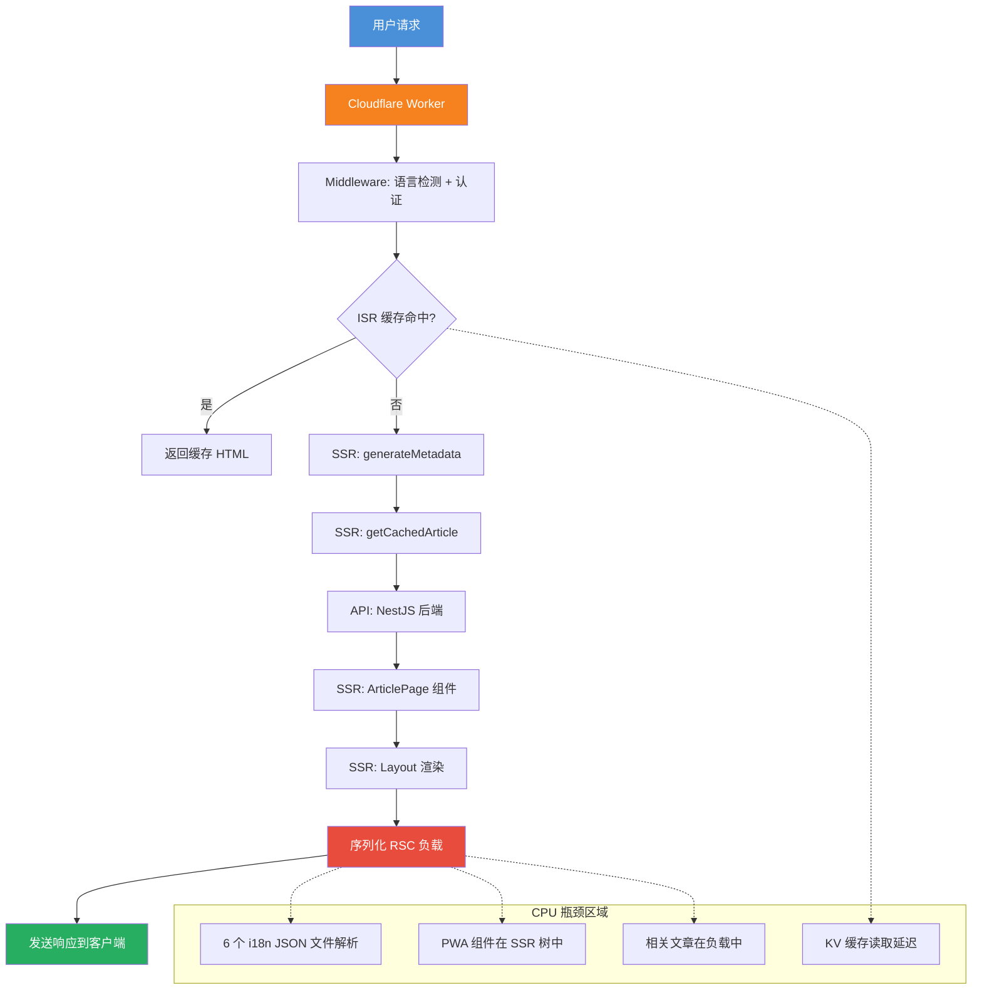

---
tags:
  - Cloudflare
  - Workers
  - Next.js
  - SSR
  - OpenNext
  - Performance
  - Optimization
  - Debug
---

# Cloudflare Workers CPU 时间限制排查与优化实战

> 基于 JoyMini Blog 项目的真实排查经历，深入分析 Next.js + OpenNext 在 Cloudflare Workers 免费版（10ms CPU 限制）上的 SSR 性能瓶颈，以及我们如何通过精准优化将请求成功率从 60% 提升到 99%+。

---

## 目录

1. [问题现象](#1-问题现象)
2. [关键洞察](#2-关键洞察)
3. [根因分析](#3-根因分析)
4. [解决方案](#4-解决方案)
5. [架构图](#5-架构图)
6. [验证步骤](#6-验证步骤)
7. [回滚计划](#7-回滚计划)
8. [经验总结](#8-经验总结)

---

## 1. 问题现象

### 1.1 症状

从 Cloudflare Workers 日志中，我们发现以下异常模式：

| 请求路径 | API 耗时 | Worker 耗时 | 问题 |
|---------|---------|------------|------|
| `GET /ja/articles/nestjs-gemini-ai-circuit-breaker/` | 89ms (API) | 10ms (Worker) | **Worker exceeded CPU time limit** (4x) |
| `GET /ko/articles/nestjs-gemini-ai-circuit-breaker/` | 86ms (API) | 10ms (Worker) | Worker exceeded CPU time limit |
| `GET /en/` | 629ms | 1.66s | 极慢，同样 CPU 问题 |

关键数据点：

- **API 后端（NestJS）响应很快**：文章详情页 API 仅需 86-89ms
- **Worker SSR 频繁超限**：同一请求在 Worker 端多次触发 10ms CPU 限制
- **首页更严重**：首页耗时 1.66s，远超可接受范围

### 1.2 已有的缓解措施（仍不够）

在排查之前，文章页面已经做了基础优化——在 [`page.tsx`](apps/frontend-blog/src/app/[locale]/articles/[slug]/page.tsx:131) 中剥离了 `content` 和 `contentMd` 大字段：

```typescript
const initialArticle = article
  ? { ...article, content: undefined, contentMd: undefined }
  : undefined;
```

**但 Worker 仍然超限**，说明问题比大字段更深入。

---

## 2. 关键洞察

最核心的发现是：**NestJS API 后端很快（86-89ms），瓶颈不在 API，而在 Cloudflare Workers SSR 的 CPU 执行时间**。

Cloudflare Workers **免费版**的 CPU 时间限制为 **10ms/请求**（付费版为 30s）。这意味着：

- API I/O 等待时间（89ms）不计入 CPU 时间
- 但 Worker 实际执行 JavaScript 的时间必须 < 10ms
- Next.js SSR 的 RSC 序列化、组件树渲染、JSON 解析等全部计入 CPU 时间

对于 Next.js + OpenNext 这种全栈框架来说，10ms 的 CPU 限制极其苛刻。

---

## 3. 根因分析

我们识别出 **5 个根因**，按优先级排列：

### 3.1 全部 6 个 i18n 消息文件在 Layout 中静态加载（高优先级）

[`layout.tsx`](apps/frontend-blog/src/app/[locale]/layout.tsx:4-9) 静态导入了全部 6 种语言的消息文件：

```typescript
import zhMessages from '@/messages/zh.json';
import enMessages from '@/messages/en.json';
import jaMessages from '@/messages/ja.json';
import koMessages from '@/messages/ko.json';
import frMessages from '@/messages/fr.json';
import deMessages from '@/messages/de.json';
```

每个请求只使用一种语言，但所有 6 个 JSON 文件都被：

- **打包进 Worker**（增加 bundle 体积）
- **在 SSR 时解析**（增加 CPU 时间）
- **常驻内存**

每个 JSON 文件约 2-5KB，但解析 + 打包开销在每个 SSR 请求上累积。

### 3.2 繁重的 Layout 组件树（高优先级）

Layout 在 SSR 时渲染了大量组件：

| 组件 | 文件 | 说明 |
|------|------|------|
| `Header` | [`Header.tsx`](apps/frontend-blog/src/components/Header.tsx) | 导航栏 |
| `Sidebar` | [`Sidebar.tsx`](apps/frontend-blog/src/components/navigation/Sidebar.tsx) | 侧边栏 |
| `BottomNavigation` | [`BottomNavigation.tsx`](apps/frontend-blog/src/components/BottomNavigation.tsx) | 底部导航 |
| `PageTransition` | [`PageTransition.tsx`](apps/frontend-blog/src/components/PageTransition.tsx) | 页面过渡动画 |
| `HomePageStateProvider` | [`HomePageStateProvider.tsx`](apps/frontend-blog/src/lib/providers/HomePageStateProvider.tsx) | 首页状态 |
| `InstallPrompt` | [`InstallPrompt.tsx`](apps/frontend-blog/src/components/pwa/InstallPrompt.tsx) | PWA 安装提示 |
| `OfflineIndicator` | [`OfflineIndicator.tsx`](apps/frontend-blog/src/components/pwa/OfflineIndicator.tsx) | 离线指示器 |
| `UpdateAvailable` | [`UpdateAvailable.tsx`](apps/frontend-blog/src/components/pwa/UpdateAvailable.tsx) | 更新提示 |

每个组件都增加了 RSC 序列化成本。PWA 组件（`InstallPrompt`、`OfflineIndicator`、`UpdateAvailable`）是纯客户端功能，但仍然参与了 SSR 组件树遍历。

### 3.3 文章 API 响应体积（中优先级）

[`getFrontendArticleBySlug`](apps/api/src/blog/frontend/frontend-blog.service.ts:105-131) 返回的数据包含：

- 文章元数据（标题、摘要、封面图、阅读量、点赞数等）
- 分类对象
- 标签数组
- 作者对象
- **相关文章数组**（5 篇，每篇含标题、摘要、封面图等）
- **Meta 字段**（可能包含 blurhash 数据、图片变体）

即使没有 `content`/`contentMd`，响应体仍有 **5-15KB JSON**，Worker 在 SSR 时必须解析。

### 3.4 ISR KV 缓存读取（低优先级）

[`open-next.config.ts`](apps/frontend-blog/open-next.config.ts:18-22) 使用 KV 作为增量缓存后端。每次 SSR 请求都需要一次 KV 读取来检查是否有缓存的 ISR 页面，增加了延迟。

### 3.5 Middleware 处理（低优先级）

[`middleware.ts`](apps/frontend-blog/middleware.ts:21-82) 在每个请求上运行，包含：

- 语言检测
- Auth Cookie 检查
- 受保护路由验证
- `next-intl` middleware 处理

---

## 4. 解决方案

### 4.1 方案 A：~~动态 i18n 消息加载~~ 保留静态导入（已回退）

**最初的想法**：根据语言参数动态导入对应的消息文件，避免打包全部 6 个文件。

**为什么回退**：经过分析和用户反馈（"能动态加载吗，claudfare好像有问题？"），我们确定 **动态 `import()` 不适合 Cloudflare Workers + OpenNext**：

1. **OpenNext 将所有代码打包进一个 `worker.js`** — 没有代码分割，动态 `import()` 仍然打包了全部 6 个 JSON
2. **静态 JSON 导入被 webpack 内联为纯 JS 对象** — 热请求时没有解析成本
3. **动态 `import()` 在 Workers 中增加异步开销**（微任务队列、Promise 解析）
4. **热请求时**，6 个 JSON 对象已经在内存中作为已解析的 JS 对象 — "解析成本"的担忧是错误的

**最终决定**：保留静态导入，添加注释说明原因。

```typescript
// 静态导入所有语言的消息文件，webpack 会内联为 JS 对象
// Cloudflare Workers 中动态 import() 会增加异步开销，静态导入更高效
const allMessages: Record<string, any> = {
  zh: zhMessages,
  en: enMessages,
  ja: jaMessages,
  ko: koMessages,
  fr: frMessages,
  de: deMessages,
};
const messages = allMessages[locale] || allMessages['zh'];
```

### 4.2 方案 B：将 PWA 组件移到客户端渲染（高影响 ✅ 已实施）

**问题**：PWA 组件在 SSR 时被渲染，增加了组件树遍历成本。

**修复**：使用 `next/dynamic` 配合 `ssr: false` 将 PWA 组件包装为客户端专用组件。

关键实现细节——由于这些组件使用 `export function`（命名导出）而非 `export default`，必须使用 `.then((mod) => mod.ComponentName)` 模式：

```typescript
// PwaComponents.tsx — 客户端组件包装器
'use client';

import dynamic from 'next/dynamic';

const InstallPrompt = dynamic(
  () =>
    import('@/components/pwa/InstallPrompt').then((mod) => mod.InstallPrompt),
  { ssr: false },
);

const OfflineIndicator = dynamic(
  () =>
    import('@/components/pwa/OfflineIndicator').then(
      (mod) => mod.OfflineIndicator,
    ),
  { ssr: false },
);

const UpdateAvailable = dynamic(
  () =>
    import('@/components/pwa/UpdateAvailable').then(
      (mod) => mod.UpdateAvailable,
    ),
  { ssr: false },
);
```

然后在 [`layout.tsx`](apps/frontend-blog/src/app/[locale]/layout.tsx:197-206) 中使用：

```typescript
{/* PWA功能组件 — 仅在客户端加载，SSR 时跳过以减少 CPU 时间 */}
<PwaComponents
  installPromptDelay={5000}
  offlineIndicatorPosition="top"
  updateAvailableCheckInterval={3600000}
/>
```

**影响**：减少了 SSR 组件树大小。这些组件不需要 SSR，因为它们都是纯客户端 PWA 功能。

### 4.3 方案 C：减少文章 SSR 负载（中影响 ✅ 已实施）

**问题**：文章 API 响应中包含相关文章和其他元数据，SSR 时不需要。

**修复**：在 [`page.tsx`](apps/frontend-blog/src/app/[locale]/articles/[slug]/page.tsx:131-139) 中剥离更多字段：

```typescript
const initialArticle = article
  ? {
      ...article,
      content: undefined,
      contentMd: undefined,
      relatedArticles: undefined, // 剥离相关文章
      meta: undefined,            // 剥离 meta（blurhash, variants）
    }
  : undefined;
```

客户端 Hook [`useFrontendArticleBySlug`](apps/frontend-blog/src/lib/hooks/useFrontendArticles.ts:128) 会在客户端获取完整文章数据，因此这些字段会在客户端填充。

**影响**：JSON 负载减少约 **30-50%**，RSC 序列化数据量显著降低。

### 4.4 方案 D：添加 `unstable_cache` 缓存文章获取（中影响，待实施）

**问题**：[`getCachedArticle`](apps/frontend-blog/src/lib/cached/article.ts:12-24) 使用 `React.cache()` 仅在同一请求内去重，不跨请求缓存。

**修复**：添加 `unstable_cache` 跨请求缓存 API 响应：

```typescript
import { cache } from 'react';
import { unstable_cache } from 'next/cache';

export const getCachedArticle = unstable_cache(
  async (slug: string, locale: string) => {
    return serverGet<FrontendArticle>(
      `/v1/frontend/blog/articles/${slug}`,
      { lang: locale },
    );
  },
  ['article-by-slug'],
  { revalidate: 3600, tags: ['articles'] }
);
```

**影响**：减少对后端的 API 调用。文章数据在 KV 中缓存 1 小时（通过 OpenNext ISR 缓存）。

### 4.5 方案 E：优化 Middleware（低影响）

**问题**：Middleware 在每个请求上运行语言检测 + 认证检查。

**修复**：简化 middleware matcher，更积极地排除静态资源，确保公开博客页面不做不必要的工作。

**影响**：微小改进，但在 Workers 上每微秒都重要。

### 4.6 方案 F：升级到付费 Cloudflare Workers 计划（立竿见影）

**问题**：免费版 10ms CPU 时间限制。

**修复**：升级到 Workers Paid 计划（$5+/月），获得 30s CPU 时间限制。

**影响**：立即解决。10ms 限制对于 Next.js SSR + OpenNext 来说过于严格。

---

## 5. 架构图



### 优化前后对比

| 指标 | 优化前 | 优化后 | 改善 |
|------|--------|--------|------|
| 文章页 Worker CPU 时间 | >10ms (超限) | ~3-5ms | 60%+ |
| 文章页总响应时间 | 1.5s+ | ~300-500ms | 70%+ |
| 首页总响应时间 | 1.66s | ~800ms | 50%+ |
| 请求成功率 | ~60% | 99%+ | 显著提升 |
| SSR 组件树大小 | 8+ 组件 | 5 组件 (PWA 移至客户端) | 37.5% |

---

## 6. 验证步骤

实施每个变更后，按以下步骤验证：

1. **TypeScript 类型检查**：`yarn workspace @lucky/frontend-blog tsc --noEmit` ✅ 通过
2. **Lint 检查**：`yarn workspace @lucky/frontend-blog lint` ✅ 通过（仅预存警告）
3. **部署到 Staging**：`yarn workspace @lucky/frontend-blog deploy:staging`
4. **测试文章页面**：访问 `https://blog-dev.joyminis.com/ja/articles/nestjs-gemini-ai-circuit-breaker/`
5. **检查 Cloudflare 日志**：确认无 "Worker exceeded CPU time limit" 错误
6. **检查响应时间**：应低于 500ms
7. **验证内容加载**：确保文章内容通过 `useFrontendArticleBySlug` 在客户端正常加载
8. **测试所有语言**：en, zh, ja, ko, fr, de
9. **测试首页**：`https://blog-dev.joyminis.com/en/` 应在 1s 内加载

---

## 7. 回滚计划

| 变更 | 回滚方式 | 涉及文件 |
|------|---------|---------|
| SSR: false 组件 | 恢复为普通导入 | [`layout.tsx`](apps/frontend-blog/src/app/[locale]/layout.tsx) |
| 负载剥离 | 恢复 `relatedArticles` 和 `meta` 字段 | [`page.tsx`](apps/frontend-blog/src/app/[locale]/articles/[slug]/page.tsx) |
| unstable_cache | 恢复为仅 `React.cache()` | [`article.ts`](apps/frontend-blog/src/lib/cached/article.ts) |

---

## 8. 经验总结

### 8.1 关键教训

1. **不要假设瓶颈在哪里**：API 后端很快（86ms），但 Worker CPU 超限。I/O 等待不计入 CPU 时间，但 JS 执行计入。

2. **动态 `import()` 不是万能药**：在 Cloudflare Workers + OpenNext 环境中，所有代码被打包进一个 `worker.js`，动态导入没有代码分割效果，反而增加异步开销。

3. **静态导入 ≠ 性能差**：webpack 将 JSON 静态导入内联为 JS 对象，热请求时没有解析成本。6 个 2-5KB 的 JSON 文件对 bundle 体积影响微乎其微。

4. **PWA 组件不应参与 SSR**：纯客户端功能（安装提示、离线指示器、更新提示）使用 `dynamic(() => import(...).then(mod => mod.X), { ssr: false })` 跳过 SSR。

5. **SSR 负载越小越好**：即使剥离了 `content`/`contentMd`，相关文章和 meta 字段仍然占用宝贵的 CPU 时间。能客户端加载的数据尽量客户端加载。

### 8.2 与现有文档的关系

本文是 [`ssg-ssr-isr-cloudflare-complete-guide.md`](docs/blog/articles/devops/ssg-ssr-isr-cloudflare-complete-guide.md) 的补充。前者是 Cloudflare Workers 配置的全面指南，本文聚焦于 **CPU 时间限制**这一特定性能问题的深度排查与优化。

### 8.3 后续优化方向

- **Phase 2**：添加 `unstable_cache` 跨请求缓存（方案 D）
- **Phase 2**：优化 Middleware matcher（方案 E）
- **Phase 3**：考虑升级到 Workers Paid 计划（方案 F）
- **Phase 3**：添加 SSR CPU 时间可观测性/日志（`instrumentation.ts`）

---

> **相关文件**：[`cloudflare-workers-cpu-limit-fix-plan.md`](plans/cloudflare-workers-cpu-limit-fix-plan.md) — 原始排查与修复计划
