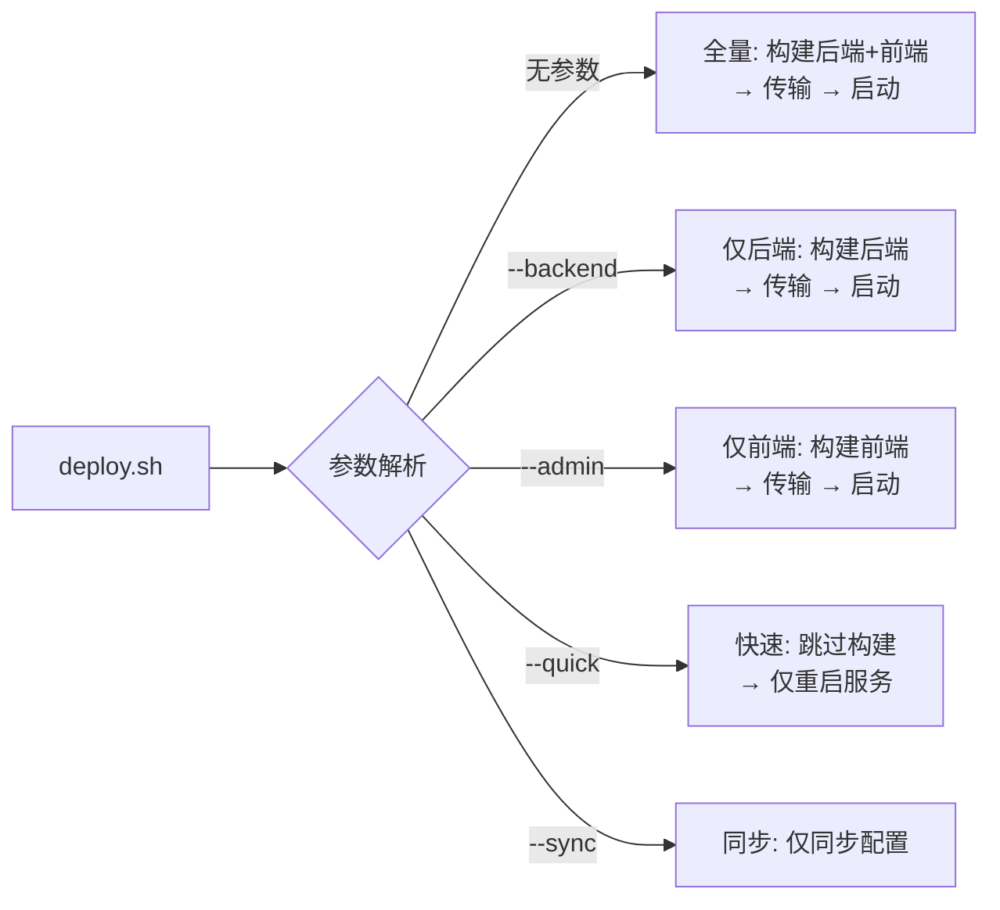
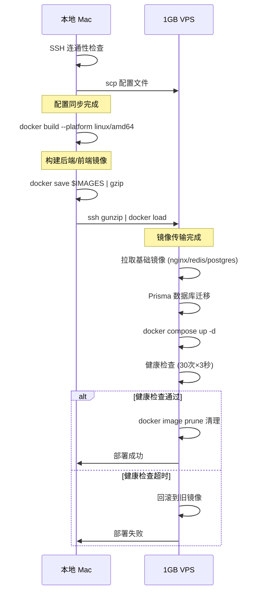
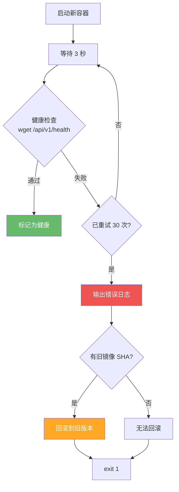

# 部署管道全流程——本地构建 + VPS 传输 + 自动回滚的 Shell 脚本实践

## 1. 背景

容器的构建和部署方式直接影响发布效率和系统稳定性。对于只有 **1GB 内存的 VPS** 来说，直接在服务器上构建 Docker 镜像会触发 OOM（内存不足），因此必须采用 **本地构建 + 远程传输** 的策略。

本文分析的 [`deploy/deploy.sh`](deploy/deploy.sh)（276 行）是一个生产级 Shell 部署脚本，包含五个模式、四个阶段，以及完整的**自动回滚**机制。它与 [GitHub Actions CI/CD](github-actions-ci-cd.md) 形成互补——CI 使用 GHCR 推送/拉取，而本地脚本使用 `docker save | ssh | docker load` 管道传输。

> 前置阅读：[Docker Compose 容器化实践](docker-compose-containerization.md) ——了解本脚本部署的 compose 文件结构。

---

## 2. 部署脚本架构

### 2.1 设计原则

脚本的核心设计哲学可以用一句话概括：**不在 VPS 上构建任何镜像**。

```bash
# deploy.sh — 文件头注释
# 策略: 在本地 Mac 构建 Docker 镜像 (内存充足)
#        → 传输到 1GB VPS (避免服务器 OOM)
```

这个决策基于以下现实约束：

- **1GB VPS 构建 Node.js 应用**：`yarn install` 和 `turbo build` 可能消耗 2GB+ 内存
- **本地 Mac 内存充足**：本地开发机通常有 16GB+ 内存，构建更快
- **网络带宽够用**：压缩后的镜像约 300MB，通过 SSH 管道传输约 30-60 秒

### 2.2 五种部署模式

脚本支持五种模式，通过参数控制：

```bash
# deploy.sh — 使用方式
./deploy/deploy.sh              # 全量部署
./deploy/deploy.sh --backend    # 仅后端
./deploy/deploy.sh --admin      # 仅前端
./deploy/deploy.sh --quick      # 跳过构建, 仅重启服务
./deploy/deploy.sh --sync       # 仅同步配置文件
```



### 2.3 四个阶段总览

每个部署（全量模式）都包含四个阶段：

| 阶段 | 描述 | 关键操作 |
|------|------|----------|
| 一：配置同步 | 将配置文件 scp 到 VPS | compose.yml, nginx 配置, redis 配置, deploy 脚本 |
| 二：本地构建 | 在本地 Mac 构建 amd64 镜像 | docker build --platform linux/amd64 |
| 三：镜像传输 | 通过 SSH 管道传输镜像 | docker save \| gzip \| ssh \| docker load |
| 四：远程部署 | 在 VPS 上启动/更新服务 | DB 迁移 → 启动 → 健康检查 → 回滚决策 |



---

## 3. 阶段一：配置同步

### 3.1 SSH 预检

```bash
# deploy.sh — SSH 连通性检查
log "检查 SSH 连接 → $SSH_TARGET..."
ssh -o ConnectTimeout=5 "$SSH_TARGET" "echo 'SSH OK'" || err "无法连接到 $SSH_TARGET"
```

使用 `ConnectTimeout=5` 快速检测 SSH 可达性，避免长时间等待。

### 3.2 同步文件清单

```bash
# deploy.sh — sync_configs 函数
sync_configs() {
    log "同步配置文件..."

    # 确保目录存在
    ssh "$SSH_TARGET" "mkdir -p $VPS_DIR/{certs,nginx/html,redis,deploy}"

    # 核心配置
    scp compose.prod.yml                    "$SSH_TARGET:$VPS_DIR/"
    scp Makefile                            "$SSH_TARGET:$VPS_DIR/"
    scp deploy/.env.prod                    "$SSH_TARGET:$VPS_DIR/deploy/"
    scp deploy/init-db.sh                   "$SSH_TARGET:$VPS_DIR/deploy/"
    scp deploy/baseline-db.sh              "$SSH_TARGET:$VPS_DIR/deploy/"
    scp deploy/install-turn.sh              "$SSH_TARGET:$VPS_DIR/deploy/"
    scp nginx/nginx.prod.conf               "$SSH_TARGET:$VPS_DIR/nginx/"
    scp nginx/whitelist.conf                "$SSH_TARGET:$VPS_DIR/nginx/"
    scp redis/redis.conf                    "$SSH_TARGET:$VPS_DIR/redis/"
}
```

同步内容包括：

- **编排文件**：`compose.prod.yml`、`Makefile`
- **环境变量**：`deploy/.env.prod`（包含数据库密码、Redis 密码等敏感信息）
- **部署脚本**：`init-db.sh`、`baseline-db.sh`、`install-turn.sh`
- **Nginx 配置**：`nginx.prod.conf`、`whitelist.conf`
- **Redis 配置**：`redis.conf`

**重要**：如果仅同步配置（`--sync` 模式），脚本在此阶段后直接退出。

---

## 4. 阶段二：本地 Docker 构建

### 4.1 跨平台构建

```bash
# deploy.sh — 本地构建
docker build \
    --platform linux/amd64 \    # 目标架构（VPS 是 amd64）
    -f Dockerfile.prod \
    -t "$BACKEND_IMAGE" \
    .
```

`--platform linux/amd64` 是关键参数——如果本地 Mac 是 Apple Silicon（ARM64），Docker 会使用 QEMU 模拟进行跨平台构建。

### 4.2 前端构建元数据注入

```bash
# deploy.sh — admin-next 构建
ADMIN_BUILD_DEPLOYED_AT="$(date -u +%Y-%m-%dT%H:%M:%SZ)"
ADMIN_BUILD_GIT_SHA="$(git rev-parse HEAD 2>/dev/null || echo local-dev)"

docker build \
    --build-arg NEXT_PUBLIC_API_BASE_URL=https://api.joyminis.com/api \
    --build-arg NEXT_PUBLIC_APP_ENV=production \
    --build-arg NEXT_PUBLIC_DEPLOYED_AT="$ADMIN_BUILD_DEPLOYED_AT" \
    --build-arg NEXT_PUBLIC_GIT_SHA="$ADMIN_BUILD_GIT_SHA" \
    -t "$ADMIN_IMAGE" \
    -f apps/admin-next/Dockerfile.prod \
    .
```

两个构建时数据注入到前端：

- **`DEPLOYED_AT`**：部署时间戳，用于 Build Info 页面展示
- **`GIT_SHA`**：当前 Git commit SHA，方便运维人员快速定位代码版本

---

## 5. 阶段三：镜像传输

### 5.1 管道传输

```bash
# deploy.sh — 镜像传输
docker save $IMAGES_TO_SEND | gzip | \
    ssh "$SSH_TARGET" "gunzip | docker load"
```

这条管道命令是脚本的精髓，它通过四个步骤完成镜像传输：

| 步骤 | 命令 | 作用 |
|------|------|------|
| 1 | `docker save` | 将 Docker 镜像导出为 tar 流 |
| 2 | `gzip` | 实时压缩（通常可压缩 50-70%） |
| 3 | `ssh` | 通过 SSH 传输到远程服务器 |
| 4 | `gunzip \| docker load` | 解压并导入到远程 Docker |

**优势**：

- **无需中间文件**：全部在管道中完成，不占磁盘空间
- **实时压缩**：300MB 镜像压缩后约 100MB，传输更快
- **一条命令**：无状态管理，简单可靠

### 5.2 选择性传输

```bash
# deploy.sh — 只传输刚构建的镜像
IMAGES_TO_SEND=""
[ "$BUILD_BACKEND" = true ] && IMAGES_TO_SEND="$BACKEND_IMAGE"
[ "$BUILD_ADMIN" = true ]   && IMAGES_TO_SEND="$IMAGES_TO_SEND $ADMIN_IMAGE"
```

`--backend` 模式下只传输后端镜像，`--admin` 模式下只传输前端镜像，避免不必要的传输。

---

## 6. 阶段四：远程部署

远程部署是一个包含 6 个子步骤的 SSH 远程脚本，是整条管道最核心的部分。

### 6.1 基础镜像预拉取

```bash
# deploy.sh — 远程 SSH 脚本片段
echo "→ 拉取基础镜像 (nginx, redis, postgres)..."
docker compose -f compose.prod.yml --env-file deploy/.env.prod pull nginx redis db 2>/dev/null || true
```

提前拉取 nginx/redis/postgres 基础镜像，利用 compose 的 pull 功能确保基础镜像是最新版本。`2>/dev/null || true` 防止拉取失败阻断整个部署。

### 6.2 数据库迁移

```bash
# deploy.sh — 远程 SSH 脚本片段
if [ "$_DEPLOY_BACKEND" = "true" ]; then
    echo "→ 运行数据库迁移..."
    NETWORK=$(docker inspect lucky-db-prod \
        --format '{{range $k,$v := .NetworkSettings.Networks}}{{$k}}{{end}}' \
        | awk '{print $1}')

    if [ -n "$NETWORK" ]; then
        MIGRATE_OUT=$(docker run --rm \
          --network "$NETWORK" \
          --env-file deploy/.env.prod \
          --entrypoint "" \
          lucky-backend-prod:latest \
          ./node_modules/.bin/prisma migrate deploy \
            --schema=apps/api/prisma/schema.prisma 2>&1) && MIGRATE_OK=true || MIGRATE_OK=false
    fi
fi
```

关键设计：

- **临时容器执行迁移**：使用 `docker run --rm` 创建一个临时容器执行 Prisma 迁移，不影响正在运行的后端服务
- **网络共享**：通过 `--network "$NETWORK"` 让临时容器连接到 DB 容器所在网络
- **`--entrypoint ""`**：覆盖镜像默认的 entrypoint，只执行迁移命令
- **P3005 错误处理**：如果迁移失败且错误包含 P3005（数据库已有表但无迁移历史），提示运行 `baseline-db.sh`

### 6.3 镜像备份与回滚准备

```bash
# deploy.sh — 保存当前镜像 SHA 用于回滚
PREV_IMAGE=$(docker inspect lucky-backend-prod \
    --format '{{.Config.Image}}' 2>/dev/null || echo "")
```

在启动新容器之前，保存当前运行容器的镜像 SHA。如果新版本健康检查失败，可以用这个 SHA 回滚。

### 6.4 服务启动

```bash
# deploy.sh — 启动服务
BACKEND_IMAGE="lucky-backend-prod:latest" \
ADMIN_IMAGE="lucky-admin-next-prod:latest" \
docker compose -f compose.prod.yml --env-file deploy/.env.prod \
    up -d --no-build --force-recreate
```

参数说明：

- **`--no-build`**：防止 compose 在服务器上重新构建镜像（我们通过管道传输了镜像）
- **`--force-recreate`**：强制重新创建容器，即使配置没有变化（确保使用新镜像）
- **环境变量传递镜像 Tag**：将镜像名通过环境变量传入 compose

### 6.5 健康检查与自动回滚

```bash
# deploy.sh — 健康检查 + 自动回滚
if [ "$_DEPLOY_BACKEND" = "true" ]; then
    echo "→ 等待后端健康检查 (最多 90s)..."
    HEALTHY=false
    for i in $(seq 1 30); do
        if docker exec lucky-backend-prod wget -qO- http://localhost:3000/api/v1/health >/dev/null 2>&1; then
            echo " 健康检查通过 (第 ${i} 次, 约 $((i*3))s)"
            HEALTHY=true
            break
        fi
        sleep 3
    done

    if [ "$HEALTHY" = false ]; then
        echo "❌ 健康检查超时! 正在回滚..."
        docker logs --tail=50 lucky-backend-prod
        if [ -n "$PREV_IMAGE" ]; then
            echo "→ 回滚到旧镜像: $PREV_IMAGE"
            BACKEND_IMAGE="$PREV_IMAGE" docker compose -f compose.prod.yml \
                --env-file deploy/.env.prod \
                up -d --no-build --force-recreate backend
            echo "⚠️  已回滚到旧版本！请检查新镜像日志排查原因。"
        fi
        exit 1
    fi
fi
```



回滚逻辑的关键点：

- **30 次重试，每次间隔 3 秒**：总共 90 秒超时
- **回滚使用旧镜像 SHA**：不是 Tag，因为 Tag `latest` 已经被新镜像覆盖
- **回滚后仍然 `exit 1`**：让调用方知道部署失败
- **输出错误日志**：`docker logs --tail=50` 帮助排查失败原因

### 6.6 清理与报告

```bash
# deploy.sh — 清理旧镜像 & 系统资源报告
echo "→ 清理旧镜像..."
docker image prune -f

echo "→ 系统资源:"
free -h
df -h /
```

`docker image prune -f` 删除所有未被任何容器引用的旧镜像，防止 `/opt/lucky` 目录因历史镜像堆积而磁盘满。

---

## 7. 错误处理矩阵

脚本通过 `set -euo pipefail` 确保任何步骤失败都立即中断。以下是各种错误场景的处理策略：

| 错误场景 | 检测方式 | 处理策略 |
|----------|----------|----------|
| SSH 连接失败 | `ssh -o ConnectTimeout=5` 超时 | 脚本立即 `exit 1` |
| 构建失败 | `set -e` 捕获 docker build 退出码 | 自动中断，输出错误 |
| 传输中断 | `set -o pipefail` 捕获管道错误 | 自动中断，可重新执行 |
| 迁移失败 (P3005) | `grep -q "P3005"` | 提示运行 `baseline-db.sh` |
| 迁移其他失败 | `set -e` 捕获退出码 | 自动中断 |
| 健康检查超时 | 30 次循环后 | 自动回滚到旧镜像 |
| Nginx 配置错误 | `nginx -t` 语法校验 | 保留旧配置，不重启 |

---

## 8. 与 CI/CD 管道的对比

本地部署脚本和 CI/CD 管道（GitHub Actions）是互补关系，而非替代关系：

| 维度 | 本地脚本 (deploy.sh) | CI/CD (GitHub Actions) |
|------|----------------------|------------------------|
| **触发方式** | 手动执行 | push/PR 自动触发 |
| **构建环境** | 本地 Mac | GitHub Runner |
| **镜像存储** | 本地 Docker | GHCR (ghcr.io) |
| **传输方式** | `docker save \| gzip \| ssh \| docker load` | `docker pull` |
| **回滚机制** | 健康检查 + 自动回滚 | 健康检查 + 自动回滚 |
| **通知** | 终端输出 | Telegram |
| **适用场景** | 开发测试、紧急修复 | 正式发布、CI 门禁 |

两者共享相同的**健康检查 + 自动回滚**逻辑，确保行为一致。具体可参考 [GitHub Actions CI/CD](github-actions-ci-cd.md) 中的 SSH 部署实现。

---

## 9. 总结

本文深入分析了 [`deploy/deploy.sh`](deploy/deploy.sh) 这个 276 行的生产级部署脚本，核心收获：

1. **不在服务器上构建**：通过本地构建 + 管道传输，避免了 1GB VPS 的 OOM 问题
2. **`docker save | gzip | ssh | docker load` 管道**：一条命令完成镜像传输，无状态、高效
3. **临时容器迁移**：不中断正在运行的服务，安全执行数据库迁移
4. **健康检查 + 自动回滚**：90 秒超时 + 旧镜像 SHA 恢复，最大程度降低故障影响
5. **Nginx 热重载**：更新配置后无需重启容器，零停机

从 nginx 配置到 Docker Compose 编排，再到部署脚本和 CI/CD 管道，整个 DevOps 体系形成了完整的闭环。

### 相关文章

- [Docker Compose 容器化实践](docker-compose-containerization.md)
- [Nginx API 网关——生产与环境配置深度解析](nginx-api-gateway-dev-prod.md)
- [GitHub Actions CI/CD——Monorepo 双管道自动化部署](github-actions-ci-cd.md)
