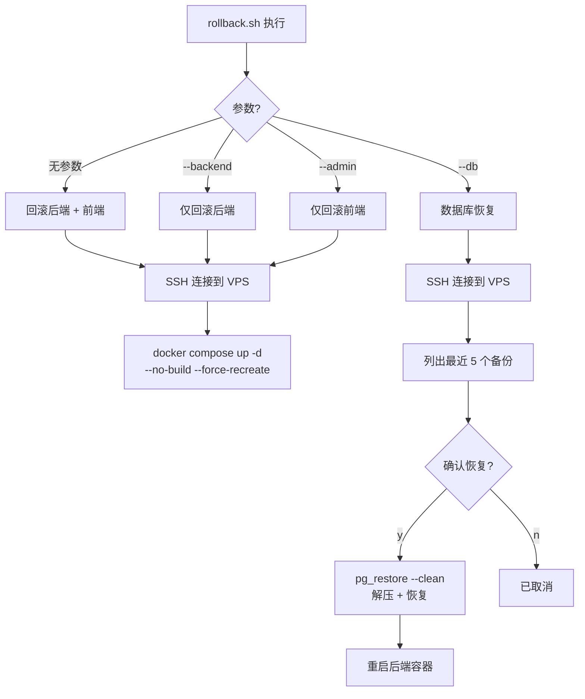

# 部署回滚机制详解——容器回滚与数据库恢复的 Shell 脚本实践

## 1. 背景

在[部署管道全流程](deployment-pipeline-full-process.md)中，自动回滚是健康检查失败后的兜底机制。但自动回滚只解决了**部署过程中**的问题，对于以下场景，需要一个独立的、手动的回滚脚本：

- **部署完成数小时后才发现 Bug**：自动回滚的超时窗口（90 秒）已过
- **数据库迁移出错**：需要从备份恢复数据
- **配置变更导致服务异常**：`docker restart` 不会重新读取 `.env`，需要强制重建

本文分析的 [`deploy/rollback.sh`](deploy/rollback.sh)（151 行）正是为这些场景设计的——它通过 SSH 远程执行回滚操作，支持容器回滚和数据库恢复两种模式。

> 前置阅读：[部署管道全流程](deployment-pipeline-full-process.md)——了解自动回滚机制。

## 2. 脚本架构

### 2.1 三种回滚模式

```bash
./deploy/rollback.sh              # 回滚后端 + 前端
./deploy/rollback.sh --backend    # 仅回滚后端
./deploy/rollback.sh --admin      # 仅回滚前端
./deploy/rollback.sh --db         # 恢复数据库备份
```



### 2.2 SSH 连接管理

脚本通过 SSH 在本地执行远程命令，与 VPS 交互：

```bash
VPS_IP="${VPS_IP:-}"
if [ -z "$VPS_IP" ]; then
    read -rp "请输入 VPS IP 地址: " VPS_IP
fi
VPS_USER="root"
VPS_DIR="/opt/lucky"
SSH_TARGET="${VPS_USER}@${VPS_IP}"
```

**设计思路**：
- 支持交互式输入（`read -rp`）和环境变量预设（`VPS_IP=<IP>`）
- 如果配置了 SSH 别名（如 `ssh lucky`），可以直接修改脚本使用别名
- SSH 连通性检查作为前置条件，避免执行到一半才发现连不上

```bash
ssh -o ConnectTimeout=5 "$SSH_TARGET" "echo 'SSH OK'"
```

## 3. 容器回滚（--backend / --admin）

### 3.1 回滚原理

容器回滚的核心命令只有一行：

```bash
docker compose -f compose.prod.yml --env-file deploy/.env.prod up -d --no-build --force-recreate
```

关键参数：
| 参数 | 作用 |
|------|------|
| `--no-build` | 不重新构建镜像，使用本地已拉取的镜像 |
| `--force-recreate` | 强制重建容器，即使配置没有变化 |

**理解回滚的实质**：这个命令不会改变镜像版本。它只是重启容器，使用**上一次 `docker pull` 拉取的镜像**。如果新部署推送了新镜像到 GHCR 但 VPS 还没来得及拉取，回滚会使用旧镜像。如果新镜像已经被拉取并运行，`--no-build` 依然会使用当前已拉取的镜像。

真正的"回滚到上一个版本"需要：
1. 在部署前记录当前镜像标签
2. 指定旧版本标签拉取
3. 使用指定标签重启

当前脚本采用简化的"重启现有镜像"策略，适用于大多数场景——因为新部署的镜像通常已经是最新的，重启是为了解决运行态的问题（如配置错误、内存泄漏等）。

### 3.2 执行流程

```bash
ssh "$SSH_TARGET" << 'REMOTE_SCRIPT'
    set -e
    cd /opt/lucky

    echo "→ 当前镜像列表:"
    docker images --format "table {{.Repository}}\t{{.Tag}}\t{{.CreatedAt}}\t{{.Size}}" | grep lucky || true

    echo "→ 重启服务..."
    docker compose -f compose.prod.yml --env-file deploy/.env.prod up -d --no-build --force-recreate

    echo "→ 等待服务健康..."
    sleep 8

    echo "→ 服务状态:"
    docker compose -f compose.prod.yml ps

    echo "→ 最近日志 (backend):"
    docker logs --tail=20 lucky-backend-prod 2>&1 || true
REMOTE_SCRIPT
```

**8 秒等待**后的状态检查和日志输出，让运维人员可以快速判断回滚是否成功。

## 4. 数据库回滚（--db）

### 4.1 安全确认机制

数据库回滚是最危险的操作，它涉及**覆盖生产数据**。脚本设计了多层安全确认：

```bash
# 第一层：参数确认
if [ "$ROLLBACK_DB" = true ]; then
    log "数据库回滚..."

    # 第二层：列出可用备份
    ssh "$SSH_TARGET" "ls -lht /opt/lucky/backups/backup_*.dump.gz 2>/dev/null | head -5"

    # 第三层：交互确认
    read -p "确认恢复最新备份? (y/N): " confirm
    if [ "$confirm" != "y" ] && [ "$confirm" != "Y" ]; then
        log "已取消"
        exit 0
    fi
```

三层保护：
1. **必须显式传入 `--db` 参数**：普通回滚不会触碰到数据库
2. **列出可用备份**：让操作者确认备份文件确实存在
3. **交互确认**：默认 `N`（首字母大写暗示默认值），必须输入 `y` 或 `Y` 才能继续

### 4.2 恢复流程

```bash
# 找到最新备份
LATEST=$(ls -t /opt/lucky/backups/backup_*.dump.gz 2>/dev/null | head -1)

# 从 .env.prod 读取数据库凭据
POSTGRES_USER=$(grep POSTGRES_USER deploy/.env.prod | cut -d'=' -f2)
POSTGRES_DB=$(grep POSTGRES_DB deploy/.env.prod | cut -d'=' -f2)

# 解压 + 恢复
gunzip -c "$LATEST" | docker exec -i lucky-db-prod pg_restore \
    -U "$POSTGRES_USER" \
    -d "$POSTGRES_DB" \
    --clean \
    --if-exists \
    --no-owner \
    --no-privileges
```

**`pg_restore` 关键参数**：
| 参数 | 作用 |
|------|------|
| `--clean` | 恢复前清理（DROP）现有对象 |
| `--if-exists` | 如果对象不存在，不报错（配合 `--clean` 使用） |
| `--no-owner` | 不恢复对象所有权（使用当前用户） |
| `--no-privileges` | 不恢复权限设置 |

**为什么用 `pg_dump --format=custom` 备份？**

备份脚本 [`deploy/backup.sh`](deploy/backup.sh) 使用 `pg_dump --format=custom` 配合 `gzip` 压缩。Custom 格式的优势：
- 压缩率高（自定义格式内置压缩 + gzip 二次压缩）
- 支持 `pg_restore` 并行恢复
- 恢复时可以灵活选择要恢复的对象

### 4.3 恢复后验证

```bash
# 重启后端（重新连接数据库）
docker compose -f compose.prod.yml restart backend
sleep 5

# 查看服务状态
docker compose -f compose.prod.yml ps
```

数据库恢复后自动重启后端，确保应用重新连接到恢复后的数据库。

## 5. 设计决策

### 5.1 为什么不做真正的"镜像版本回滚"？

理想的回滚应该是：记录上一个镜像标签 → `docker pull old-tag` → `docker compose up -d`。当前脚本没有实现这个机制，原因：

1. **部署频率低**：项目通常是 daily 部署，而非 hourly
2. **镜像管理复杂度**：需要维护版本历史、清理旧镜像
3. **大多数问题可以被重启解决**：配置错误、连接泄漏、内存增长等问题，重启即可恢复

如果未来需要版本回滚，可以在 `deploy.sh` 中添加：
```bash
# 部署前保存当前镜像标签
docker inspect lucky-backend-prod --format "{{.Config.Image}}" > /tmp/previous-image.txt
```

然后在 `rollback.sh` 中读取并拉取旧版本。

### 5.2 SSH heredoc vs 独立远程脚本

当前脚本使用 **SSH heredoc**（`ssh ... << 'REMOTE_SCRIPT'`）在远程执行多行命令，而不是：

1. **在 VPS 上放置独立脚本**：需要额外维护同步逻辑
2. **逐条 SSH 命令**：网络延迟高，每条命令都需重新建立 SSH 连接
3. **Ansible/SSH 工具**：太重，回滚脚本要简单可靠

Heredoc 的 `'REMOTE_SCRIPT'`（引号包裹）防止本地 shell 展开变量，确保所有变量在远程端解析。

### 5.3 为什么不在 CI 中自动回滚？

GitHub Actions 的 `appleboy/ssh-action` 存在已知的**状态报告 Bug**——即使远程命令执行失败，CI 也会显示 ✅ 绿色：

```
CI 显示 ✅ → 但线上代码没更新
```

因此手动回滚比 CI 自动回滚更可靠。运维人员可以通过 `make rollback VPS_IP=<IP>` 或直接运行脚本手动触发。

## 6. 使用场景示例

### 场景 1：新部署导致 500 错误

```bash
# 1. 检查日志
ssh lucky 'docker logs --tail=50 lucky-backend-prod'

# 2. 回滚容器
./deploy/rollback.sh

# 3. 验证恢复
curl https://api.joyminis.com/api/v1/health
```

### 场景 2：数据库迁移出错

```bash
# 1. 确认最新备份存在
ssh lucky 'ls -lh /opt/lucky/backups/'

# 2. 回滚数据库
./deploy/rollback.sh --db

# 3. 验证数据完整性
curl https://api.joyminis.com/api/v1/health
```

### 场景 3：配置变更导致服务崩溃

```bash
# 1. 回滚容器（重启使用旧配置的镜像）
./deploy/rollback.sh --backend

# 2. 修复本地 .env.prod
vim deploy/.env.prod

# 3. 同步修复后的配置
scp deploy/.env.prod lucky:/opt/lucky/deploy/
./deploy/deploy.sh --backend
```

## 7. 总结

`rollback.sh` 虽然只有 151 行，但它解决了一个关键问题——**部署出问题后，如何最快恢复服务**。它的设计哲学：

1. **简单就是可靠**：没有依赖复杂工具链，纯 SSH + Docker Compose
2. **安全优先**：数据库回滚的三层确认防止误操作
3. **信息透明**：回滚前后输出镜像状态、服务状态、最近日志
4. **易于集成**：支持交互式和自动化两种调用方式

它与 [`deploy.sh`](deploy/deploy.sh) 的自动回滚形成互补——自动回滚处理部署过程中的问题，`rollback.sh` 处理部署完成后的紧急恢复。
