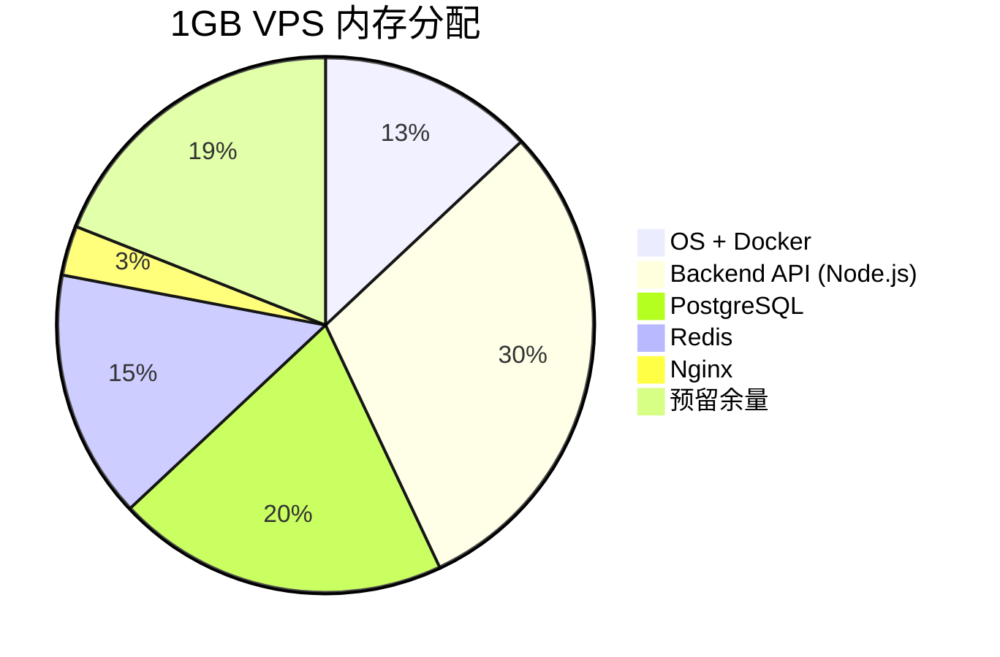
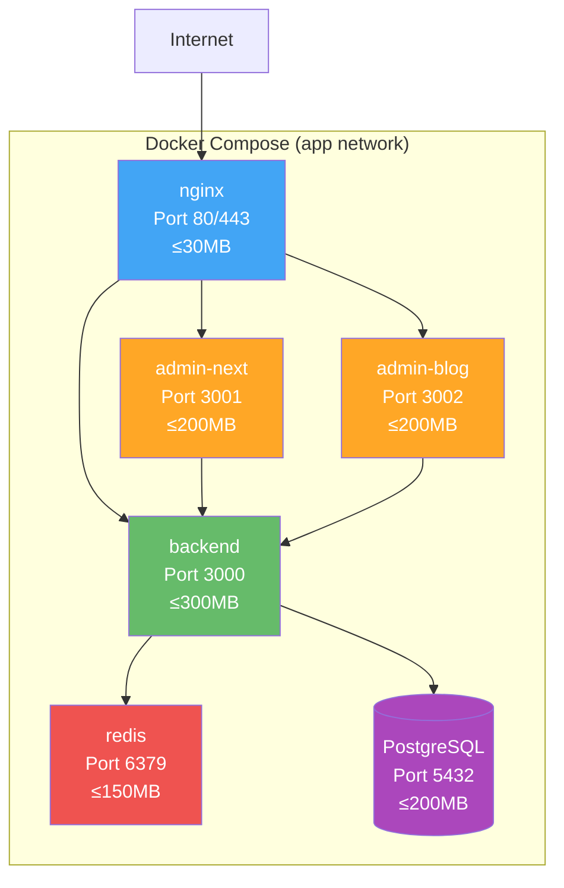
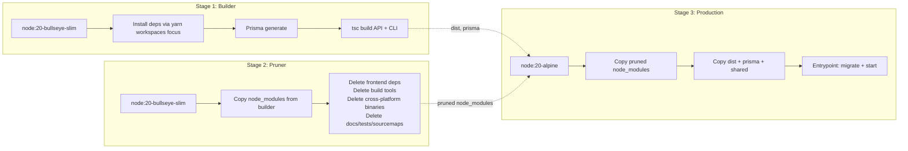

# 1GB VPS 上的 Docker Compose 容器化实践

## 1. 背景

本项目的生产环境部署在一台 **1GB 内存的 VPS** 上，却需要同时运行以下服务：

- **NestJS API 后端**（Node.js）
- **Admin Next.js SSR**（前端后台）
- **Admin Blog SSR**（博客后台）
- **Nginx 反向代理**（API 网关）
- **PostgreSQL 数据库**
- **Redis 缓存**

在如此有限的内存资源下编排这些服务，是一个极具挑战性的容器化课题。直接使用 Kubernetes 显然过于臃肿，因此选择了 **Docker Compose** 作为编排工具。

本文围绕 [`compose.prod.yml`](compose.prod.yml)（271 行）和 [`Dockerfile.prod`](Dockerfile.prod)（210 行）两份核心文件，深入讲解三个关键设计：

1. **内存预算驱动的服务编排**——如何让 6 个服务在 1GB 内和平共处
2. **多阶段构建 + Pruner 裁剪**——如何将 2GB+ 的镜像压缩到 300MB
3. **健康检查与依赖链**——如何保证容器启动顺序和故障自愈

> 前置阅读：[Nginx API 网关——生产与环境配置深度解析](nginx-api-gateway-dev-prod.md) ——本文的 nginx 服务将引用该文章中的配置详情。

---

## 2. 内存预算设计

### 2.1 1GB 的分配哲学

在 compose 文件头部，有一段清晰的注释说明了内存预算：

```yaml
# compose.prod.yml 内存预算:
#   OS + Docker: ~130 MB
#   Backend:     ≤300 MB
#   PostgreSQL:  ≤200 MB
#   Redis:       ≤150 MB (maxmemory 128MB)
#   Nginx:       ≤30 MB
#   Swap 兜底:   1 GB
#   总计:        ~810 MB + 1 GB swap
```

关键设计原则：

- **每个服务都有硬上限**（`limits.memory`）和**软预留**（`reservations.memory`），防止某个服务异常占用过多内存导致 OOM
- **预留 190MB 余量**给 OS 和 Docker 守护进程本身
- **1GB Swap 兜底**——虽然 swap 性能不如物理内存，但在突发内存尖峰时可以防止进程被 OOM Killer 杀死



### 2.2 服务级内存限制

每个服务通过 `deploy.resources` 声明内存限制：

```yaml
# compose.prod.yml — backend 服务的内存限制
backend:
  deploy:
    resources:
      limits:
        memory: 300M    # 硬上限，超过则 OOM Kill
      reservations:
        memory: 150M    # Docker 调度保证至少分配 150M
```

同时在后端镜像的构建参数中设置 Node.js 堆内存限制：

```yaml
environment:
  - NODE_OPTIONS=--max-old-space-size=256  # 限制 V8 堆 ≤ 256MB
```

PostgreSQL 也在 `command` 中进行了低内存调优：

```yaml
db:
  command: >
    postgres
      -c shared_buffers=32MB
      -c work_mem=4MB
      -c maintenance_work_mem=32MB
      -c effective_cache_size=128MB
      -c max_connections=30
```

这些参数确保 PostgreSQL 不会因为默认配置而在 1GB 机器上消耗过多内存。

---

## 3. 服务编排详解

compose 文件定义了 6 个服务，通过内部 `app` 网络互联，仅 nginx 对外暴露端口。



### 3.1 Backend API

```yaml
# compose.prod.yml — backend 服务
backend:
  image: ${BACKEND_IMAGE:-lucky-backend-prod:latest}
  container_name: lucky-backend-prod
  restart: unless-stopped
  logging:
    driver: json-file
    options:
      max-size: "10m"
      max-file: "3"
  env_file:
    - deploy/.env.prod
  healthcheck:
    test: ["CMD-SHELL", "wget -qO- http://localhost:3000/api/v1/health >/dev/null 2>&1 || exit 1"]
    interval: 10s
    timeout: 3s
    retries: 10
  depends_on:
    db:
      condition: service_healthy
    redis:
      condition: service_healthy
  networks: [app]
```

关键设计：

- **镜像来源可切换**：通过 `BACKEND_IMAGE` 环境变量指定，本地部署使用本地构建镜像，CI 部署使用 GHCR 镜像
- **`depends_on` + `condition: service_healthy`**：确保后端只在数据库和 Redis 健康后才启动，而不是简单的依赖启动
- **日志限制**：`max-size: "10m"` 防止容器日志撑满磁盘
- **健康检查**：每 10 秒探测一次 `/api/v1/health`，Docker 会自动重启不健康的容器

### 3.2 Admin Next SSR

```yaml
# compose.prod.yml — admin-next 前端 SSR
admin-next:
  image: ${ADMIN_IMAGE:-lucky-admin-next-prod:latest}
  container_name: lucky-admin-next-prod
  environment:
    - NODE_ENV=production
    - PORT=3001
    - HOSTNAME=0.0.0.0
    - NEXT_PUBLIC_API_BASE_URL=${NEXT_PUBLIC_API_BASE_URL:-https://api.joyminis.com/api}
    # Server Components 直连后端（内网，不走公网）
    - INTERNAL_API_URL=http://lucky-backend-prod:3000/api
```

关键设计：

- **`INTERNAL_API_URL`**：Next.js Server Components 获取数据时，通过容器名 `lucky-backend-prod:3000` 直连后端，不走 nginx 公网，减少延迟和网络开销
- **前端不暴露端口**：不映射 `ports`，只通过 `expose` 对内网暴露；所有外部请求都由 nginx 代理

### 3.3 Nginx API 网关

```yaml
# compose.prod.yml — nginx 服务
nginx:
  image: nginx:latest
  container_name: lucky-nginx-prod
  ports:
    - "80:80"
    - "443:443"
  volumes:
    - ./nginx/nginx.prod.conf:/etc/nginx/conf.d/default.conf
    - ./nginx/whitelist.conf:/etc/nginx/conf.d/whitelist.conf
    - ./certs:/etc/nginx/certs
    - ./nginx/html:/var/www/html
    - nginx_cache:/var/cache/nginx
  depends_on:
    backend:
      condition: service_healthy
    admin-next:
      condition: service_healthy
    admin-blog:
      condition: service_healthy
```

关键设计：

- **唯一对外暴露端口的服务**：只有 nginx 映射了 80/443 端口
- **配置卷挂载**：nginx 配置通过 bind mount 从宿主机注入，方便修改后热重载（`nginx -s reload`）
- **缓存卷**：`nginx_cache` 用于 nginx 的 proxy cache，避免重复从后端拉取资源
- **依赖所有内部服务健康**后才启动

### 3.4 Redis

```yaml
# compose.prod.yml — Redis 缓存
redis:
  image: redis:7-alpine
  container_name: lucky-redis-prod
  command: redis-server /etc/redis/redis.conf --requirepass "${REDIS_PASSWORD:-changeme}"
  volumes:
    - redis_data:/data
    - ./redis/redis.conf:/etc/redis/redis.conf
  healthcheck:
    test: ["CMD-SHELL", "redis-cli -a ${REDIS_PASSWORD:-changeme} ping | grep PONG"]
    interval: 5s
    timeout: 3s
    retries: 10
```

关键设计：

- **Alpine 版本**：`redis:7-alpine` 镜像仅约 12MB，远小于标准镜像
- **密码保护**：通过 `--requirepass` 和 `.env.prod` 中的 `REDIS_PASSWORD` 保护
- **自定义配置**：挂载 `redis/redis.conf`，其中包含 `maxmemory 128mb` 限制内存使用
- **健康检查**：每 5 秒用 `redis-cli ping` 探测

### 3.5 PostgreSQL

```yaml
# compose.prod.yml — PostgreSQL 数据库
db:
  image: postgres:16-alpine
  container_name: lucky-db-prod
  command: >
    postgres
      -c shared_buffers=32MB
      -c work_mem=4MB
      -c maintenance_work_mem=32MB
      -c effective_cache_size=128MB
      -c max_connections=30
  volumes:
    - db_data:/var/lib/postgresql/data
  healthcheck:
    test: ["CMD-SHELL", "pg_isready -h 127.0.0.1 -U $$POSTGRES_USER -d $$POSTGRES_DB"]
```

关键设计：

- **Alpine 版本**：`postgres:16-alpine` 约 50MB
- **低内存参数**：针对 1GB 服务器的 PostgreSQL 调优——`shared_buffers` 从默认的 128MB 降至 32MB
- **named volume 持久化**：`db_data` 保证数据库文件在容器重启后不丢失

### 3.6 网络与卷

```yaml
# compose.prod.yml — 网络与卷定义
networks:
  app:     # 内部网络，所有服务加入

volumes:
  db_data:       # PostgreSQL 数据持久化
  redis_data:    # Redis 数据持久化（AOF/RDB）
  nginx_cache:   # Nginx 代理缓存
```

三个 named volume 各有用途：`db_data` 保存数据库文件，`redis_data` 保存缓存持久化数据，`nginx_cache` 缓存反向代理响应。

---

## 4. 多阶段 Dockerfile 构建

后端镜像使用 [`Dockerfile.prod`](Dockerfile.prod) 进行三阶段构建，这是整个容器化方案中最具技术含量的部分。



### 4.1 Builder 阶段

```dockerfile
# Dockerfile.prod — Stage 1: Builder
FROM node:20-bullseye-slim AS builder
WORKDIR /app

# 原生模块构建工具
RUN apt-get update \
    && apt-get install -y --no-install-recommends python3 make g++ openssl \
    && rm -rf /var/lib/apt/lists/*

RUN corepack enable && corepack prepare yarn@4.9.2 --activate
ENV YARN_ENABLE_GLOBAL_CACHE=0

# 1) 先拷贝依赖声明 → 利用 Docker layer 缓存
COPY package.json yarn.lock .yarnrc.yml ./
COPY .yarn ./.yarn
COPY apps/api/package.json ./apps/api/package.json
COPY packages/*/package.json ./packages/*/package.json
# 前端 package.json — yarn 需要知道它们存在，但不安装
COPY apps/admin-next/package.json ./apps/admin-next/package.json
COPY apps/admin-blog/package.json ./apps/admin-blog/package.json

# 2) 只安装后端工作区依赖
RUN yarn workspaces focus @lucky/api

# 3) 拷贝源码
COPY apps/api/ ./apps/api/
COPY packages/ ./packages/
COPY turbo.json tsconfig.json ./

# 4) Prisma generate
RUN yarn workspace @lucky/api prisma generate

# 5) Build @lucky/shared
RUN node_modules/.bin/tsc -p packages/shared/tsconfig.json

# 6) Build API
RUN yarn workspace @lucky/api build

# 7) 编译 CLI 脚本
RUN node_modules/.bin/tsc -p apps/api/tsconfig.cli.json

# 8) 确保 workspace node_modules 目录存在
RUN mkdir -p apps/api/node_modules packages/shared/node_modules
```

关键设计：

- **Layer 缓存优化**：先拷贝 `package.json` + `yarn.lock` 安装依赖，再拷贝源码。只要 `yarn.lock` 不变，依赖安装层就被缓存
- **`yarn workspaces focus @lucky/api`**：只安装 API 工作区及其传递依赖，跳过 react/next.js/zustand 等前端包，大幅减少下载量和构建时间
- **Docker 下关闭全局缓存**：`YARN_ENABLE_GLOBAL_CACHE=0` 让 `.yarn/cache` 写入工作目录，确保 layer 缓存能命中

### 4.2 Pruner 阶段——裁剪的艺术

这是本方案最核心的创新点。大部分 Docker 镜像构建只用两个阶段（builder + production），但这里增加了专门的 **Pruner 阶段**来激进地删除不需要的文件。

```dockerfile
# Dockerfile.prod — Stage 2: Pruner
FROM node:20-bullseye-slim AS pruner
WORKDIR /app

COPY --from=builder /app/node_modules ./node_modules
COPY --from=builder /app/apps/api/node_modules ./apps_api_nm
COPY --from=builder /app/packages/shared/node_modules ./shared_nm

# 删除构建工具 & CLI
RUN rm -rf \
    node_modules/turbo* \
    node_modules/@esbuild \
    node_modules/@rollup \
    node_modules/typescript \
    node_modules/@nestjs/cli \
    node_modules/@nestjs/schematics \
    node_modules/@babel \
    node_modules/ts-node \
    node_modules/prettier \
    node_modules/webpack \
    node_modules/rollup \
    node_modules/rimraf \
    # 删除 Lint / Types
    node_modules/eslint* \
    node_modules/@eslint* \
    node_modules/@typescript-eslint \
    node_modules/@types \
    node_modules/.cache \
    # 删除前端框架 & UI
    node_modules/react \
    node_modules/react-dom \
    node_modules/react-hook-form \
    node_modules/lucide-react \
    node_modules/framer-motion \
    node_modules/@radix-ui \
    node_modules/@tanstack \
    node_modules/recharts \
    node_modules/zustand \
    node_modules/ahooks \
    # 删除前端构建工具
    node_modules/@vitejs \
    node_modules/tailwindcss \
    node_modules/postcss \
    node_modules/autoprefixer \
    # 删除 sharp 非 Alpine 二进制
    node_modules/@img/sharp-darwin* \
    node_modules/@img/sharp-win32* \
    node_modules/@img/sharp-linux-x64 \
    # 通用清理
    && find node_modules -type f \( \
        -name "*.md" -o -name "*.map" -o -name "*.ts" ! -name "*.d.ts" \
        -o -name "CHANGELOG*" -o -name "LICENSE*" \
    \) -delete 2>/dev/null \
    && find node_modules -type d \( \
        -name "test" -o -name "tests" -o -name "docs" \
    \) -exec rm -rf {} + 2>/dev/null || true
```

删除策略分为五类：

| 类别 | 删除内容 | 节省空间 |
|------|----------|----------|
| 构建工具 | turbo, esbuild, typescript, webpack, rollup, @nestjs/cli | ~200MB |
| Lint/Types | eslint, @typescript-eslint, @types, prettier | ~150MB |
| 前端框架 | react, react-dom, zustand, tailwindcss, radix-ui | ~300MB |
| 跨平台二进制 | sharp darwin/win32/linux-x64 保留 musl | ~54MB |
| 文档/测试 | *.md, *.map, test/, docs/ 目录 | ~100MB |

此外，`apps_api_nm` 和 `shared_nm` 也进行了针对性清理，删除 Prisma CLI 引擎、typescript、@types 等运行时不需要的包。

### 4.3 Production 阶段

```dockerfile
# Dockerfile.prod — Stage 3: Production
FROM node:20-alpine AS production
WORKDIR /app

# Alpine 运行时依赖
RUN apk add --no-cache openssl wget

# 从 pruner 拷贝裁剪后的 node_modules
COPY --from=pruner /app/node_modules ./node_modules
# 删除 Prisma debian 引擎（Alpine 使用 musl 版本）
RUN find ./node_modules/.prisma -name "*debian*" -delete 2>/dev/null || true

# API 构建产物
COPY --from=builder /app/apps/api/dist ./apps/api/dist
COPY --from=builder /app/apps/api/package.json ./apps/api/package.json
COPY --from=builder /app/apps/api/prisma ./apps/api/prisma
# @prisma/client（裁剪后只保留 client）
COPY --from=pruner /app/apps_api_nm ./apps/api/node_modules

# 内部包 @lucky/shared
COPY --from=builder /app/packages/shared/dist ./packages/shared/dist
COPY --from=builder /app/packages/shared/package.json ./packages/shared/package.json
COPY --from=pruner /app/shared_nm ./packages/shared/node_modules

# entrypoint
COPY apps/api/docker/entrypoint.sh /entrypoint.sh
RUN chmod +x /entrypoint.sh

ENV NODE_ENV=production
EXPOSE 3000
ENTRYPOINT ["/entrypoint.sh"]
```

最终镜像特点：

- **基础镜像**：`node:20-alpine` 仅约 50MB，远小于 debian-slim 的 80MB
- **运行时依赖**：仅 `openssl`（Prisma 查询引擎需要）和 `wget`（健康检查需要）
- **Prisma 引擎兼容**：Alpine 使用 musl 构建的 Prisma 引擎，需要删除 builder 中 debian 版本的引擎文件
- **最终镜像大小**：从构建时的 2GB+ 压缩到约 300MB

---

## 5. 入口脚本与启动流程

### 5.1 entrypoint.sh

```bash
#!/bin/sh
# apps/api/docker/entrypoint.sh

set -e

# 1. 运行数据库迁移
echo "Running database migrations..."
npx prisma migrate deploy --schema=apps/api/prisma/schema.prisma

# 2. 启动应用
echo "Starting API server..."
exec node apps/api/dist/main.js
```

容器的启动顺序链为：

```text
db (健康) → redis (健康) → backend (健康) → nginx
                                  → admin-next
                                  → admin-blog
```

这种链式依赖确保了：

- 数据库迁移在应用启动前完成
- 后端在数据库和缓存都就绪后才开始接受请求
- nginx 在所有上游服务健康后才对外服务

---

## 6. 运维实践

### 6.1 常用命令

```bash
# 部署（本地构建 + 传输）
./deploy/deploy.sh

# 仅重启服务（跳过构建）
./deploy/deploy.sh --quick

# 停止所有服务
docker compose -f compose.prod.yml down

# 查看所有服务日志
docker compose -f compose.prod.yml logs -f

# 查看特定服务日志
docker compose -f compose.prod.yml logs -f backend

# 单独重启某个服务
docker compose -f compose.prod.yml restart backend

# 查看服务状态
docker compose -f compose.prod.yml ps
```

### 6.2 监控容器资源

```bash
# 查看每个容器的实时资源使用
docker stats

# 查看特定容器的内存使用
docker inspect lucky-backend-prod --format '{{.State.Status}} - {{.HostConfig.Memory}}'

# 查看容器日志大小
docker ps --size
```

### 6.3 镜像更新策略

compose 文件支持通过环境变量切换镜像来源：

```bash
# 使用 CI 构建的 GHCR 镜像
BACKEND_IMAGE=ghcr.io/mrbigporter/lucky-backend-prod:latest \
ADMIN_IMAGE=ghcr.io/mrbigporter/lucky-admin-next-prod:latest \
docker compose -f compose.prod.yml up -d --no-build

# 使用本地构建镜像（默认）
docker compose -f compose.prod.yml up -d --no-build
```

---

## 7. 总结

本文详细介绍了在 1GB VPS 上使用 Docker Compose 编排多服务 NestJS + Next.js Monorepo 的三个核心设计：

1. **内存预算驱动的服务编排**：给每个服务设置硬上限和软预留，配合 Node.js 堆限制和 PostgreSQL 低内存参数，让 6 个服务在 1GB 内存中稳定运行
2. **三阶段构建 + Pruner 裁剪**：通过 Builder → Pruner → Production 三阶段，将 2GB+ 的构建产物裁剪到约 300MB，既加速了传输也减少了攻击面
3. **健康检查与依赖链**：使用 `depends_on` + `condition: service_healthy` 构建完整的服务启动顺序

这些实践的价值在于：

- **极低的资源消耗**：整套系统的物理内存稳定在 ~810MB（含 1GB swap 兜底）
- **快速部署**：裁剪后的镜像传输时间从分钟级降至秒级
- **生产就绪**：日志限制、健康检查、重启策略等生产化配置一应俱全

### 相关文章

- [Nginx API 网关——生产与环境配置深度解析](nginx-api-gateway-dev-prod.md)
- [部署管道全流程——本地构建 + VPS 传输 + 自动回滚](deployment-pipeline-full-process.md)
- [GitHub Actions CI/CD——Monorepo 双管道自动化部署](github-actions-ci-cd.md)
