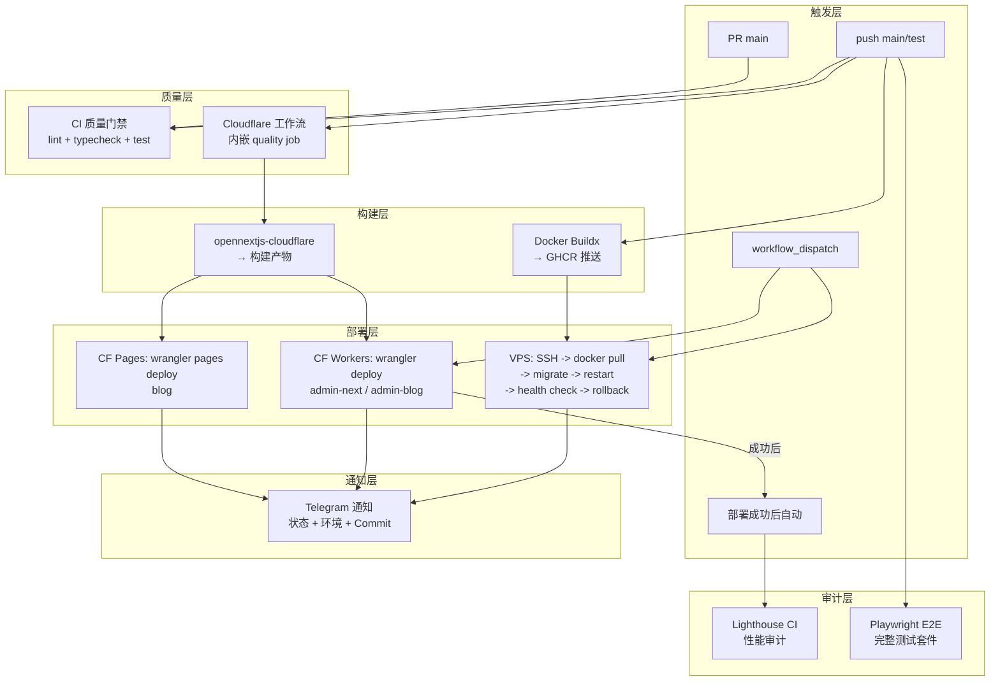

## 1. 背景

在 Monorepo 架构中，CI/CD 的挑战远不止于「跑测试、然后部署」。以 [`lucky`](.) Monorepo 为例，它同时需要管理：

- **后端 API** — NestJS 服务，部署到 1GB VPS 上的 Docker 容器
- **三个前端应用** — admin-next (管理后台)、blog (博客)、admin-blog (管理博客)，使用 Next.js + opennextjs-cloudflare 构建
- **两种部署目标** — VPS Docker (胖容器) 和 Cloudflare Workers/Pages (无服务器)

此外，还需要 **CI 质量门禁**（lint + 类型检查 + 测试）、**性能审计**（Lighthouse CI）和 **独立 E2E 测试**，且所有部署都需附带 **Telegram 通知**。

为此，项目设计了 8 条 GitHub Actions 工作流，形成一套完整的自动化工具体系。本文将深入每条工作流的实现细节与设计思路。

## 2. 整体架构

### 2.1 工作流全景

以下 8 条工作流覆盖了代码质量、部署、审计、测试四大领域：

| 工作流 | 文件 | 触发方式 | 目标 | 核心职责 |
|--------|------|---------|------|---------|
| CI | [`ci.yml`](.github/workflows/ci.yml) | push/PR main | 代码质量 | Lint + TypeScript 类型检查 + 单元测试 + E2E |
| Deploy Backend | [`deploy-backend.yml`](.github/workflows/deploy-backend.yml) | push main/test + path filter | VPS | Docker 构建 → GHCR → SSH 部署 + 自动回滚 |
| Deploy Admin CF | [`deploy-admin-cloudflare.yml`](.github/workflows/deploy-admin-cloudflare.yml) | push main/test + path filter | Cloudflare Workers | opennext 构建 → CF Workers 部署 |
| Deploy Blog CF | [`deploy-blog-cloudflare.yml`](.github/workflows/deploy-blog-cloudflare.yml) | push main/test + path filter | Cloudflare Pages | opennext 构建 → CF Pages 部署 |
| Deploy Admin Blog CF | [`deploy-admin-blog-cloudflare.yml`](.github/workflows/deploy-admin-blog-cloudflare.yml) | push main/test + path filter | Cloudflare Workers | opennext 构建 → CF Workers 部署 |
| Deploy Master | [`deploy-master.yml`](.github/workflows/deploy-master.yml) | workflow_dispatch | Orchestrator | 编排调用 backend + admin CF 工作流 |
| Lighthouse CI | [`lighthouse-ci.yml`](.github/workflows/lighthouse-ci.yml) | 手动 + CF 部署成功后自动触发 | 性能 | LHCI 性能审计 + 报告 |
| Playwright E2E | [`playwright.yml`](.github/workflows/playwright.yml) | push main | E2E 测试 | 独立完整 Playwright 套件 |



### 2.2 双管道架构决策

为什么后端和前端采用完全不同的部署管道？

| 维度 | 后端 (VPS Docker) | 前端 (Cloudflare) |
|------|-------------------|-------------------|
| 运行时 | Node.js 20 Alpine (长期进程) | V8 isolates (无服务器) |
| 资源需求 | 300MB+ 内存，需与 DB/Redis 同网络 | 无状态，按需执行 |
| 构建产物 | Docker 镜像 (OCI) | opennext 编译产物 (JavaScript) |
| 镜像存储 | GHCR (GitHub Container Registry) | 直接上传到 Cloudflare |
| 部署方式 | SSH 远程命令 | wrangler CLI |
| 回滚策略 | docker pull 旧镜像 | CF 版本管理 |

这一设计充分利用了两种平台的优势：VPS 提供可控的计算环境适合有状态的后端，Cloudflare 的边缘网络天然适合无状态的前端。

## 3. CI 质量门禁 (`ci.yml`)

[`ci.yml`](.github/workflows/ci.yml) 是项目的核心质量关卡，在每次 push 到 main/test 或 PR 到 main 时触发。

### 3.1 并发控制

```yaml
concurrency:
  group: ci-${{ github.ref }}
  cancel-in-progress: true
```

同一 PR 的旧提交触发的新运行会自动取消旧运行，避免浪费 CI 资源。这是 monorepo 中的关键优化——当开发者频繁推送时，只有最后一次运行有意义。

### 3.2 三级缓存策略

CI 耗时大头是依赖安装。项目采用了三层缓存：

```yaml
# 第一层: Yarn zip 缓存 (全局 lockfile 级)
- name: Cache Yarn zip cache
  uses: actions/cache@v4
  with:
    path: |
      .yarn/cache
      .yarn/install-state.gz
    key: yarn-${{ hashFiles('yarn.lock') }}
    restore-keys: yarn-

# 第二层: node_modules 缓存 (系统 + lockfile 级)
- name: Cache node_modules
  uses: actions/cache@v4
  id: nm-cache
  with:
    path: |
      node_modules
      apps/*/node_modules
      packages/*/node_modules
    key: nm-${{ runner.os }}-${{ hashFiles('yarn.lock') }}

# 第三层: Turbo 远程缓存 (分支级)
- name: Cache Turbo
  uses: actions/cache@v4
  with:
    path: .turbo
    key: turbo-${{ github.ref_name }}-${{ github.sha }}
    restore-keys: |
      turbo-${{ github.ref_name }}-
      turbo-main-
```

三层缓存的命中率依次递减，但恢复速度也依次递增。最理想的情况是三层全命中，CI 可在 2 分钟内完成。

### 3.3 硬门禁 vs 软门禁

```yaml
# 硬门禁 — 失败即阻断
- name: Lint
  run: yarn turbo run lint --filter=!@lucky/api

- name: Type Check
  run: turbo run check-types

# 软门禁 — 失败不阻断但告警
- name: E2E
  continue-on-error: true
  ...
```

设计原则：
- **硬门禁**（Lint + 类型检查 + 构建 + 管理后台单元测试）— 这些失败意味着代码质量问题，PR 不应合并
- **软门禁**（其他包测试 + Playwright E2E）— 允许 CI 通过但记录失败，避免阻塞开发流程

### 3.4 E2E 作业

```yaml
e2e:
  runs-on: ubuntu-latest
  steps:
    - name: Check if E2E secrets are set
      id: check-secrets
      run: |
        if [ -z "${{ secrets.E2E_ADMIN_PASSWORD }}" ]; then
          echo "skip=true" >> "$GITHUB_OUTPUT"
        fi

    - name: Start mock API
      if: steps.check-secrets.outputs.skip != 'true'
      run: node scripts/mock-api/server.js &

    - name: Run Playwright E2E
      if: steps.check-secrets.outputs.skip != 'true'
      run: yarn workspace @lucky/admin-next exec playwright test

    - name: Upload E2E reports
      if: always()
      uses: actions/upload-artifact@v4
      with:
        name: e2e-reports
        path: apps/admin-next/playwright-report/
```

通过 Secret 门控机制，即使 E2E 凭据未配置，CI 也不会失败 — 只是跳过 E2E 步骤。Mock API server 用于模拟后端响应，使 E2E 不依赖真实 VPS 环境。

## 4. 后端部署 (`deploy-backend.yml`)

[`deploy-backend.yml`](.github/workflows/deploy-backend.yml) 是项目中最复杂的工作流，包含 3 个阶段共 387 行。

### 4.1 触发条件

```yaml
on:
  push:
    branches: [main, test]
    paths:
      - "apps/api/**"
      - "packages/shared/**"
      - "packages/config/**"
      - "Dockerfile.prod"
      - "compose.prod.yml"
      - "nginx/nginx.prod.conf"
      - "nginx/whitelist.conf"
      - ".github/workflows/deploy-backend.yml"
  workflow_dispatch:
  workflow_call:
```

路径过滤确保只有后端相关的变更才触发部署，避免频繁无意义的部署。`workflow_dispatch` 支持手动触发时选择 runner 类型，`workflow_call` 使其可被 master 工作流编排调用。

### 4.2 阶段零：质量检查

与 CI 工作流类似，但只需要检查 API 工作区：

```yaml
quality:
  steps:
    - name: Lint + Type Check
      run: |
        yarn workspace @lucky/api lint
        yarn workspace @lucky/api check-types
```

这是部署前的最后一道防线——确保推送到生产的代码通过了类型检查和 lint。

### 4.3 阶段一：Docker 构建 + GHCR 推送

```yaml
build:
  needs: quality
  steps:
    - name: Set up Docker Buildx
      uses: docker/setup-buildx-action@v3

    - name: Login to GHCR
      uses: docker/login-action@v3
      with:
        registry: ghcr.io
        username: ${{ github.actor }}
        password: ${{ secrets.GITHUB_TOKEN }}

    - name: Docker meta
      id: meta
      uses: docker/metadata-action@v5
      with:
        images: ${{ env.IMAGE_NAME }}
        tags: |
          type=sha,prefix=
          type=raw,value=latest

    - name: Build & Push
      uses: docker/build-push-action@v6
      with:
        context: .
        file: ./Dockerfile.prod
        push: true
        tags: ${{ steps.meta.outputs.tags }}
        platforms: linux/amd64
        cache-from: type=gha
        cache-to: type=gha,mode=max
```

关键特性：
- **`docker/metadata-action`** 自动生成两个标签：Git commit SHA（唯一标识）和 `latest`（滚动更新）
- **GHA cache** 跨构建复用 Docker layer 缓存，大幅缩短构建时间
- **`platforms: linux/amd64`** 显式指定目标架构，确保与 VPS 兼容

### 4.4 阶段二：SSH 部署

部署阶段包含多个子步骤，每个都有容错机制：

```yaml
deploy:
  environment: production
  steps:
    # Step 1: SSH 预检连通性 (3 次重试)
    - name: Validate SSH connectivity preflight
      run: |
        OK=0
        for i in 1 2 3; do
          if nc -zvw5 "$SSH_HOST" "$SSH_PORT"; then
            OK=1; break
          fi
          sleep 5
        done

    # Step 2: SCP 同步脚本 (重试机制)
    - name: Sync deploy scripts to VPS
      id: scp_sync_1
      continue-on-error: true
      uses: appleboy/scp-action@v0.1.7

    - name: Sync deploy scripts to VPS (retry once)
      if: steps.scp_sync_1.outcome == 'failure'
      uses: appleboy/scp-action@v0.1.7
```

SCP 的显式重试机制非常实用——网络抖动是 CI 环境中的常见问题，一次失败直接报错过于激进。

远程部署脚本（通过 `appleboy/ssh-action` 执行）完整复现了 [`deploy.sh`](deploy/deploy.sh) 的核心逻辑：

```bash
# 1. 登录 GHCR
retry 4 8 sh -c 'echo "$GHCR_TOKEN" | docker login ghcr.io -u "$GHCR_USER" --password-stdin'

# 2. 拉取新镜像
retry 4 10 docker pull "$IMAGE"

# 3. 数据库迁移 (临时容器)
NETWORK=$(docker inspect lucky-db-prod --format '{{range $k,$v := .NetworkSettings.Networks}}{{$k}}{{end}}')
docker run --rm --network "$NETWORK" --env-file deploy/.env.prod \
  --entrypoint "" "$IMAGE" \
  ./node_modules/.bin/prisma migrate deploy

# 4. 保存旧镜像 SHA (用于回滚)
PREV_IMAGE_SHA=$(docker inspect lucky-backend-prod --format '{{.Image}}' 2>/dev/null || echo "")

# 5. 重启服务
BACKEND_IMAGE="$IMAGE" docker compose -f compose.prod.yml up -d --no-build --force-recreate backend

# 6. 健康检查 (30 次 × 3s = 90s 超时)
for i in $(seq 1 30); do
  if docker exec lucky-backend-prod wget -qO- http://localhost:3000/api/v1/health >/dev/null 2>&1; then
    HEALTHY=true; break
  fi
  sleep 3
done

# 7. 健康检查失败 → 自动回滚
if [ "$HEALTHY" = false ]; then
  if [ -n "$PREV_IMAGE_SHA" ]; then
    BACKEND_IMAGE="lucky-backend-prod@${PREV_IMAGE_SHA}" docker compose up -d --no-build --force-recreate backend
  fi
  exit 1
fi

# 8. Nginx 热重载
docker exec lucky-nginx-prod nginx -t && docker exec lucky-nginx-prod nginx -s reload
```

### 4.5 阶段三：Telegram 通知

```yaml
- name: Send Telegram Notification
  if: always()  # 无论成功失败都通知
  run: |
    MESSAGE="⚙️ *Lucky Backend Deployment Report*
    Status: $STATUS_EMOJI
    Environment: Production (VPS) — branch: \`${{ github.ref_name }}\`
    Commit: \`${{ github.sha }}\`"

    curl -s -X POST "https://api.telegram.org/bot${{ secrets.TELEGRAM_TOKEN }}/sendMessage" \
      -d "chat_id=${{ secrets.TELEGRAM_CHAT_ID }}" \
      -d "text=$MESSAGE" \
      -d "parse_mode=Markdown"
```

`if: always()` 确保即使在部署失败时，通知也会发送——团队能在第一时间获知问题。

## 5. 前端部署 (Cloudflare 三条工作流)

三个前端应用共享相似的部署模式，但各有差异。

### 5.1 共同模式

三条工作流都遵循 `quality → deploy` 双 job 结构：

| 特征 | 说明 |
|------|------|
| quality job | setup-node → yarn install → lint + typecheck + test |
| 环境区分 | `environment: ${{ github.ref_name == 'main' && 'production' \|\| 'preview' }}` |
| 构建工具 | `opennextjs-cloudflare build` |
| Cloudflare 凭证验证 | 通过 CF API 验证 token 有效性 |
| 部署方式 | `opennextjs-cloudflare deploy` |
| GitHub Deployments API | 集成部署状态追踪 |
| Telegram 通知 | 同后端通知模式 |

### 5.2 Admin Next (Cloudflare Workers)

[`deploy-admin-cloudflare.yml`](.github/workflows/deploy-admin-cloudflare.yml) 部署管理后台到 Cloudflare Workers：

```yaml
- name: Build Admin for Cloudflare Workers
  working-directory: apps/admin-next
  env:
    NEXT_PUBLIC_API_BASE_URL: ${{ secrets.NEXT_PUBLIC_API_BASE_URL }}
    NEXT_PUBLIC_WS_URL: ${{ secrets.NEXT_PUBLIC_WS_URL }}
    NEXT_PUBLIC_RECAPTCHA_SITE_KEY: ${{ secrets.NEXT_PUBLIC_RECAPTCHA_SITE_KEY }}
    NEXT_PUBLIC_SENTRY_DSN: ${{ secrets.NEXT_PUBLIC_SENTRY_DSN }}
  run: |
    yarn exec opennextjs-cloudflare build

- name: Deploy to Cloudflare Workers
  working-directory: apps/admin-next
  run: |
    yarn exec opennextjs-cloudflare deploy -c wrangler.jsonc
```

关键构建注入：
- **`NEXT_PUBLIC_APP_ENV`** — 根据分支自动切换 production/preview
- **`NEXT_PUBLIC_DEPLOYED_AT`** — 构建时间戳，用于 Build Info 页面
- **`NEXT_PUBLIC_GIT_SHA`** — 当前 commit SHA，用于版本追踪

### 5.3 Blog (Cloudflare Pages)

[`deploy-blog-cloudflare.yml`](.github/workflows/deploy-blog-cloudflare.yml) 部署博客到 Cloudflare Pages，与 Workers 部署不同：

```yaml
- name: Build Blog for Cloudflare Pages
  working-directory: apps/frontend-blog
  run: |
    yarn exec opennextjs-cloudflare build

- name: Run post-processing scripts
  run: |
    bash scripts/copy-manifests.sh
    node scripts/patch-worker-queue.mjs

- name: Deploy to Cloudflare Pages
  working-directory: apps/frontend-blog
  run: |
    yarn exec opennextjs-cloudflare deploy --pages
```

Pages 与 Workers 的核心区别：
- **Pages** 使用 `--pages` 标志，部署到 Cloudflare Pages 平台
- **Workers** 使用 `-c wrangler.jsonc` 配置，部署到 Workers 运行时
- Pages 需要额外的后处理脚本（`copy-manifests.sh` + `patch-worker-queue.mjs`）
- Blog 使用四级缓存策略（额外包含 Next.js `.next/cache`）

### 5.4 Admin Blog (Cloudflare Workers)

[`deploy-admin-blog-cloudflare.yml`](.github/workflows/deploy-admin-blog-cloudflare.yml) 结构与 admin CF 完全相同，只是 Sentry DSN 和应用名称不同。

### 5.5 环境切换模式

三条工作流都使用统一的环境条件模式：

```yaml
environment: ${{ github.ref_name == 'main' && 'production' || 'preview' }}
```

这确保了：
- **main 分支** → 部署到 production 环境，使用正式域名和 API
- **test 分支** → 部署到 preview 环境，使用测试域名和 API
- 不同环境使用不同的 GitHub Environment Secrets，隔离敏感信息

## 6. 主控工作流 (`deploy-master.yml`)

[`deploy-master.yml`](.github/workflows/deploy-master.yml) 提供了一个一键式的手动部署控制台：

```yaml
name: Master Deployment Control

on:
  workflow_dispatch:
    inputs:
      runner:
        description: "Runner type"
        type: choice
        options: [ubuntu-latest, self-hosted]
        default: ubuntu-latest
      deploy_admin_cloudflare:
        description: "Deploy Admin Frontend (CF Workers)"
        type: boolean
        default: true
      deploy_api:
        description: "Deploy Backend API (VPS)"
        type: boolean
        default: true

jobs:
  preflight:
    steps:
      - name: Write dispatch summary
        run: |
          echo "## Master Deploy Dispatch"
          echo "- Branch: \`${{ github.ref_name }}\`"
          echo "- Commit: \`${{ github.sha }}\`"
          echo "- Deploy Admin: \`${{ inputs.deploy_admin_cloudflare }}\`"
          echo "- Deploy API: \`${{ inputs.deploy_api }}\`"
          echo "- Triggered by: \`${{ github.actor }}\`" >> "$GITHUB_STEP_SUMMARY"

  run-admin-cloudflare-deploy:
    needs: preflight
    if: ${{ inputs.deploy_admin_cloudflare == true }}
    uses: ./.github/workflows/deploy-admin-cloudflare.yml
    secrets: inherit

  run-backend-deploy:
    needs: preflight
    if: ${{ inputs.deploy_api == true }}
    uses: ./.github/workflows/deploy-backend.yml
    secrets: inherit
```

关键设计：
- **`workflow_dispatch` 布尔输入** — 操作员勾选需要部署的模块
- **可复用工作流** (`workflow_call`) — 直接引用其他工作流，不重复逻辑
- **`secrets: inherit`** — 子工作流自动继承父工作流的密钥
- **`needs: preflight`** — 先打印部署意图摘要，再并行执行子工作流

## 7. 性能审计 (`lighthouse-ci.yml`)

[`lighthouse-ci.yml`](.github/workflows/lighthouse-ci.yml) 在 Admin CF 部署成功后自动触发，或手动触发：

### 7.1 触发条件

```yaml
on:
  workflow_dispatch:
    inputs:
      runs_per_page:
        description: "Runs per page (1=fast, 3=accurate)"
        type: choice
        options: ["1", "3"]
        default: "1"
  workflow_run:
    workflows: ["Deploy Admin (Cloudflare)"]
    types: [completed]
    branches: [main]
```

`workflow_run` 事件监听 Admin CF 部署的完成状态，确保每次生产部署后自动执行性能审计。

### 7.2 认证流程

Lighthouse 需要模拟已登录的管理员来审计受保护的页面：

```bash
# 通过生产 API 获取 JWT
RESPONSE=$(curl -s -w "\n%{http_code}" -X POST https://api.joyminis.com/api/v1/auth/admin/login \
  -H 'Content-Type: application/json' \
  -d "{\"username\":\"$LIGHTHOUSE_ADMIN_USERNAME\",\"password\":\"$LIGHTHOUSE_ADMIN_PASSWORD\"}")

# 提取 token 并注入到 LHCI
TOKEN=$(echo "$BODY" | python3 -c "import sys,json; print(json.load(sys.stdin)['data']['tokens']['accessToken'])")

# mask token 防止日志泄露
echo "::add-mask::$TOKEN"
echo "token=$TOKEN" >> "$GITHUB_OUTPUT"
```

认证后的 token 通过 `LHCI_COOKIE` 环境变量传递给 Lighthouse CI，使其在审计所有页面时都携带已登录的 Cookie。

### 7.3 报告生成

```yaml
- name: Run Lighthouse CI
  env:
    LHCI_COOKIE: auth_token=${{ steps.auth.outputs.token }}
  run: |
    npx lhci autorun \
      --config=apps/admin-next/lighthouserc.js \
      --collect.numberOfRuns=${{ inputs.runs_per_page || '1' }}

- name: Upload Lighthouse reports
  if: always()
  uses: actions/upload-artifact@v4
  with:
    name: lighthouse-reports-${{ github.run_number }}
    path: .lighthouseci/
    retention-days: 30

- name: Write summary
  if: always()
  run: |
    echo "## Lighthouse CI — ${{ github.ref_name }}"
    echo "| Page | LCP (ms) | TBT (ms) | CLS | Score |"
    python3 - <<'PYEOF'
    # 解析所有 LHR JSON 报告
    # 按页面路径聚合，计算中位数
    # 输出 Markdown 表格到 GITHUB_STEP_SUMMARY
    PYEOF
```

报告以三种形式输出：
1. **Artifacts** — 原始 HTML/JSON 报告，保留 30 天，可供详细审查
2. **GitHub Step Summary** — 浓缩的 Markdown 表格，在 Actions 页面直接查看
3. **偏差标记** — LCP < 2500ms ✅, 2500-4000ms ⚠️, > 4000ms ❌

## 8. 独立 E2E (`playwright.yml`)

[`playwright.yml`](.github/workflows/playwright.yml) 与 [`ci.yml`](.github/workflows/ci.yml) 中的 E2E 分工明确：

| 工作流 | E2E 角色 | 触发 | 配置 | 失败处理 |
|--------|---------|------|------|---------|
| `ci.yml` | 轻量 Smoke Test | 每次 push/PR | 基本登录 + 页面加载 | continue-on-error |
| `playwright.yml` | 完整 E2E 套件 | push main | 全功能测试 + 截图/trace | 明确报告失败 |

Playwright E2E 在部署生产后运行完整测试套件，并上传所有诊断产物：

```yaml
- name: Upload Playwright Screenshots
  if: failure()
  uses: actions/upload-artifact@v4
  with:
    name: playwright-screenshots
    path: apps/admin-next/e2e/screenshots/

- name: Upload Playwright Traces
  if: failure()
  uses: actions/upload-artifact@v4
  with:
    name: playwright-traces
    path: apps/admin-next/e2e/traces/

- name: Upload HTML Report
  if: always()
  uses: actions/upload-artifact@v4
  with:
    name: playwright-report
    path: apps/admin-next/playwright-report/
    retention-days: 14
```

失败时上传截图和 trace 文件，便于离线分析。HTML 报告无论成功失败都上传（保留 14 天）。

## 9. 密钥管理

GitHub Actions 的 Secret 管理采用分层策略：

| Secret | 用途 | 作用域 | 分类 |
|--------|------|--------|------|
| `SSH_HOST` / `SSH_PORT` / `SSH_USERNAME` / `SSH_PRIVATE_KEY` | VPS SSH 连接 | Repository Secrets | 基础设施 |
| `VPS_GHCR_PAT` | VPS 从 GHCR 拉取镜像 | Environment (production) | 基础设施 |
| `CLOUDFLARE_API_TOKEN` / `CLOUDFLARE_ACCOUNT_ID` | Cloudflare 部署 | Environment (production/preview) | 基础设施 |
| `TELEGRAM_TOKEN` / `TELEGRAM_CHAT_ID` | 部署通知 | Environment (production) | 通知 |
| `NEXT_PUBLIC_API_BASE_URL` / `NEXT_PUBLIC_WS_URL` | 前端构建 | Environment (production/preview) | 应用配置 |
| `NEXT_PUBLIC_RECAPTCHA_SITE_KEY` | reCAPTCHA 验证 | Environment (production/preview) | 安全 |
| `SENTRY_AUTH_TOKEN` / `SENTRY_DSN` | Sentry 错误追踪 | Environment (production) | 监控 |
| `E2E_ADMIN_USERNAME` / `E2E_ADMIN_PASSWORD` | E2E 测试凭据 | Repository Secrets | 测试 |
| `LIGHTHOUSE_ADMIN_USERNAME` / `LIGHTHOUSE_ADMIN_PASSWORD` | Lighthouse 认证 | Repository Secrets | 测试 |

设计原则：
- **Environment Secrets** 用于带环境隔离的配置（production vs preview）
- **Repository Secrets** 用于跨环境共享的凭据（SSH、测试）
- pipeline 中通过 `environment:` 字段自动切换 Secret 作用域

## 10. 模式总结

以下是从 8 条工作流中提炼的可复用模式：

### 10.1 环境条件模式

```yaml
environment: ${{ github.ref_name == 'main' && 'production' || 'preview' }}
```

这一模式贯穿所有部署工作流，根据分支名自动选择目标环境。

### 10.2 路径过滤模式

```yaml
on:
  push:
    branches: [main, test]
    paths:
      - "apps/api/**"
      - "packages/shared/**"
      - "Dockerfile.prod"
```

路径过滤确保只有相关代码变更才触发部署，避免「改前端文案触发后端部署」的无效流水线。

### 10.3 双管道模式

- **后端管道**: GitHub Runner → Docker Buildx (AMD64) → GHCR 推送 → SSH 到 VPS → docker pull → migrate → restart → health check + rollback
- **前端管道**: GitHub Runner → opennextjs-cloudflare build → wrangler deploy → CF Workers/Pages → smoke check

两种管道共享质量检查、Telegram 通知和 Git SHA 注入。

### 10.4 通知模式

```yaml
- name: Send Notification
  if: always()
```

`if: always()` 确保无论工作流成功还是失败，通知都不会丢失。这是 DevOps 可观测性的基石——坏消息比没消息好。

### 10.5 可复用工作流模式

```yaml
# 在主控工作流中调用子工作流
run-admin-cloudflare-deploy:
  uses: ./.github/workflows/deploy-admin-cloudflare.yml
  secrets: inherit
```

通过 `workflow_call` + `secrets: inherit` 实现工作流组合，避免重复定义。

## 11. 与本地部署脚本的对比

| 维度 | CI/CD (GitHub Actions) | 本地脚本 ([`deploy.sh`](deploy/deploy.sh)) |
|------|------------------------|------------------------------------------|
| 构建环境 | GitHub Runner (ephemeral) | 本地 Mac (持久) |
| 镜像存储 | GHCR (远程 registry) | 本地 Docker daemon |
| 传输方式 | `docker pull` (registry) | `docker save \| gzip \| ssh \| docker load` (管道) |
| 构建架构 | `linux/amd64` (显式指定) | `--platform linux/amd64` |
| 触发方式 | `push` / `workflow_dispatch` | 手动执行 |
| 通知 | Telegram + GitHub UI | 终端输出 |
| 回滚 | 内置自动回滚 | 内置自动回滚 |
| 密钥管理 | GitHub Secrets | `.env.prod` 文件 |
| 并发控制 | `concurrency.group` | 无（手动保证） |

两者共享相同的健康检查逻辑和回滚策略，确保 CI/CD 和手动部署的行为一致。

## 12. 总结

GitHub Actions CI/CD 体系的核心设计原则可以归纳为：

1. **触发精确** — 路径过滤 + 分支规则 + 手动/自动组合，确保恰到好处的自动化
2. **缓存极致** — 三层缓存策略（Yarn zip → node_modules → Turbo）使 CI 能在 2-3 分钟内完成
3. **容错全面** — SSH 预检重试、SCP 重试、SSH 命令重试、健康检查失败自动回滚
4. **双管道并行** — VPS Docker 后端 + Cloudflare Workers/Pages 前端，各取所长
5. **可观测性** — Telegram 通知贯穿所有工作流，`if: always()` 保证失败通知不丢失
6. **可组合** — `workflow_call` 实现工作流复用，`deploy-master.yml` 作为统一编排入口

这套体系与之前的 [Docker Compose 容器化实践](./docker-compose-containerization) 和 [部署管道全流程](./deployment-pipeline-full-process) 形成了完整的 DevOps 工具链——从本地构建到远程容器化部署，再到 CI/CD 自动化，覆盖了整个软件交付生命周期。

### 相关文章

- [Docker Compose 容器化实践 —— 1GB VPS 多服务编排](./docker-compose-containerization)
- [部署管道全流程 —— 从本地构建到远程部署](./deployment-pipeline-full-process)
- [Nginx API 网关——生产与开发双配置实践](./nginx-api-gateway-dev-prod)
