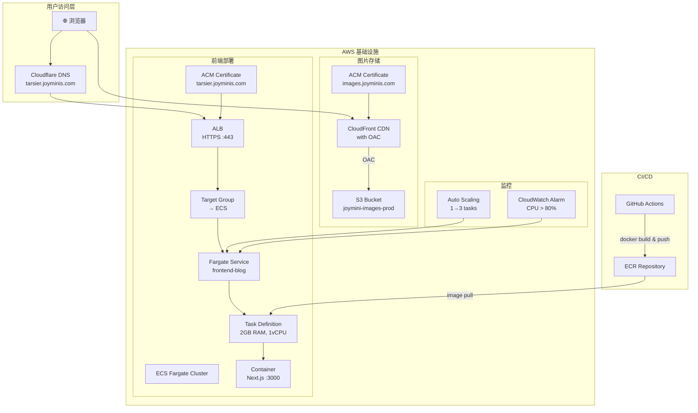

# JoyMini AWS 云基础设施实战总结：从 ECS Fargate 到 S3 + CloudFront 的完整部署

> 当 Next.js 应用需要生产级部署时，为什么选择 ECS Fargate 而不是 Vercel？本文基于 JoyMini 项目的真实 AWS 基础设施搭建经验，详细拆解从 ECS 容器部署、ALB 负载均衡、ACM 证书管理，到 S3 + CloudFront OAC 图片存储的完整链路，以及 CDK 基础设施即代码和 GitHub Actions CI/CD 全自动化的最佳实践。

---

## 目录

- [1. 背景：为什么自建 AWS 而不是 Vercel](#1-背景为什么自建-aws-而不是-vercel)
- [2. 整体架构总览](#2-整体架构总览)
- [3. ECS Fargate：容器化前端部署](#3-ecs-fargate容器化前端部署)
  - [3.1 VPC 与网络规划](#31-vpc-与网络规划)
  - [3.2 Task Definition 与容器配置](#32-task-definition-与容器配置)
  - [3.3 Fargate Service 与滚动更新](#33-fargate-service-与滚动更新)
- [4. ALB + ACM：域名与 HTTPS](#4-alb--acm域名与-https)
  - [4.1 HTTP → HTTPS 重定向](#41-http--https-重定向)
  - [4.2 Health Check 配置](#42-health-check-配置)
- [5. Auto Scaling + CloudWatch 告警](#5-auto-scaling--cloudwatch-告警)
- [6. S3 + CloudFront OAC：图片存储与 CDN](#6-s3--cloudfront-oac图片存储与-cdn)
  - [6.1 S3 生命周期策略](#61-s3-生命周期策略)
  - [6.2 CloudFront OAC 安全访问](#62-cloudfront-oac-安全访问)
- [7. CDK 基础设施即代码](#7-cdk-基础设施即代码)
  - [7.1 为什么选 CDK](#71-为什么选-cdk)
  - [7.2 Constructs 重构经验](#72-constructs-重构经验)
- [8. CI/CD 自动化流水线](#8-cicd-自动化流水线)
  - [8.1 Frontend Blog 部署流水线](#81-frontend-blog-部署流水线)
  - [8.2 CDK 基础设施流水线](#82-cdk-基础设施流水线)
- [9. 踩坑记录](#9-踩坑记录)
- [10. 总结](#10-总结)

---

## 1. 背景：为什么自建 AWS 而不是 Vercel

JoyMini Blog 最初在 Cloudflare 上运行，但随着功能增长，我们面临几个关键需求：

- **后端 API 需要稳定运行环境**：NestJS 后端和数据库不能跑在 Serverless Worker 上
- **Monorepo 多应用管理**：frontend-blog、admin-next、api 三个应用需要统一的部署策略
- **成本可控**：自建 AWS 部署比使用 Vercel 等 PaaS 平台更省钱，适合个人项目长期运行
- **学习价值**：ECS Fargate 是 AWS 面试高频考点，亲手搭建比背面试题更有说服力

最终选择 **AWS ECS Fargate** 作为主要部署目标，搭配 **S3 + CloudFront** 作图片存储，**CDK** 管理基础设施，**GitHub Actions** 实现 CI/CD 自动化。

---

## 2. 整体架构总览



---

## 3. ECS Fargate：容器化前端部署

### 3.1 VPC 与网络规划

在 [`infra/lib/infra-stack.ts`](infra/lib/infra-stack.ts:40) 中，VPC 配置为仅使用公有子网：

```typescript
// infra/lib/infra-stack.ts
const vpc = new ec2.Vpc(this, "TarsierLabsVpc", {
  maxAzs: 2,
  subnetConfiguration: [
    {
      name: "Public",
      subnetType: ec2.SubnetType.PUBLIC,
    },
  ],
  natGateways: 0, // 不创建 NAT Gateway，避免 VPC 公网出口额外开销
});
```

**为什么只用公有子网 + 不用 NAT Gateway？**
- Frontend Blog 是纯前端应用，不访问私有网络资源
- 去掉 NAT Gateway 减少不必要的公网出口开销
- 安全通过 Security Group 控制，不需要网络层的私有隔离

### 3.2 Task Definition 与容器配置

Task Definition 定义了容器的资源规格，见 [`infra/lib/infra-stack.ts`](infra/lib/infra-stack.ts:114)：

```typescript
// infra/lib/infra-stack.ts
const taskDef = new ecs.FargateTaskDefinition(this, "TarsierLabsTaskDef", {
  memoryLimitMiB: 2048,
  cpu: 1024,
  family: "tarsier-labs-task",
});

const container = taskDef.addContainer("FrontendBlog", {
  image: ecs.ContainerImage.fromEcrRepository(repository, "latest"),
  containerName: "frontend-blog",
  memoryLimitMiB: 2048,
  cpu: 1024,
  environment: {
    NODE_ENV: "production",
    PORT: "3000",
  },
  logging: ecs.LogDrivers.awsLogs({ streamPrefix: "frontend-blog" }),
});

container.addPortMappings({
  containerPort: 3000,
  protocol: ecs.Protocol.TCP,
});
```

关键配置：

| 参数 | 值 | 说明 |
|------|----|------|
| `memoryLimitMiB` | 2048 | 2 GB 内存，Next.js 应用的标准配置 |
| `cpu` | 1024 | 1 vCPU，与 2 GB 内存是 Fargate 的推荐组合 |
| `image` | ECR `latest` tag | 自动获取最新构建的 Docker 镜像 |
| `logging` | CloudWatch Logs | 日志自动汇聚到 CloudWatch，按需排查问题 |

### 3.3 Fargate Service 与滚动更新

Service 配置了优雅部署和健康检查，见 [`infra/lib/infra-stack.ts`](infra/lib/infra-stack.ts:138)：

```typescript
// infra/lib/infra-stack.ts
const service = new ecs.FargateService(this, "TarsierLabsService", {
  cluster,
  taskDefinition: taskDef,
  serviceName: "tarsier-labs-service",
  securityGroups: [ecsSg],
  vpcSubnets: { subnetType: ec2.SubnetType.PUBLIC },
  assignPublicIp: true,
  desiredCount: 1,
  enableExecuteCommand: true,
  healthCheckGracePeriod: cdk.Duration.seconds(60),
  circuitBreaker: { rollback: true },
  minHealthyPercent: 100,
});
```

**`circuitBreaker: { rollback: true }`** 是部署安全的最后一道防线——如果新版本容器无法通过健康检查，ECS 自动回滚到上一个稳定版本，避免部署导致服务中断。

**`minHealthyPercent: 100`** 确保在滚动更新期间，始终有至少 100% 的任务在运行（旧任务在新任务健康之前不会被停止）。

**`enableExecuteCommand: true`** 允许通过 AWS CLI 的 `execute-command` 直接进入运行中的容器排查问题：

```bash
aws ecs execute-command \
  --cluster tarsier-labs-cluster \
  --task $(aws ecs list-tasks --cluster tarsier-labs-cluster --query 'taskArns[0]' --output text) \
  --container frontend-blog \
  --command "/bin/sh" \
  --interactive
```

---

## 4. ALB + ACM：域名与 HTTPS

### 4.1 HTTP → HTTPS 重定向

ALB 配置了两个监听器，见 [`infra/lib/infra-stack.ts`](infra/lib/infra-stack.ts:95)：

```typescript
// infra/lib/infra-stack.ts
// HTTP:80 → 重定向到 HTTPS
const httpListener = alb.addListener("HttpListener", {
  port: 80,
  open: true,
});
httpListener.addAction("RedirectToHttps", {
  action: elbv2.ListenerAction.redirect({
    protocol: "HTTPS",
    port: "443",
    permanent: true, // 301 永久重定向
  }),
});

// HTTPS:443 → 转发到 ECS
const httpsListener = alb.addListener("HttpsListener", {
  port: 443,
  open: true,
  certificates: [tarsierCert],
});
```

ACM 证书通过 DNS 验证自动颁发：

```typescript
// infra/lib/infra-stack.ts
const tarsierCert = new acm.Certificate(this, "TarsierLabsCert", {
  domainName: "tarsier.joyminis.com",
  validation: acm.CertificateValidation.fromDns(),
});
```

### 4.2 Health Check 配置

**踩坑经验**：Health Check 路径从最初的 `/` 改为 `/zh/`。

为什么？因为 frontend-blog 是 i18n 应用，根路径 `/` 会触发 302 重定向到 `/zh/`。ALB 的 Health Check 默认不跟随重定向，导致连续 5 次收到 302 后判断实例不健康，触发 `circuitBreaker` 回滚——部署卡了 30 分钟才完成。

```typescript
// infra/lib/infra-stack.ts
httpsListener.addTargets("FrontendBlogTarget", {
  port: 3000,
  protocol: elbv2.ApplicationProtocol.HTTP,
  targets: [service],
  healthCheck: {
    path: "/zh/",  // 直接返回 200，不触发重定向
    interval: cdk.Duration.seconds(30),
  },
});
```

---

## 5. Auto Scaling + CloudWatch 告警

ECS Service 配置了基于 CPU 利用率的自动扩缩容，见 [`infra/lib/infra-stack.ts`](infra/lib/infra-stack.ts:153)：

```typescript
// infra/lib/infra-stack.ts
const scaling = service.autoScaleTaskCount({
  maxCapacity: 3,
  minCapacity: 1,
});

scaling.scaleOnCpuUtilization("CpuScaling", {
  targetUtilizationPercent: 70,
});

// CloudWatch 告警 — CPU > 80% 触发
new cloudwatch.Alarm(this, "CpuHighAlarm", {
  metric: service.metricCpuUtilization(),
  alarmName: "tarsier-labs-cpu-high",
  threshold: 80,
  evaluationPeriods: 2,
  datapointsToAlarm: 1,
});
```

**扩展策略**：

| 指标 | 阈值 | 动作 | 冷却期 |
|------|------|------|--------|
| CPU 利用率 | > 70% | 增加 1 个任务（最多 3 个） | 自动（AWS 管理） |
| CPU 利用率 | < 70% | 减少 1 个任务（最少 1 个） | 自动（AWS 管理） |
| CloudWatch 告警 | CPU > 80% | SNS 通知管理员 | 2 个评估周期 |

**为什么要配 Auto Scaling？** 虽然日常流量 1 个任务就够，但 Auto Scaling 解决了两个问题：
1. **流量突发**：被推荐或 SEO 排名提升时，自动扩容应对峰值
2. **部署安全**：滚动更新期间，新老任务同时运行需要额外容量

---

## 6. S3 + CloudFront OAC：图片存储与 CDN

### 6.1 S3 生命周期策略

图片存储在 S3 桶 `joymini-images-prod` 中，配置了自动降冷策略，见 [`infra/lib/infra-stack.ts`](infra/lib/infra-stack.ts:199)：

```typescript
// infra/lib/infra-stack.ts
const imageBucket = new s3.Bucket(this, "JoyMiniImagesBucket", {
  bucketName: "joymini-images-prod",
  encryption: s3.BucketEncryption.S3_MANAGED,
  versioned: true,
  blockPublicAccess: s3.BlockPublicAccess.BLOCK_ALL,
  removalPolicy: cdk.RemovalPolicy.RETAIN,
  lifecycleRules: [
    {
      transitions: [
        {
          storageClass: s3.StorageClass.INFREQUENT_ACCESS, // 30 天后转为低频
          transitionAfter: cdk.Duration.days(30),
        },
        {
          storageClass: s3.StorageClass.GLACIER, // 365 天后转为归档
          transitionAfter: cdk.Duration.days(365),
        },
      ],
    },
  ],
});
```

| 存储阶段 | 时间 | 存储成本 | 说明 |
|---------|------|---------|------|
| S3 Standard | 0-30 天 | $0.023/GB | 新图片频繁访问 |
| S3 IA | 30-365 天 | $0.0125/GB | 历史图片偶尔访问 |
| S3 Glacier | 365 天+ | $0.004/GB | 冷数据归档，节省 ~80% |

**版本控制**：开启版本控制后，即使图片被误删或覆盖，也能快速恢复——这对 CDN 内容管理至关重要。

### 6.2 CloudFront OAC 安全访问

CloudFront 使用 OAC（Origin Access Control）确保只有 CloudFront 可以访问 S3 中的图片，见 [`infra/lib/infra-stack.ts`](infra/lib/infra-stack.ts:222)：

```typescript
// infra/lib/infra-stack.ts
const distribution = new cloudfront.Distribution(this, "JoyMiniImagesCdn", {
  defaultBehavior: {
    origin: origins.S3BucketOrigin.withOriginAccessControl(imageBucket),
    viewerProtocolPolicy: cloudfront.ViewerProtocolPolicy.REDIRECT_TO_HTTPS,
    cachePolicy: cloudfront.CachePolicy.CACHING_OPTIMIZED,
  },
  domainNames: ["images.joyminis.com"],
  certificate: imageCert,
});
```

**OAC vs OAI**：OAC 是 OAI（Origin Access Identity）的升级版，支持更细粒度的访问控制，并且强制使用 HTTPS 回源。这是 CloudFront 和 S3 集成的最新推荐方式。

---

## 7. CDK 基础设施即代码

### 7.1 为什么选 CDK

在 CDK 和 Terraform 之间的选择：

| 维度 | AWS CDK | Terraform |
|------|---------|-----------|
| 语言 | TypeScript（与项目一致） | HCL（新语言） |
| 类型安全 | 原生 TypeScript 支持 | 需要额外工具 |
| 调试 | 可以直接 `console.log` | 需要 `terraform console` |
| 与项目集成 | 和 infra Lambda 共享代码 | 独立代码仓库 |
| 学习成本 | 低（会 TypeScript 就行） | 高（需要学 HCL） |

对于 JoyMini 这样的 monorepo 项目，CDK 的优势很明显——前端和后端都使用 TypeScript，infra 层也写 TypeScript，开发体验一致。

### 7.2 Constructs 重构经验

随着基础设施增加，`infra-stack.ts` 从最初的几十行膨胀到近 400 行。为了提高可维护性，我们将其重构为 CDK Constructs：

```
infra/lib/
├── infra-stack.ts          # 主 Stack（~80 行，只做编排）
└── constructs/
    ├── ecs-frontend.ts     # ECS Fargate + ALB + ACM
    └── s3-r2-sync.ts       # S3 + CloudFront + SQS + SNS + Lambda
```

**重构收益**：
- `infra-stack.ts` 职责单一：初始化 Constructs 并传递参数
- 每个 Construct 内聚性强：独立管理自己的资源
- 方便复用：新项目只需 `new EcsFrontendConstruct(this, ...)` 即可

---

## 8. CI/CD 自动化流水线

### 8.1 Frontend Blog 部署流水线

[`.github/workflows/deploy-frontend-blog.yml`](.github/workflows/deploy-frontend-blog.yml) 实现了从代码提交到 ECS 部署的全自动化：

```yaml
# .github/workflows/deploy-frontend-blog.yml
name: Deploy Frontend Blog to ECS

on:
  push:
    branches: [main]
    paths:
      - 'apps/frontend-blog/**'
      - 'packages/**'
      - 'apps/frontend-blog/Dockerfile'
      - '.github/workflows/deploy-frontend-blog.yml'
  workflow_dispatch:

env:
  AWS_REGION: ${{ secrets.AWS_REGION }}
  ECR_REPOSITORY: ${{ secrets.ECR_REPOSITORY }}
  ECS_CLUSTER: ${{ secrets.ECS_CLUSTER }}
  ECS_SERVICE: ${{ secrets.ECS_SERVICE }}

jobs:
  deploy:
    name: Build & Deploy
    runs-on: ubuntu-latest
    steps:
      - name: Checkout
        uses: actions/checkout@v4

      - name: Configure AWS credentials
        uses: aws-actions/configure-aws-credentials@v4
        with:
          aws-access-key-id: ${{ secrets.AWS_ACCESS_KEY_ID }}
          aws-secret-access-key: ${{ secrets.AWS_SECRET_ACCESS_KEY }}
          aws-region: ${{ env.AWS_REGION }}

      - name: Login to Amazon ECR
        id: login-ecr
        uses: aws-actions/amazon-ecr-login@v2

      - name: Build & Push Docker image
        env:
          ECR_REGISTRY: ${{ steps.login-ecr.outputs.registry }}
          IMAGE_TAG: ${{ github.sha }}
        run: |
          docker build -f apps/frontend-blog/Dockerfile \
            -t $ECR_REGISTRY/$ECR_REPOSITORY:$IMAGE_TAG \
            -t $ECR_REGISTRY/$ECR_REPOSITORY:latest .
          docker push --all-tags $ECR_REGISTRY/$ECR_REPOSITORY

      - name: Deploy to ECS
        run: |
          aws ecs update-service \
            --cluster $ECS_CLUSTER \
            --service $ECS_SERVICE \
            --desired-count 1 \
            --force-new-deployment \
            --region $AWS_REGION
```

**流水线流程**：
1. `push` 到 `main` 分支且路径匹配 `frontend-blog/**` 时触发
2. 使用 OIDC 配置 AWS 凭证（无需存储长期密钥）
3. 构建 Docker 镜像并推送到 ECR（双标签：`commit-sha` + `latest`）
4. 触发 ECS 强制新部署（`force-new-deployment` 确保拉取最新镜像）

### 8.2 CDK 基础设施流水线

基础设施变更通过独立的 [`deploy-infra.yml`](.github/workflows/deploy-infra.yml) 管理：

```yaml
# .github/workflows/deploy-infra.yml（关键部分）
- name: CDK Deploy
  working-directory: infra
  env:
    SYNC_NOTIFICATION_EMAIL: ${{ secrets.SYNC_NOTIFICATION_EMAIL }}
  run: npx cdk deploy --app "npx ts-node bin/infra.ts" --require-approval never
```

**设计原则**：

| 流水线 | 触发方式 | 适用范围 | 风险 |
|--------|---------|---------|------|
| `deploy-frontend-blog.yml` | 自动（push） | 应用代码变更 | 低（有 circuitBreaker 保护） |
| `deploy-infra.yml` | 手动（workflow_dispatch） | 基础设施变更 | 中（需要人工确认） |

基础设施流水线使用手动触发，确保每次基础设施变更都经过人工审查。

---

## 9. 踩坑记录

### 坑 1：ALB Health Check 302 重定向

**症状**：部署新版本后，ECS 新任务始终无法通过 Health Check，30 分钟后回滚。

**原因**：Health Check 路径配置为 `/`，但 frontend-blog 的 i18n 中间件将 `/` 302 重定向到 `/zh/`。ALB Health Check 不跟随重定向，连续收到 5 次 302 后判定不健康。

**解决**：将 Health Check 路径改为 `/zh/`，直接返回 200。

### 坑 2：ECR 空镜像导致 ECS 起不来

**症状**：CI/CD 构建成功但 ECS 新任务一直处于 `PROVISIONING` 状态。

**原因**：Dockerfile 中 COPY 路径不正确，导致构建出的镜像是空的——有 layer 但没有实际文件。

**解决**：在本地先 `docker build` 验证镜像内容，确认文件存在再推送到 CI/CD。

### 坑 3：ACM DNS 验证等待

**症状**：CDK deploy 超时失败。

**原因**：ACM 证书需要 DNS 验证，但 Cloudflare DNS 记录创建后需要几十秒到几分钟才会生效。

**解决**：首次部署时先部署 ACM 部分，等待 DNS 验证完成后再部署其余资源。后续更新不需要再次验证。

---

## 10. 总结

从零搭建 JoyMini AWS 云基础设施的过程，不仅解决了生产部署的实际需求，也加深了对 AWS 核心服务的理解。几个关键收获：

1. **ECS Fargate + ALB 是 Next.js 自建部署的黄金组合**：比 EC2 省心，比 Vercel 省钱，比 EKS 简单
2. **S3 + CloudFront OAC 是图片存储的标准方案**：成本极低 + CDN 加速 + OAC 安全三赢
3. **CDK 是 monorepo 的最佳基础设施工具**：统一语言（TypeScript），类型安全，可调试
4. **GitHub Actions 做 CI/CD 够用且简单**：不需要 Jenkins 或 GitLab CI 的复杂配置
5. **Auto Scaling + circuitBreaker 是生产环境的标配**：自动应对流量峰值 + 部署安全兜底

这个基础设施已经稳定运行数月，承载着 frontend-blog 的生产流量和数万张图片的存储分发。如果你也在考虑自建 AWS 部署 Next.js 应用，希望本文能为你提供一个可参考的实践范本。

---

> **相关代码文件**：
> - CDK Stack: [`infra/lib/infra-stack.ts`](https://github.com/MrBigPorter/JoyMini_Nest_Monorepo/blob/main/infra/lib/infra-stack.ts)
> - ECS Construct: [`infra/lib/constructs/ecs-frontend.ts`](https://github.com/MrBigPorter/JoyMini_Nest_Monorepo/blob/main/infra/lib/constructs/ecs-frontend.ts)
> - Frontend CI/CD: [`.github/workflows/deploy-frontend-blog.yml`](https://github.com/MrBigPorter/JoyMini_Nest_Monorepo/blob/main/.github/workflows/deploy-frontend-blog.yml)
> - Infrastructure CI/CD: [`.github/workflows/deploy-infra.yml`](https://github.com/MrBigPorter/JoyMini_Nest_Monorepo/blob/main/.github/workflows/deploy-infra.yml)
> - Dockerfile: [`apps/frontend-blog/Dockerfile`](https://github.com/MrBigPorter/JoyMini_Nest_Monorepo/blob/main/apps/frontend-blog/Dockerfile)
