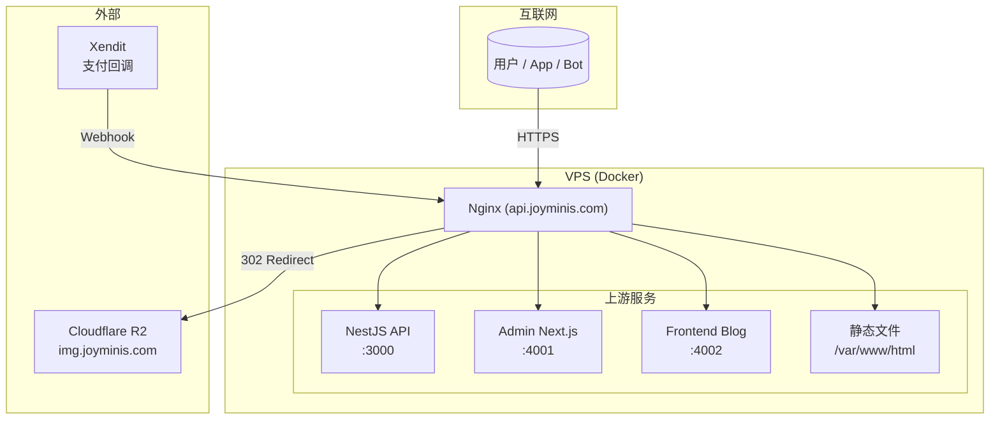
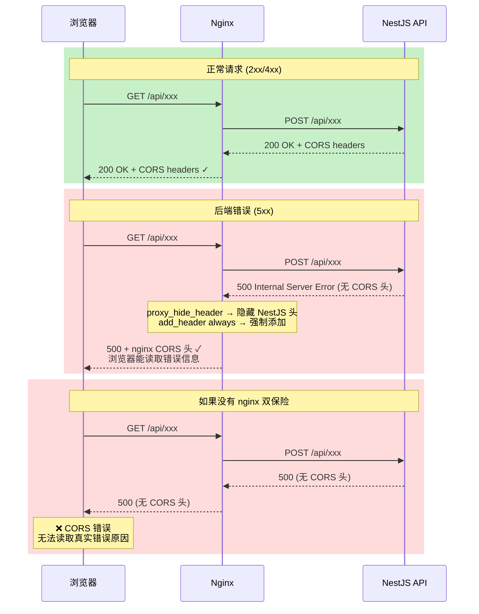

# Nginx API 网关：从开发多域名到生产级安全与性能的全面实践

## 1. 背景

在现代全栈应用中，Nginx 扮演着** API 网关**的核心角色——它不仅是反向代理，更是安全边界、流量控制器和请求路由枢纽。

本项目的架构由多个服务组成：

- **NestJS API** — 核心后端（`:3000`）
- **Admin Next.js** — 管理后台（`:4001`）
- **Frontend Blog** — 前端博客（`:4002`）
- **Flutter App** — 移动端直连 API

如果没有统一的网关层，每个服务都需要独立处理 SSL、CORS、限流、安全头等问题。Nginx 将这些横切关注点收敛到一层，让上游服务专注于业务逻辑。

本文基于项目中的两份核心配置——[`nginx/nginx.prod.conf`](nginx/nginx.prod.conf)（326 行）和 [`nginx/nginx.dev.conf`](nginx/nginx.dev.conf)（230 行）——深入解析从开发到生产的 nginx 实践。

## 2. 架构总览

下面是完整的请求流转拓扑：



**生产环境**——`api.joyminis.com`（单一域名，专注 API 代理）：
- 所有外部请求统一经过 `api.joyminis.com`
- nginx 根据路径分发到 NestJS、静态文件或重定向到 Cloudflare
- 前端服务（Admin / Blog）独立部署，不经过本 nginx

**开发环境**——5 个域名共享一个 server 块：
- `admin-dev.joyminis.com`、`dev-api.joyminis.com`、`dev.joyminis.com`、`blog-dev.joyminis.com`、`blog-admin-dev.joyminis.com`
- 根据 `$host` 头动态路由到不同前端服务

## 3. 开发环境配置（[`nginx.dev.conf`](nginx/nginx.dev.conf)）

### 3.1 多域名路由——`$host` map 模式

传统做法是为每个域名写一个独立的 `server` 块，但这样配置臃肿且难以维护。本项目用一个 **`map` 指令** 实现按 Host 分发：

```nginx
map $host $next_upstream {
    default                     http://admin-next:4001;
    blog-dev.joyminis.com       http://frontend-blog:4002;
    blog-admin-dev.joyminis.com http://admin-blog:4002;
}
```

```nginx
# location / 中直接使用 $next_upstream 作为 proxy_pass 目标
location / {
    proxy_pass $next_upstream;
    proxy_http_version 1.1;
    proxy_set_header Upgrade $http_upgrade;
    proxy_set_header Connection "upgrade";
    proxy_set_header Host $host;
    proxy_next_upstream error timeout http_502 http_503;
}
```

优势：
- **单个 server 块**服务 5 个域名，减少重复配置
- **`proxy_next_upstream`** 在 Next.js 返回 502/503 时自动切换上游，提升开发容错

### 3.2 Google OAuth 兼容——COOP/COEP 头

开发环境中，Google OAuth 弹窗需要特定安全头：

```nginx
add_header Cross-Origin-Opener-Policy "unsafe-none" always;
add_header Cross-Origin-Embedder-Policy "unsafe-none" always;
```

**为什么需要？**

Google OAuth 流程会打开一个弹窗窗口，该窗口与主页面之间通过 `postMessage()` 通信。默认情况下，`Cross-Origin-Opener-Policy: same-origin` 会阻止跨域窗口通信。设置为 `unsafe-none` 后，弹窗可以与主页面交换数据。

**为什么只在开发环境？**

生产环境中 OAuth 回调走 `/auth/` 后端代理（见 7.2 节），不需要前端直接处理 Google 弹窗。开发环境的前端（Next.js）直接处理 OAuth 回调，因此需要这两个头。

### 3.3 Next.js HMR 代理

Next.js 开发模式使用 WebSocket 实现 Hot Module Replacement（HMR）。nginx 必须正确转发 Upgrade 头：

```nginx
location ^~ /_next/ {
    add_header Cross-Origin-Opener-Policy "unsafe-none" always;
    add_header Cross-Origin-Embedder-Policy "unsafe-none" always;

    proxy_http_version 1.1;
    proxy_set_header Upgrade $http_upgrade;
    proxy_set_header Connection "upgrade";
    proxy_set_header Host $host;

    proxy_pass $next_upstream;
}
```

`/_next/` 路径不仅承载静态资源（JS/CSS），还包含 HMR 的 WebSocket 连接。`Upgrade` 和 `Connection` 头是 WebSocket 握手的关键。

### 3.4 媒体重定向——Cloudflare 图片域名

项目早期，图片通过 `api.joyminis.com/uploads/` 提供。迁移到独立图片域名（`img.joyminis.com`）后，开发环境的旧链接通过 302 重定向兼容：

```nginx
# /cdn-cgi/image/ 格式的图片链接重定向到 img.joyminis.com
location ~ "^/cdn-cgi/image/[^/]+/(uploads/.*)$" {
    add_header Access-Control-Allow-Origin "*" always;
    if ($is_options) { return 204; }
    return 302 https://img.joyminis.com/$1;
}

# /uploads/ 的直接链接重定向
location ^~ /uploads/ {
    add_header Access-Control-Allow-Origin "*" always;
    if ($is_options) { return 204; }
    return 302 https://img.joyminis.com$request_uri;
}
```

这种模式在迁移期间非常实用：前端代码无需修改，nginx 层面完成 URL 重写。

### 3.5 Docker 动态 DNS 解析

在 Docker Compose 环境中，服务名（如 `backend`）通过 Docker 内置 DNS 解析。但 nginx 在启动时只解析一次 `proxy_pass` 中的域名——如果使用字面域名，容器重启后 IP 变化会导致 502。

解决方案是**使用变量**：

```nginx
resolver 127.0.0.11 valid=5s ipv6=off;
set $backend_upstream http://backend:3000;
proxy_pass $backend_upstream;
```

原理：
- `resolver 127.0.0.11` 使用 Docker 内置 DNS
- `valid=5s` 缓存 5 秒后重新解析
- `set` 变量强制 nginx 在**每次请求**时重新解析

## 4. 生产环境配置（[`nginx.prod.conf`](nginx/nginx.prod.conf)）

### 4.1 SSL/TLS

```nginx
ssl_protocols TLSv1.2 TLSv1.3;
ssl_ciphers HIGH:!aNULL:!MD5;
ssl_prefer_server_ciphers on;
ssl_session_cache shared:SSL:2m;
ssl_session_timeout 10m;
```

- **仅启用 TLSv1.2 和 TLSv1.3**，弃用不安全的 TLSv1.0/TLSv1.1
- **密码套件**：`HIGH:!aNULL:!MD5`——使用高安全性套件，排除匿名认证和 MD5
- **会话缓存**：2MB 共享缓存 + 10 分钟超时，减少 SSL 握手开销

### 4.2 Gzip 压缩

```nginx
gzip on;
gzip_min_length 1k;
gzip_comp_level 5;
gzip_vary on;
gzip_proxied any;
gzip_types application/json application/javascript application/xml text/plain text/css text/javascript image/svg+xml;
```

- **压缩级别 5**：平衡 CPU 和压缩率（级别 1-9，6 是默认值，这里用 5 更保守）
- **1KB 阈值**：小于 1KB 的响应不压缩（压缩小文件收益甚微）
- **`gzip_vary on`**：添加 `Vary: Accept-Encoding` 头，告知 CDN 和浏览器根据编码协商缓存

### 4.3 限流——双区域策略

生产环境配置了两个限流区域，针对不同的 API 路径：

| 区域 | 速率 | Burst | 适用路径 | 原因 |
|------|------|-------|----------|------|
| `api_limit` | 20r/s | 50 | `/api/` 通用 | 管理后台 + App 高频请求 |
| `blog_public_limit` | 10r/s | 20 | 博客/客户端公开 API | 防爬虫，允许正常页面并发 |

```nginx
# 定义限流区域
limit_req_zone $binary_remote_addr zone=api_limit:10m rate=20r/s;
limit_req_zone $binary_remote_addr zone=blog_public_limit:10m rate=10r/s;

# 博客公开 API — 10r/s
location ~ ^/api/v1/(frontend/blog|client/system-config) {
    limit_req zone=blog_public_limit burst=20 nodelay;
}

# 通用 API — 20r/s
location /api/ {
    limit_req zone=api_limit burst=50 nodelay;
}
```

**为什么 Webhook 不限流？**

支付回调（`payment/webhook/xendit`）在 `C. 支付 Webhook` 段中单独处理，不经过限流 location。如果 Webhook 被限流，会导致充值/提现回调丢失，造成资金状态不一致。

```nginx
location ~ ^/api/(v1/)?payment/webhook/xendit {
    proxy_pass http://backend:3000;
    # 无 limit_req 指令——不限流
}
```

### 4.4 代理缓存——公开 API 缓存

对于博客公开 API（文章列表、系统配置等），nginx 层做了 1 分钟代理缓存：

```nginx
proxy_cache_path /var/cache/nginx/public_api levels=1:2 keys_zone=public_cache:10m max_size=1g inactive=60m use_temp_path=off;

location ~ ^/api/v1/(frontend/blog|client/system-config) {
    proxy_cache public_cache;
    proxy_cache_key "$scheme$proxy_host$uri$is_args$args$http_origin";
    proxy_cache_valid 200 301 302 304 60s;
    add_header Vary "Origin, Accept-Encoding" always;
    proxy_cache_use_stale error timeout updating http_500 http_502 http_503 http_504;
    proxy_cache_lock on;
    proxy_cache_lock_timeout 5s;
    add_header X-Cache-Status $upstream_cache_status;
}
```

关键点：
- **`$http_origin` 加入缓存键**：避免不同来源的请求收到错误 CORS 响应
- **`Vary: Origin, Accept-Encoding`**：通知下游（包括 Cloudflare）响应因来源和编码而异
- **`proxy_cache_use_stale`**：后端故障时提供过期缓存，提升可用性
- **`proxy_cache_lock`**：防止缓存未命中时多个并发请求同时回源
- **`X-Cache-Status`**：调试头，显示 `HIT`/`MISS`/`STALE`

## 5. Bot 与安全探针防御

### 5.1 444 静默丢弃策略

```nginx
location ~* /(\.env|\.git|\.htaccess|\.htpasswd|backup\.sql|dump\.sql|phpinfo\.php|wp-login\.php|wp-admin|\.DS_Store) {
    access_log off;
    return 444;
}
```

**444 是什么？**

444 是 nginx 的**非标准状态码**，含义是"关闭连接而不发送任何响应"。与 403（禁止）或 404（未找到）不同，444 不给客户端任何反馈。

**为什么 444 比 403 更有效？**

- **403**：告诉 bot "资源存在但你无权访问"——bot 知道目标存在，会尝试更多攻击路径
- **404**：告诉 bot "资源不存在"——但攻击脚本会记录"路径存在但返回 404"
- **444**：**什么都不返回**——bot 无法区分"目标不存在"和"连接被丢弃"，没有信息泄漏

当 bot 扫描 `.env`、`phpinfo.php`、`wp-admin` 等常见敏感路径时，nginx 直接切断 TCP 连接，没有任何 HTTP 响应。大多数扫描器会将此视为"目标不存在"并放弃。

## 6. CORS 双保险模式

这是生产配置中最值得关注的设计模式。

### 6.1 问题背景

NestJS 通过 `app.enableCors()` 配置 CORS。正常请求下，NestJS 返回正确的 `Access-Control-*` 头。但有一个边界情况：

> **后端报错（5xx/timeout）时，NestJS 错误处理管道可能不附加 CORS 头。**
>
> 浏览器收到无 CORS 头的 5xx 响应 → 解析为 CORS 错误 → 无法读取真实错误信息

### 6.2 nginx 层解决方案

```nginx
# 1. 隐藏 NestJS 的 CORS 头，避免重复
proxy_hide_header Access-Control-Allow-Origin;
proxy_hide_header Access-Control-Allow-Credentials;

# 2. nginx 无条件添加 CORS 头（无论后端返回什么）
add_header Access-Control-Allow-Origin  $http_origin always;
add_header Access-Control-Allow-Credentials "true" always;
```

**"双保险"** 的含义：
1. **`proxy_hide_header`**：隐藏 NestJS 的 CORS 头，消除重复头风险
2. **`add_header ... always`**：nginx 无条件添加 CORS 头，即使后端返回 5xx

`always` 参数确保 nginx 在所有响应码（包括 4xx/5xx）上都附加指定头。

### 6.3 为什么不能只靠 NestJS 的 CORS



### 6.4 `add_header` scoping 陷阱

这是 nginx 配置中最容易踩的坑之一。

**行为规则**：在 `if` 块内的 `add_header` **替换**（而非追加）父块的 `add_header` 指令。

```nginx
location /api/ {
    # 父块：CORS 头
    add_header Access-Control-Allow-Origin $http_origin always;
    add_header Access-Control-Allow-Credentials "true" always;

    if ($request_method = OPTIONS) {
        # ⚠️ if 块内的 add_header 会替换父块的！
        # 必须在此重新声明所有头
        add_header Access-Control-Allow-Origin  $http_origin always;
        add_header Access-Control-Allow-Credentials "true" always;
        add_header Access-Control-Allow-Methods "GET, POST, PUT, PATCH, DELETE, OPTIONS" always;
        add_header Access-Control-Allow-Headers "DNT,User-Agent,X-Requested-With,If-Modified-Since,Cache-Control,Content-Type,Range,Authorization,x-lang,x-csrf-token,x-xsrf-token,x-skip-auth-refresh" always;
        add_header Access-Control-Max-Age 1728000 always;
        add_header Content-Type "text/plain; charset=utf-8" always;
        add_header Content-Length 0 always;
        return 204;
    }

    # 如果 OPTIONS 没有重写所有头，浏览器收到的 CORS 响应头将不完整
}
```

> **经验法则**：在 `if` 块内使用 `add_header` 时，必须假设父块的头全部失效，并在 `if` 内完整声明所有需要的头。

## 7. 请求路由深度解析

### 7.1 路由匹配优先级

nginx 的 location 匹配遵循严格优先级：

1. **`=`** 精确匹配 > **`^~`** 前缀匹配 > **`~`/`~*`** 正则匹配 > 普通前缀匹配
2. 正则匹配按**配置顺序**（第一个匹配的生效）

本项目生产配置的匹配顺序（按优先级排列）：

| 优先级 | Location 模式 | 用途 | 限流 | 缓存 | 超时 | 特殊处理 |
|--------|---------------|------|------|------|------|----------|
| 1 | `~* /(\.env\|\.git\|...)` | Bot 安全拦截 | — | — | — | `return 444`；`access_log off` |
| 2 | `= /share.html` | 分享页面 | — | — | 默认 | 简单透传 |
| 3 | `^~ /.well-known/` | Android/iOS 应用关联文件 | — | — | — | 静态文件服务；CORS `*` |
| 4 | `~ ^/api/(v1/)?payment/webhook/xendit` | 支付回调 | **无** | — | 默认 | 不限流！ |
| 5 | `~ ^/api/v1/(frontend/blog\|client/system-config)` | 博客公开 API | 10r/s | 60s | 30s | `proxy_cache`；`Vary` 头 |
| 6 | `= /api/v1/admin/finance/adjust` | 财务调账 | — | — | 600s | 白名单 `include` + `deny all` |
| 7 | `~ ^/(docs\|swagger-ui\|api-json)` | Swagger 文档 | — | — | 默认 | 白名单 + `deny all` |
| 8 | `/api/` | 通用 API | 20r/s | — | 600s | CORS 双保险；上传超时 |
| 9 | `^~ /auth/` | OAuth 代理 | — | — | 600s | URI 重写 `/auth/` → `/api/v1/auth/` |
| 10 | `^~ /socket.io/` | WebSocket | — | — | 3600s | Upgrade 头；长超时 |

### 7.2 OAuth 代理——URI 重写

Google OAuth 回调的路径设计是一个典型问题。前端期望的回调 URL 是 `/auth/google/callback`，但 NestJS 的全局前缀是 `/api/v1`。

解决方案：nginx 层做 URI 重写：

```nginx
location ^~ /auth/ {
    # /auth/xxx → /api/v1/auth/xxx
    proxy_pass http://backend:3000/api/v1$request_uri;
    proxy_set_header X-Original-URI $request_uri;
}
```

`$request_uri` 保持原始请求的完整 URI（包括查询参数），确保 OAuth 回调的 `code` 和 `state` 参数不丢失。

### 7.3 静态文件服务——`.well-known/`

移动端深度链接（Deep Link）需要两个文件：
- **Android**: `.well-known/assetlinks.json`
- **iOS**: `.well-known/apple-app-site-association`

```nginx
location ^~ /.well-known/ {
    root /var/www/html;
    try_files $uri $uri/ =404;

    # 确保 JSON 内容类型正确
    if ($uri ~* "\.json$") {
        add_header Content-Type application/json always;
    }
    if ($uri ~* "apple-app-site-association$") {
        add_header Content-Type application/json always;
    }

    # Android/iOS 系统需要跨域读取
    add_header Access-Control-Allow-Origin "*" always;
    add_header Access-Control-Allow-Methods "GET, OPTIONS" always;
    add_header Cache-Control "public, max-age=3600";
}
```

`Access-Control-Allow-Origin: *` 是必须的——手机操作系统在验证 App Link 时会从浏览器上下文发起跨域请求。

## 8. 生产 vs 开发配置对比

| 维度 | 开发环境 | 生产环境 |
|------|----------|----------|
| **域名** | 5 个域名（`$host` map 分发） | 单一 `api.joyminis.com` |
| **SSL 证书** | 自签名通配符证书 | 正式证书 |
| **限流** | ❌ 无 | ✅ 双区域（20r/s + 10r/s） |
| **代理缓存** | ❌ 无 | ✅ 1 分钟公开 API 缓存 |
| **CORS 来源** | 固定 `blog-dev.joyminis.com` | 动态 `$http_origin` |
| **Body 限制** | 500M | 50M |
| **安全头** | COOP/COEP + 基本 CORS | 完整安全头 + Bot 444 拦截 |
| **前端代理** | ✅ Next.js HMR + WebSocket | ❌ 前端独立部署 |
| **媒体服务** | 302 → `img.joyminis.com` | 已下线（注释保留） |
| **Swagger** | 开放访问 | 白名单限制 |
| **DNS 解析** | Docker resolver + 变量 | 静态 `upstream` |
| **日志** | stdout/stderr | stdout/stderr（Docker） |

## 9. 部署与实践

### Docker Compose 集成

nginx 作为 Docker 服务运行：

```yaml
# compose.prod.yml
services:
  nginx:
    image: nginx:1.27-alpine
    container_name: lucky-nginx-prod
    ports:
      - "443:443"
      - "80:80"
    volumes:
      - ./nginx/nginx.prod.conf:/etc/nginx/conf.d/default.conf:ro
      - ./nginx/whitelist.conf:/etc/nginx/conf.d/whitelist.conf:ro
      - ./certs:/etc/nginx/certs:ro
      - ./public:/var/www/html:ro
    depends_on:
      - backend
```

### 配置检查与重载

```bash
# 语法检查
docker exec lucky-nginx-prod nginx -t

# 优雅重载（不中断连接）
docker exec lucky-nginx-prod nginx -s reload

# 查看日志
docker logs --tail=50 lucky-nginx-prod
```

## 10. 踩坑总结

### 10.1 CORS 头重复

**现象**：浏览器控制台报错 `Multiple Access-Control-Allow-Origin headers`。

**原因**：NestJS 的 `enableCors()` 在响应中添加 CORS 头，nginx 的 `add_header` 也添加同样的头。某些浏览器（如 iOS WebKit）会拒绝重复头。

**解决方案**：用 `proxy_hide_header` 隐藏后端 CORS 头，只用 nginx 层管理：

```nginx
proxy_hide_header Access-Control-Allow-Origin;
proxy_hide_header Access-Control-Allow-Credentials;
add_header Access-Control-Allow-Origin $http_origin always;
```

### 10.2 OPTIONS 请求丢失 CORS 头

**现象**：预检请求（OPTIONS）返回 204 但没有 `Access-Control-Allow-Origin` 头。

**原因**：nginx 的 `if` 块内 `add_header` 替换了父块的头（见 6.4 节）。

**解决方案**：在 `if` 块内完整声明所有需要的头。

### 10.3 Docker 容器 DNS 解析失败

**现象**：nginx 启动几分钟后，部分请求返回 502。

**原因**：`proxy_pass http://backend:3000` 中 `backend` 解析为容器 IP。Docker 容器重启后 IP 变化，nginx 使用缓存的旧 IP。

**解决方案**：使用变量强制每次请求重新解析：

```nginx
resolver 127.0.0.11 valid=5s;
set $backend_upstream http://backend:3000;
proxy_pass $backend_upstream;
```

### 10.4 代理缓存的 CORS 污染

**现象**：来源 A 的请求获取到来源 B 的 CORS 头，导致 CORS 错误。

**原因**：代理缓存的键不包括 `$http_origin`，所以不同 Origin 的请求命中同一条缓存。

**解决方案**：将 `$http_origin` 加入缓存键：

```nginx
proxy_cache_key "$scheme$proxy_host$uri$is_args$args$http_origin";
```

### 10.5 支付 Webhook 被限流

**现象**：用户充值成功但余额未更新，排查发现 nginx 返回 429。

**原因**：早期配置中 Webhook 路径 `/api/payment/webhook/xendit` 被通用 `/api/` location 匹配，受到限流规则影响。

**解决方案**：将 Webhook location 放在通用 API 之前，并**不添加** `limit_req`：

```nginx
# 先匹配 Webhook（正则，优先级高于普通前缀）
location ~ ^/api/(v1/)?payment/webhook/xendit {
    proxy_pass http://backend:3000;
    # 无 limit_req——不限流
}

# 通用 API（限流）
location /api/ {
    limit_req zone=api_limit burst=50 nodelay;
}
```

## 11. 总结

本文基于实际项目中的两份 nginx 配置文件，完整梳理了从开发到生产的 nginx 实践。核心要点：

1. **开发环境**：`$host` map 实现多域名路由、COOP/COEP 兼容 Google OAuth、Docker resolver 模式
2. **生产环境**：双区域限流、代理缓存、SSL/TLS 安全配置
3. **安全设计**：Bot 444 静默拦截、全量安全头、Swagger/调账白名单
4. **CORS 双保险**：`proxy_hide_header` + `add_header always`，确保即使后端报错也能返回 CORS 头
5. **`add_header` 陷阱**：`if` 块会替换父块的 `add_header`，必须在 `if` 内完整声明
6. **请求路由**：10 个 location 块按优先级覆盖所有业务场景

这些配置不是一次性写出来的，而是在迭代中不断演进的。每个配置背后都有一个真实的问题——CORS 重复头、Docker DNS 缓存失效、Webhook 被限流、缓存跨域污染——正是这些踩坑经验构成了配置的价值。

### 相关文章

- [Full-Stack Authentication：JWT 签发、OAuth 登录](/docs/blog/articles/admin-next/full-stack-authentication.md) — OAuth 流程中 nginx 扮演的角色
- [End-to-End Push Notification](/docs/blog/articles/admin-next/end-to-end-push-notification.md) — WebSocket 代理应用
- [Full-Stack File Upload](/docs/blog/articles/admin-next/full-stack-file-upload.md) — 上传超时与 Body 限制
- [Production Operations Guide](/docs/blog/operations/ONLINE_OPERATIONS.md) — nginx 运维命令
