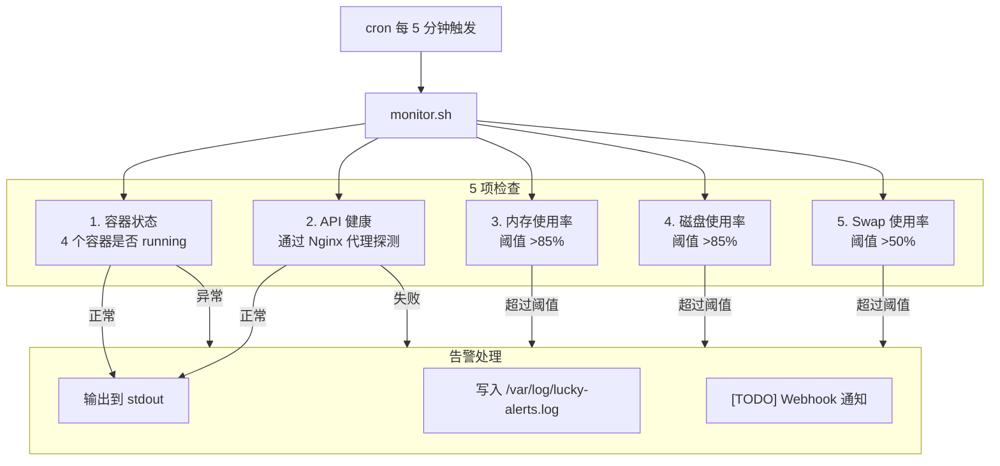

# 生产环境轻量级监控告警系统——85 行 Shell 脚本的 5 分钟守护

## 1. 背景

生产环境最怕的不是出问题，而是**出了问题没人知道**。

在 1GB 内存 VPS 上运行 Docker 容器栈（backend + PostgreSQL + Redis + Nginx），资源瓶颈是常态。需要一个轻量级的监控方案，满足以下条件：

| 要求 | 说明 |
|------|------|
| 🪶 **零额外依赖** | 不引入 Prometheus/Grafana 等重型系统 |
| ⏱ **高频检查** | 每 5 分钟覆盖一次核心指标 |
| 🚨 **即时告警** | 发现问题立即落日志，为后续通知做准备 |
| 🛡 **容错设计** | 单项检查失败不影响其他检查项 |

监控脚本 [`deploy/monitor.sh`](deploy/monitor.sh)（85 行）就是为此而生的——轻量、无依赖、5 分钟周期、5 项检查。

> 配套阅读：[VPS 服务器初始化与安全加固](vps-server-initialization-hardening.md) —— 了解被监控的服务器环境是如何初始化的。

## 2. 架构总览



关键设计：五项检查**顺序执行**，但使用 `set -uo pipefail`（没有 `-e`），使得单次检查失败不会终止整个脚本。所有检查完成后统一输出结果。

## 3. 容器状态检查

```bash
for container in lucky-backend-prod lucky-db-prod lucky-redis-prod lucky-nginx-prod; do
    STATUS=$(docker inspect --format='{{.State.Status}}' "$container" 2>/dev/null || echo "not_found")
    if [ "$STATUS" != "running" ]; then
        alert "$container 状态异常: $STATUS"
    fi
done
```

### 3.1 排查的四个容器

| 容器名 | 角色 | 异常影响 |
|--------|------|---------|
| `lucky-backend-prod` | NestJS API 服务 | 所有 API 请求失败 |
| `lucky-db-prod` | PostgreSQL 数据库 | 数据读写完全中断 |
| `lucky-redis-prod` | Redis 缓存 | 会话/缓存失效，性能降级 |
| `lucky-nginx-prod` | Nginx 反向代理 | 所有外部请求不可达 |

### 3.2 为什么用 `docker inspect` 而非 `docker ps`

| 方式 | 优点 | 缺点 |
|------|------|------|
| `docker inspect --format` | 精确获取 `.State.Status` 字段 | 容器不存在时报错 |
| `docker ps --filter` | 只显示 running 容器 | 无法区分 exited/created/paused |

脚本使用 `2>/dev/null || echo "not_found"` 处理容器不存在的情况——如果 `docker inspect` 失败（容器被删除），`STATUS` 会被设为 `not_found`，触发告警。

## 4. API 健康检查

```bash
HTTP_CODE=$(docker exec lucky-nginx-prod wget -qO- --timeout=5 \
    http://lucky-backend-prod:3000/api/v1/health 2>/dev/null && echo "200" || echo "FAIL")
if [ "$HTTP_CODE" = "FAIL" ]; then
    alert "API 健康检查失败"
fi
```

### 4.1 为什么通过 Nginx 容器发起请求

这里没有从宿主机直接 curl 外部地址，而是使用了**两层间接**：

```
宿主机 → docker exec lucky-nginx-prod → http://lucky-backend-prod:3000
```

好处：
1. **利用 Docker 内部网络**：Nginx 容器和 backend 容器在同一个 Docker 网络（`lucky-network`），可以直接通过容器名访问
2. **验证 Nginx 到 backend 的连通性**：如果 Nginx 无法代理到 backend，即使外部 curl 成功，实际流量也会失败
3. **绕过防火墙**：不依赖宿主机到容器的端口暴露

### 4.2 健康端点设计

```bash
curl https://api.joyminis.com/api/v1/health
# 预期响应：{"code":10000,"message":"success","data":{"ok":true}}
```

后端 NestJS 的健康端点返回 `{"ok": true}`，这是一个**浅层健康检查**——只验证应用进程是否在运行并能响应 HTTP 请求。更深层的健康检查（数据库连接、Redis 连通性）属于**就绪探针（readiness probe）**的范畴，由 Docker Compose 的 `healthcheck` 配置负责。

## 5. 系统资源阈值检查

### 5.1 内存使用率

```bash
MEM_TOTAL=$(free | awk '/^Mem:/{print $2}')
MEM_USED=$(free | awk '/^Mem:/{print $3}')
MEM_PERCENT=$((MEM_USED * 100 / MEM_TOTAL))
if [ "$MEM_PERCENT" -gt 85 ]; then
    alert "内存使用率过高: ${MEM_PERCENT}%"
fi
```

使用 `free` 命令而非 `docker stats`，因为我们需要的是**宿主机级别的内存**，而非单个容器的内存。在 1GB VPS 上，内存是最紧缺的资源：

| 服务 | 内存限制 | 说明 |
|------|---------|------|
| backend | 2GB (unlimited) | 但 VPS 只有 1GB |
| PostgreSQL | 2GB | shared_buffers=256MB |
| Redis | 512MB | 通常只用几十 MB |
| Nginx | 64MB | 极轻量 |
| **合计** | **~810MB + 2GB Swap** | 85% 阈值 = 850MB |

当内存 >85%（约 850MB），意味着可用内存不足 150MB，系统开始大量使用 Swap，性能显著下降。

### 5.2 磁盘使用率

```bash
DISK_PERCENT=$(df / | awk 'NR==2{gsub(/%/,""); print $5}')
if [ "$DISK_PERCENT" -gt 85 ]; then
    alert "磁盘使用率过高: ${DISK_PERCENT}%"
fi
```

磁盘达到 85% 的常见原因及处理：

| 原因 | 排查 | 解决 |
|------|------|------|
| 数据库备份堆积 | `ls -lh /opt/lucky/backups/` | 确认 `backup.sh` 的 `KEEP_DAYS=30` 生效 |
| Docker 日志膨胀 | `docker system df` | 配置 `compose.prod.yml` 的 `logging.max-size: 10m` |
| 容器镜像缓存 | `docker images` | `docker image prune -a` |

### 5.3 Swap 使用率

```bash
SWAP_USED=$(free | awk '/^Swap:/{print $3}')
SWAP_TOTAL=$(free | awk '/^Swap:/{print $2}')
if [ "$SWAP_TOTAL" -gt 0 ]; then
    SWAP_PERCENT=$((SWAP_USED * 100 / SWAP_TOTAL))
    if [ "$SWAP_PERCENT" -gt 50 ]; then
        alert "Swap 使用率偏高: ${SWAP_PERCENT}% — 内存使用偏高，建议排查"
    fi
fi
```

注意 Swap 检查前先判断 `SWAP_TOTAL -gt 0`——如果系统没有配置 Swap（虽然 [`server-init.sh`](vps-server-initialization-hardening.md) 默认配置了 2GB Swap），跳过此项检查以避免除零错误。

Swap 使用率 >50% 通常意味着物理内存已耗尽。配合 `vm.swappiness=10`（[server-init.sh](vps-server-initialization-hardening.md) 中的内核参数优化），系统会尽量减少 Swap 使用。如果 Swap 使用率超过 50%，说明内存压力已经到了比较严重的程度。

## 6. 告警处理机制

### 6.1 alert() 函数

```bash
ALERT=false
MESSAGES=""

alert() {
    ALERT=true
    MESSAGES="${MESSAGES}\n⚠️  $1"
    echo "[$(date)] ALERT: $1" >> "$ALERT_LOG"
}
```

`alert()` 函数做了三件事：
1. 设置 `ALERT=true` 标记
2. 累加 `MESSAGES` 字符串（所有告警合并输出）
3. 写入告警日志文件（带时间戳）

### 6.2 最终输出

```bash
if [ "$ALERT" = true ]; then
    echo "========================================"
    echo "[$(date)] ❌ 发现问题:"
    echo -e "$MESSAGES"
    echo "========================================"
else
    echo "[$(date)]  ✅ 所有服务正常 | MEM: ${MEM_PERCENT}% | DISK: ${DISK_PERCENT}%"
fi
```

正常时一行输出，异常时多行报告。所有输出通过 cron 重定向到 `/var/log/lucky-monitor.log`。

### 6.3 查看告警

```bash
# 查看所有历史告警
ssh lucky 'tail -50 /var/log/lucky-alerts.log'

# 查看最近监控日志
ssh lucky 'tail -20 /var/log/lucky-monitor.log'

# 持续监控
ssh lucky 'tail -f /var/log/lucky-monitor.log'
```

### 6.4 Webhook 扩展（TODO）

脚本中预留了 webhook 通知接口：

```bash
# TODO: 可在此处添加 webhook 通知
# curl -s -X POST "https://hooks.slack.com/..." -d "{\"text\": \"$MESSAGES\"}"
```

未来可以接入：

| 通知渠道 | 集成方式 | 复杂度 |
|---------|---------|--------|
| Telegram Bot | `curl -X POST "https://api.telegram.org/bot${TOKEN}/sendMessage"` | ⭐ 低 |
| Slack Webhook | 官方 Incoming Webhook URL | ⭐ 低 |
| 邮件 (mailutils) | `echo "$MESSAGES" | mail -s "Alert" admin@example.com` | ⭐⭐ 中 |
| 企业微信/钉钉 | 机器人 Webhook | ⭐ 低 |

## 7. Cron 自动化

### 7.1 安装方式

```bash
# 一次性安装（追加到现有 crontab）
ssh lucky '(crontab -l 2>/dev/null; echo "*/5 * * * * /opt/lucky/deploy/monitor.sh >> /var/log/lucky-monitor.log 2>&1") | crontab -'
```

### 7.2 Cron 字段解析

| 字段 | 值 | 含义 |
|------|----|------|
| 分钟 | `*/5` | 每 5 分钟执行一次 |
| 小时 | `*` | 每小时 |
| 日 | `*` | 每天 |
| 月 | `*` | 每月 |
| 星期 | `*` | 每天 |

### 7.3 为什么是 5 分钟？

| 周期 | 优点 | 缺点 |
|------|------|------|
| 1 分钟 | 发现问题最快 | 日志冗余，cron 负载高 |
| **5 分钟（当前）** | **平衡告警及时性和日志量** | **发现问题的延迟在可接受范围** |
| 10 分钟 | 日志量少 | 如果容器崩溃，用户可能比你先发现问题 |

在 1GB VPS 上，5 分钟的检查周期足够短以捕获异常，又不会对系统造成可见负载（脚本本身只占用几毫秒的 CPU 时间）。

### 7.4 Logrotate 配置

cron 输出写入 `/var/log/lucky-monitor.log` 且不做轮转切割。建议配置 logrotate：

```bash
# /etc/logrotate.d/lucky-monitor
/var/log/lucky-monitor.log
/var/log/lucky-alerts.log {
    weekly
    rotate 4
    compress
    missingok
    notifempty
}
```

## 8. 设计决策

### 8.1 为什么不用 `set -e`

```bash
set -uo pipefail  # 注意：没有 -e
```

这是故意的。`set -e` 会让脚本在任意命令失败时立即退出。在监控场景中，我们希望：

- 容器检查失败 → 记录告警 → 继续检查其他项
- API 健康检查失败 → 记录告警 → 继续检查资源

如果加入 `set -e`，`docker inspect` 返回非零退出码会导致脚本立即终止，剩余检查项全部跳过。这不是我们想要的。

**但代价是什么？** 脚本中的拼写错误或命令不存在不会自动停止。这就是为什么脚本保持极简（85 行），减少出错的可能。

### 8.2 为什么不做自动恢复

监控脚本只负责**发现和报告**问题，不自动修复。这是有意为之：

1. **避免级联故障**：自动重启一个容器可能掩盖更严重的底层问题（如磁盘 IO 瓶颈）
2. **保证人工介入**：告警需要运维人员确认并分析根因
3. **幂等性风险**：在复杂故障中，自动恢复可能导致数据损坏（例如数据库崩溃时自动重启加重损坏）

如果需要自动恢复，建议：
```bash
# 在 Docker Compose 层面配置 restart: always
# compose.prod.yml 中已配置
restart: always
```

这保证了容器崩溃后 Docker 守护进程会自动重启，无需脚本干预。

### 8.3 为什么不用 Prometheus + Grafana

| 方案 | 内存占用 | 部署复杂度 | 适合场景 |
|------|---------|-----------|---------|
| ✅ **当前 Shell + cron** | ~0MB（无常驻进程） | 极低 | 1GB VPS，单机部署 |
| ❌ Prometheus + Grafana | ~300MB+ | 高 | 多服务器，需要历史趋势图 |
| ❌ Netdata | ~100MB | 中 | 需要实时指标面板 |
| ❌ Datadog Agent | ~200MB | 中 | 有预算的团队 |

在 1GB VPS 上，任何额外的常驻监控进程都是不可接受的。85 行的 Shell 脚本 + cron 是性价比最高的方案。

## 9. 常见问题排查

### 9.1 告警日志为空

```bash
# 检查 cron 是否运行
ssh lucky 'crontab -l'
# 预期输出：*/5 * * * * /opt/lucky/deploy/monitor.sh >> /var/log/lucky-monitor.log 2>&1

# 检查脚本权限
ssh lucky 'ls -l /opt/lucky/deploy/monitor.sh'
# 预期：-rwxr-xr-x

# 手动执行测试
ssh lucky 'bash /opt/lucky/deploy/monitor.sh'
```

### 9.2 容器状态误报

```
ALERT: lucky-db-prod 状态异常: not_found
```

可能原因：
1. 容器命名不匹配（检查 `docker ps --format '{{.Names}}'`）
2. 容器正在重启（`docker inspect` 返回 `restarting` 状态）
3. `compose.prod.yml` 中的 `container_name` 已更改

### 9.3 磁盘告警频繁

```
ALERT: 磁盘使用率过高: 92%
```

排查步骤：
```bash
# 查看大目录
ssh lucky 'du -sh /opt/lucky/*'

# 查看 Docker 磁盘占用
ssh lucky 'docker system df'

# 查看备份目录大小
ssh lucky 'du -sh /opt/lucky/backups/'

# 清理旧 Docker 镜像
ssh lucky 'docker image prune -a -f'
```

### 9.4 内存告警频繁

```
ALERT: 内存使用率过高: 91%
```

在 1GB VPS 上，如果持续超过 85%：

```bash
# 查看容器内存占用
ssh lucky 'docker stats --no-stream'

# 查看 PostgreSQL 内存分配
ssh lucky 'docker exec lucky-db-prod psql -U postgres -c "SHOW shared_buffers;"'

# 检查是否有异常进程
ssh lucky 'ps aux --sort=-%mem | head -10'
```

## 10. 与备份脚本的协同

[`deploy/backup.sh`](deploy/backup.sh) 是另一个 cron 脚本（每天凌晨 3 点），两者互补：

| 脚本 | 周期 | 职责 |
|------|------|------|
| `monitor.sh` | 每 5 分钟 | 检查**当前**是否健康 |
| `backup.sh` | 每天 03:00 | 确保**过去的数据**可恢复 |

监控发现磁盘 >85% → 排查发现备份未清理 → 修复 backup.sh 的 `KEEP_DAYS` 参数。这是一个典型的**监控驱动运维**场景。

## 11. 总结

85 行 Shell 脚本 + 一行 cron 配置，构成了生产环境的**轻量级监控系统**：

- **4 个容器**状态检查（backend / db / redis / nginx）
- **API 健康**探测（通过 Nginx 内部网络）
- **3 项资源阈值**（内存 >85%、磁盘 >85%、Swap >50%）
- **1 个告警日志**（`/var/log/lucky-alerts.log`）
- **预留 Webhook 接口**（可扩展 Telegram/Slack 通知）

在 1GB VPS 上，这是性价比最高的监控方案——零额外内存开销、零部署成本、5 分钟告警延迟。配合 Docker 的 `restart: always` 自动恢复机制，构成了生产环境最基本的**可观测性**保障。
