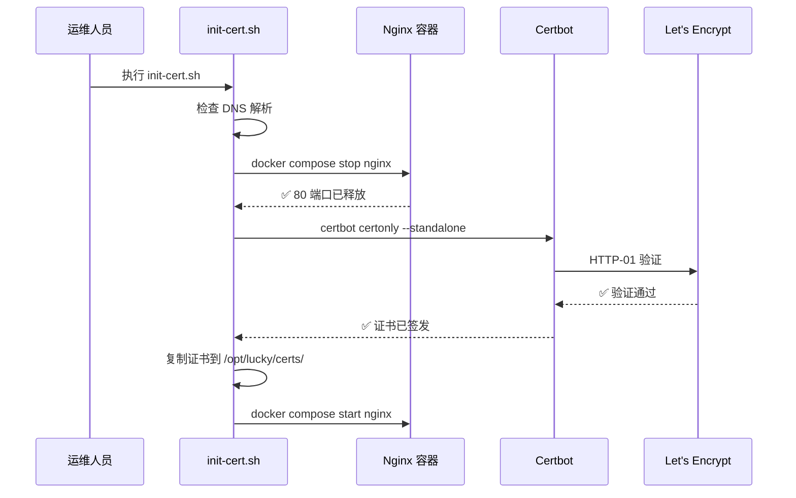
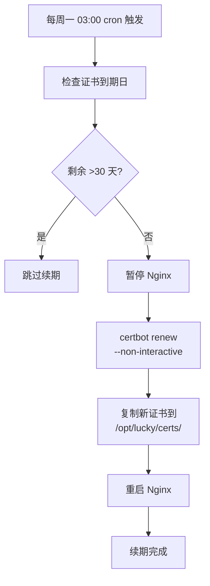

# SSL 证书全自动化——Let's Encrypt 首次申请与定时续期的 Shell 脚本实践

## 1. 背景

SSL/TLS 证书是现代 Web 服务的基石。Let's Encrypt 提供的免费证书虽然有 **90 天有效期**，但自动化续期机制使得这个限制不再是问题——前提是你的自动化流程足够健壮。

本项目使用两个脚本处理 SSL 证书的全生命周期：

| 脚本 | 用途 | 执行位置 | 执行频率 |
|------|------|---------|---------|
| [`deploy/init-cert.sh`](deploy/init-cert.sh)（107 行） | **首次申请**证书 | VPS | 一次性（新服务器部署时） |
| [`deploy/renew-cert.sh`](deploy/renew-cert.sh)（76 行） | **定时续期**证书 | VPS | 每周一 03:00 cron |

它们与 [VPS 初始化脚本](vps-server-initialization-hardening.md)中的 Certbot 安装步骤衔接——初始化时安装 certbot，部署时申请证书，之后 cron 自动续期。

> 前置阅读：[VPS 服务器初始化与安全加固](vps-server-initialization-hardening.md) §3.7——了解 certbot 的安装时机。

## 2. 首次申请（init-cert.sh）

### 2.1 前置条件检查

证书申请前必须确认两个条件：

```bash
DOMAIN="api.joyminis.com"

# 条件 1：DNS A 记录已指向本服务器
if command -v dig &>/dev/null; then
    RESOLVED_IP=$(dig +short "$DOMAIN" @1.1.1.1 | tail -1)
fi
SERVER_IP=$(curl -4 -fsSL https://api.ipify.org)

# 条件 2：DNS 解析结果 === 本机 IP
if [ "$RESOLVED_IP" != "$SERVER_IP" ]; then
    echo "❌ DNS 未指向本机！"
    exit 1
fi
```

**为什么必须检查 DNS？** Let's Encrypt 的 HTTP-01 验证会从公网访问 `http://DOMAIN/.well-known/acme-challenge/`。如果 DNS 尚未指向本服务器，验证请求会到达错误的服务器，导致申请失败。

DNS 检查使用三层回退机制：
1. **dig**（来自 dnsutils 包）→ 最快的 DNS 查询工具
2. **nslookup** → 更广泛可用的 DNS 工具
3. **python3** → 兜底方案，使用系统内置 Python 解析

本机 IP 通过 `api.ipify.org` 获取，这是一个可靠的 IP 回显服务。

### 2.2 临时释放 80 端口



为什么需要 **standalone 模式**？因为 Nginx 容器已经在监听 80 端口，certbot 的 `--standalone` 模式也需要监听 80 端口来响应 ACME 挑战。两者冲突，所以需要临时停止 Nginx：

```bash
if docker ps --format '{{.Names}}' | grep -q "lucky-nginx-prod"; then
    docker compose -f "$COMPOSE_FILE" --env-file "$ENV_FILE" stop nginx
    NGINX_WAS_RUNNING=true
fi
```

`NGINX_WAS_RUNNING` 标记确保只在 Nginx 原本运行的情况下才重新启动它。

### 2.3 证书申请

```bash
certbot certonly \
    --standalone \
    --non-interactive \
    --agree-tos \
    -m "$EMAIL" \
    -d "$DOMAIN"
```

参数说明：
| 参数 | 作用 |
|------|------|
| `certonly` | 仅获取证书，不修改 Web 服务器配置 |
| `--standalone` | 使用内置 Web 服务器响应 ACME 挑战 |
| `--non-interactive` | 非交互模式（脚本自动化必需） |
| `--agree-tos` | 同意 Let's Encrypt 服务条款 |
| `-m` | 注册邮箱（用于到期提醒 + 紧急联系） |

### 2.4 证书分发

申请完成后，证书被复制到项目目录：

```bash
mkdir -p /opt/lucky/certs
cp /etc/letsencrypt/live/api.joyminis.com/fullchain.pem /opt/lucky/certs/server.crt
cp /etc/letsencrypt/live/api.joyminis.com/privkey.pem   /opt/lucky/certs/server.key
chmod 644 /opt/lucky/certs/server.crt
chmod 600 /opt/lucky/certs/server.key
```

**为什么从 Let's Encrypt 目录复制到项目目录？**

| 路径 | 用途 | 特点 |
|------|------|------|
| `/etc/letsencrypt/live/` | certbot 源目录 | certbot 自动管理，符号链接指向最新版本 |
| `/opt/lucky/certs/` | 项目使用目录 | Nginx 挂载此目录，与 certbot 解耦 |

这样设计的好处是：Nginx 容器通过 `volumes: - ./certs:/etc/nginx/certs` 直接挂载项目目录，与 certbot 的目录结构解耦。续期脚本只需更新项目目录，Nginx 自动加载新证书。

### 2.5 申请完成验证

```bash
echo "到期日: $(openssl x509 -enddate -noout -in /opt/lucky/certs/server.crt | cut -d= -f2)"
# 输出示例: 到期日: Aug  6 03:00:00 2026 GMT
```

使用 `openssl` 直接从证书文件解析到期日期，无需调用 certbot API。

## 3. 自动续期（renew-cert.sh）

### 3.1 智能跳过机制

```bash
EXPIRY=$(openssl x509 -enddate -noout -in "$LE_CERT_DIR/fullchain.pem" | cut -d= -f2)
EXPIRY_EPOCH=$(date -d "$EXPIRY" +%s)
NOW_EPOCH=$(date +%s)
DAYS_LEFT=$(( (EXPIRY_EPOCH - NOW_EPOCH) / 86400 ))

if [ "$DAYS_LEFT" -gt 30 ]; then
    echo "证书有效期充足, 无需续期"
    exit 0
fi
```

**为什么阈值设为 30 天？**

| 阶段 | 剩余天数 | 动作 |
|------|---------|------|
| 🟢 安全期 | >30 天 | 跳过续期 |
| 🟡 续期窗口 | 10-30 天 | 执行续期 |
| 🔴 紧急期 | <10 天 | 必须立即续期 |

30 天的提前量给了充足的容错时间。即使 cron 因故停摆两周，证书仍有一半以上的有效期。

### 3.2 续期流程



续期流程与首次申请类似，但使用 `certbot renew` 而非 `certbot certonly`：

```bash
certbot renew --non-interactive
```

`certbot renew` 会自动检查所有由本机 certbot 管理的证书，对即将到期的证书执行续期。无需指定域名和邮箱——certbot 会从 `/etc/letsencrypt/renewal/` 配置中读取这些信息。

### 3.3 续期后的证书分发

```bash
cp /etc/letsencrypt/live/$DOMAIN/fullchain.pem /opt/lucky/certs/server.crt
cp /etc/letsencrypt/live/$DOMAIN/privkey.pem   /opt/lucky/certs/server.key
```

注意：这里使用的是 `live` 目录，而非特定版本目录。`/etc/letsencrypt/live/` 下的文件实际上是符号链接，指向 `/etc/letsencrypt/archive/` 下的特定版本文件。certbot `renew` 后会自动更新这些符号链接。因此我们的复制命令始终获取的是最新版本。

## 4. 安装 cron 自动续期

### 4.1 一次性安装

```bash
ssh lucky "(crontab -l 2>/dev/null; echo '0 3 * * 1 /opt/lucky/deploy/renew-cert.sh >> /var/log/lucky-cert.log 2>&1') | crontab -"
```

| 字段 | 值 | 含义 |
|------|----|------|
| 分钟 | `0` | 每小时的第 0 分钟 |
| 小时 | `3` | 凌晨 3 点 |
| 日 | `*` | 每天 |
| 月 | `*` | 每月 |
| 星期 | `1` | 周一 |

**为什么选周一凌晨 3 点？**
- **凌晨 3 点**：业务低峰期，即使短期停机影响也最小
- **周一**：周末有运维人员值班，如果续期失败可以在周一工作时间内处理
- **每周而非每天**：减少不必要的 certbot 调用，降低 Let's Encrypt 服务器负载

### 4.2 日志监控

```bash
# 查看最近一次续期日志
ssh lucky 'tail -20 /var/log/lucky-cert.log'

# 持续监控续期日志
ssh lucky 'tail -f /var/log/lucky-cert.log'
```

所有续期输出写入 `/var/log/lucky-cert.log`，便于排查问题。

## 5. 证书路径与权限

| 文件 | 路径 | 权限 | 说明 |
|------|------|------|------|
| 证书文件 | `/opt/lucky/certs/server.crt` | 644 | Nginx 只读 |
| 私钥 | `/opt/lucky/certs/server.key` | 600 | 仅 root 可读 |
| Let's Encrypt 源 | `/etc/letsencrypt/live/api.joyminis.com/` | - | certbot 管理 |
| Nginx 挂载 | compose.prod.yml `- ./certs:/etc/nginx/certs` | - | 容器内路径 `/etc/nginx/certs/` |

**权限安全**：
- `server.crt` 为 644（所有用户可读），因为证书是公开信息
- `server.key` 为 600（仅 root 可读），私钥泄露意味着 HTTPS 加密可被中间人攻击

## 6. 常见问题排查

### 6.1 DNS 解析不一致

```
❌ DNS 未解析，请先在 Cloudflare 把 api.joyminis.com A 记录指向本服务器
```

**排查步骤**：
```bash
# 检查当前 DNS 解析
dig api.joyminis.com +short @1.1.1.1

# 检查 Cloudflare Dashboard 中的 A 记录值
# 确保是灰云（仅 DNS，非代理模式）

# 等待 DNS 传播（通常 1-5 分钟，最长 60 分钟）
```

### 6.2 certbot 验证失败

```
certbot 申请失败：urn:ietf:params:acme:error:connection
```

**常见原因**：
1. 80 端口仍被占用（Nginx 未完全停止）
2. VPS 防火墙未开放 80 端口
3. Cloudflare 代理模式（橙云）干扰 ACME 挑战

**解决**：
```bash
# 检查 80 端口占用
ss -lntup | grep :80

# 确认 UFW 已开放 80
ufw status verbose

# Cloudflare 必须设置为灰云（仅 DNS）
# 橙云代理会返回 Cloudflare 的 IP，而非 VPS IP
```

### 6.3 续期失败

```
证书到期，但 certbot renew 失败
```

**紧急手动处理**：
```bash
# 1. 检查 certbot 状态
certbot certificates

# 2. 强制续期
certbot renew --force-renewal

# 3. 手动复制证书
cp /etc/letsencrypt/live/api.joyminis.com/fullchain.pem /opt/lucky/certs/server.crt
cp /etc/letsencrypt/live/api.joyminis.com/privkey.pem /opt/lucky/certs/server.key

# 4. 重启 Nginx
docker compose -f /opt/lucky/compose.prod.yml restart nginx
```

### 6.4 Nginx 未自动加载新证书

Nginx 不会自动重新加载证书文件，需要发送 `reload` 信号：
```bash
docker exec lucky-nginx-prod nginx -s reload
```

`renew-cert.sh` 通过 `docker compose start nginx`（重启整个容器）来规避这个问题。

## 7. 设计决策

### 7.1 为什么不用 Nginx certbot 插件？

`certbot --nginx` 插件可以自动修改 Nginx 配置，但我们选择 `--standalone` 模式，原因：

1. **容器化环境**：Nginx 运行在 Docker 容器中，certbot 在宿主机上，插件无法直接修改容器内的配置
2. **配置版本管理**：Nginx 配置在 Git 中管理，自动修改会破坏版本一致性
3. **脚本透明性**：`--standalone` 模式的流程清晰：停止 Nginx → 申请 → 复制 → 启动

### 7.2 为什么复制证书而非挂载 Let's Encrypt 目录？

两种方案对比：

| 方案 | 优点 | 缺点 |
|------|------|------|
| 复制到项目目录（当前方案） | 与 certbot 解耦，目录结构清晰 | 续期后多一次复制操作 |
| 直接挂载 Let's Encrypt 目录 | 无需复制步骤 | 依赖 certbot 目录结构，权限管理复杂 |

当前方案虽然多了一次复制，但胜在**简单、可预测、与 Docker 卷挂载模式匹配**。

## 8. 总结

SSL 证书自动化是生产环境不可或缺的一环。两个脚本加起来不到 200 行，却完整覆盖了证书的全生命周期：

- **`init-cert.sh`**：DNS 验证 → 临时停 Nginx → certbot 申请 → 复制证书 → 重启 Nginx
- **`renew-cert.sh`**：到期检查 → 有条件续期 → 复制新证书 → 重启 Nginx
- **cron**：每周一 03:00 自动触发续期检查

这套机制结合 Let's Encrypt 的 90 天有效期，理论上可以实现**证书永不过期**的自动运维。
