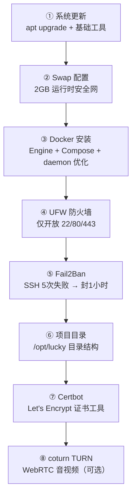
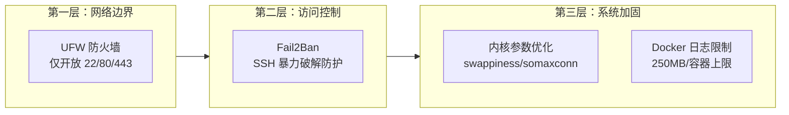

# VPS 服务器初始化与安全加固——从裸机到生产就绪的一键脚本实践

## 1. 背景

当我们从云服务商拿到一台全新的 Ubuntu 22.04 VPS 时，它是一台**裸机**——没有 Docker、没有防火墙、没有 Swap、没有任何安全防护。如果直接开始部署应用，会在后续运维中不断踩坑。

本文分析的 [`deploy/server-init.sh`](deploy/server-init.sh)（233 行）是一个生产级一键初始化脚本，它将新服务器的 8 个必要步骤整合为一个可重复执行的流程。它与 [部署管道全流程脚本](deployment-pipeline-full-process.md) 形成完整的前后衔接——初始化 → 部署。

> 前置阅读：[部署管道全流程](deployment-pipeline-full-process.md)——了解初始化完成后如何部署应用。

## 2. 初始化流程图



8 个步骤严格按依赖顺序执行。第 8 步 coturn 是**可选的**——只有在设置了 `TURN_SECRET` 环境变量时才会安装。

## 3. 各步骤详解

### 3.1 系统更新与基础工具

```bash
apt-get update -y && apt-get upgrade -y
apt-get install -y curl wget git htop nano unzip fail2ban
```

这是最基础但最关键的一步。新 VPS 的镜像可能滞后数月，包含已知安全漏洞。`apt upgrade` 确保所有系统包处于最新版本。

安装的工具包：
| 工具 | 用途 |
|------|------|
| `curl` / `wget` | HTTP 请求与文件下载 |
| `git` | 代码管理（虽然生产环境不直接拉代码） |
| `htop` | 交互式资源监控 |
| `nano` | 应急文本编辑器 |
| `unzip` | 解压工具 |
| `fail2ban` | SSH 防暴力破解（后续步骤详细配置） |

### 3.2 Swap 配置——运行时安全网

```bash
fallocate -l 2G /swapfile
chmod 600 /swapfile
mkswap /swapfile
swapon /swapfile
echo '/swapfile none swap sw 0 0' >> /etc/fstab
```

**为什么要 2GB Swap？** 对于 8GB RAM 的 VPS，Swap 不是用来替代内存的，而是作为**紧急兜底机制**。当以下场景发生时，Swap 可以防止进程直接被 OOM Killer 杀死：

- **Node.js 构建过程**：`turbo build` 或 `yarn install` 可能瞬时消耗 3-4GB 内存
- **PostgreSQL 查询峰值**：复杂 JOIN 或排序操作可能超出 `work_mem` 限制
- **多个容器同时启动**：Docker 容器启动时需要分配内存

同时设置内核参数优化 Swap 行为：

```bash
vm.swappiness=10          # 尽量少用 Swap，保持内存优先
vm.overcommit_memory=1    # Redis AOF rewrite 需要
net.core.somaxconn=1024   # 8 核高并发
net.ipv4.tcp_fin_timeout=30  # 更快回收 TIME_WAIT
fs.file-max=131072        # 文件描述符上限
```

`vm.swappiness=10` 是关键配置。默认值 60 意味着内核在内存使用达到 40% 时就开始换出页面。对于服务器工作负载，设置为 10 可以让内核仅在内存极度紧张时才使用 Swap。

### 3.3 Docker 安装与 daemon 优化

```bash
curl -fsSL https://get.docker.com | sh
systemctl enable docker
```

使用官方一键安装脚本，自动安装 Docker Engine 和 Compose Plugin。之后对 Docker daemon 进行两个关键优化：

```json
{
  "log-driver": "json-file",
  "log-opts": {
    "max-size": "50m",
    "max-file": "5"
  },
  "storage-driver": "overlay2"
}
```

**日志限制**：默认 Docker 会无限积累容器日志。一个未做日志轮换的 Node.js 容器可能在数周内产生数 GB 的日志文件。`max-size=50m` + `max-file=5` 将每个容器的日志总量限制在 **250MB**。

### 3.4 UFW 防火墙

```bash
ufw default deny incoming
ufw default allow outgoing
ufw allow 22/tcp    # SSH
ufw allow 80/tcp    # HTTP
ufw allow 443/tcp   # HTTPS
ufw --force enable
```

防火墙采用**白名单策略**：默认拒绝所有入站流量，仅开放三个必要端口：

| 端口 | 协议 | 用途 | 说明 |
|------|------|------|------|
| 22 | TCP | SSH | 远程管理，受 Fail2Ban 保护 |
| 80 | TCP | HTTP | Let's Encrypt 证书验证（certbot standalone） |
| 443 | TCP | HTTPS | 生产流量入口，Nginx 反向代理 |

**为什么不开放 3000/4001 等应用端口？** 所有应用服务通过 Docker 的内部网络 `lucky_app` 通信，Nginx 作为唯一的外部入口。Docker 的 NAT 网络本身就在 UFW 之后，不需要额外开放应用端口。

### 3.5 Fail2Ban——SSH 防暴力破解

```ini
[sshd]
enabled = true
port = ssh
filter = sshd
logpath = /var/log/auth.log
maxretry = 5
bantime = 3600
findtime = 600
```

Fail2Ban 通过监控 `/var/log/auth.log` 中的 SSH 登录失败记录，在 **10 分钟内失败 5 次** 的 IP 将被封禁 **1 小时**。

对于暴露在公网上的 VPS，这个配置极为重要。根据实际观察，一台新 VPS 在开放 SSH 端口后的 **24 小时内**，会收到来自全球自动化扫描器的数百次 SSH 登录尝试。Fail2Ban 可以有效阻断这些暴力破解。

### 3.6 项目目录结构

```bash
/opt/lucky/
├── certs/       # SSL 证书
├── nginx/
│   └── html/    # Nginx 静态文件
├── redis/       # Redis 持久化数据
├── deploy/      # 部署脚本 + .env.prod
├── data/        # 其他持久化数据
└── backups/     # 数据库备份（由 backup.sh 创建）
```

**为什么用 `/opt/lucky/` 而不是 `/home/` 或 `/srv/`？**

- `/opt/` 是 FHS 标准中用于**第三方软件**的目录
- 容器化部署中，只有配置文件和数据卷需要持久化在宿主机
- 项目结构扁平化，所有运维相关的文件都在 `/opt/lucky/` 下，SSH 操作时路径简短

### 3.7 Certbot——SSL 证书工具

```bash
apt-get install -y certbot
```

Certbot 将在后续的 [`deploy/init-cert.sh`](deploy/init-cert.sh) 中使用 standalone 模式申请 Let's Encrypt 证书。之所以现在安装，是因为 DNS 解析可能需要时间生效，而 certbot 的依赖包（如 Python3）安装耗时，提前安装可以减少后续 SSL 申请步骤的等待时间。

### 3.8 coturn TURN 服务器（可选）

```bash
TURN_SECRET="${TURN_SECRET:-}"
# 只有设置了 TURN_SECRET 才会安装
```

coturn 用于 WebRTC 音视频通信的 TURN/STUN 中继。安装是**可选**的，通过 `TURN_SECRET` 环境变量控制：

- **设置 `TURN_SECRET`**：自动安装 coturn，生成配置文件，开放 3478/TCP+UDP 和 49160-49200/UDP 端口
- **未设置 `TURN_SECRET`**：跳过安装，输出提示信息，后续可通过 [`deploy/install-turn.sh`](deploy/install-turn.sh) 单独安装

coturn 的配置要点：
```ini
listening-port=3478
min-port=49160
max-port=49200
use-auth-secret           # 使用共享密钥认证
static-auth-secret=<secret>
lt-cred-mech              # 长期凭证机制
no-tls                    # 首次安装简化，后续可加 TLS
no-dtls
```

**为什么先跳过 TLS？** TURN over TLS（端口 5349）需要额外的证书配置。首次部署时先跑通基础功能，后续再通过 Let's Encrypt 证书启用加密中继。

## 4. 内存与磁盘预算

脚本执行完成后，VPS 的资源消耗预算如下：

| 组件 | 预估占用 |
|------|---------|
| OS + 基础服务 | ~500 MB RAM / ~5 GB 磁盘 |
| Docker 镜像 | ~1-2 GB 磁盘（取决于镜像数量） |
| Swap | 2 GB 磁盘 |
| 总磁盘占用 | ~8-10 GB（193 GB 总磁盘绰绰有余） |

## 5. 安全设计总览

脚本建立了**三层安全防线**：



## 6. 后续步骤

脚本执行完成后的输出提示了完整的后续流程：

```bash
# 1. 配置 DNS A 记录
#    api.joyminis.com → VPS_IP

# 2. 申请 SSL 证书（DNS 生效后）
CERT_EMAIL='your@email.com' bash /opt/lucky/deploy/init-cert.sh

# 3. 上传 .env.prod 并部署
scp deploy/.env.prod root@<VPS_IP>:/opt/lucky/deploy/
./deploy/deploy.sh

# 4. 安装 cron 定时任务
#    证书续期 (每周一 3AM)
#    监控 (每 5 分钟)
#    备份 (每天 3AM)
```

> 完整流程参见 [RUNBOOK Part 1](/Volumes/MySSD/work/JoyMini_Nest_Monorepo/RUNBOOK.md#part-1-新服务器部署)。

## 7. 踩坑与经验

### 7.1 Swap 文件 vs Swap 分区

生产服务器上推荐使用 **Swap 文件**而不是 Swap 分区。Swap 文件的优势在于：
- 无需重新分区即可调整大小
- 创建和删除灵活
- 可以使用 `fallocate` 快速分配连续空间

### 7.2 UFW 与 Docker 的交互

Docker 默认会修改 iptables 规则，可能导致 UFW 规则被绕过。解决方法是：
1. Docker 容器通过 `network: lucky_app` 内部网络通信
2. 外部流量必须经过 UFW 开放的端口，再被 DNAT 到 Docker 内部
3. 不需要为 Docker 容器单独配置 UFW 规则

### 7.3 Fail2Ban 误封风险

如果自己频繁 SSH 登录失败（比如输错密码），也可能被封。解决方案：
```bash
# 查看被封 IP
fail2ban-client status sshd

# 解封指定 IP
fail2ban-client set sshd unbanip <IP>

# 查看日志确认
tail -f /var/log/fail2ban.log
```

## 8. 总结

`server-init.sh` 看似只有 233 行，但它通过 8 个步骤，将一台裸机 VPS 变成了**生产就绪**的状态。它的核心设计原则是：

1. **幂等性**：每个步骤都检查前置条件（如 `if ! command -v docker`），可重复执行
2. **可选安装**：coturn 通过环境变量控制，避免不必要的软件安装
3. **安全内建**：防火墙、Fail2Ban、日志限制在初始化阶段就完成，而非事后补救
4. **前后衔接**：初始化完成后输出清晰的后续步骤，与部署、证书、监控脚本形成完整链路

对于任何需要在 Ubuntu VPS 上部署容器化应用的团队，这个初始化脚本都是一个可以直接使用的起点。
