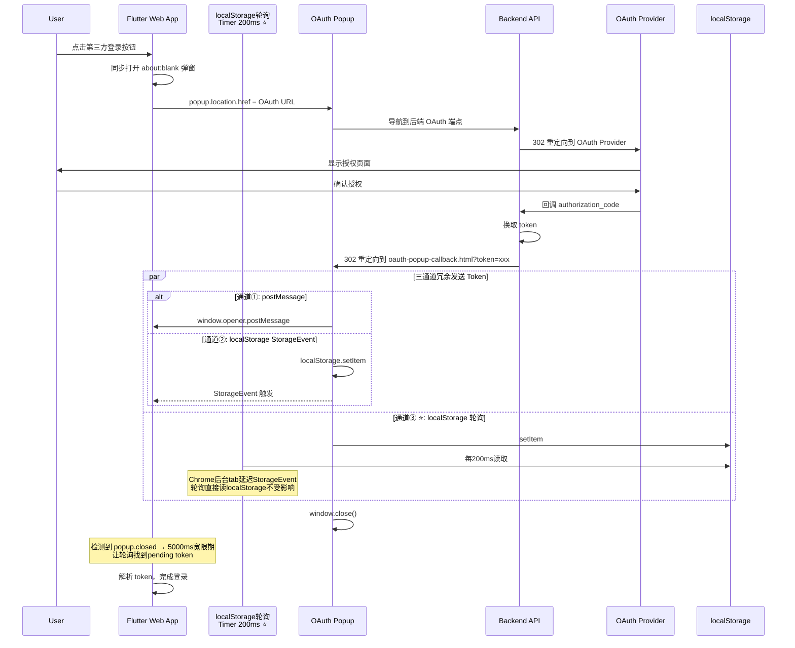

# H5 Web OAuth 弹窗登录：从弹窗拦截到三通道冗余的完整实现

## 1. 背景

H5 Web 第三方登录面临独特的挑战：浏览器安全策略层层加码，弹窗拦截器、COOP 跨域隔离、同源策略、Chrome 后台 Tab 事件节流都对传统的 OAuth 弹窗流程构成了阻碍。

### 1.1 核心挑战

| 挑战 | 浏览器机制 | 影响 |
|------|-----------|------|
| **弹窗被拦截** | 非用户手势触发的 `window.open` 被屏蔽 | OAuth 弹窗直接无法打开 |
| **`window.opener` 为 null** | COOP 跨域隔离策略切断 opener 引用 | `postMessage` 无法到达父窗口 |
| **跨域通信限制** | 同源策略阻止跨域读写 DOM | 弹窗无法直接操作父窗口数据 |
| **Token 泄露** | URL 参数在浏览器历史/地址栏可见 | 敏感 token 可能被截获 |
| **⭐ Chrome 后台 Tab StorageEvent 节流** | Chrome 延迟投递后台 tab 的 StorageEvent | Token 已写入 localStorage 但主窗口数秒后才收到事件 |

### 1.2 技术选型

| 维度 | 选择 | 理由 |
|------|------|------|
| 弹窗策略 | `about:blank` → 填充 URL | 同步打开绕过弹窗拦截 |
| 主通信通道 | `postMessage` | 低延迟、原生支持 |
| 兜底通信通道 | `localStorage` + `StorageEvent` | 跨域隔离下仍可靠 |
| ⭐ 后台 Tab 通道 | `localStorage` 轮询（每200ms） | 绕过 Chrome StorageEvent 节流 |
| 弹窗页面 | 独立 HTML (`oauth-popup-callback.html`) | 不依赖 Flutter 框架，轻量快速 |

---

## 2. 整体架构

```
┌────────────────────────────────────────────────────────────────┐
│                      Flutter Web App                            │
│  ┌─────────────────────────────────────────────────────────┐   │
│  │              DeepLinkOAuthServiceWeb                      │   │
│  │  ┌──────────────────────────────────────────────────┐   │   │
│  │  │  openPopup()     listenForOAuthToken()            │   │   │
│  │  │  ┌──────────┐    ┌───────────────────────────┐   │   │   │
│  │  │  │about:blank│    │  ① postMessage Listener   │   │   │   │
│  │  │  │  → OAuth  │    │  ② StorageEvent Listener  │   │   │   │
│  │  │  │  URL      │    │  ③ ⭐ localStorage Poll    │   │   │   │
│  │  │  └──────────┘    │     Timer.periodic 200ms   │   │   │   │
│  │  │                   └───────────────────────────┘   │   │   │
│  │  │  popup.closed 检测 ← Timer.periodic 500ms         │   │   │
│  │  └──────────────────────────────────────────────────┘   │   │
│  └─────────────────────────────────────────────────────────┘   │
│                               │                                │
│      ① openPopup(url) → return popup ref                      │
│      ② postMessage / StorageEvent / localStoragePoll          │
│      ③ popup.closed 检测                                       │
│                               │                                │
│                               ▼                                │
└────────────────────────────────────────────────────────────────┘
┌────────────────────────────────────────────────────────────────┐
│                     Browser (Popup Window)                      │
│                                                                 │
│  ① about:blank → loading spinner                               │
│  ② popup.location.href = OAuth URL                            │
│  ③ OAuth provider (Google/Facebook)                           │
│  ④ Backend redirect → oauth-popup-callback.html?token=xxx     │
│  ⑤ 三通道发送 token:                                           │
│     postMessage → opener                                        │
│     localStorage.setItem → StorageEvent                         │
│     localStorage.setItem → 被主窗口轮询读取 ⭐                  │
│  ⑥ window.close() + postMessage('popup_closed')                │
└────────────────────────────────────────────────────────────────┘
```

### 完整时序



---

## 3. 第1步：同步打开空白弹窗绕过弹窗拦截

### 3.1 问题背景

现代浏览器只允许在 **用户手势同步调用栈** 中执行 `window.open`。任何异步操作后的 `window.open` 都会被浏览器的弹窗拦截器屏蔽。

### 3.2 实现

关键策略：先同步打开 `about:blank` 空白弹窗，再异步导航到真实 OAuth URL。

```dart
static html.WindowBase? openPopup(String url) {
  try {
    // 1. 同步打开空白弹窗，使用 about:blank 确保始终能获得可写入的 document
    final popup = html.window.open(
      'about:blank',
      'oauth_popup',
      'width=600,height=700,scrollbars=yes',
    );

    // 2. 通过 document.write 注入 loading 界面
    try {
      final doc = (popup as dynamic).document;
      if (doc != null) {
        doc.write('''
          <!DOCTYPE html>
          <html>
          <head>
            <meta charset="UTF-8">
            <title>Signing in...</title>
            <style>
              body {
                display: flex; justify-content: center; align-items: center;
                height: 100vh; margin: 0;
                font-family: -apple-system, ...;
                background: #f8f9fa; color: #333;
              }
              .spinner { ... }
              @keyframes spin { to { transform: rotate(360deg); } }
            </style>
          </head>
          <body>
            <div class="container">
              <div class="spinner"></div>
              <p>Redirecting to login...</p>
            </div>
          </body>
          </html>
        ''');
        doc.close();
      }
    } catch (e) {
      // document.write 可能失败，不影响后续导航
    }

    // 3. 导航到实际的 OAuth URL
    popup.location.href = url;
    return popup;  // ← 返回 popup 引用，用于后续 popup.closed 检测
  } catch (e) {
    return null;  // 弹窗被拦截
  }
}
```

**⭐ v3.0 变更**：返回类型从 `bool` 改为 `WindowBase?`。返回 popup 引用是为了后续轮询 `popup.closed` 检测用户手动关闭弹窗。

### 3.3 为什么选 `about:blank` 而非 `data:` URI？

| 方案 | 问题 |
|------|------|
| `data:text/html,...` | 部分浏览器（Safari）拒绝导航到跨域 URL |
| 直接 `window.open(url)` | 异步调用被拦截 |
| **`about:blank`** | 始终可写入、可导航，无兼容性问题 |

---

## 4. 第2步：导航弹窗到后端 OAuth URL

```dart
popup.location.href = url;
```

此时弹窗中展示着 loading spinner，用户看到的是"Redirecting to login..."。`popup.location.href` 赋值后，弹窗立即导航到后端 OAuth 端点（例如 `/api/auth/google/login`）。

后端会根据 OAuth Provider 的不同，302 重定向到对应的授权页面（Google、Facebook 等）。

---

## 5. 第3步：后端重定向回回调页面

用户授权完成后，OAuth Provider 通过 `authorization_code` 回调后端。后端换取 token 后，不再重定向到 Flutter 应用（那会导致弹窗导航到 Flutter 页面），而是重定向到**独立的回调 HTML 页面**：

```
302 → https://app.joymini.com/oauth-popup-callback.html?token=xxx&refreshToken=yyy&state=zzz&provider=google
```

这个页面是纯静态 HTML，不依赖 Flutter 框架，确保：
- **快速加载**：无需启动 Flutter 引擎
- **独立运行**：即使 Flutter 应用未加载也能正常工作
- **轻量处理**：只需要解析 URL、发送 token、关闭弹窗

回调页面源码：

```javascript
(function() {
  // ===== 解析 URL 参数 =====
  var params = {};
  var queryString = window.location.search.substring(1);
  if (queryString) {
    var pairs = queryString.split('&');
    for (var i = 0; i < pairs.length; i++) {
      var pair = pairs[i].split('=');
      if (pair[0]) {
        params[decodeURIComponent(pair[0])] = decodeURIComponent(pair[1] || '');
      }
    }
  }

  var token = params['token'] || '';
  var refreshToken = params['refreshToken'] || '';
  var state = params['state'] || '';
  var provider = params['provider'] || 'google';

  if (!token) {
    document.body.innerHTML = '<div class="container"><p>Sign in could not be completed. Missing token.</p></div>';
    return;
  }

  // ===== 构建结果负载 =====
  var result = {
    type: 'oauth_token',
    token: token,
    refreshToken: refreshToken,
    state: state,
    provider: provider,
    timestamp: String(Date.now())
  };

  // ===== 所有通道同时发送（谁先到就用谁）=====
  
  // 通道①: postMessage（opener 存在时最快）
  if (window.opener && window.opener !== window) {
    try {
      window.opener.postMessage(result, '*');
    } catch (e) { /* ignore */ }
  }

  // 通道②③: localStorage（同时触发 StorageEvent + 被轮询读取）
  try {
    localStorage.setItem('oauth_token_result', JSON.stringify(result));
  } catch (e) { /* ignore */ }

  // ===== 清理 URL =====
  window.history.replaceState({}, '', window.location.pathname);

  // ===== 关闭弹窗 =====
  setTimeout(function() {
    try { window.close(); } catch (e) {
      document.body.innerHTML = '<div class="container"><p>Sign in successful! You can close this window.</p></div>';
    }
  }, 500);
})();
```

---

## 6. 第4步：三通道通信——postMessage + StorageEvent + localStorage 轮询

这是整个实现中最关键的部分。由于浏览器的 **COOP（Cross-Origin Opener Policy）** 策略，跨域导航后 `window.opener` 会被设置为 `null`，导致 `postMessage` 无法到达父窗口。

### 6.1 根因：COOP 策略 + Chrome 后台 Tab 节流

| 场景 | `window.opener` | 通信方案 |
|------|-----------------|---------|
| 同源重定向 | 存在 | postMessage 直接通信 |
| 跨源重定向 + COOP 隔离 | **null** | postMessage 失效，需兜底 |
| **⭐ 主 tab 在后台** | 任意 | Chrome 延迟 StorageEvent，需轮询 |

### 6.2 三通道实现

Flutter 端同时监听三个通道：

```dart
static Stream<Map<String, String>> listenForOAuthToken() {
  final controller = StreamController<Map<String, String>>(sync: true);

  void handleData(Map<String, dynamic> data, String channel) {
    debugPrint('[OAuthTokenListener] Received event via $channel');
    if (data['type'] == 'oauth_token' && data['token'] != null) {
      // 用 .toString() 转换所有值（处理 timestamp 等数字类型）
      final stringMap = <String, String>{};
      data.forEach((key, value) {
        stringMap[key] = value.toString();
      });
      controller.add(stringMap);
    }
  }

  // 通道①: postMessage 监听（主通道 — opener 存在时工作）
  final msgSub = html.window.onMessage.listen((event) {
    if (event.data is Map) {
      handleData(Map<String, dynamic>.from(event.data as Map), 'postMessage');
    }
  });

  // 通道②: StorageEvent 监听（兜底 — COOP 导致 opener 丢失时工作）
  final storageSub = html.window.onStorage.listen((event) {
    if (event.key == 'oauth_token_result' && event.newValue != null) {
      final data = jsonDecode(event.newValue!) as Map<String, dynamic>;
      html.window.localStorage.remove('oauth_token_result');
      handleData(data, 'localStorage');
    }
  });

  // 通道③ ⭐: localStorage 轮询（每200ms — 绕过 Chrome 后台 tab 节流）
  // StorageEvent 在 main tab 处于后台时被 Chrome 延迟投递。
  // 直接轮询 localStorage 确保无论 tab 可见性如何都能立即获取 token。
  Timer? pollTimer;
  pollTimer = Timer.periodic(const Duration(milliseconds: 200), (_) {
    final stored = html.window.localStorage['oauth_token_result'];
    if (stored != null) {
      try {
        final data = jsonDecode(stored) as Map<String, dynamic>;
        html.window.localStorage.remove('oauth_token_result');
        handleData(data, 'localStoragePoll');
      } catch (_) {}
    }
  });

  controller.onCancel = () {
    msgSub.cancel();
    storageSub.cancel();
    pollTimer?.cancel();
  };

  return controller.stream;
}
```

### 6.3 为什么需要三通道？

| 通道 | 延迟 | 可靠性 | 适用场景 |
|------|------|--------|---------|
| **① postMessage** | 微秒级 | 高（但需 opener 存在） | `window.opener` 正常时 |
| **② StorageEvent** | 毫秒级但可能被延迟 | 高（不受 COOP 影响） | COOP 隔离、opener null |
| **③ ⭐ localStorage 轮询** | **~200ms** | **最高（不受任何浏览器事件系统影响）** | Chrome 后台 tab 节流、所有场景 |

三个通道**同时启用**，谁先触发就用谁，不会重复处理。这种设计确保了：

1. **正常情况**：postMessage 微秒级送达，父窗口即时响应
2. **COOP 隔离**：opener 丢失，StorageEvent 兜底
3. **⭐ Chrome 后台 tab**：主 tab 在后台时，StorageEvent 被 Chrome 延迟投递（实测可达 5-10 秒），但轮询每 200ms 直接读取 localStorage，不受事件系统节流影响

### 6.4 Chrome 后台 Tab 节流问题的发现过程

这个 Bug 非常隐蔽：在本地开发环境测试一切正常，部署到生产环境后，部分用户登录后 loading 状态卡住 5 分钟直到超时。

**根因分析**：

```
本地开发（单 tab）:
  弹窗写入 localStorage → StorageEvent 立即触发 → 主窗口立即收到 ✓

生产环境（多 tab）:
  用户点击登录 → 弹窗获得焦点 → 主 tab 进入后台
  弹窗写入 localStorage → 🔴 Chrome 延迟 StorageEvent 投递
  主 tab: 后台, 收不到事件 → loading 卡住
  5 分钟后 → 超时 → "登录失败"
```

**为什么本地测试不出现？** 本地开发时浏览器通常只有一个 tab 在前台，Chrome 不会节流 StorageEvent。只有弹窗（子窗口）获得焦点、主 tab 进入后台时，Chrome 的节能机制才会激活。

**修复方案**：`Timer.periodic` 每 200ms 直接读取 `localStorage['oauth_token_result']`，绕过浏览器事件系统。无论 tab 在前台还是后台，轮询都能正常工作。

---

## 7. 第5步：弹窗关闭检测 + Race Condition 修复

### 7.1 弹窗关闭检测

⭐ v3.0 新增：轮询 `popup.closed` 检测用户手动关闭弹窗，每 500ms 检查一次。

```dart
// 轮询弹窗是否被用户关闭，每 500ms 检测一次
static Future<bool> _waitForPopupClose(dynamic popup) async {
  while (true) {
    await Future.delayed(const Duration(milliseconds: 500));
    try {
      if (popup.closed == true) {
        debugPrint('[DeepLinkOAuthService] Popup closed by user');
        return true;
      }
    } catch (e) {
      // 跨域弹窗可能无法访问 .closed 属性
    }
  }
}
```

### 7.2 Race Condition：弹窗关闭 vs Token 到达

当弹窗自动关闭时，可能刚好 token 也在同一时刻到达。如果用 `Future.any()` 竞速，弹窗关闭信号可能比 token 早几毫秒到达，导致 Completer 被 cancelled。

**⭐ v3.0 修复**：使用 `Completer` + 5000ms 宽限期。

```dart
// v2.1 有 Bug 的写法
// final token = await Future.any([
//   listenForOAuthToken().first,
//   _waitForPopupClose(popup).then((_) => throw 'cancelled'),
// ]);

// v3.0 修复的写法
final completer = Completer<Map<String, String>>();

// 监听三个通道的 token（postMessage + StorageEvent + localStoragePoll）
subscription = listenForOAuthToken().listen(
  (token) { if (!completer.isCompleted) completer.complete(token); },
  onError: (Object e) { if (!completer.isCompleted) completer.completeError(e); },
);

// 弹窗关闭 → 不立即取消，等待 5000ms 宽限期
_waitForPopupClose(popup).then((_) {
  Future.delayed(const Duration(milliseconds: 5000), () {
    if (!completer.isCompleted) {
      completer.completeError(
        DeepLinkOAuthException('Login cancelled by user'),
      );
    }
    subscription?.cancel();
  });
});

final token = await completer.future.timeout(const Duration(minutes: 5));
```

**逻辑说明：**
1. 每 500ms 检查 `popup.closed`
2. 用户关闭弹窗后，不立即取消 Completer
3. 等待 **5000ms 宽限期**，让 localStorage 轮询找到可能存在的 pending token
4. 如果 5000ms 内 token 到达 → 正常登录
5. 如果 5000ms 内没有 token → 判定为用户取消

---

## 8. 调试经验与 Bug 总结

### 8.1 已修复 Bug 汇总

| # | Bug | 根因 | 修复 | 版本 |
|---|-----|------|------|------|
| 1 | **弹窗被拦截** | 异步调用 `window.open` | 同步打开 `about:blank`，再异步导航 | v2.1 |
| 2 | **弹窗以新标签页打开** | 缺少尺寸参数 | 加 `width=600,height=700` | v2.1 |
| 3 | **后端不认识 redirect_uri** | 参数名不匹配 | 改为 `callback` | v2.1 |
| 4 | **`window.opener` 为 null** | COOP 跨域隔离策略 | 增加 localStorage StorageEvent 兜底通道 | v2.1 |
| 5 | **后端没回传 state/provider** | 后端未返回所有参数 | 回调页只检查 token 存在即可 | v2.1 |
| 6 | **timestamp 类型不匹配** | Dart `Map<String, String>` 转型报错 | 用 `.toString()` 手动转换 | v2.1 |
| 7 | **⭐ Chrome 后台 tab 延迟 StorageEvent** | Chrome 节能机制节流事件投递 | 新增 localStorage 轮询 `Timer.periodic` 每200ms | **v3.0** |
| 8 | **⭐ Race Condition: 弹窗关闭先于 Token 到达** | `Future.any` 竞速 | 改为 `Completer` + 5000ms 宽限期 | **v3.0** |
| 9 | **⭐ 弹窗关闭检测缺失** | 无法感知用户手动关闭弹窗 | 轮询 `popup.closed` 每500ms | **v3.0** |

### 8.2 调试工具技巧

```javascript
// 在弹窗控制台手动触发 StorageEvent 调试
localStorage.setItem('oauth_token_result', JSON.stringify({
  type: 'oauth_token',
  token: 'debug_token_xxx',
  provider: 'google'
}));

// 查看弹窗 opener 状态
console.log(window.opener);  // null → COOP 生效

// 手动触发 postMessage
if (window.opener) {
  window.opener.postMessage({ type: 'oauth_token', token: 'test' }, '*');
}

// ⭐ 模拟 Chrome 后台 tab 场景：手动写入 localStorage
// 然后切到主 tab 控制台，看轮询是否能在 200ms 内捕获
```

### 8.3 核心调试日志点

```
[OAuthPopupCallback] Callback loaded. URL: ...
[OAuthPopupCallback] token=***, state=..., provider=...
[OAuthPopupCallback] Token sent via postMessage
[OAuthPopupCallback] Token saved to localStorage
[OAuthTokenListener] Received event via postMessage / localStorage / localStoragePoll
[OAuthTokenListener] Valid token found, adding to stream
[DeepLinkOAuthService] Popup opened, waiting for OAuth token...
[DeepLinkOAuthService] Listening for token via postMessage + StorageEvent + localStoragePoll...
[DeepLinkOAuthService] OAuth token received
```

---

## 9. 总结

H5 Web OAuth 弹窗登录的完整实现围绕 **5 个步骤** 展开：

1. **同步打开空白弹窗**：使用 `about:blank` 绕过浏览器弹窗拦截器
2. **导航到 OAuth URL**：弹窗从 loading 状态导航到后端 OAuth 端点
3. **后端重定向回回调页面**：独立静态 HTML 接收 token，不依赖 Flutter 框架
4. **三通道冗余通信**：`postMessage`（主通道）+ `StorageEvent`（COOP 兜底）+ `localStorage` 轮询（⭐ Chrome 后台 tab 修复）
5. **弹窗关闭检测 + 宽限期**：`popup.closed` 轮询 + 5000ms 宽限期解决 Race Condition

| 文件 | 角色 | 关键方法/代码 |
|------|------|--------------|
| [`web/oauth-popup-callback.html`](../../../web/oauth-popup-callback.html) | 回调页面 | 解析 URL、三通道发送 token、关闭弹窗 |
| [`lib/core/services/auth/deep_link_oauth_service_web.dart`](../../../lib/core/services/auth/deep_link_oauth_service_web.dart) | Web 平台服务 | `openPopup()`、`listenForOAuthToken()`（三通道）、Timer.periodic |
| [`lib/core/services/auth/deep_link_oauth_service.dart`](../../../lib/core/services/auth/deep_link_oauth_service.dart) | 统一服务入口 | `_webLoginWithProvider()`、`_waitForPopupClose()`、Completer |

**核心经验**：Web OAuth 弹窗登录的本质不是"在弹窗中打开登录页"，而是**在独立窗口中完成 OAuth 流程后，通过可靠的跨窗口通信协议将 token 送回主应用**。理解浏览器安全策略（COOP、同源策略、弹窗拦截、Chrome 事件节流）决定了架构设计的成败。

最隐蔽的坑往往是浏览器对后台 tab 的处理差异——本地测试一切正常不代表生产环境没有问题。三通道冗余设计确保了任何浏览器场景下 token 都能可靠送达。
