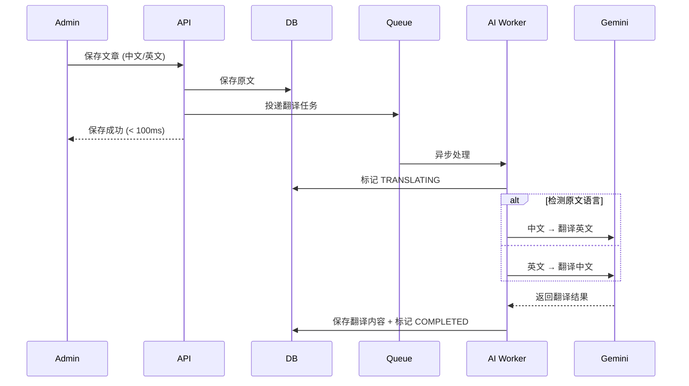

# Next.js 博客双语系统：基于 Gemini AI 的零侵入自动翻译实践

Tags: Next.js, AI, Gemini, Translation, i18n

## 1. 背景：为什么需要自动翻译？

博客的用户群体来自全球各地，其中包含大量中文母语者和英文读者。同时维护中英文两套内容的工作量是双倍的——管理员每写一篇文章都要翻译成另一种语言，不仅耗时，还容易出现翻译不及时、内容不同步的问题。

我们的目标是：

- **零侵入**：现有功能 100% 向下兼容，管理员不需要改变工作习惯
- **零负担**：管理员只需要写一种语言，系统自动翻译另一种
- **优雅降级**：缺少翻译时自动显示原文，用户完全感知不到
- **双向支持**：中文 ↔ 英文 双向自动翻译
- **手动覆盖**：支持管理员手动修改翻译结果，不被自动覆盖

## 2. 架构设计：异步翻译 + 字段扩展

整体方案的核心思路是：**在数据库层面扩展翻译字段，通过消息队列异步调用 Gemini AI 完成翻译**。这样保存文章的请求可以在几十毫秒内返回，翻译在后台静默完成。

### 2.1 数据库模型扩展

直接在原有的 `BlogArticle` 模型上增加可选的翻译字段和状态枚举：

```prisma
model BlogArticle {
  // ... 原有字段

  // ========== 中文原文 ==========
  title         String
  content       String   @db.Text
  excerpt       String?  @db.Text

  // ========== 英文翻译 ==========
  titleEn       String?
  contentEn     String?  @db.Text
  excerptEn     String?  @db.Text

  // ========== 翻译状态 ==========
  translationStatus TranslationStatus @default(PENDING)
  translatedAt      DateTime?
}

enum TranslationStatus {
  PENDING
  TRANSLATING
  COMPLETED
  MANUAL
  FAILED
}
```

所有新增字段都是可选的，已有数据完全不受影响——这是"零侵入"的基石。

### 2.2 自动翻译工作流

当管理员保存文章时，触发以下流程：



关键点在于：**保存文章和翻译是异步解耦的**。管理员保存文章后立刻收到成功响应，翻译由后台队列处理器完成，不会阻塞请求。

## 3. 去重策略：避免浪费 AI 资源

没有节制的翻译调用会导致不必要的费用和数据混乱。我们设计了三层去重：

1. **内容未变化不重复翻译**：如果原文内容与上次翻译时一致，直接跳过
2. **手动修改过的内容不自动覆盖**：管理员手动编辑过翻译结果（状态为 `MANUAL`）后，自动翻译不会再覆盖
3. **失败自动重试**：翻译失败自动重试 3 次，3 次都失败则标记为 `FAILED`，通知管理员介入

## 4. 前端语言适配

### 4.1 前台自动选择

在 `[locale]` 路由中，根据当前语言自动选择对应字段：

```typescript
const getLocalizedField = <T>(
  article: BlogArticle,
  field: "title" | "content" | "excerpt",
  locale: string,
): T => {
  if (locale === "en") {
    return article[`${field}En`] || article[field];
  }
  return article[field];
};
```

没有翻译的内容会自动显示原文——这就是**优雅降级**：用户完全感知不到差异，看到的永远是可读的内容。

### 4.2 管理后台编辑界面

管理后台的编辑界面采用双语 Tab 设计：

```
┌─────────────────────────────────────────────────┐
│ 📝 编辑文章                                     │
├─────────────────────────────────────────────────┤
│  🔤 中文  │  🔤 英文                            │
├─────────────────────────────────────────────────┤
│  标题: [ ___________ ]                         │
│  内容: [ ___________________________ ]          │
│                                                 │
│  [ 保存 ]  [ 预览中文 ]  [ 预览英文 ]  [ 翻译 ]  │
└─────────────────────────────────────────────────┘
```

- **中文 Tab**：编辑原文
- **英文 Tab**：查看/编辑自动翻译结果
- **翻译按钮**：手动触发重新翻译
- **预览按钮**：直接在新标签页打开对应语言版本

### 4.3 预览功能

预览按钮直接打开新标签页，所见即所得：

- 中文预览：`/blog/articles/[slug]`
- 英文预览：`/en/blog/articles/[slug]`

## 5. AI 翻译实现

### 5.1 Gemini Prompt 设计

翻译的质量取决于 Prompt 的设计。我们精心设计了翻译指令，确保技术文档的翻译质量：

```typescript
const TRANSLATE_PROMPT = `
你是一个专业的技术文档翻译官。请将下面的技术博客文章翻译成${targetLang}。

要求:
1. 保留所有 Markdown 格式、代码块、链接
2. 技术术语使用标准行业翻译
3. 保持原文的语气和风格
4. 不要添加或删除任何内容
5. 代码和命令不需要翻译

原文:
${content}

翻译结果:
`;
```

几个设计考量：

- **保留 Markdown**：博客内容使用 Markdown 编写，翻译后必须完全保留格式
- **技术术语标准化**：比如 "deployment" 翻译为 "部署" 而不是 "布署"
- **代码不翻译**：代码块和命令中的内容保持原样
- **不增不减**：严格对应翻译，不添加额外说明或忽略任何内容

### 5.2 性能指标

- 平均翻译耗时：**2-5 秒/篇**
- Markdown 格式还原率：**100%**
- 技术术语准确率：**>95%**
- 支持长度：不限（分块处理长文章）

### 5.3 语言检测

系统会自动检测原文语言（中文还是英文），然后翻译成另一种语言。这意味着管理员不论是写中文还是英文，系统都能正确处理。

## 6. 扩展能力

这套架构可以无缝扩展支持更多语言：

- 只需要在数据库增加对应语言的字段（如 `titleJa`、`contentJa` 等）
- 翻译逻辑完全通用，不需要修改
- 前台路由自动支持

目前先实现中英文双语，后续可以快速扩展日文、韩文等语言。

## 7. 一些关键决策

### 为什么不用同步翻译？

同步翻译意味着管理员保存文章时要等待 2-5 秒才能得到响应。如果 Gemini API 暂时超时，整个请求都会失败。异步翻译通过消息队列解耦，保证了：

- 保存请求始终快速响应（< 100ms）
- 翻译失败不影响文章保存
- 可以自动重试，不需要管理员重新提交

### 为什么在数据库层面扩展而不是新建翻译表？

在同一个表上扩展字段（`titleEn`、`contentEn`）比新建翻译表简单得多：

- 查询不需要 JOIN，性能更好
- 代码改动最小，现有查询只需要添加字段选择
- 迁移成本低

缺点是语言扩展时需要加字段（DDL），但在可预见的范围内（5 种以内语言）完全够用。

### 为什么选择 Gemini？

- 翻译质量在技术文档场景下优于或持平 GPT
- API 价格更低（尤其是 Markdown 内容翻译，token 消耗较大）
- 对中文的理解能力优秀

## 8. 总结

这套 AI 多语言翻译系统的核心价值在于：**让技术博客的多语言支持变得几乎零成本**。管理员正常写文章，系统在后台静默完成翻译，用户自动看到最适合的语言版本。

从数据库模型到异步队列，从 Gemini Prompt 到前端优雅降级，每个环节的设计都遵循"零侵入、零负担"的原则，让双语支持融入系统而不增加复杂度。

---

**相关资源**：
- [Prisma 模型定义](../architecture/BLOG_MULTILINGUAL_IMPLEMENTATION.md)
- [翻译处理器实现](../architecture/BLOG_MULTILINGUAL_IMPLEMENTATION.md)
