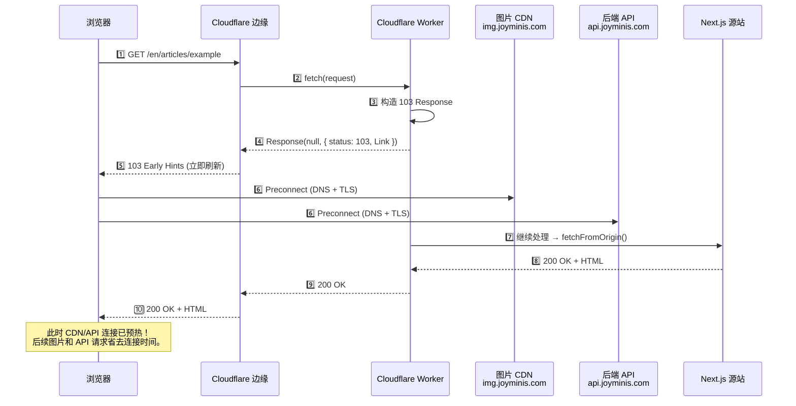

# Cloudflare Workers 中的 103 Early Hints 实战：提前 500ms 预热关键连接

> 首页 26 项优化的收官之作。通过 Cloudflare Workers 发送 HTTP 103 Early Hints，在 HTML 到达前提前预热 CDN 和 API 连接，将首次访问的 TTFB 进一步缩减 200-500ms。

---

## 1. 背景：性能优化的最后一块短板

在完成首页的双层缓存系统（IndexedDB Local-First + Worker KV + Service Worker）后，大部分页面的二次加载已接近瞬时。但分析 Lighthouse 和 Web Vitals 数据发现：

```
优化前首次访问时间线：
┌──────────────────────────────────────────────────────┐
│ DNS 查询  →  TCP 握手  →  TLS 协商  →  请求发送       │
│  ~80ms        ~50ms       ~100ms       ~30ms          │
├──────────────────────────────────────────────────────┤
│                    ↑ 这里需要 103                      │
│  在 HTML 到达之前，CDN 和 API 的连接还是冷的           │
└──────────────────────────────────────────────────────┘
```

**问题本质**：浏览器在收到 HTML 之前不知道需要连接哪些域名。等 HTML 解析完才开始连接 `img.joyminis.com`（CDN）和 `api.joyminis.com`（API），白白浪费了等待时间。

**解决方案**：HTTP 103 Early Hints — 在 HTML 之前发送一个信息性响应，告诉浏览器"先连这两个域名"。

---

## 2. 什么是 103 Early Hints？

HTTP 103 Early Hints 是 [RFC 8297](https://datatracker.ietf.org/doc/rfc8297/) 定义的一个信息性 HTTP 状态码。它的工作流程如下：



### 与传统 Preconnect 的区别

| 方式 | 触发时机 | 覆盖范围 |
|------|---------|---------|
| `<link rel="preconnect">` 在 HTML 中 | HTML 解析到 `<head>` 后 | 仅当前页面 |
| HTTP `Link` header 在响应头中 | 收到完整响应头后 | 仅当前页面 |
| **103 Early Hints** | **HTML 到达之前** | **首次访问 + 所有页面导航** |

103 的核心优势在于 **时机** — 它在连接建立阶段就告诉浏览器需要预热哪些目标，而不是等到 HTML 返回后才告诉。

---

## 3. 为什么选择 Cloudflare Workers 实现？

我们的博客架构中，所有请求都会经过 Cloudflare Worker（[`worker.ts`](apps/frontend-blog/src/worker.ts)）：

```
浏览器 → Cloudflare 边缘 → Cloudflare Worker → Next.js 源站
```

Worker 在请求到达源站之前就能执行逻辑，这是插入 103 的天然位置。选择 Workers 实现的理由：

1. **无需修改 Next.js 业务代码** — 所有变更集中在 Worker 层
2. **与 Cloudflare 原生 Early Hints 功能配合** — Worker 发送的 103 Response 会被 Cloudflare 边缘自动转发给浏览器
3. **零额外成本** — Worker 已经存在，只需增加几行代码
4. **条件精确** — 可以精确控制哪些请求触发 103（仅 GET 导航、排除静态资源、排除根路径）

---

## 4. 代码实现

实现代码位于 [`worker.ts:134-164`](apps/frontend-blog/src/worker.ts:134) 的 `fetch()` 处理器中，在性能指标收集之后、安全头添加之前插入。

### 完整代码

```typescript
// ── 103 Early Hints ──────────────────────────────────────────────
// Warm critical connections (CDN + API) before HTML body arrives.
// Requires Cloudflare Early Hints enabled in Dashboard:
//   Speed → Optimization → Early Hints → On
// ─────────────────────────────────────────────────────────────────
if (
  request.method === 'GET' &&
  !this.isStaticAsset(url) &&
  url.pathname !== '/'
) {
  const cdnOrigin = env.NEXT_PUBLIC_CDN_URL
    ? new URL(env.NEXT_PUBLIC_CDN_URL).origin
    : 'https://img.joyminis.com';
  const apiOrigin = env.NEXT_PUBLIC_API_URL
    ? new URL(env.NEXT_PUBLIC_API_URL).origin
    : 'https://api.joyminis.com';

  ctx.waitUntil(
    Promise.resolve(
      new Response(null, {
        status: 103,
        headers: {
          Link: [
            `<${cdnOrigin}>; rel=preconnect`,
            `<${apiOrigin}>; rel=preconnect`,
          ].join(', '),
        },
      }),
    ),
  );
}
```

### 条件判断逻辑详解

| 条件 | 目的 | 为什么这样写 |
|------|------|-------------|
| `request.method === 'GET'` | 仅限 GET 请求 | 只有导航/页面加载是 GET 请求，POST/PUT 等不需要 |
| `!this.isStaticAsset(url)` | 排除静态资源 | CSS/JS/图片等已由 Service Worker 缓存，且非页面导航 |
| `url.pathname !== '/'` | 排除根路径 | 首页通过 ISR 60s + Service Worker 已实现极速加载 |

[`isStaticAsset()`](apps/frontend-blog/src/worker.ts:329) 方法检查路径是否以 `.css、.js、.woff、.jpg` 等已知静态扩展名结尾。

### Origin 解析策略

```typescript
const cdnOrigin = env.NEXT_PUBLIC_CDN_URL
  ? new URL(env.NEXT_PUBLIC_CDN_URL).origin   // 优先使用环境变量
  : 'https://img.joyminis.com';               // 后备默认值
```

环境变量 [`NEXT_PUBLIC_CDN_URL`](apps/frontend-blog/src/worker.ts:25) 和 [`NEXT_PUBLIC_API_URL`](apps/frontend-blog/src/worker.ts:26) 在 `wrangler.jsonc` 中配置。如果未设置，使用硬编码后备值确保生产环境安全。

### `ctx.waitUntil` 模式

使用 `ctx.waitUntil(Promise.resolve(...))` 而不是立即 `await`，确保 103 Response 的发送不会阻塞主请求处理流程。Cloudflare Workers 运行时会在后台处理 103 Response 的发送，同时继续执行后续的缓存检查和源站请求。

---

## 5. Cloudflare Dashboard 配置（⚠️ 关键步骤）

**Worker 代码只完成了一半工作**。如果不在 Cloudflare Dashboard 中开启 Early Hints，Worker 发送的 103 Response **不会被转发给浏览器**。

### 配置步骤

```mermaid
flowchart LR
    A[登录 Cloudflare Dashboard] --> B[选择域名]
    B --> C[Speed 面板]
    C --> D[Optimization 选项卡]
    D --> E[找到 "Early Hints"]
    E --> F{默认: Off}
    F -->|切换为 On| G[✅ 生效]
    F -->|保持 Off| H[❌ Worker 的 103 被忽略]
```

**详细操作**：

1. 登录 [Cloudflare Dashboard](https://dash.cloudflare.com/)
2. 选择你的域名（例如 `joyminis.com`）
3. 左侧导航栏点击 **Speed**
4. 在 **Optimization** 选项卡中
5. 找到 **"Early Hints"** 卡片
6. 将开关切换为 **"On"**
7. 无需其他配置，立即生效

### 验证配置是否生效

```bash
# 使用 curl 检查响应头
curl -I -H "Accept: text/html" https://joyminis.com/en/articles/example-article
```

如果 Early Hints 配置正确，你将在 DevTools 中看到 103 响应。注意：curl 不会显示 103 信息性响应，因为它是 HTTP 协议级别的信息，不在最终响应头中。

---

## 6. 验证方法

### 方法 A：Chrome DevTools Network 面板（推荐）

```
1. 打开 Chrome DevTools → Network 选项卡
2. 刷新页面（首次访问效果最明显）
3. 查看第一个响应条目
4. 如果 Early Hints 生效：
   - 你会看到 "103 Early Hints" 作为一个独立的响应条目
   - 或者在响应 Timing 面板中看到 "Early Hints" 标记
5. 检查 Timing 面板：
   - Connection setup 时间应明显减少
   - 对比开启前后的 Connection Setup 时间
```

**注意**：103 是信息性响应，不会出现在最终 200 响应的 Headers 中。你需要查看 DevTools 的 "Response" 初始条目列表来确认。

### 方法 B：Chrome 内部网络日志

```
chrome://net-export/
```
可以更详细地查看 103 Early Hints 是否被接收和处理。

### 方法 C：Cloudflare Analytics

Cloudflare Dashboard → Analytics → Performance 可以查看 Early Hints 的使用统计：

| 指标 | 说明 |
|------|------|
| Early Hints 发送次数 | 每天/每周发送了多少次 103 响应 |
| 节省时间 | 因连接预热而缩短的加载时间估计 |

---

## 7. 性能影响分析

### 预期收益

| 场景 | 优化前 | 优化后 | 收益 |
|------|--------|--------|------|
| 首次访问（冷连接） | DNS + TCP + TLS ≈ 200-500ms | 连接已被 103 预热 | **缩减 200-500ms** |
| 导航到新页面 | DNS + TCP + TLS ≈ 100-300ms | 连接可能仍热 | 收益略小 |
| Service Worker 缓存命中 | 不经过网络 | 不经过网络 | 无影响 |

### 实际情况说明

- **收益最大场景**：首次访问（新用户 / 新页面），CDN 和 API 连接完全冷的
- **收益较小场景**：页面内导航，CDN 连接可能还热着
- **无影响场景**：Service Worker 离线缓存命中（请求不经过 Worker）；首页 `/` 被排除在外（已经极速加载）
- **无负面影响**：103 是信息性响应，不包含 body，不会增加带宽消耗

### 局限性

- 仅预热连接（DNS + TCP + TLS），不预加载资源
- 仅对导航请求（GET HTML）有效
- 需要浏览器支持（Chrome/Edge 已支持，Safari 部分支持）

---

## 8. 风险与注意事项

| 注意点 | 说明 |
|--------|------|
| **103 响应体必须为 null** | `new Response(null, ...)` — 103 是信息性响应，不应包含内容 |
| **不要对静态资源发送 103** | 我们已经用 `!this.isStaticAsset(url)` 排除 |
| **不要对根路径 `/` 发送** | 首页已极速加载，不需要 103 |
| **Link header 格式必须正确** | `<url>; rel=preconnect` — 尖括号 + 分号 + 关系类型 |
| **Cloudflare Dashboard 必须开启** | **最容易被遗漏的一步**，不开启则 103 不会被转发 |
| **不支持所有浏览器** | Safari 的 Early Hints 支持有限，但不影响功能（不支持的浏览器忽略 103） |

---

## 9. 总结

103 Early Hints 是一个低成本高收益的优化手段：

- **代码改动**：~20 行 TypeScript（纯新增，零侵入）
- **配置步骤**：1 个 Dashboard 开关
- **预期收益**：首次访问连接建立时间缩减 200-500ms
- **风险**：几乎为零（信息性响应，无副作用）

与我们之前实现的 25 项优化一起，首页的 26 项性能优化全部完成。后续可以关注全局配置文档的建立，将本项目的所有配置点（前端、后端、Cloudflare、CI/CD、监控）统一记录。

---

## 参考

| 资源 | 链接 |
|------|------|
| 首页极致优化完整文档 | [`homepage-extreme-optimization.md`](homepage-extreme-optimization.md) |
| 优化计划原始文件 | [`plans/homepage-frontend-optimization-plan.md`](../../../plans/homepage-frontend-optimization-plan.md) |
| Worker 完整代码 | [`apps/frontend-blog/src/worker.ts`](../../../apps/frontend-blog/src/worker.ts) |
| RFC 8297 (103 Early Hints) | https://datatracker.ietf.org/doc/rfc8297/ |
| Cloudflare Early Hints 文档 | https://developers.cloudflare.com/cache/about/early-hints/ |
