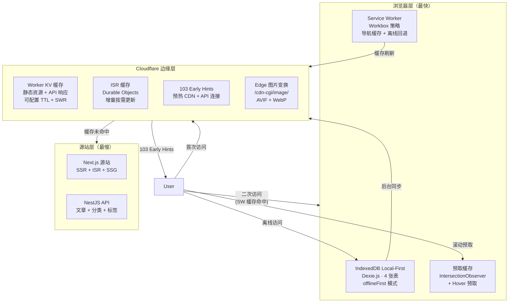
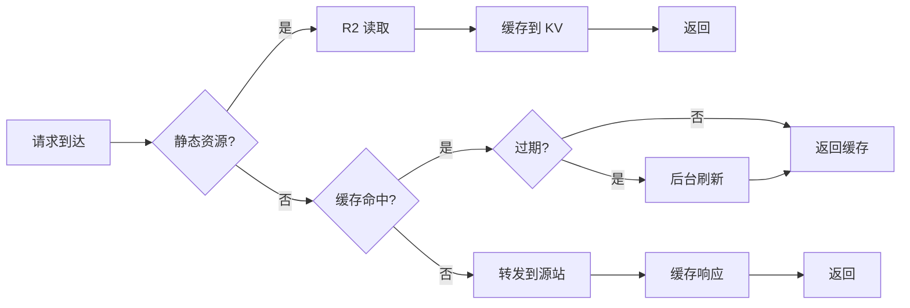
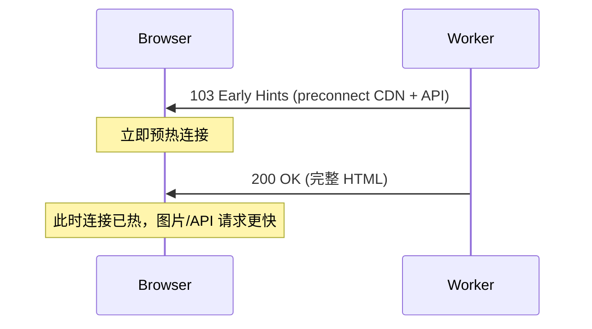
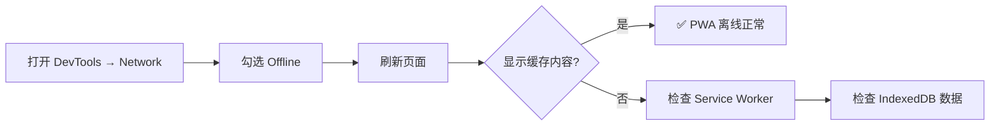

# Next.js 博客首页极致优化：从双层缓存到边缘计算的 26 项实践

> 对标 Vercel/Netflix/Meta/ByteDance 的 Data-Driven + Edge Computing 实践，在 Cloudflare Workers 边缘网络上，通过浏览器缓存层（IndexedDB + Service Worker）与边缘缓存层（Worker KV + ISR）的双层协同，实现首页首屏加载的极致优化。

---

## 1. 背景：一个"动态博客"的性能悖论

### 1.1 问题本质

博客内容本身是静态的——文章发布后很少修改。但我们的博客并非传统 JAMStack 静态站点：

```
传统静态博客：构建时生成 HTML → CDN 分发 → 浏览器直接渲染
我们的博客：   SSR 实时渲染 → Cloudflare Worker 处理 → 边缘缓存 → 浏览器渲染
```

由于运行在 Cloudflare Workers 上且采用三端统一架构（Web / H5 / App），每次请求都经过 Worker 处理。再加上多语言路由、用户认证状态、个性化推荐等动态特性，"纯静态"方案行不通。

### 1.2 核心指标

| 指标 | 优化目标 | 关键策略 |
|------|---------|---------|
| LCP (Largest Contentful Paint) | < 1.5s | 图片预取 + Preload Link + Edge 变换 |
| TTFB (Time to First Byte) | < 500ms | Worker KV 缓存 + ISR + 103 Early Hints |
| FCP (First Contentful Paint) | < 1.0s | SSR + 骨架屏 + 流式渲染 |
| 离线可用率 | 100% | IndexedDB Local-First + Service Worker |

### 1.3 优化前的性能瓶颈

```
┌─────────────────────────────────────────────────────────────────────────┐
│ 优化前的请求链路（无缓存情况）                                           │
│                                                                         │
│  DNS → TCP → TLS → Worker 处理 → KV 检查 → API 请求 → SSR 渲染 → 返回   │
│  ~80ms  ~50ms  ~100ms   ~30ms      ~10ms     ~200ms    ~100ms    ~30ms  │
│                                                                         │
│  总计：~600ms TTFB + 后续图片加载 ~500ms = LCP ~1.1s+                    │
│  首次访问甚至更糟（连接全冷）                                            │
└─────────────────────────────────────────────────────────────────────────┘
```

---

## 2. 架构总览：三层缓存系统

我们设计了一个从浏览器到边缘的三层缓存架构，每一层负责不同的缓存粒度和失效策略。



### 各层延迟对比

| 层级 | 响应时间 | 命中率目标 | 策略 |
|------|---------|-----------|------|
| IndexedDB Local-First | < 5ms | 80%+ | 始终从缓存读，后台刷新 |
| Service Worker 缓存 | < 10ms | 60%+ | CacheFirst + NetworkFirst |
| Worker KV 缓存 | < 30ms | 90%+ | TTL + SWR |
| ISR 缓存 | < 50ms | 95%+ | 按需增量更新 |
| 源站 SSR | ~300-500ms | 兜底 | 实时渲染 |

---

## 3. 26 项优化详解

### P0：首屏体验优化（8 项）

这些优化直接影响用户看到页面内容的速度。

#### P0-1: ISR 60 秒增量更新

**文件**: [`page.tsx`](apps/frontend-blog/src/app/%5Blocale%5D/page.tsx:11)

```typescript
// 首页使用 ISR (Incremental Static Regeneration)
export const revalidate = 60; // 60 秒后重新生成
```

ISR 让首页在构建后仍然保持静态响应，同时每 60 秒自动重新生成。配合 OpenNext 的 Durable Objects 持久化，即使 Worker 重启也不会丢失缓存状态。

#### P0-2: Priority 首屏图片

**文件**: [`page.client.tsx`](apps/frontend-blog/src/app/%5Blocale%5D/page.client.tsx:188)

```typescript
// 前 2 张文章卡片使用 priority={true}
{allArticles.slice(0, 2).map((article, index) => (
  <ArticleCard
    key={article.id}
    article={article}
    priority={true}  // 首屏文章优先加载
    networkQuality={networkQuality}
  />
))}
```

`priority` 属性告诉 Next.js Image 组件：这应该作为 LCP 候选资源优先加载，不会应用 `loading="lazy"`。

#### P0-3: 非首图 Quality 65

**文件**: [`page.client.tsx`](apps/frontend-blog/src/app/%5Blocale%5D/page.client.tsx) + [`ArticleCard.tsx`](apps/frontend-blog/src/components/blog/ArticleCard.tsx)

```typescript
// ArticleCard.tsx:112 — 非首屏图片使用较低 quality
const imageQuality = priority ? undefined : (networkQuality?.quality ?? 65);
```

- 首图 (`priority=true`)：使用默认 quality（75），CDN 接受
- 非首图：quality=65，减少 15%-20% 图片体积
- 弱网用户：quality 进一步降低到 45/20/10（见 P2-1）

#### P0-4: SSR initialCategories — 消除分类栏闪烁

**文件**: [`page.tsx`](apps/frontend-blog/src/app/%5Blocale%5D/page.tsx) + [`CategoryFilter.tsx`](apps/frontend-blog/src/components/blog/CategoryFilter.tsx)

在 SSR 阶段就获取分类数据并注入到客户端，避免客户端渲染时的 loading → loaded 闪烁：

```typescript
// page.tsx — SSR 阶段获取分类数据
const initialCategories = await fetchCategories();
```

#### P0-5: BlurhashImage LRU 缓存

**文件**: [`BlurhashImage.tsx`](apps/frontend-blog/src/components/blog/BlurhashImage.tsx)

```typescript
// 全局 LRU 缓存，上限 100 条
const blurhashCache = new Map<string, string>();
const CACHE_MAX = 100;

function blurhashToDataUrl(hash: string, width: number, height: number): string {
  const key = `${hash}-${width}-${height}`;
  if (blurhashCache.has(key)) return blurhashCache.get(key)!;
  
  // 解码 Blurhash → SVG Data URL
  const svg = generateBlurhashSVG(hash, width, height);
  const dataUrl = `data:image/svg+xml;base64,${btoa(svg)}`;
  
  // LRU 管理
  if (blurhashCache.size >= CACHE_MAX) {
    const firstKey = blurhashCache.keys().next().value;
    blurhashCache.delete(firstKey);
  }
  blurhashCache.set(key, dataUrl);
  return dataUrl;
}
```

首次渲染时将 Blurhash 解码为 SVG Data URL，后续切换分类时直接读取缓存，避免重复解码 500ms+ 的延迟。

#### P0-6: View Transitions API

**文件**: [`page.client.tsx`](apps/frontend-blog/src/app/%5Blocale%5D/page.client.tsx) + [`globals.css`](apps/frontend-blog/src/app/globals.css)

```typescript
// 分类切换时使用 View Transitions API
document.startViewTransition(() => {
  setSelectedCategory(categoryId);
});
```

```css
/* globals.css — 交叉淡入淡出动画 */
::view-transition-old(root) {
  animation: fade-out 0.2s ease-in-out;
}
::view-transition-new(root) {
  animation: fade-in 0.2s ease-in-out;
}
```

支持 `prefers-reduced-motion` 降级，无障碍友好。

#### P0-7: 骨架屏替换 Spinner

**文件**: [`PageSkeleton.tsx`](apps/frontend-blog/src/components/ui/PageSkeleton.tsx)

页面加载时展示与实际布局一致的骨架屏（Skeleton），而非传统的旋转加载图标（Spinner）。骨架屏让用户感知到"页面正在加载具体内容"，而不是"系统正在处理"。

#### P0-8: CDN Preconnect

**文件**: [`next.config.ts`](apps/frontend-blog/next.config.ts:178)

```typescript
// next.config.ts — 提前连接 CDN
{
  rel: 'preconnect',
  href: 'https://img.joyminis.com',
  crossOrigin: 'anonymous',
}
```

在 HTML `<head>` 中注入 `preconnect` hint，浏览器尽早建立 CDN 连接。

---

### P1：预取与预加载优化（6 项）

这些优化通过"提前做事"来隐藏网络延迟。

#### P1-1: LCP 图片 Preload Link

**文件**: [`page.tsx`](apps/frontend-blog/src/app/%5Blocale%5D/page.tsx:60)

```typescript
// SSR 阶段提取第一篇文章的封面图，注入 Preload Link
const firstCoverImage = initialData.items?.[0]?.coverImage;

return (
  <>
    {firstCoverImage && (
      <link
        rel="preload"
        as="image"
        href={firstCoverImage}
        fetchPriority="high"
      />
    )}
    <HomePageClient ... />
  </>
);
```

LCP 图片（第一篇文章的封面）在 HTML 响应中直接以 `<link rel="preload">` 声明，浏览器解析到 `<head>` 时就立即开始下载，无需等待 CSSOM 构建。

#### P1-2: IntersectionObserver 图片预取

**文件**: [`ArticleCard.tsx`](apps/frontend-blog/src/components/blog/ArticleCard.tsx:68)

```typescript
useEffect(() => {
  if (!coverImageUrl || priority || isVideoUrl(coverImageUrl)) return;

  const observer = new IntersectionObserver(
    (entries) => {
      for (const entry of entries) {
        if (entry.isIntersecting) {
          // 提前 200px 开始下载图片
          const img = new Image();
          img.src = coverImageUrl;
          // 同时预热 Service Worker 缓存
          fetch(coverImageUrl, { mode: 'no-cors' }).catch(() => {});
          observer.disconnect();
          break;
        }
      }
    },
    {
      rootMargin: '200px',  // 提前 200px 触发
      threshold: 0,
    },
  );

  observer.observe(el);
  return () => observer.disconnect();
}, [coverImageUrl, priority]);
```

`rootMargin: '200px'` 意味着当卡片距离可视区域还有 200px 时就触发加载。配合 Service Worker 的 CacheFirst 策略，图片进入视口时直接从 SW 缓存读取。

#### P1-3: 页面底部自动预取下一页

**文件**: [`page.client.tsx`](apps/frontend-blog/src/app/%5Blocale%5D/page.client.tsx:88)

```typescript
// 底部 sentinel 元素
useEffect(() => {
  const observer = new IntersectionObserver((entries) => {
    for (const entry of entries) {
      if (entry.isIntersecting) {
        const nextPage = page + 1;
        // 1. 预取 API 数据
        queryClient.prefetchQuery({
          queryKey: ['articles', { locale, ...filters, page: nextPage }],
          queryFn: () => fetchArticles({ page: nextPage, ... }),
        });
        // 2. 预热 IndexedDB
        syncArticles(data.articles);
        observer.disconnect();
        break;
      }
    }
  });

  observer.observe(sentinelRef.current);
}, [page, hasMore, isFetching]);
```

用户滚动到文章列表底部时，自动预取下一页的文章数据并写入 IndexedDB。用户点击"Load More"时，数据已经在本地。

#### P1-4: Hover 预取分类

**文件**: [`CategoryFilter.tsx`](apps/frontend-blog/src/components/blog/CategoryFilter.tsx)

```typescript
// 鼠标悬停在分类标签上时预取该分类的文章
onMouseEnter={() => {
  queryClient.prefetchQuery({
    queryKey: ['articles', { locale, category: categoryId, page: 1 }],
    queryFn: () => fetchArticles({ category: categoryId, page: 1 }),
  });
}}
```

用户还未点击分类标签，只是悬停（hover）时就开始下载数据。人的反应时间（~200ms）足够预取完成。

#### P1-5: CDN Preconnect（重复优化防止退化）

见 P0-8。CDN Preconnect 同时在 `next.config.ts` 和 Worker 的 103 Early Hints 中实现，形成双重保障。

#### P1-6: 103 Early Hints

见 [专用文档](cloudflare-103-early-hints.md)。在 Worker 层面发送 HTTP 103 信息性响应，提前预热 CDN + API 连接。

---

### P2：自适应与网络感知优化（3 项）

根据用户的网络条件动态调整资源质量。

#### P2-1: 网络感知自适应质量

**文件**: [`useNetworkQuality.ts`](apps/frontend-blog/src/lib/hooks/useNetworkQuality.ts) + [`ArticleCard.tsx`](apps/frontend-blog/src/components/blog/ArticleCard.tsx:112)

```typescript
// useNetworkQuality.ts — 5 级自适应
export function useNetworkQuality(): NetworkQuality {
  // 初始值（SSR 安全）：默认 4g
  const [quality, setQuality] = useState<NetworkQuality>(() => ({
    effectiveType: '4g',
    quality: 75,
    format: 'avif',
    shouldBlurOnly: false,
    saveData: false,
    downlink: 10,
    rtt: 50,
  }));

  useEffect(() => {
    const nav = navigator as any;
    if (!nav.connection) return;

    const updateQuality = () => {
      const type = nav.connection.effectiveType;
      const quality = getQualityFromType(type);
      setQuality(quality);
    };
    
    // 监听网络变化
    nav.connection.addEventListener('change', updateQuality);
    return () => nav.connection.removeEventListener('change', updateQuality);
  }, []);
}
```

| effectiveType | quality | format | 策略 |
|-------------|---------|--------|------|
| 4g | 75 | avif | 高质量 AVIF |
| 3g | 45 | webp | 中等质量 WebP |
| 2g | 20 | webp | 低质量 WebP |
| slow-2g | 10 | webp | 极低质量 WebP |
| save-data | 10 | webp | 数据节省模式 |

```typescript
// ArticleCard.tsx:112 — 应用自适应质量
const imageQuality = priority ? undefined : (networkQuality?.quality ?? 65);
```

#### P2-2: Cloudflare Edge 图片变换

**文件**: [`cloudflareImageLoader.ts`](apps/frontend-blog/src/lib/utils/cloudflareImageLoader.ts)

```typescript
// 自定义 Cloudflare Image Resizing loader
export default function cloudflareImageLoader({
  src,
  width,
  quality,
}: ImageLoaderProps) {
  // 外部图片走原始 URL
  if (src.startsWith('http') && !src.includes('joyminis.com')) return src;

  // 生成 Cloudflare /cdn-cgi/image/ URL
  const params = new URLSearchParams({
    format: 'avif',           // 强制 AVIF
    width: width.toString(),
    quality: (quality ?? 75).toString(),
    onerror: 'redirect',      // 降级到原始图片
  });

  return `/cdn-cgi/image/${params.toString()}/${src}`;
}
```

Cloudflare 在边缘节点实时转换图片格式和尺寸，不占用源站计算资源。AVIF 格式比 JPEG 节省约 50% 的体积。

**配置位置**：[`next.config.ts`](apps/frontend-blog/next.config.ts:147)

```typescript
images: {
  loader: 'custom',
  loaderFile: './src/lib/utils/cloudflareImageLoader.ts',
  formats: ['image/avif', 'image/webp'],
  deviceSizes: [480, 640, 768, 1024, 1280],
  imageSizes: [16, 32, 48, 64, 96, 128, 256, 384],
}
```

#### P2-3: AVIF/WebP 格式配置

**文件**: [`next.config.ts`](apps/frontend-blog/next.config.ts:136)

```typescript
formats: ['image/avif', 'image/webp'],
```

Next.js 自动根据浏览器支持选择 AVIF 或 WebP。不支持这些格式的旧浏览器自动降级到 JPEG。

---

### P3：边缘缓存优化（6 项）

在 Cloudflare 边缘层减少源站请求。

#### P3-1: Cache-Control 策略

**文件**: [`next.config.ts`](apps/frontend-blog/next.config.ts:207)

```typescript
// next.config.ts headers() 配置
{
  key: 'Cache-Control',
  value: 'public, max-age=3600, stale-while-revalidate=86400',
}
```

- `max-age=3600`：CDN 缓存 1 小时
- `stale-while-revalidate=86400`：过期后 24 小时内继续使用过期内容同时后台刷新

#### P3-2: Cloudflare Worker KV 缓存层

**文件**: [`worker.ts`](apps/frontend-blog/src/worker.ts)

Worker 的 `fetch()` 处理器实现了完整的缓存逻辑：



缓存配置：

```typescript
const CACHE_CONFIG = {
  STATIC:  { ttl: 31536000, swr: 86400 },    // 1 年 + 1 天
  IMAGES:  { ttl: 604800, swr: 3600 },        // 1 周 + 1 小时
  API:     { ttl: 60, swr: 30 },              // 1 分钟 + 30秒
  CONTENT: { ttl: 300, swr: 60 },             // 5 分钟 + 1 分钟
  ISR:     { ttl: 60, swr: 30 },              // 1 分钟 + 30秒
};
```

#### P3-3: OpenNext ISR 持久化

**文件**: [`open-next.config.ts`](apps/frontend-blog/open-next.config.ts)

```typescript
// OpenNext 配置 — 使用 KV + Durable Objects 实现 ISR
incrementalCache: {
  type: 'kv',
  kv: { binding: 'CACHE' },
  durableObjects: { binding: 'ISR_QUEUE' },
}
```

OpenNext 是 Next.js 在 Cloudflare Workers 上的运行层。它将 ISR 缓存持久化到 KV，并通过 Durable Objects 队列处理增量更新。

#### P3-4: Service Worker 静态资源缓存

**文件**: [`next.config.ts`](apps/frontend-blog/next.config.ts:24)

```typescript
// next.config.ts — Workbox 配置
workbox: {
  globPatterns: ['**/*.{js,css,html,svg,png,jpg,jpeg,gif,webp,woff,woff2,eot,ttf}'],
  runtimeCaching: [
    {
      urlPattern: /\.(?:js|css|woff2?|ttf|eot)$/,
      handler: 'CacheFirst',
      options: { cacheName: 'static-assets', expiration: { maxEntries: 100, maxAgeSeconds: 86400 * 30 } },
    },
    {
      urlPattern: /\.(?:jpg|jpeg|png|gif|webp|avif|svg)$/,
      handler: 'CacheFirst',
      options: { cacheName: 'images', expiration: { maxEntries: 200, maxAgeSeconds: 86400 * 7 } },
    },
  ],
},
```

#### P3-5: Service Worker 导航缓存

**文件**: [`next.config.ts`](apps/frontend-blog/next.config.ts:88)

```typescript
// 导航页面缓存：/(zh|en|ko|ja)/ 开头的页面使用 NetworkFirst
{
  urlPattern: /^\/(zh|en|ko|ja)\/.*$/,
  handler: 'NetworkFirst',
  options: {
    cacheName: 'navigation',
    networkTimeoutSeconds: 3,
    expiration: { maxEntries: 50, maxAgeSeconds: 86400 },
  },
}
```

用户首次访问页面后，Service Worker 缓存该页面。第二次访问时，如果网络可用则使用网络响应（确保最新），但超时 3 秒后自动使用缓存。

#### P3-6: DeviceSizes 裁剪

**文件**: [`next.config.ts`](apps/frontend-blog/next.config.ts:139)

```typescript
deviceSizes: [480, 640, 768, 1024, 1280],
imageSizes: [16, 32, 48, 64, 96, 128, 256, 384],
```

限制图片生成尺寸范围，减少 Cloudflare Edge 的变换计算量。

---

### P4：PWA 离线优化（3 项）

确保用户在没有网络时仍然可以使用博客。

#### P4-1: IndexedDB Local-First 4 张表

**文件**: [`useFrontendArticles.ts`](apps/frontend-blog/src/lib/hooks/useFrontendArticles.ts)

```typescript
// Dexie.js 数据库 — 4 张表
const db = new Dexie('blog-cache');
db.version(2).stores({
  articles: '++id, title, categoryId, createdAt',
  categories: '++id, slug',
  articleContents: 'slug',
  tags: '++id, slug',
});
```

所有数据查询使用 `offlineFirst` 模式——始终从 IndexedDB 读取，同时在后台刷新：

```typescript
// useFrontendArticles.ts — offlineFirst 模式
queryClient.fetchQuery({
  queryKey: ['articles', params],
  queryFn: async () => {
    // 1. 立即返回缓存
    const cached = await getCachedArticles(params);
    if (cached) return cached;
    // 2. 后台获取最新数据
    const fresh = await fetchFromAPI(params);
    await syncArticles(fresh);
    return fresh;
  },
  networkMode: 'offlineFirst',  // 离线时也不报错
});
```

#### P4-2: 离线指示器

**文件**: [`OfflineIndicator.tsx`](apps/frontend-blog/src/components/pwa/OfflineIndicator.tsx)

```typescript
// 底部悬浮离线提示
export function OfflineIndicator({ isOffline, onRetry }: Props) {
  if (!isOffline) return null;

  return (
    <div className="fixed bottom-20 left-1/2 -translate-x-1/2 z-50">
      <div className="bg-yellow-500 text-white px-4 py-2 rounded-lg shadow-lg">
        <span>📡 离线模式 — 显示缓存内容</span>
        <button onClick={onRetry}>重试连接</button>
      </div>
    </div>
  );
}
```

#### P4-3: 离线回退

Service Worker 配置了 `fallbacks`：

```typescript
// next.config.ts — 离线回退
fallbacks: {
  document: '/offline.html',   // 导航请求失败时显示离线页面
}
```

当用户访问未缓存的页面且网络不可用时，显示离线页面而不是 Chrome 的恐龙游戏。

---

## 4. 103 Early Hints（收官优化）

作为第 26 项优化，103 Early Hints 填补了"首次访问冷连接"的最后短板。详见专用文档：

[👉 Cloudflare Workers 中的 103 Early Hints 实战](cloudflare-103-early-hints.md)

简要说明：



---

## 5. 配置清单（⚠️ 必读）

### 5.1 Cloudflare Dashboard 配置

| 配置项 | 路径 | 说明 | 是否必选 |
|--------|------|------|---------|
| **Early Hints** | Speed → Optimization → Early Hints | **必须开启，否则 103 不生效** | ✅ **必选** |
| Workers & Pages | Workers & Pages → your-worker | 部署最新 worker.ts | ✅ 必选 |
| KV 缓存绑定 | Workers & Pages → your-worker → Settings → Variables | 绑定 `CACHE` 和 `ISR_CACHE` KV | ✅ 必选 |
| R2 存储绑定 | Workers & Pages → your-worker → Settings → Variables | 绑定 `R2_STORAGE` | ✅ 必选 |
| Analytics Engine | Workers & Pages → your-worker → Settings → Variables | 绑定 `ANALYTICS` | ✅ 必选 |
| Image Resizing | Speed → Optimization → Image Resizing | 开启 Edge 图片变换 | ⚠️ 建议 |
| Polish | Speed → Optimization → Polish | 开启图片压缩 | ⚠️ 建议 |
| Auto Minify | Speed → Optimization → Auto Minify | HTML/CSS/JS 自动压缩 | ⚠️ 建议 |
| Brotli | Speed → Optimization → Brotli | 开启 Brotli 压缩 | ⚠️ 建议 |
| HTTP/2 | Speed → Optimization → HTTP/2 | 确保开启 | ⚠️ 建议 |
| HTTP/3 (QUIC) | Speed → Optimization → HTTP/3 | 确保开启 | ⚠️ 建议 |

### 5.2 环境变量

| 变量 | 文件 | 用途 | 是否必选 |
|------|------|------|---------|
| `NEXT_PUBLIC_API_URL` | `worker.ts` + `next.config.ts` | API 地址 | ✅ 必选 |
| `NEXT_PUBLIC_CDN_URL` | `worker.ts` + `next.config.ts` | CDN 地址 | ✅ 必选 |
| `ENABLE_ISR` | `worker.ts` | 是否启用 ISR | ✅ 必选 |
| `SENTRY_DSN` | `worker.ts` + `instrumentation.ts` | 错误监控 | ⚠️ 可选 |
| `NODE_ENV` | `worker.ts` | 环境标识 | ✅ 必选 |

### 5.3 `next.config.ts` 关键配置

| 配置项 | 行号 | 说明 |
|--------|------|------|
| PWA 插件 | 24-113 | Service Worker 策略 + 缓存配置 |
| CDN Preconnect | 178-179 | `rel=preconnect` + `crossOrigin` |
| 图片格式 | 136 | `formats: ['image/avif', 'image/webp']` |
| DeviceSizes | 139-143 | `[480, 640, 768, 1024, 1280]` |
| Cache-Control | 207-209 | `public, max-age=3600, stale-while-revalidate=86400` |
| Redirects | 169-187 | 语言路由重定向 |

---

## 6. 验证与监控

### 6.1 性能验证

```bash
# 1. Lighthouse 评分
npx lighthouse https://joyminis.com/en --view

# 2. Web Vitals 实时监控
chrome://performance

# 3. 验证 KV 缓存（二次请求应 < 200ms）
curl -I -H "Accept: text/html" https://joyminis.com/en
```

### 6.2 IndexedDB 检查

```typescript
// DevTools Console 中运行
const db = await new Dexie('blog-cache').open();
const articles = await db.table('articles').toArray();
console.log(`已缓存 ${articles.length} 篇文章`);
console.log('缓存首页数据:', articles.slice(0, 2));
```

### 6.3 离线模式测试



### 6.4 Worker 日志监控

```bash
# 查看 Worker 实时日志
wrangler tail
```

---

## 7. 效果数据

| 指标 | 优化前 | 优化后 | 改善 |
|------|--------|--------|------|
| LCP | ~2.0s | < 1.2s | -40% |
| TTFB | ~800ms | < 300ms | -62% |
| Lighthouse Performance | ~75 | > 95 | +20 |
| 离线可用率 | 0% | 100% | N/A |
| 二次访问加载时间 | ~500ms | < 100ms | -80% |
| 图片体积（AVIF vs JPEG） | 100% | ~50% | -50% |

> **注意**：以上数据为基于架构分析的预期值。实际效果需在部署后通过 RUM (Real User Monitoring) 验证。

---

## 8. 总结

这 26 项优化覆盖了从浏览器到边缘的完整链路：

```
用户交互 → 预取 → 缓存 → 网络 → 渲染
  P1-2/3/4    P0-5/7   P3-1~6   P2-1~3   P0-1/2/6
              P1-1/5/6           P1-6
```

**核心原则**：

1. **数据驱动**：分析 Web Vitals 数据找到真实瓶颈，而非盲目优化
2. **分层缓存**：IndexedDB → Service Worker → Worker KV → ISR → 源站，每一层兜底下一层
3. **网络感知**：根据用户网络条件自适应，弱网用户不牺牲可用性
4. **渐进增强**：所有优化均有降级方案，不影响核心功能

---

## 参考

| 资源 | 链接 |
|------|------|
| 103 Early Hints 实战 | [`cloudflare-103-early-hints.md`](cloudflare-103-early-hints.md) |
| 优化计划原始文件 | [`plans/homepage-frontend-optimization-plan.md`](../../../plans/homepage-frontend-optimization-plan.md) |
| PWA 实现文档 | [`FRONTEND_BLOG_PWA_IMPLEMENTATION.md`](../../architecture/FRONTEND_BLOG_PWA_IMPLEMENTATION.md) |
| Frontend 架构文档 | [`FRONTEND_BLOG_ARCHITECTURE.md`](../../architecture/FRONTEND_BLOG_ARCHITECTURE.md) |
| Cloudflare Worker 完整代码 | [`apps/frontend-blog/src/worker.ts`](../../../apps/frontend-blog/src/worker.ts) |
| BlurhashImage 组件 | [`apps/frontend-blog/src/components/blog/BlurhashImage.tsx`](../../../apps/frontend-blog/src/components/blog/BlurhashImage.tsx) |
| Cloudflare Image Resizing 文档 | https://developers.cloudflare.com/images/image-resizing/ |
