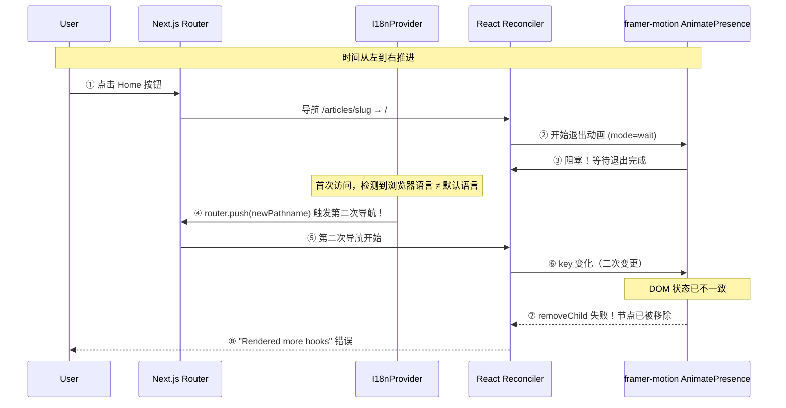

# React "Rendered more hooks" 经典竞态条件：AnimatePresence + 多语言检测的完美风暴

> **架构关键词**：竞态条件、AnimatePresence、React Hook 链、多因子故障、popLayout
> **适用场景**：Next.js App Router 项目，使用了 Framer Motion 页面过渡动画 + 多语言检测

---

## 1. 引言：一个看似随机的崩溃

某天，Sentry 告警响起：

```
Error: Rendered more hooks than during the previous render
```

同时浏览器控制台报错：

```
NotFoundError: Failed to execute 'removeChild' on 'Node'
```

| 现象 | 解释 |
|------|------|
| Sentry 捕获 | `Rendered more hooks` — React 最经典的错误之一 |
| 浏览器 Console | `removeChild` 失败 — DOM 节点已被移除 |
| 发生条件 | 快速导航（快速点击底部导航栏） |
| 用户感受 | 页面白屏 / 组件不渲染 / 导航卡住 |

经过几天排查，识别出这是一个 **多因子竞态条件**（Multi-factor Race Condition），类似于"完美风暴"——单个因子不会导致问题，但多个因子同时出现时，就会触发这个 React 经典错误。

最有趣的是：**同一个 bug 模式在两个不同的 Next.js 应用中都出现了**（管理后台和前端博客），但触发因子却不完全相同。

---

## 2. 错误信号链

### 2.1 Sentry 关键信息

```
Event: Error: Rendered more hooks than during the previous render
User: null (首次访问用户)
Navigation: /en/articles/some-slug → / (快速点击 Home)
```

### 2.2 浏览器 Console 关键信息

```
NotFoundError: Failed to execute 'removeChild' on 'Node': 
The node to be removed is not a child of this node.
    at AnimatePresence...
```

### 2.3 关键线索

- ❌ **不是内存泄漏** — 内存使用正常
- ❌ **不是条件 Hook** — 代码审查未发现条件 Hook 调用
- ❌ **不是异步组件** — 所有组件都是同步渲染
- ✅ **发生在快速导航时** — 特别是通过底部导航栏快速切换
- ✅ **Sentry 堆栈指向 AnimatePresence**

---

## 3. 拆解"完美风暴"：四个因子

### 3.1 因子 A：AnimatePresence `mode="wait"` 阻塞（P0 — 致命）

**文件**: [`PageTransition.tsx`](../../apps/frontend-blog/src/components/PageTransition.tsx:94)

```tsx
<AnimatePresence mode="wait" initial={false}>
  <motion.div key={pathname} ...>
    {children}
  </motion.div>
</AnimatePresence>
```

**问题**: `mode="wait"` 的含义是"等待退出动画完成后，再渲染新内容"。当用户快速点击导航时，`key`（即 `pathname`）在退出动画完成前多次变化，Framer Motion 的 DOM 内部状态进入不一致状态：

1. 第一次导航：`/articles/slug` → `/`，退出动画开始
2. 第二次导航：`/` → `/categories`，但第一次的退出动画还没完成
3. Framer Motion 尝试移除旧的 DOM 节点，但节点已被 React 回收
4. `removeChild` 失败 → DOM 状态损坏 → React Hook 链失稳

**本质**: `mode="wait"` 是一个 **阻塞操作**，与 React 的异步 Reconciliation 模型存在冲突。

### 3.2 因子 B：I18nProvider `router.push()` 在 useEffect 中触发导航（P1 — 中等）

**文件**: [`I18nProvider.tsx`](../../apps/frontend-blog/src/lib/providers/I18nProvider.tsx:20)

```tsx
useEffect(() => {
  // ... 浏览器语言检测逻辑 ...
  const newPathname = pathname.replace(`/${actualLocale}`, `/${browserLang}`);
  router.push(newPathname);  // ← 在 useEffect 中触发第二次导航
}, [actualLocale, pathname, router]);
```

**问题**: 首次访问时，如果没有 `NEXT_LOCALE` cookie，且浏览器语言与默认语言不同，`useEffect` 中的 `router.push()` 会触发 **第二次导航**，而此时第一次导航的 `AnimatePresence mode="wait"` 退出动画仍在进行中。

第一次导航 → 退出动画阻塞 → `router.push()` 触发第二次导航 → 两个导航冲突 → Hook 链崩溃

### 3.3 因子 C：RootPage 服务端组件 `redirect()`（P2 — 低风险，实际安全）

**文件**: [`RootPage`](../../apps/frontend-blog/src/app/page.tsx:52)

```tsx
export default async function RootPage() {
  // ... 服务端语言检测 ...
  redirect(`/${locale}`);
}
```

**潜在风险**: 对 `/` 的直接访问会触发服务端 `redirect()`，产生一次额外的路由变化。

**为什么实际安全**:
- RootPage **只在直接访问 `/`**（输入 URL / 书签 / 外链）时触发
- 此时**没有任何动画在运行**（`AnimatePresence` 尚未挂载）
- 内部 SPA 导航通过 `@/navigation` 的 `localePrefix: 'always'` 自动添加 locale 前缀，绕过 RootPage

> ⚠️ **重要陷阱**: 尝试将 RootPage 转为客户端组件使用 `useRouter()` 会失败，因为 `useRouter` 来自 next-intl，需要 `NextIntlClientProvider` 上下文，而该上下文只在 `[locale]/layout.tsx` 中提供。RootPage 渲染在此上下文之外。

### 3.4 因子 D：`useLanguage()` try/catch 包装（仅管理后台有）

**只在管理后台存在** — 管理后台的 `useLanguage()` hook 使用了 try/catch 包装：

```tsx
export function useLanguage() {
  try {
    const router = useRouter();  // Hook 调用被 try/catch 包裹
    // ...
  } catch {
    return fallback;  // 错误恢复
  }
}
```

**问题**: React 官方规则明确禁止在 try/catch 中调用 Hook。当 React 检测到 Hook 调用顺序异常时，try/catch 阻止了错误的自然传播，导致后续组件的 Hook 链被"跳过"，加剧了 `Rendered more hooks` 错误。

**前端博客不存在此因子** — 前端博客的 `useCurrentLocale` 是正确命名的 Hook，没有 try/catch。

---

## 4. 两端的差异化对比

| 因子 | 管理后台 (admin-blog) | 前端博客 (frontend-blog) |
|------|----------------------|------------------------|
| A: AnimatePresence mode="wait" | ✅ 存在 | ✅ 存在 |
| B: I18nProvider router.push() | ✅ `router.refresh()` 在每次渲染触发 | ✅ `router.push()` 首次访问触发 |
| C: RootPage server redirect | ✅ DashboardPage 有同样问题 | ❌ 确定安全（无动画上下文） |
| D: useLanguage() try/catch | ✅ 存在 | ❌ 不存在 |

**管理后台**: 4 个因子同时触发 → 更容易复现
**前端博客**: 2 个因子同时触发 → 更隐蔽，条件更苛刻

---

## 5. 时间线：完美风暴的形成



**关键转折点在第 ④ 步**：`router.push()` 在退出动画进行中触发了第二次导航，而此时 Framer Motion 的 DOM 状态已经因为第一次的 key 变更进入不稳定状态。

---

## 6. 修复方案

### 6.1 Fix 1（P0）：AnimatePresence `mode="wait"` → `mode="popLayout"`

```diff
- <AnimatePresence mode="wait" initial={false}>
+ <AnimatePresence mode="popLayout" initial={false}>
```

**为什么 `popLayout` 有效**：

| 特性 | mode="wait" | mode="popLayout" |
|------|------------|-----------------|
| 退出动画 | 阻塞——等待退出完成 | 非阻塞——立即开始 |
| 进入动画 | 退出完成后才开始 | 立即开始，与退出并行 |
| 退出元素定位 | 保留在文档流中 | `position: absolute`，脱离文档流 |
| 快速导航 | ❌ DOM 状态损坏 | ✅ 正确处理快速 key 变更 |
| 方向感知动画 | ✅ 正常 | ✅ 正常 |

"脱离文档流"是关键——退出元素不再影响布局，进入元素立即占据正确位置，两者动画并行执行，不存在"阻塞"窗口期。

### 6.2 Fix 2（P1）：I18nProvider 拆分 Effect，添加首次挂载守卫

```tsx
export default function I18nProvider({ children }) {
  const hasRunLocaleDetection = useRef(false);

  // Effect 1: 浏览器语言检测 — 仅在首次挂载时运行
  useEffect(() => {
    if (typeof document === 'undefined') return;
    if (hasRunLocaleDetection.current) return;
    hasRunLocaleDetection.current = true;

    // ... 检测逻辑，包含 router.push() ...
  }, []);  // 空依赖数组 — 永不重跑

  // Effect 2: HTML lang 同步 — 语言变化时运行
  useEffect(() => {
    document.documentElement.lang = actualLocale;
  }, [actualLocale]);

  return <>{children}</>;
}
```

**核心变化**：

| 修改前 | 修改后 |
|--------|--------|
| 一个 `useEffect` 同时处理检测 + 同步 | 两个 `useEffect` 分离关注点 |
| 依赖 `[actualLocale, pathname, router]` | 检测 Effect 依赖 `[]` |
| 每次路由变化都可能重跑 | 检测逻辑只跑一次 |
| `router.push()` 可能发生在导航中 | `router.push()` 只在挂载时触发 |

### 6.3 Fix 3（不修复）：RootPage 保持服务端组件

虽然最初计划将 RootPage 转为客户端组件，但发现：

1. `useRouter` 来自 next-intl，需要 `NextIntlClientProvider` 上下文
2. RootPage 在此上下文之外，会抛出 `No intl context found` 错误
3. RootPage 只在无动画上下文的页面加载时触发

→ **不做任何修改**，保留原始服务端组件。

---

## 7. 复现步骤与验证

### 7.1 复现条件

| 条件 | 说明 |
|------|------|
| 浏览器 | Chrome/Safari/Edge |
| 首次访问 | 无 `NEXT_LOCALE` cookie |
| 浏览器语言 | 与默认语言不同 |
| 操作 | 快速点击导航栏（1 秒内多次） |

### 7.2 验证清单

```bash
# 1. TypeScript 编译检查
yarn workspace @lucky/frontend-blog tsc --noEmit

# 2. 无控制台错误
# 打开 DevTools Console，快速导航，确认无 removeChild 错误

# 3. 无 Sentry 错误
# 部署后观察 Sentry，确认 "Rendered more hooks" 归零

# 4. 动画视觉效果
# 确认 popLayout 下方向感知滑动动画仍然正常
```

---

## 8. 经验教训：如何预防这类 Bug

### 8.1 警惕 `useEffect` 中的导航操作

`router.push()` / `router.replace()` / `router.refresh()` 在 `useEffect` 中是**副作用中的副作用**。它们触发的是**导航**——整个应用状态的重置。如果此时有其他异步操作在进行（如动画），就容易产生竞态条件。

**最佳实践**：
- 导航操作尽量放在事件处理函数中（`onClick` 等）
- 如必须在 `useEffect` 中导航，使用 `useRef` 守卫确保只执行一次
- 考虑使用 `router.replace()` 而非 `router.push()` 避免浏览器历史栈混乱

### 8.2 避免 `AnimatePresence mode="wait"`

`mode="wait"` 的问题在于它**违背了 React 的声明式哲学**——它是命令式的"等待完成后再继续"。在 SPA 中，用户的操作是不可预测的，任何阻塞模型都会引入竞态条件。

**最佳实践**：
- 优先使用 `mode="popLayout"`（Framer Motion v6+）
- 如果必须使用 `mode="wait"`，在用户交互处添加防抖（[`BottomNavigation.tsx`](../../apps/frontend-blog/src/components/BottomNavigation.tsx:11)）
- 考虑使用 CSS 动画替代 framer-motion 的页面过渡（减少 JS 导致的 DOM 操作）

### 8.3 遵守 React Rules of Hooks

这条规则看似简单，但在实际项目中最容易被忽视：

```tsx
// ❌ 错误 — try/catch 包裹 Hook
function useLanguage() {
  try {
    const locale = useLocale();  // Hook 在条件分支中
    return locale;
  } catch {
    return 'en';
  }
}

// ✅ 正确 — Hook 在顶层调用
function useLanguage() {
  const locale = useLocale();  // 顶层调用
  return locale ?? 'en';
}
```

**最佳实践**：
- Hook 永远在顶层调用，不在条件、循环、try/catch 中
- 自定义 Hook 函数名必须以 `use` 开头（React ESLint 规则依赖此约定）

### 8.4 架构层面的思考

这个 bug 提醒我们：**竞态条件往往发生在不同抽象层的交界处**。

| 层次 | 组件 | 问题 |
|------|------|------|
| 动画层 | AnimatePresence | 阻塞 DOM 操作 |
| 导航层 | Next.js Router | 异步路由切换 |
| 数据层 | I18nProvider | useEffect 中触发导航 |
| 渲染层 | React Reconciler | Hook 链稳定性依赖渲染顺序 |

每一层单独看都是正确的设计，但组合在一起时，时序问题就暴露了。

**防御策略**：在架构层面建立"时序契约"——明确哪些操作可以并行，哪些必须串行。例如：
- 动画和导航不应该同时进行（使用 `popLayout` 消除阻塞）
- 数据获取和导航可以并行（React 的 Suspense + Streaming）
- `useEffect` 中的导航应该视为"一次性初始化"，而不是"响应式副作用"

---

## 9. 总结

| 项目 | 内容 |
|------|------|
| 根因 | `AnimatePresence mode="wait"` 阻塞 + `I18nProvider` `router.push()` 在动画中触发第二次导航 |
| 管理后台因子数 | 4（A + B + C + D） |
| 前端博客因子数 | 2（A + B） |
| Fix 1 | `mode="wait"` → `mode="popLayout"` |
| Fix 2 | I18nProvider 拆分 Effect + `useRef` 守卫 |
| Fix 3 | RootPage 不修改（服务端组件安全） |
| 核心教训 | `useEffect` 中的导航操作需要警惕竞态条件 |

这个 bug 的场景在 Next.js + Framer Motion 的项目中非常典型——你可能会在完全不同的项目、不同的依赖版本中遇到同样的模式。理解其背后的**多因子竞态条件**本质，比记住特定的修复方案更有价值。

> 最后，记住一句真理：**`mode="wait"` 在 SPA 中是一个幻觉——用户永远不会等你。**
