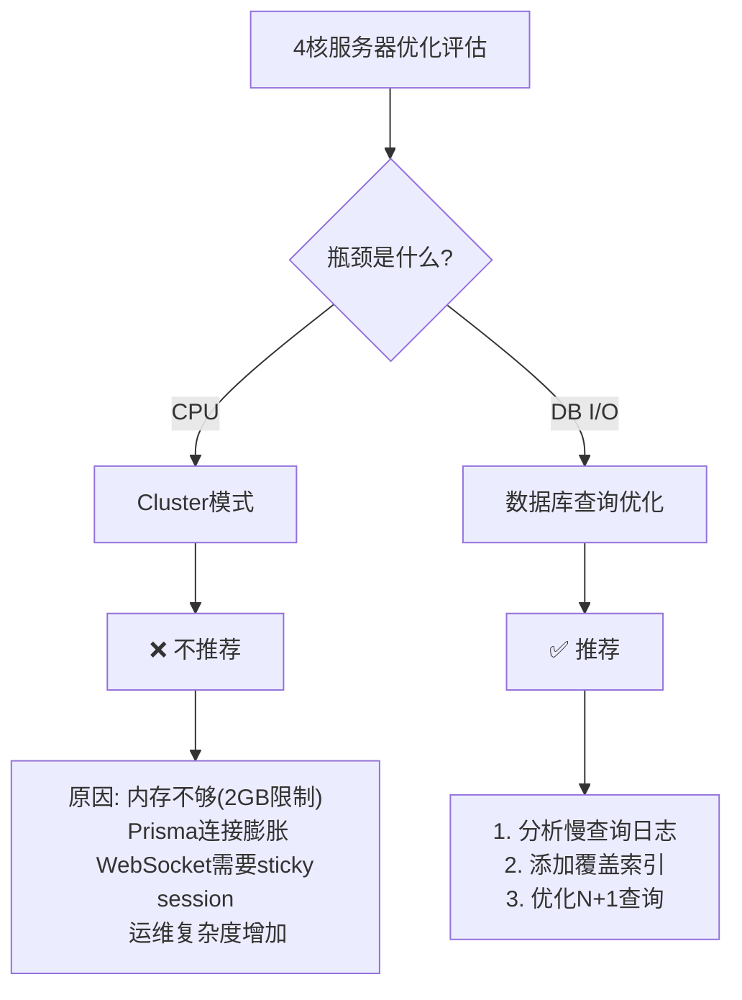

## 1. 背景

JoyMini API 部署在一台 4 核 VPS 上。某天在审查服务器配置时，产生了一个自然的疑问：

> **"Node.js 是单线程的，而我们有 4 个 CPU 核心。是不是应该启用 Cluster 模式来榨干多核性能？"**

为了回答这个问题，我们对服务器现状、应用瓶颈和各项优化方案进行了系统性的评估。

### 服务器规格

| 项目 | 值 |
|------|-----|
| CPU 核心数 | **4 核** |
| CPU 型号 | AMD EPYC 9J45 |
| 架构 | 4 sockets × 1 core/socket |
| 总内存 | 7.8 GB |
| 容器内存限制 | Backend 2GB / PostgreSQL 2GB / Redis 512MB / Nginx 64MB |

## 2. 当前配置状态总览

在评估优化方案前，先了解当前各组件的配置：

| 组件 | 当前值 | 是否最优 |
|------|--------|---------|
| Node.js 进程 | 单进程（无 cluster 模式） | ✅ 适合当前架构 |
| `UV_THREADPOOL_SIZE` | 默认 4（未设置） | ✅ 匹配 4 核 |
| Nginx `worker_processes` | `auto` → 4 workers | ✅ 最优 |
| Nginx `proxy_cache` | 60s TTL, 2GB max | ✅ 已启用 |
| Nginx `gzip` | level 5 | ✅ 已启用 |
| PostgreSQL `shared_buffers` | 256MB | ⚠️ 可优化 |
| 应用层缓存 | `PublicCacheInterceptor` (NestJS) | ✅ 已启用 |
| Prisma 慢查询日志 | 200ms 阈值 | ✅ 已启用 |

其中几个关键配置的代码位置：

**Nginx 代理缓存配置**（[`nginx/nginx.prod.conf:39`](nginx/nginx.prod.conf:39)）：
```nginx
proxy_cache_path /var/cache/nginx/public_api levels=1:2 keys_zone=public_cache:10m max_size=2g inactive=60m use_temp_path=off;
```

**Prisma 慢查询日志配置**（[`apps/api/src/common/prisma/prisma.service.ts:48`](apps/api/src/common/prisma/prisma.service.ts:48)）：
```typescript
private readonly isDev = process.env.NODE_ENV !== 'production';
private readonly slowMs = Number(
  process.env.PRISMA_SLOW_MS ?? (this.isDev ? 80 : 200),
);
```

## 3. 优化方案逐一评估

### 3.1 ❌ 不推荐：Cluster 模式

Cluster 模式是 Node.js 最常被提起的多核利用方案。它通过 `fork()` 创建多个 Worker 进程，每个进程监听同一个端口，由操作系统负责负载均衡。

但在我们的场景中，**Cluster 模式不仅不推荐，甚至可能降低系统稳定性**。

**原因一：瓶颈是 DB I/O，不是 CPU**

Node.js 应用在处理 API 请求时，大部分时间在**等待 Prisma 查询返回**。以下是典型的请求耗时分解：

```
请求进入 → 路由匹配 → 参数校验 → Prisma 查询（等待 DB） → 数据处理 → 响应返回
                                    ↑
                              这里占了 80%+ 的时间
```

瓶颈在数据库 I/O 等待，而非 CPU 计算。增加 Cluster Worker 不会让数据库查询变快，反而会因为并发查询增多而**加剧数据库压力**。

**原因二：内存开销不可接受**

```
单个 Worker 内存：~100-200MB
4 个 Worker = 400-800MB
容器限制：2GB
           ↑
      剩余内存将不足以支撑应用正常运行
```

在 2GB 的容器内存限制下，Cluster 模式会消耗大量内存用于进程复制，严重影响可用资源。

**原因三：Prisma 连接数膨胀**

每个 Worker 需要独立的 Prisma 连接池，意味着连接数会乘以 Worker 数：

| 配置 | 连接数 | 说明 |
|------|--------|------|
| 单进程（默认连接池） | ~10 | Prisma 默认连接池大小 |
| Cluster 4 Worker | ~40 | 每个 Worker 独立连接池 |
| PostgreSQL 最大连接数 | ~100 | 2GB 容器下的典型上限 |

**原因四：WebSocket 需要 sticky session**

Socket.IO 的 WebSocket 连接是状态化的，Cluster 模式下需要配置 Redis 适配器或 sticky session，否则连接会在不同 Worker 间跳转：

```typescript
// 需要额外的 Redis 适配器配置
import { createAdapter } from '@socket.io/redis-adapter';
import { createClient } from 'redis';

// 每个 Worker 需要独立的 Redis pub/sub 客户端
const pubClient = createClient({ url: process.env.REDIS_URL });
const subClient = pubClient.duplicate();
io.adapter(createAdapter(pubClient, subClient));
```

**原因五：运维复杂度增加**

- 进程崩溃恢复（`cluster.on('exit', ...)`）
- 优雅重启（`SIGTERM` 处理）
- 日志聚合（多个进程写同一文件）
- 指标聚合（CPU/内存使用率）

**结论：** 对于 API 网关应用，单 Node.js 进程配合 Nginx 反向代理 + 缓存是最优架构。

### 3.2 ❌ 不推荐：增加 UV_THREADPOOL_SIZE

`UV_THREADPOOL_SIZE` 控制 libuv 线程池的大小，默认值为 4。它影响以下操作：

- **加密/解密**：bcrypt 密码哈希、JWT 签名验证
- **DNS 解析**：`dns.lookup()`
- **文件系统 I/O**：`fs.*` 操作

**评估：**

| 方面 | 当前状态 | 评估 |
|------|---------|------|
| 默认值 | 4（匹配 4 核） | ✅ 合适 |
| bcrypt 调用量 | 仅登录/注册时 | ✅ 不是瓶颈 |
| JWT 操作 | 每次请求验证 | ⚪ 轻微影响 |
| 文件系统操作 | 极少（主要在 Worker 中） | ✅ 不是瓶颈 |

增加线程数反而会增加上下文切换开销，在 CPU 密集型操作不多的情况下，收益为负。

### 3.3 ⚠️ 低优先级：PostgreSQL shared_buffers

PostgreSQL 的 `shared_buffers` 决定数据库内核缓存的共享内存大小。

| 参数 | 当前值 | 建议值 |
|------|--------|--------|
| `shared_buffers` | 256MB（总内存的 3.3%） | 512MB-1GB（总内存的 10-25%） |

**但**：当前 PostgreSQL 实际仅使用约 **48MB** 的共享缓存，`shared_buffers` 远未成为瓶颈。在没有大量缓存未命中的情况下，增加 `shared_buffers` 不会带来明显性能提升。

### 3.4 ✅ 推荐：数据库查询优化（高优先级）

这是目前性价比最高的优化方向。

**现状分析：**

Prisma 已配置慢查询日志（[`apps/api/src/common/prisma/prisma.service.ts:48`](apps/api/src/common/prisma/prisma.service.ts:48)），生产环境的慢查询阈值为 **200ms**：

```typescript
// 生产环境: PRISMA_SLOW_MS=200，或默认 200ms
this.slowMs = Number(process.env.PRISMA_SLOW_MS ?? 200);

// 慢查询日志输出（[apps/api/src/common/prisma/prisma.service.ts:77]）
if (isSlow) {
  this.logger.log(
    `🐢 SLOW ${took}ms ${e.query}${e.params ? ` | params=${truncateParams(e.params)}` : ''}`,
  );
}
```

**建议执行步骤：**

1. **分析现有慢查询日志**：收集并分析生产环境的慢查询记录，找出频繁出现的表和不合理的查询模式

2. **对高频查询添加覆盖索引（Covering Index）**：
   ```sql
   -- 例如：针对文章列表查询添加复合索引
   CREATE INDEX CONCURRENTLY idx_blog_articles_published
   ON "BlogArticle" ("publishedAt", "status")
   INCLUDE ("title", "slug", "excerpt");
   ```

3. **优化 N+1 查询模式**：使用 Prisma 的 `include` 或 `select` 合并查询，避免循环中执行多次查询：
   ```typescript
   // ❌ N+1: 查出文章后循环查分类
   const articles = await prisma.blogArticle.findMany();
   for (const article of articles) {
     const category = await prisma.blogCategory.findUnique({
       where: { id: article.categoryId },
     });
   }

   // ✅ 1+N→1: 使用 include 合并查询
   const articles = await prisma.blogArticle.findMany({
     include: { category: true },
   });
   ```

### 3.5 ✅ 推荐：应用层 Redis 缓存扩展（中优先级）

**现状分析：**

系统已通过 [`PublicCacheInterceptor`]（基于 `@nestjs/cache-manager`）实现了应用层缓存，支持以下特性：

- 缓存 Key 包含 locale/platform 维度隔离
- 支持 `__nocache` 参数调试绕过
- 默认缓存策略基于 NestJS 的 `CacheInterceptor`

**建议：**

1. **审计缓存覆盖率**：检查哪些 API 端点未使用缓存但适合缓存（如系统配置、分类列表、标签列表等低频变化数据）

2. **差异化 TTL**：根据数据变更频率设置不同的缓存过期时间：

| 数据类型 | 当前 TTL | 建议 TTL |
|---------|---------|---------|
| 分类列表 | 未缓存 | 5 分钟 |
| 标签列表 | 未缓存 | 5 分钟 |
| 系统配置 | 未缓存 | 10 分钟 |
| 文章详情 | 60s (Nginx) | 60s + Redis 缓存 |

### 3.6 ✅ 推荐：Nginx proxy_cache TTL 调优（低优先级）

**现状：**

Nginx 配置（[`nginx/nginx.prod.conf:197`](nginx/nginx.prod.conf:197)）对所有匹配 `~/api/v1/(frontend/blog|client/system-config)` 的公开 GET  API 设置了 60s 缓存：

```nginx
proxy_cache_valid 200 301 302 304 60s;
```

**建议：**

| 路径 | 当前 TTL | 建议 TTL | 理由 |
|------|---------|---------|------|
| `/frontend/blog/categories` | 60s | 300s | 分类几乎不变 |
| `/frontend/blog/tags` | 60s | 300s | 标签几乎不变 |
| `/frontend/blog/articles/:slug` | 60s | 120s | 文章内容稳定 |
| `/client/system-config` | 60s | 600s | 系统配置极少变动 |

## 4. 总结

### 核心结论



**不需要启用 Cluster 模式。** 对于 API 网关应用，单 Node.js 进程配合 Nginx 反向代理 + 缓存是最优架构。真正的性能瓶颈在数据库查询层面，而非 CPU。

### 推荐执行顺序

| 优先级 | 优化项 | 预期效果 | 难度 |
|--------|--------|---------|------|
| 1 | 收集并分析 Prisma 慢查询日志 → 加索引 | ⭐⭐⭐ 降低响应延迟 | ⭐ |
| 2 | 审计 API 缓存覆盖率 → 扩展 Redis 缓存 | ⭐⭐ 减少重复查询 | ⭐⭐ |
| 3 | 微调 Nginx proxy_cache TTL | ⭐ 减少后端请求 | ⭐ |
| 4 | （可选）增加 PostgreSQL shared_buffers 到 512MB | ⚪ 长期收益 | ⭐ |

### 经验总结

这次评估的核心收获是：**不要因为"大家都在用"就盲目引入复杂度。** Cluster 模式确实能利用多核，但在 IO 密集型应用中，它解决的不是核心瓶颈问题。优化前需要先问自己两个问题：

1. **瓶颈在哪里？**（CPU vs I/O vs 网络）
2. **这个方案解决瓶颈吗？**（Cluster 解决 CPU 瓶颈，不解决 I/O 瓶颈）

对于小规模 API 服务（1-4 核），单 Node.js 进程 + Nginx 缓存 + 数据库优化，远比 Cluster 模式更实用、更稳定。

## 5. 相关文档

- [Nginx API 网关配置：生产环境部署](docs/blog/articles/devops/nginx-api-gateway-dev-prod.md)
- [VPS 服务器初始化与安全加固](docs/blog/articles/devops/vps-server-initialization-hardening.md)
- [Prisma 数据库架构：从 Schema 到高阶查询模式](docs/blog/articles/admin-next/prisma-database-architecture.md)
- [部署流水线：从代码提交到生产上线](docs/blog/articles/devops/deployment-pipeline-full-process.md)
