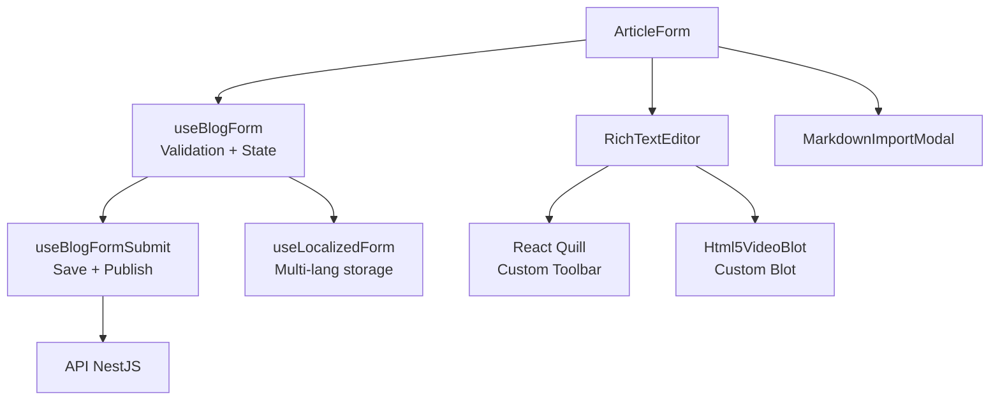
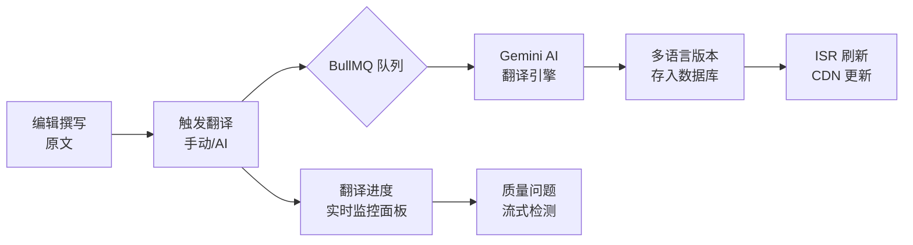
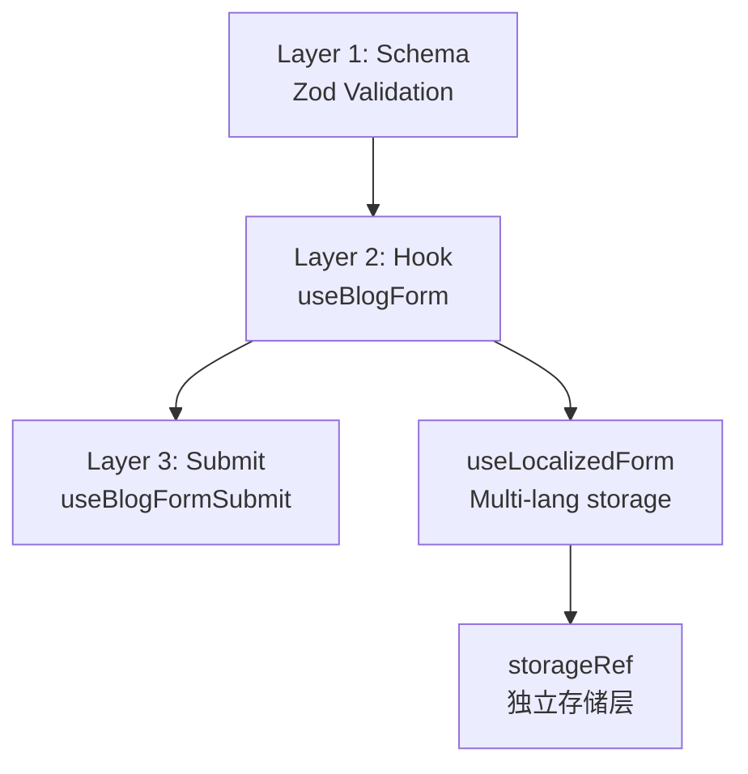
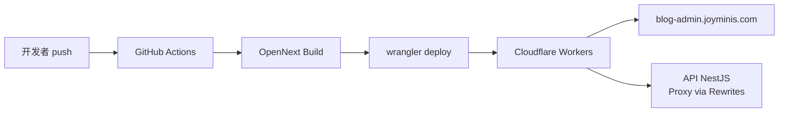

# JoyMini Admin Blog — 博客 CMS 管理后台架构实践

> **定位：** JoyMini 博客系统的内容管理中枢，为运营团队提供文章编辑、多语言翻译、评论审核、媒体管理等一站式博客运营能力。
>
> **规模：** 12+ 管理页面 | 540+ 行富文本编辑器 | 1309+ 行翻译监控面板 | 6 语言支持 | Cloudflare Workers 边缘部署

---

## 一、项目概述

JoyMini Admin Blog（`@lucky/admin-blog`）是 JoyMini 博客平台的管理后台，支撑 [blog.joyminis.com](https://blog.joyminis.com) 的全部内容运营工作。编辑器和管理员可以在此创建文章、管理分类标签、审核读者评论、管理媒体资源，以及通过 AI 翻译管道将内容自动翻译为 6 种语言。

**核心数据：**
- 12+ 管理页面覆盖完整博客运营流程
- 6 语言内容管理（韩文/英文/简体中文/繁体中文/日文/越南文）
- AI 自动翻译管道 + 实时进度追踪
- 富文本 + Markdown 双模式编辑器
- SSE 流式翻译质量检测
- Cloudflare Workers 边缘部署

**技术栈：**

| 层 | 技术选型 | 选择理由 |
|---|---------|---------|
| 框架 | Next.js 15 App Router | Server Components + 流式渲染、App Router 布局嵌套 |
| 状态管理 | Zustand + persist 中间件 | 轻量、TypeScript 友好、localStorage 持久化 |
| 数据缓存 | TanStack Query v5 | 服务端数据缓存 + 乐观更新、自动 GC |
| 表格 | TanStack Table v8 | Headless UI、虚拟滚动、排序/筛选/分页 |
| 表单 | React Hook Form + Zod | 类型安全的表单验证、Schema 驱动 |
| HTTP 客户端 | axios + 自定义 HttpClient | 拦截器体系（Token 刷新/错误处理/401 单飞重试） |
| 富文本编辑器 | React Quill (react-quill-new) | 可扩展 Blot 体系、自定义工具栏 |
| 拖拽 | @dnd-kit | 分类/标签拖拽排序 |
| 样式 | Tailwind CSS 4 | 原子化 CSS、暗黑主题 |
| 国际化 | next-intl | 6 语言路由 + 多语言内容渲染 |
| 部署 | Cloudflare Workers (OpenNext) | 边缘部署、全球低延迟访问 |
| 监控 | Sentry | 错误追踪 + 性能监控 |

---

## 二、核心功能模块

### 2.1 文章管理

完整的文章生命周期管理，从创建、编辑到发布、多语言翻译：

| 功能 | 页面/组件 | 说明 |
|------|----------|------|
| 文章列表 | [`articles/page.tsx`](apps/admin-blog/src/app/(dashboard)/blog/articles/page.tsx) | SmartTable 驱动的 CRUD 列表，支持搜索/筛选/排序/批量操作 |
| 文章编辑 | [`ArticleForm.tsx`](apps/admin-blog/src/views/blog/ArticleForm.tsx) | 3 层表单架构 + 多语言字段编辑 |
| 富文本编辑器 | [`RichTextEditor.tsx`](apps/admin-blog/src/components/blog/RichTextEditor.tsx) | 540 行自定义 Quill 编辑器，支持 HTML5 视频 Blot |
| Markdown 导入 | [`MarkdownImportModal.tsx`](apps/admin-blog/src/components/blog/MarkdownImportModal.tsx) | 解析 Frontmatter + GFM Markdown → HTML |
| 文章预览 | [`articles/[slug]/page.tsx`](apps/admin-blog/src/app/(dashboard)/blog/articles/[slug]/page.tsx) | 实时预览文章渲染效果 |

**文章编辑器架构：**



> 详细架构见：[admin-blog 表单架构](../frontend/admin-blog-form-architecture.md)

### 2.2 分类与标签管理

| 功能 | 页面 | 技术亮点 |
|------|------|---------|
| 分类管理 | [`categories/page.tsx`](apps/admin-blog/src/app/(dashboard)/blog/categories/page.tsx) | SmartTable + @dnd-kit 拖拽排序 |
| 标签管理 | [`tags/page.tsx`](apps/admin-blog/src/app/(dashboard)/blog/tags/page.tsx) | 颜色标签 + 自定义排序 |

### 2.3 评论审核

| 功能 | 页面 | 说明 |
|------|------|------|
| 评论列表 | [`comments/page.tsx`](apps/admin-blog/src/app/(dashboard)/blog/comments/page.tsx) | 审核/驳回/删除，XSS 消毒后展示 |
| 敏感词过滤 | API 端 SensitiveWordFilterPipe | DFA 算法 O(n) 扫描，1000 字 < 1ms |

### 2.4 多语言翻译中心

这是 admin-blog 的核心差异化能力 —— 完整的 AI 驱动翻译管道：

| 页面/组件 | 文件 | 功能 |
|-----------|------|------|
| 翻译进度监控 | [`BlogTranslationProgress.tsx`](apps/admin-blog/src/views/blog/BlogTranslationProgress.tsx) | 1309 行实时监控面板，集成 BullMQ 队列状态 |
| 翻译问题检测 | [`BlogTranslationIssues.tsx`](apps/admin-blog/src/views/blog/BlogTranslationIssues.tsx) | 自动检测不完整翻译 + 批量修复 |
| 流式质量检测 | [`BlogTranslationQualityDetectionStream.tsx`](apps/admin-blog/src/views/blog/BlogTranslationQualityDetectionStream.tsx) | SSE 流式实时翻译质量检测 |
| 双栏编辑器 | [`LocalizedFieldEditor.tsx`](apps/admin-blog/src/components/blog/LocalizedFieldEditor.tsx) | 双栏 AI 辅助翻译编辑 |
| 多语言渲染 | [`renderLocalizedText()`](apps/admin-blog/src/utils/localizedText.ts) | 5 级回退渲染链 |

**翻译管道流程：**



> 详细文章：[翻译进度追踪](../frontend/admin-blog-translation-progress.md) · [翻译问题检测](../frontend/admin-blog-translation-issues.md) · [SSE 流式质量检测](../api/sse-streaming-translation-quality-detection.md)

### 2.5 批量文章导入

| 功能 | 页面 | 说明 |
|------|------|------|
| 批量导入 | [`import/page.tsx`](apps/admin-blog/src/app/(dashboard)/blog/import/page.tsx) | 从 Markdown 文件批量导入文章+Frontmatter 解析 |

### 2.6 仪表盘

| 功能 | 页面 | 说明 |
|------|------|------|
| 博客概览 | [`page.tsx`](apps/admin-blog/src/app/(dashboard)/blog/page.tsx) | 文章统计、翻译进度概览 |

### 2.7 系统设置

| 功能 | 页面 | 说明 |
|------|------|------|
| 系统配置 | [`settings/page.tsx`](apps/admin-blog/src/app/(dashboard)/settings/page.tsx) | 博客系统级配置 |
| 多语言配置 | [`settings/locales/page.tsx`](apps/admin-blog/src/app/(dashboard)/settings/locales/page.tsx) | 启用/禁用语言、默认语言设置 |

---

## 三、关键技术亮点

### 3.1 HttpClient 拦截器体系

自定义 [`HttpClient`](apps/admin-blog/src/api/http.ts) 封装 axios，提供企业级 HTTP 能力：

```typescript
// 请求拦截：自动注入 Token + 语言头
this.instance.interceptors.request.use((config) => {
  config.headers.Authorization = `Bearer ${getToken()}`;
  config.headers['Accept-Language'] = getLanguage();
  return config;
});

// 响应拦截：Token 自动刷新 + 业务错误处理
this.instance.interceptors.response.use(
  (res) => res.data,
  async (error) => {
    if (error.response?.status === 401) {
      return handle401AndRetry(error); // 单飞 Token 刷新
    }
    return handleBizError(error); // 业务错误码映射
  }
);
```

**亮点：**
- **单飞 Token 刷新** — 多请求同时 401 时只刷新一次，其余排队等待
- **业务错误码映射** — 后端错误码自动转为用户友好提示
- **自动重试** — 网络抖动时指数退避重试（最多 3 次）
- **Presigned URL 直传** — 三步上传：GET presigned URL → PUT to R2 → Confirm

> 详细文章：[HttpClient 认证刷新与重试](../admin/http-client-auth-refresh-retry.md)

### 3.2 SmartTable 通用 CRUD 组件

[`SmartTable`](apps/admin-blog/src/components/scaffold/SmartTable/SmartTable.tsx) 是 admin-blog 的 ProTable 风格通用组件，一个组件覆盖所有列表页：

```typescript
<SmartTable
  columns={[
    { key: 'title', title: '标题' },
    { key: 'category', title: '分类', render: (v) => <Badge>{v.name}</Badge> },
    { key: 'status', title: '状态', valueType: 'enumTag' },
    { key: 'createdAt', title: '创建时间', valueType: 'date' },
    { key: 'actions', title: '操作' },
  ]}
  fetchFn={api.getArticles}
  queryKey={['articles']}
/>
```

**自动能力：** SearchForm 从 columns 自动生成 → DataTable 自动处理加载/空/错误态 → Pagination 国际化感知 → 导出 CSV

> 详细文章：[SmartTable 通用数据表格](../admin/smart-table-generic-data-grid.md)

### 3.3 3 层表单架构

Admin-blog 的表单系统采用清晰的 3 层分离设计：



| 层 | 文件 | 职责 |
|---|------|------|
| Schema | `Zod` 定义 | 字段类型、必填校验、自定义规则 |
| Hook | [`useBlogForm.ts`](apps/admin-blog/src/hooks/useBlogForm.ts) | 表单状态 + 双向绑定 |
| Submit | [`useBlogFormSubmit.ts`](apps/admin-blog/src/hooks/useBlogFormSubmit.ts) | 创建/更新逻辑、成功/错误处理 |
| Localized | [`useLocalizedForm.ts`](apps/admin-blog/src/hooks/useLocalizedForm.ts) | 多语言字段独立存储层 |

> 详细文章：[admin-blog 表单架构](../frontend/admin-blog-form-architecture.md) · [多语言表单](../frontend/admin-blog-localized-form.md)

### 3.4 多语言渲染体系

为解决 `[object Object]` 渲染问题和语言回退，设计了完整的 5 级回退链：

```
① 当前语言 → ② 后备语言列表 → ③ 任意可用语言 → ④ key 本身 → ⑤ 空字符串
```

核心函数 [`renderLocalizedText()`](apps/admin-blog/src/utils/localizedText.ts) 和组件 [`LocalizedFieldEditor`](apps/admin-blog/src/components/blog/LocalizedFieldEditor.tsx) 覆盖了所有多语言渲染和编辑场景。

> 详细文章：[admin-blog 多语言渲染](../frontend/admin-blog-localized-rendering.md)

### 3.5 富文本编辑器

[`RichTextEditor`](apps/admin-blog/src/components/blog/RichTextEditor.tsx) 基于 React Quill 构建，是 admin-blog 最复杂的 UI 组件之一（540 行）：

| 特性 | 实现 |
|------|------|
| 自定义工具栏 | 标题/列表/引用/代码块/媒体嵌入 |
| HTML5 视频 Blot | [`Html5VideoBlot.ts`](apps/admin-blog/src/components/blog/Html5VideoBlot.ts) 自定义 Quill Blot |
| Markdown 导入 | [`MarkdownImportModal.tsx`](apps/admin-blog/src/components/blog/MarkdownImportModal.tsx) + GFM 解析 |
| 内容消毒 | DOMPurify 安全过滤 |
| 媒体上传 | Presigned URL 直传 + 进度条 |

> 详细文章：[admin-blog 富文本编辑器](../frontend/admin-blog-rich-text-editor.md)

### 3.6 SSE 流式翻译质量检测

翻译质量检测支持 REST 批处理和 SSE 流式两种模式：

- **批处理模式**：`BlogTranslationQualityDetection` — 批量检测不完整翻译
- **流式模式**：`BlogTranslationQualityDetectionStream` — 基于 [`useSSE`](apps/admin-blog/src/hooks/useSSE.ts) Hook 的实时流式检测

```typescript
// 可复用的 SSE Hook
const { data, isConnecting, error, connect, disconnect } = useSSE<DetectionEvent>(
  '/api/v1/admin/blog/translation/detect-incomplete/stream?lang=en'
);
```

> 详细文章：[SSE 流式翻译质量检测](../api/sse-streaming-translation-quality-detection.md)

---

## 四、部署架构



| 环境 | 平台 | 域名 |
|------|------|------|
| 生产 | Cloudflare Workers | blog-admin.joyminis.com |
| 预览 | Cloudflare Workers (Preview) | PR 自动生成 preview URL |

API 代理：Next.js `rewrites` 将 `/api/v1/admin/blog/*` 请求代理到后端 API 服务器（`api.joyminis.com`）。

---

## 五、技术栈总结

| 类别 | 技术 | 用途 |
|------|------|------|
| **框架** | Next.js 15 (App Router) | 全栈 React 框架 |
| **状态管理** | Zustand + persist | 全局状态 + localStorage 持久化 |
| **数据缓存** | TanStack Query v5 | 服务端/客户端统一缓存 |
| **表格** | TanStack Table v8 | Headless 表格渲染引擎 |
| **表单** | React Hook Form + Zod | 类型安全表单验证 |
| **HTTP** | axios (自定义 HttpClient) | 请求拦截器 + Token 自动刷新 |
| **编辑器** | React Quill (react-quill-new) | 富文本编辑 + 自定义 Blot |
| **拖拽** | @dnd-kit | 分类/标签拖拽排序 |
| **样式** | Tailwind CSS 4 | 原子化 CSS |
| **国际化** | next-intl | 6 语言路由 + 多语言内容 |
| **部署** | Cloudflare Workers (OpenNext) | 边缘部署 |
| **监控** | Sentry | 错误追踪 + 性能监控 |
| **AI** | Google Gemini (via API) | 自动翻译 + 质量检测 |

---

## 相关阅读

### 项目系列

- [JoyMini Blog — 多语言博客平台的 SSG/SSR/ISR 混合渲染实践](./joymini-blog-platform.md) — 前端博客技术解析
- [JoyMini API — 企业级 NestJS 后端架构实践](./joymini-api-nestjs.md) — 后端 API 技术解析
- [JoyMini Admin — Next.js 智能管理后台架构实践](./joymini-admin-nextjs.md) — 运营后台技术解析
- [JoyMini Flutter App — 跨平台超级 App 架构实践](./joymini-flutter-super-app.md) — Flutter App 技术解析

### 深度技术文章

| 文章 | 分类 |
|------|------|
| [HttpClient 认证刷新与重试](../admin/http-client-auth-refresh-retry.md) | 前端架构 |
| [SmartTable 通用数据表格](../admin/smart-table-generic-data-grid.md) | 前端架构 |
| [admin-blog 表单架构](../frontend/admin-blog-form-architecture.md) | 表单系统 |
| [admin-blog 多语言表单](../frontend/admin-blog-localized-form.md) | 表单系统 |
| [admin-blog 多语言渲染](../frontend/admin-blog-localized-rendering.md) | 多语言 |
| [admin-blog 富文本编辑器](../frontend/admin-blog-rich-text-editor.md) | 编辑器 |
| [翻译进度追踪](../frontend/admin-blog-translation-progress.md) | 翻译系统 |
| [翻译问题检测与修复](../frontend/admin-blog-translation-issues.md) | 翻译系统 |
| [SSE 流式翻译质量检测](../api/sse-streaming-translation-quality-detection.md) | 翻译系统 |
| [Presigned URL 直传](../api/presigned-url-direct-upload.md) | 媒体上传 |

---

*撰写于 2026 年 · JoyMini 技术团队*
