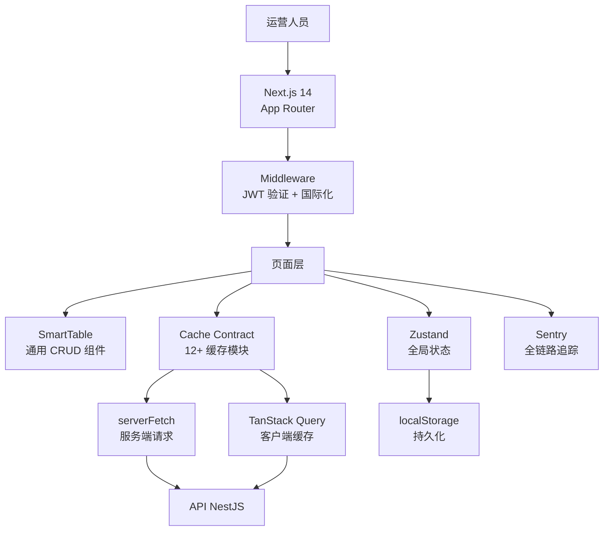
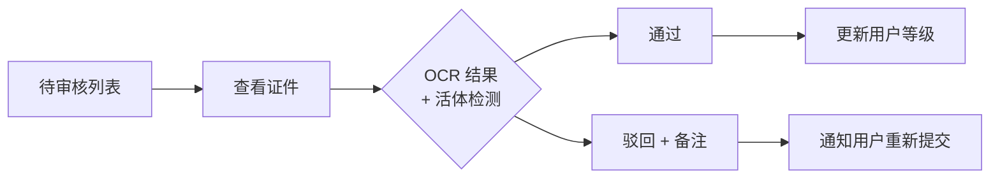

# JoyMini Admin — Next.js 智能管理后台架构实践

## 一、项目概述

JoyMini Admin 是 JoyMini 全平台统一运营管理后台，支撑 **用户管理、订单金融、商品营销、KYC 审核、即时通讯客服、系统配置** 等 20+ 业务模块，为运营团队提供一站式管理能力。

**核心数据：**
- 20+ 业务管理模块
- 12+ 统一缓存契约模块
- 40+ 列表/详情页面组件
- JWT 双令牌认证 + 多级权限控制
- Sentry 全链路追踪

---

## 二、技术架构总览

### 2.1 架构图



### 2.2 技术栈

| 层 | 技术选型 | 选择理由 |
|---|---------|---------|
| 框架 | Next.js 14 App Router | Server Components + 流式渲染、内置 API Routes |
| 状态管理 | Zustand + persist 中间件 | 轻量、TypeScript 友好、localStorage 持久化 |
| 数据缓存 | TanStack Query v5 | 服务端/客户端统一缓存、乐观更新 |
| HTTP 客户端 | axios + 自定义 HttpClient | 拦截器体系（Token 刷新/错误处理/重试） |
| 样式 | Tailwind CSS | 原子化 CSS，快速原型 + 暗黑主题 |
| 动画 | Framer Motion | 弹窗/侧边栏/列表动画 |
| 部署 | Cloudflare Workers | 边缘部署，全球高速访问 |

> 🎥 录屏建议：展示项目目录结构 `apps/admin-next/src/` — views/（页面）、lib/cache/（缓存模块）、api/（HTTP 客户端）、components/（UI 组件）

---

## 三、核心功能模块

### 3.1 仪表盘 Dashboard

运营数据一目了然：

```typescript
// Dashboard 关键指标统计
const stats = await api.dashboard.getStats();
// 返回: { totalUsers, newUsersToday, totalOrders, revenueToday, pendingKyc, ... }
```

**核心指标卡：** 用户总数、今日新增、订单量、今日收入、待审核 KYC、在线客服数
**趋势图表：** 7 日/30 日用户增长曲线、订单趋势、收入趋势

> 🎥 录屏建议：展示 Dashboard 页面，突出数字动效和图表交互

### 3.2 用户管理

完整的用户生命周期管理：

| 功能 | 说明 |
|------|------|
| 用户列表 | 搜索（用户名/手机/邮箱）+ 多条件筛选 + 排序 + 分页 |
| 用户详情 | 基本信息、设备列表、操作记录、订单历史 |
| KYC 审核 | 身份证 OCR 结果查看、活体检测视频回放、审核通过/驳回 |
| 地址管理 | 用户收货地址列表、新增/编辑 |

**KYC 审核流程：**



> 🎥 录屏建议：展示用户列表搜索筛选、点击进入用户详情、KYC 审核弹窗（展示证件照片和审核按钮）

### 3.3 订单与财务管理

| 模块 | 功能 | 状态流转 |
|------|------|---------|
| 订单管理 | 订单列表/搜索/详情、退款处理 | 待支付 → 已支付 → 已发货 → 已完成 |
| 充值管理 | 充值记录、审核 | 待审核 → 已通过/已驳回 |
| 提现管理 | 提现申请、审核 | 待审核 → 审核中 → 已打款/已驳回 |
| 交易记录 | 全部交易流水 | 不可逆的审计日志 |

### 3.4 商品与营销

| 模块 | 功能 |
|------|------|
| 商品管理 | 商品 CRUD、多规格、上下架 |
| Banner 管理 | 首页 Banner 配置、排序、绑定商品 |
| 优惠券 | 创建/发放/核销、满减/折扣类型 |
| 秒杀活动 | 时间段配置、商品绑定、限购设置 |
| 幸运抽奖 | 活动配置、奖品管理、开奖记录 |

### 3.5 系统管理

| 模块 | 功能 |
|------|------|
| 管理员管理 | 管理员账户 CRUD、角色权限分配 |
| 操作日志 | 所有管理员操作审计日志、操作类型/时间/IP |
| 系统配置 | 键值对配置、分组管理 |
| 多语言配置 | 动态语言包管理、翻译管理 |

### 3.6 即时通讯客服

支持运营人员查看用户消息、回复消息、强制撤回、关闭会话：

```typescript
// 客服回复 API
api.support.reply(conversationId, { content: '您好，请问有什么可以帮助您？' });
```

> 🎥 录屏建议：展示客服对话界面 — 查看用户消息、回复、消息撤回

---

## 四、关键技术亮点

### 4.1 SmartTable 通用 CRUD 组件

这是项目的核心抽象 —— **一个组件覆盖所有列表页**：

```typescript
// 通用 SmartTable 使用示例 — 用户列表
<SmartTable
  columns={[
    { key: 'id', title: 'ID' },
    { key: 'username', title: '用户名', render: (v) => <UserCell user={v} /> },
    { key: 'email', title: '邮箱' },
    { key: 'status', title: '状态', render: (v) => <Badge color={v ? 'green' : 'gray'}>{v ? '启用' : '禁用'}</Badge> },
    { key: 'createdAt', title: '注册时间', render: (v) => formatTime(v) },
    { key: 'actions', title: '操作', render: (_, row) => <ActionButtons row={row} /> },
  ]}
  fetchFn={api.users.getList}
  queryKey={['users']}
/>
```

**亮点：**
- 统一的搜索/筛选/排序/分页体验
- 自动处理加载态/空态/错误态
- 导出 CSV 功能
- 适配 20+ 列表页，**代码复用率 > 90%**

> 🎥 录屏建议：快速切换多个列表页面（用户列表、订单列表、商品列表），展示一致的表格交互体验

### 4.2 缓存契约模式（Cache Contract）

这是数据层的核心抽象 —— **12+ 缓存模块遵循统一模式**：

```typescript
// lib/cache/users-cache.ts — 统一的缓存契约模式
export const USERS_LIST_TAG = 'users:list';

// 1. SearchParams 解析（从 URL 参数到 API 参数）
export function parseUsersSearchParams(searchParams: NextSearchParams): UsersListQueryInput {
  return {
    page: parsePositiveInt(readParam(searchParams, 'page'), 1),
    pageSize: parsePositiveInt(readParam(searchParams, 'pageSize'), 20),
    keyword: readParam(searchParams, 'keyword'),
    status: parseOptionalInt(readParam(searchParams, 'status')),
    // ... 更多筛选条件
  };
}

// 2. Query Key 构建（用于 TanStack Query 缓存）
export function usersListQueryKey(input: UsersListQueryInput): QueryKey {
  return ['users', 'list', input];
}

// 3. 服务端预取（用于 SSR/ISR）
export async function prefetchUsersList(queryClient: QueryClient, input: UsersListQueryInput) {
  await queryClient.prefetchQuery({
    queryKey: usersListQueryKey(input),
    queryFn: () => serverGet<PaginatedResponse<User>>('/admin/users', { params: input }),
  });
}
```

**12+ 统一缓存模块：** `users-cache`、`orders-cache`、`products-cache`、`kyc-cache`、`banners-cache`、`groups-cache`、`address-cache`、`login-logs-cache`、`operation-logs-cache`、`payment-channels-cache`、`finance-deposits-cache`、`finance-withdrawals-cache`、`finance-transactions-cache`...

**为什么这么做？**
- URL 参数解析 → 查询 key 构建 → 数据获取，三阶段逻辑绑定在一起
- 修改变更只修改一个文件，**一致性保障**
- 服务端 `serverFetch` + 客户端 TanStack Query **双端共享同一套键值**

> 🎥 录屏建议：展示多个缓存契约文件（users-cache.ts、orders-cache.ts 等）的相似结构，展示实际缓存效果（Network 面板显示数据来自 TanStack Query 缓存）

### 4.3 认证与安全

**Middleware JWT 验证：**

```typescript
// middleware.ts — 全局 JWT 验证
export function middleware(request: NextRequest) {
  const token = request.cookies.get('access_token')?.value;
  
  if (!token || isJwtExpiredOrMalformed(token)) {
    // 检查 refresh_token 是否存在
    const refreshToken = request.cookies.get('refresh_token')?.value;
    if (refreshToken) {
      // 尝试静默刷新
      return NextResponse.redirect(new URL('/api/auth/refresh', request.url));
    }
    // 无有效令牌，重定向到登录
    return NextResponse.redirect(new URL(`/${locale}/login`, request.url));
  }
  
  return NextResponse.next();
}
```

**安全体系：**

| 防护层 | 实现 | 说明 |
|--------|------|------|
| JWT 双令牌 | access_token (15min) + refresh_token (7d) | 减少 Token 暴露风险 |
| CSRF | 动态 Token 生成 + 验证 | 防止跨站请求伪造 |
| XSS 防护 | `sanitizeInput()` + React 自动转义 | 输入输出双向防护 |
| SQL 注入 | `containsSqlInjection()` 检测 | 关键词黑名单匹配 |
| 数据脱敏 | `maskPhone()` / `maskEmail()` / `maskIdCard()` | 敏感信息展示保护 |

> 🎥 录屏建议：展示 JWT 过期后的自动刷新流程（Network 面板看 401 → refresh → retry）

### 4.4 HttpClient 拦截器体系

```typescript
// api/http.ts — 自定义 HttpClient
class HttpClient {
  private setupInterceptors() {
    // 请求拦截：注入 Token + 语言头
    this.instance.interceptors.request.use((config) => {
      config.headers.Authorization = `Bearer ${this.getToken()}`;
      config.headers['Accept-Language'] = this.getLanguage();
      return config;
    });

    // 响应拦截：业务错误处理 + Token 自动刷新
    this.instance.interceptors.response.use(
      (res) => res.data, // 直接提取 data
      async (error) => {
        if (error.response?.status === 401) {
          return this.handle401AndRetry(error); // 单飞 Token 刷新
        }
        return this.handleBizError(error); // 业务码错误映射到用户消息
      }
    );
  }
}
```

**亮点：**
- **单飞 Token 刷新** — 多请求同时 401 时只刷新一次 Token，其余等待
- **业务错误码映射** — 后端业务错误码自动转换为用户友好的中文提示
- **自动重试** — 网络抖动时自动重试（最多 3 次，指数退避）

### 4.5 Sentry 全链路追踪

```typescript
// lib/sentry-span.ts — 全链路追踪封装
export async function withAppSpan<T>(name: string, fn: () => Promise<T>): Promise<T> {
  return Sentry.startSpan({ op: 'app', name }, async (span) => {
    span.setAttributes(cleanAttributes({ /* 自动注入请求上下文 */ }));
    return fn();
  });
}

// 使用示例 — 每个 API 调用自动标记追踪
export async function getUsers(params) {
  return withAppSpan('users.list', () => serverGet('/admin/users', { params }));
}
```

**追踪层级：**
- `withAppSpan` — 应用级调用追踪
- `withSsrSpan` — 服务端渲染追踪
- `withUiActionSpan` — 用户操作追踪（点击/表单提交）
- `withHttpClientSpan` — HTTP 请求追踪

> 🎥 录屏建议：打开 Sentry Performance 面板，展示每个 API 请求的 Span 瀑布图

---

## 五、UI/UX 设计

### 5.1 Framer Motion 动画系统

```typescript
// 侧边栏展开/收起动画
<motion.aside
  animate={{ width: isCollapsed ? 64 : 240 }}
  transition={{ type: 'spring', stiffness: 300, damping: 30 }}
>
```

**动画覆盖范围：**
- 侧边栏展开/收起（Spring 物理动画）
- 弹窗出现/消失（缩放 + 透明度）
- 列表项进入动画（Stagger 子项延迟）
- Toast 通知（滑动进入 + 自动消失）
- 主题切换（平滑过渡）

### 5.2 暗黑/明亮主题

基于 Zustand persist 中间件持久化到 localStorage：

```typescript
const useAppStore = create<AppState>()(
  persist(
    (set) => ({
      theme: 'light',
      toggleTheme: () => set((state) => ({
        theme: state.theme === 'light' ? 'dark' : 'light',
      })),
    }),
    {
      name: 'app-preferences',
      storage: createJSONStorage(() => localStorage),
      partialize: (state) => ({ theme: state.theme }),
    }
  )
);
```

> 🎥 录屏建议：展示主题切换（light → dark → light），展示所有页面的主题一致性

### 5.3 多语言 i18n 支持

管理后台支持韩文/英文/中文等多语言界面切换，语言偏好持久化存储。

---

## 六、技术栈总结

| 类别 | 技术 | 用途 |
|------|------|------|
| **框架** | Next.js 14 (App Router) | 全栈框架 + 流式渲染 |
| **状态管理** | Zustand | 全局状态 + localStorage 持久化 |
| **数据缓存** | TanStack Query v5 | 服务端/客户端统一缓存 |
| **HTTP** | axios | 自定义 HttpClient + 拦截器 |
| **UI** | Tailwind CSS + Framer Motion | 原子化样式 + 动画系统 |
| **安全** | JWT + CSRF + XSS 防护 | 多层安全防护 |
| **监控** | Sentry | 全链路追踪 + 错误监控 |
| **部署** | Cloudflare Workers | 边缘部署 |
| **测试** | Vitest + Playwright | 单元测试 + E2E 测试 |
| **CI/CD** | GitHub Actions + GitLab CI | 双平台自动部署 |

---

> 📌 **本文是 JoyMini 项目系列介绍之一：**
> - [JoyMini Super App — Flutter 驱动的社交电商平台](./joymini-flutter-super-app.md)
> - [JoyMini API — 企业级 NestJS 后端架构实践](./joymini-api-nestjs.md)
> - [JoyMini Admin Blog — 博客 CMS 管理后台](./joymini-admin-blog.md)
> - **JoyMini Admin — Next.js 智能管理后台**（本文）
> - [JoyMini Blog — 多语言博客平台的 SSG/SSR/ISR 实践](./joymini-blog-platform.md)
