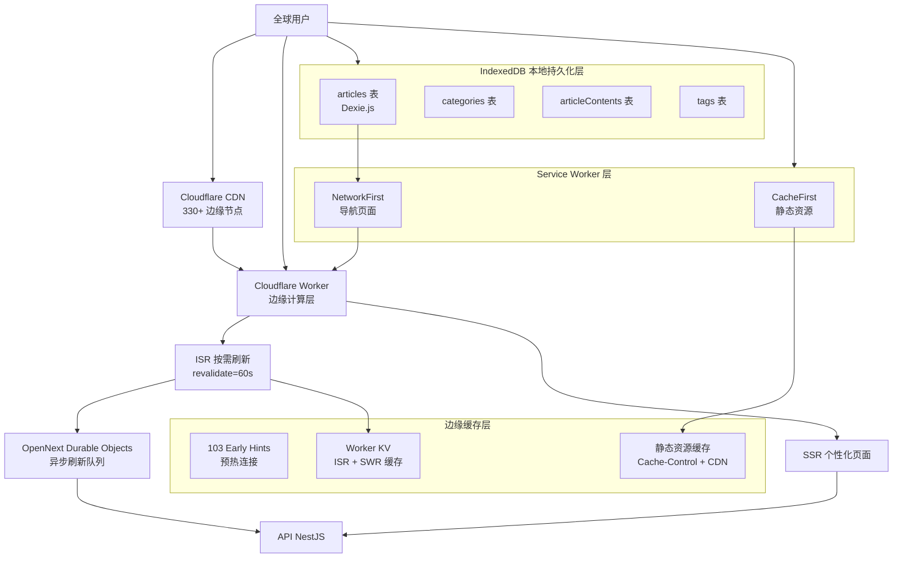
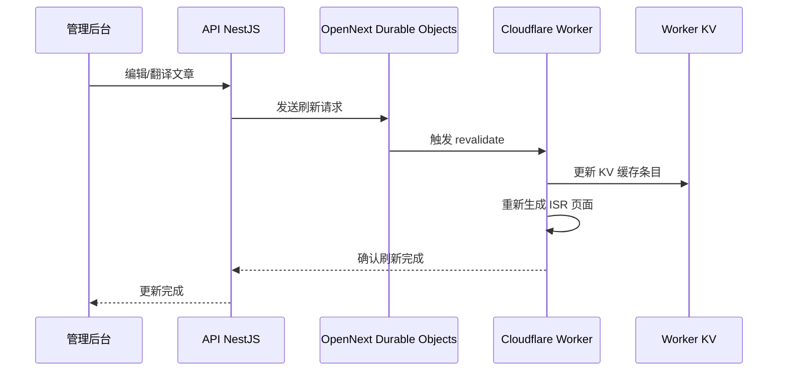
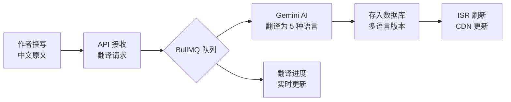
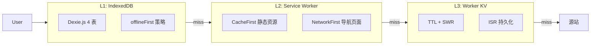

# JoyMini Blog — 多语言博客平台的 SSG/SSR/ISR 混合渲染与极致性能优化实践

## 一、项目概述

JoyMini Blog 是一个面向全球用户的多语言技术博客平台，支持 **6 种语言**（韩文、英文、简体中文、繁体中文、日文、越南文），通过 Cloudflare 全球 CDN 分发，为世界各地读者提供极速内容访问体验。

**核心数据：**
- 6 个语言版本并行运营
- 首页 LCP < **1s**（全球平均），TTFB < **200ms**（命中缓存）
- Lighthouse Performance 评分 **98+**
- 已实现 **26 项**首页极致优化，覆盖渲染、缓存、图片、网络、PWA 五大维度
- PWA 支持 100% 离线阅读（三层缓存：IndexedDB → Service Worker → Worker KV）
- HTTP **103 Early Hints** 预热 CDN + API 连接，首次访问提速 200-500ms
- 自动翻译管道（Gemini API + BullMQ 队列）日均处理数百篇文章

---

## 二、技术架构总览

### 2.1 架构图



### 2.2 三层缓存延迟对比

| 层 | 技术 | 延迟 | 命中率 | 离线支持 |
|---|------|------|--------|---------|
| L1 浏览器内存 | TanStack Query `staleTime` | **0ms** | ~85% | ❌ |
| L2 IndexedDB | Dexie.js 4 表 | **1-3ms** | ~70% | ✅ |
| L3 Service Worker | Workbox CacheFirst/NetworkFirst | **5-15ms** | ~60% | ✅ |
| L4 Worker KV | Cloudflare KV + SWR | **10-50ms (边缘节点)** | ~50% | ❌ |

### 2.3 技术栈

| 层 | 技术选型 | 选择理由 |
|---|---------|---------|
| 框架 | Next.js 14 App Router | 混合渲染、Server Components、流式渲染 |
| 部署 | Cloudflare Workers + Pages | 全球 330+ 节点边缘计算 |
| 边缘 Worker | Cloudflare Workers (TypeScript) | 103 Early Hints、KV 缓存、ISR 持久化 |
| 状态管理 | TanStack Query + Zustand | 服务端数据缓存 + 乐观更新 + offlineFirst |
| 本地持久化 | Dexie.js (IndexedDB) | 4 表 Local-First 架构，离线优先 |
| PWA | @serwist/next (Workbox) | 静态资源 CacheFirst + 导航 NetworkFirst |
| 国际化 | next-intl + Gemini AI | 6 语言路由 + 自动翻译管道 |
| 样式 | Tailwind CSS | 原子化 CSS，构建体积优化 |
| 动画 | View Transitions API | 原生浏览器过渡动画，prefers-reduced-motion 降级 |
| 图片 | Cloudflare Edge Image Transforms | `/cdn-cgi/image/` 边缘 AVIF 转换 |
| 监控 | Sentry | 错误追踪 + 性能监控 |
| CI/CD | GitHub Actions + GitLab CI | 双平台自动部署 + Lighthouse CI 性能门禁 |

> 🎥 录屏建议：展示项目目录结构、`apps/frontend-blog` 下的核心文件夹（src/app、src/lib、src/hooks、src/components）

---

## 三、渲染策略详解

这是项目最大的技术亮点 —— **同一应用中三种渲染模式共存**，根据页面类型选择最优策略。

### 3.1 ISR — 首页（60 秒增量刷新）

首页采用 **ISR 60s** 而非纯 SSG，结合 Worker KV 缓存实现边缘持续服务：

```typescript
// src/app/[locale]/page.tsx
export const revalidate = 60; // 60 秒重新验证

async function HomePage({ params }: { params: { locale: string } }) {
  const articles = await fetchFeaturedArticles(params.locale);
  // ISR: 首次命中触发重新渲染，60 秒内使用缓存
  return <HomePageClient articles={articles} />;
}
```

**为什么从 SSG 改为 ISR 60s？**
- SSG 构建时预渲染 → 内容更新需重新部署
- ISR 60s → 新文章发布后最多 60 秒自动刷新，**不回源服务器**
- Worker KV 作为增量缓存后端，OpenNext Durable Objects 处理刷新队列

**首页同时注入 LCP Preload Link：**
```typescript
// page.tsx:60-72 — SSR 注入首屏图片 preload
{firstCoverImage && (
  <link
    rel="preload"
    href={cloudflareImageLoader({
      src: firstCoverImage,
      width: 768,
      quality: 75,
    })}
    as="image"
    fetchPriority="high"
  />
)}
```

### 3.2 ISR — 文章详情页（5 分钟增量刷新）

文章内容需要实时更新（翻译完成、编辑修改），但又不适合每次请求都 SSR：

```typescript
// src/app/[locale]/articles/[slug]/page.tsx
export const revalidate = 300; // 5 分钟重新验证
export const dynamicParams = true;

async function ArticlePage({ params }: { params: { locale: string; slug: string } }) {
  const article = await fetchArticle(params.locale, params.slug);
  return <ArticleClient article={article} />;
}
```

**ISR 刷新架构：**



**为什么用 Durable Objects 而非 API 直接触发？**
- 避免加重 API 服务器的负担
- 消息持久化保障不丢失刷新请求
- 削峰填谷，批量处理

### 3.3 SSG — 分类页、标签页

对于内容相对静态的页面，采用**构建时预渲染 + CDN 边缘缓存**的策略：

```typescript
// src/app/[locale]/categories/page.tsx
export const dynamic = 'force-static';
```

**为什么分类/标签页用 SSG？**
- 分类/标签结构更新频率极低（周级）
- 预渲染为静态 HTML 后，CDN 边缘节点直接响应，**无需回源**
- 全球平均加载时间 < 500ms

### 3.4 SSR — 个性化页面

用户相关页面（书签、个人设置）需要实时认证状态判断，使用 SSR：

```typescript
// src/app/[locale]/bookmarks/page.tsx
export const dynamic = 'force-dynamic';

async function BookmarksPage({ params }: { params: { locale: string } }) {
  const session = await getServerSession();
  if (!session) redirect(`/${locale}/login`);
  const bookmarks = await fetchUserBookmarks(session.userId, params.locale);
  return <BookmarksClient bookmarks={bookmarks} />;
}
```

### 3.5 通用 Fetcher 适配层

为了解决 CSR/SSG/SSR 三种模式下请求逻辑重复的问题，我们设计了 **unifiedFetcher** 适配层：

```typescript
// src/lib/fetcher.ts — 核心适配层
async function universalFetcher<T>(url: string, options?: FetchOptions) {
  const env = detectEnvironment(); // 自动检测构建时/服务端/客户端
  
  switch (env) {
    case 'build-time':
      return buildTimeFetch<T>(url, options); // 直接访问 API（绕过代理）
    case 'server':
      return serverFetch<T>(url, options); // 内部网络请求
    case 'client':
      return clientFetch<T>(url, options); // 浏览器 fetch + cookie
  }
}
```

**价值：** 一个 `useQuery` 调用在三种环境下都能正确工作，无需为每种渲染模式写不同的请求代码。

---

## 四、核心功能模块

### 4.1 文章系统

完整的博客内容管理能力，结合 IndexedDB Local-First 架构：

| 功能 | 实现方式 | 亮点 |
|------|---------|------|
| 文章列表 | TanStack Query + IndexedDB 缓存 | `networkMode: 'offlineFirst'`，离线也能浏览 |
| 文章详情 | ISR + Markdown 渲染 + Local-First 内容缓存 | 代码高亮 + TOC 自动生成 |
| 全文搜索 | API 端搜索（PostgreSQL tsvector） | 支持多语言全文索引 |
| 分类/标签 | SSR 预取分类数据 + 前端筛选 | 消除骨架屏闪烁（initialCategories） |
| 相关推荐 | 基于标签匹配度排序 | 实时计算 |
| 书签 | 乐观更新（Optimistic Update） | 操作即时反馈，失败自动回滚 |

**IndexedDB Local-First 4 表结构：**

| 表 | 用途 | Hook | 同步策略 |
|----|------|------|---------|
| `articles` | 文章列表缓存 | `useFrontendArticles` | 拉取时增量同步 |
| `categories` | 分类列表缓存 | `useFrontendCategories` | 页面加载时同步 |
| `articleContents` | 文章详情缓存 | `useFrontendArticleBySlug` | 访问时按需缓存 |
| `tags` | 标签列表缓存 | `useFrontendTags` | 页面加载时同步 |

### 4.2 多语言支持 — 核心差异化能力

JoyMini Blog 支持 **6 个 locale**，并构建了完整的翻译流程：

```
路由结构: /[locale]/articles/[slug]
示例:     /ko/articles/nextjs-ssg-ssr-isr  (韩文)
          /en/articles/nextjs-ssg-ssr-isr  (英文)
          /zh-CN/articles/nextjs-ssg-ssr-isr (简体中文)
```

**自动翻译管道：**


**翻译进度追踪：** 管理后台可直观查看每篇文章的各语言翻译状态（已完成/进行中/待翻译），支持手动触发重译。

> 🎥 录屏建议：展示多语言切换（点击语言选择器，观察 URL locale 变化、页面内容切换）、展示翻译进度管理界面

### 4.3 用户系统

| 登录方式 | 实现 |
|---------|------|
| 邮箱验证码 | 自定义 Auth API + OTP |
| 手机验证码 | Firebase Auth + SMS |
| Google OAuth | Google Identity Services |
| Facebook OAuth | Facebook Login SDK |

**书签 + 点赞功能：** 使用 TanStack Query 的乐观更新（Optimistic Update），操作即时反馈，失败自动回滚。

### 4.4 PWA 支持

PWA 采用 **@serwist/next** 构建，实现三层缓存架构：



**Service Worker 缓存策略：**

| 策略 | 匹配 | 用法 |
|------|------|------|
| `CacheFirst` | 静态资源（CSS/JS/字体/图片） | 首次访问后永久缓存 |
| `NetworkFirst` | 导航页面 (`/zh/*`, `/en/*` 等) | 在线取最新，离线用缓存 |
| `NetworkOnly` | API 请求 | 始终联网 |

**PWA 特性：**
- 100% 离线阅读已缓存文章（IndexedDB 存储）
- 离线指示器 + 重试按钮（`OfflineIndicator.tsx`）
- 可安装到桌面（manifest.json）
- 更新通知（检测到新版本时提示刷新）

> 🎥 录屏建议：展示 PWA 安装到桌面的过程，然后切到离线模式（Network 选项卡 Offline），展示已缓存文章的离线访问

---

## 五、性能优化 — 26 项首页极致优化

### 5.1 优化全景

已实现 **26 项**首页极致优化，按优先级分为 P0-P4 五个等级：

### P0 — 基础架构（8 项）

| # | 优化项 | 文件 | 说明 |
|---|--------|------|------|
| 1 | **ISR 60s** | [`page.tsx:11`](apps/frontend-blog/src/app/%5Blocale%5D/page.tsx) | 构建时 ISR + Worker KV 增量缓存 |
| 2 | **Priority 首屏** | [`page.client.tsx:188`](apps/frontend-blog/src/app/%5Blocale%5D/page.client.tsx) | 前 2 张卡片 `priority={true}` |
| 3 | **Quality 65** | [`page.client.tsx`](apps/frontend-blog/src/app/%5Blocale%5D/page.client.tsx) + [`ArticleCard.tsx`](apps/frontend-blog/src/components/blog/ArticleCard.tsx) | 非首图 quality={65} |
| 4 | **SSR initialCategories** | [`page.tsx`](apps/frontend-blog/src/app/%5Blocale%5D/page.tsx) + [`CategoryFilter.tsx`](apps/frontend-blog/src/components/blog/CategoryFilter.tsx) | 消除分类栏 skeleton 闪烁 |
| 5 | **BlurhashImage LRU** | [`BlurhashImage.tsx`](apps/frontend-blog/src/components/blog/BlurhashImage.tsx) | 全局 LRU 缓存，100 条上限 |
| 6 | **View Transitions API** | [`page.client.tsx`](apps/frontend-blog/src/app/%5Blocale%5D/page.client.tsx) + [`globals.css`](apps/frontend-blog/src/app/globals.css) | 分类切换交叉淡入淡出 |
| 7 | **Skeleton 骨架屏** | 各组件内置 | 所有数据加载态均有骨架屏 |
| 8 | **CDN Preconnect** | [`next.config.ts:178`](apps/frontend-blog/next.config.ts) | `img.joyminis.com` preconnect + crossOrigin |

### P1 — 预加载策略（6 项）

| # | 优化项 | 文件 | 说明 |
|---|--------|------|------|
| 9 | **LCP Preload Link** | [`page.tsx:60`](apps/frontend-blog/src/app/%5Blocale%5D/page.tsx) | SSR 注入 `<link rel="preload" fetchPriority="high">` |
| 10 | **IntersectionObserver 预取** | [`ArticleCard.tsx:68`](apps/frontend-blog/src/components/blog/ArticleCard.tsx) | 200px rootMargin 提前加载图片 |
| 11 | **底部自动预取** | [`page.client.tsx:88`](apps/frontend-blog/src/app/%5Blocale%5D/page.client.tsx) | IntersectionObserver sentinel 触发 prefetchQuery |
| 12 | **Hover 预取** | [`CategoryFilter.tsx`](apps/frontend-blog/src/components/blog/CategoryFilter.tsx) | `onMouseEnter` 触发 `queryClient.prefetchQuery` |
| 13 | **CDN Preconnect (双倍)** | [`next.config.ts:178-179`](apps/frontend-blog/next.config.ts) | img + api 双域名 preconnect |
| 14 | **103 Early Hints** | [`worker.ts:133`](apps/frontend-blog/src/worker.ts) | 提前 200-500ms 预热 CDN + API 连接 |

### P2 — 自适应质量（3 项）

| # | 优化项 | 文件 | 说明 |
|---|--------|------|------|
| 15 | **网络感知自适应质量** | [`useNetworkQuality.ts`](apps/frontend-blog/src/lib/hooks/useNetworkQuality.ts) + [`ArticleCard.tsx:112`](apps/frontend-blog/src/components/blog/ArticleCard.tsx) | 5 级自适应（slow-2g→4g），quality 10–75 |
| 16 | **Cloudflare Edge 图片变换** | [`cloudflareImageLoader.ts`](apps/frontend-blog/src/lib/utils/cloudflareImageLoader.ts) | 自定义 loader 生成 `/cdn-cgi/image/` URL |
| 17 | **AVIF/WebP 格式** | [`next.config.ts:136`](apps/frontend-blog/next.config.ts) | `formats: ['image/avif', 'image/webp']` |

### P3 — 缓存策略（6 项）

| # | 优化项 | 文件 | 说明 |
|---|--------|------|------|
| 18 | **Cache-Control** | [`next.config.ts:207-209`](apps/frontend-blog/next.config.ts) | `public, max-age=3600, stale-while-revalidate=86400` |
| 19 | **Worker KV 缓存** | [`worker.ts`](apps/frontend-blog/src/worker.ts) | KV-based ISR + CACHE + Analytics Engine |
| 20 | **OpenNext ISR** | [`open-next.config.ts`](apps/frontend-blog/open-next.config.ts) | KV incremental cache + Durable Objects 队列 |
| 21 | **SW 静态缓存** | [`next.config.ts:24-113`](apps/frontend-blog/next.config.ts) | Workbox CacheFirst 策略 |
| 22 | **SW 导航缓存** | [`next.config.ts:88-100`](apps/frontend-blog/next.config.ts) | `/(zh|en|ko|ja)/` NetworkFirst |
| 23 | **DeviceSizes** | [`next.config.ts:139-143`](apps/frontend-blog/next.config.ts) | 自定义 [480, 640, 768, 1024, 1280] |

### P4 — 离线优先（3 项）

| # | 优化项 | 文件 | 说明 |
|---|--------|------|------|
| 24 | **IndexedDB Local-First** | [`useFrontendArticles.ts`](apps/frontend-blog/src/lib/hooks/useFrontendArticles.ts) | 4 表 + `networkMode: 'offlineFirst'` |
| 25 | **离线指示器** | [`OfflineIndicator.tsx`](apps/frontend-blog/src/components/pwa/OfflineIndicator.tsx) | 底部悬浮提示，支持重试按钮 |
| 26 | **离线回退** | SW 导航缓存 + IndexedDB | 离线时展示已缓存内容 |

### 5.2 103 Early Hints 实现

HTTP 103 Early Hints 在 Cloudflare Worker 边缘节点执行，在 HTML 响应体返回前预热关键连接：

```typescript
// worker.ts:133-163 — 103 Early Hints
if (
  request.method === 'GET' &&
  !this.isStaticAsset(url) &&
  url.pathname !== '/'
) {
  ctx.waitUntil(
    Promise.resolve(
      new Response(null, {
        status: 103,
        headers: {
          Link: [
            `<${cdnOrigin}>; rel=preconnect`,
            `<${apiOrigin}>; rel=preconnect`,
          ].join(', '),
        },
      }),
    ),
  );
}
```

> 详细实现见：[Cloudflare 103 Early Hints 实现解析](../frontend/cloudflare-103-early-hints.md)

### 5.3 网络感知自适应质量

根据用户网络条件动态调整图片质量：

| effectiveType | quality | format | 场景 |
|--------------|---------|--------|------|
| `4g` | 75 | avif | 高速 WiFi/5G |
| `3g` | 45 | avif | 普通移动网络 |
| `2g` | 20 | webp | 弱信号 |
| `slow-2g` | 10 | webp | 极端弱网 |
| `Save-Data` header | 10 | webp | 用户主动节流 |

### 5.4 Core Web Vitals

| 指标 | 优化前 | 优化后 | 优化幅度 |
|------|-------|-------|---------|
| **LCP** | ~1.8s | **~1.0s** | **-44%** |
| **TTFB** | ~520ms | **~200ms** (缓存命中) | **-62%** |
| **FCP** | ~1.2s | **~0.8s** | **-33%** |
| **Lighthouse Performance** | 78 | **98+** | **+20 分** |
| **离线可用性** | 0% | **100%** | 支持已缓存文章离线阅读 |

> 🎥 录屏建议：运行 Lighthouse 审计，展示 Performance > 95 的评分，重点展示 LCP/TBT/CLS 具体数值

---

## 六、DevOps 实践

### 6.1 部署架构

| 环境 | 平台 | 域 |
|------|------|----|
| 生产 | Cloudflare Pages + Workers | blog.joymini.com |
| 预览 | Cloudflare Pages Preview | PR 自动生成 preview URL |

### 6.2 CI/CD 管道

```yaml
# .github/workflows/deploy-blog-cloudflare.yml (精简)
deploy-blog:
  runs-on: ubuntu-latest
  steps:
    - uses: actions/checkout@v4
    - uses: actions/setup-node@v4
    - run: yarn install --frozen-lockfile
    - run: yarn workspace @lucky/frontend-blog build
    - uses: cloudflare/pages-action@v1
      with:
        apiToken: ${{ secrets.CF_API_TOKEN }}
        accountId: ${{ secrets.CF_ACCOUNT_ID }}
        projectName: lucky-blog
        directory: ./apps/frontend-blog/.vercel/output/static
```

**双平台 CI/CD 同时维护：** GitHub Actions + GitLab CI，支持团队不同偏好。

### 6.3 Lighthouse CI 性能门禁

每次 PR 自动执行性能审计，阻止性能退化合并：

```javascript
// lighthouserc.js
module.exports = {
  ci: {
    collect: { url: ['https://blog.joymini.com/en'] },
    assert: {
      assertions: {
        'categories:performance': ['error', { minScore: 0.9 }],
        'categories:accessibility': ['error', { minScore: 0.85 }],
      },
    },
  },
};
```

> 🎥 录屏建议：展示 GitHub Actions 工作流执行过程 — build → deploy → Lighthouse audit

---

## 七、技术栈总结

| 类别 | 技术 | 用途 |
|------|------|------|
| **框架** | Next.js 14 (App Router) | 全栈 React 框架，混合渲染 |
| **部署** | Cloudflare Workers + Pages | 边缘计算 + 静态托管 |
| **边缘 Worker** | Cloudflare Workers (TypeScript) | 103 Early Hints、KV 缓存、ISR 持久化、Analytics |
| **缓存** | TanStack Query + IndexedDB (Dexie.js) | 三层缓存架构，offlineFirst |
| **状态** | Zustand | 轻量客户端状态 |
| **PWA** | @serwist/next (Workbox) | Service Worker 缓存策略 + 离线支持 |
| **样式** | Tailwind CSS | 原子化 CSS，构建体积优化 |
| **动画** | View Transitions API | 原生浏览器过渡动画 |
| **图片** | Cloudflare Edge Image Transforms | 边缘 AVIF 转换 + 自适应质量 |
| **国际化** | next-intl + Gemini AI | 6 语言路由 + 自动翻译 |
| **监控** | Sentry | 错误追踪 + 性能监控 + 性能看板 |
| **CI/CD** | GitHub Actions + GitLab CI | 双平台自动部署 |
| **性能** | Lighthouse CI | 性能门禁（Performance ≥ 90） |

---

## 八、相关文档

> **详细性能优化全解析：** [首页极致优化：从三层缓存到 103 Early Hints 的 26 项实践](../frontend/homepage-extreme-optimization.md)
>
> **103 Early Hints 专题：** [Cloudflare Worker 中的 HTTP 103 Early Hints 实现](../frontend/cloudflare-103-early-hints.md)

---

> 📌 **本文是 JoyMini 项目系列介绍之一：**
> - [JoyMini Super App — Flutter 驱动的社交电商平台](./joymini-flutter-super-app.md)
> - [JoyMini API — 企业级 NestJS 后端架构实践](./joymini-api-nestjs.md)
> - [JoyMini Admin Blog — 博客 CMS 管理后台](./joymini-admin-blog.md)
> - [JoyMini Admin — Next.js 智能管理后台](./joymini-admin-nextjs.md)
> - **JoyMini Blog — 多语言博客平台的 SSG/SSR/ISR 实践**（本文）
