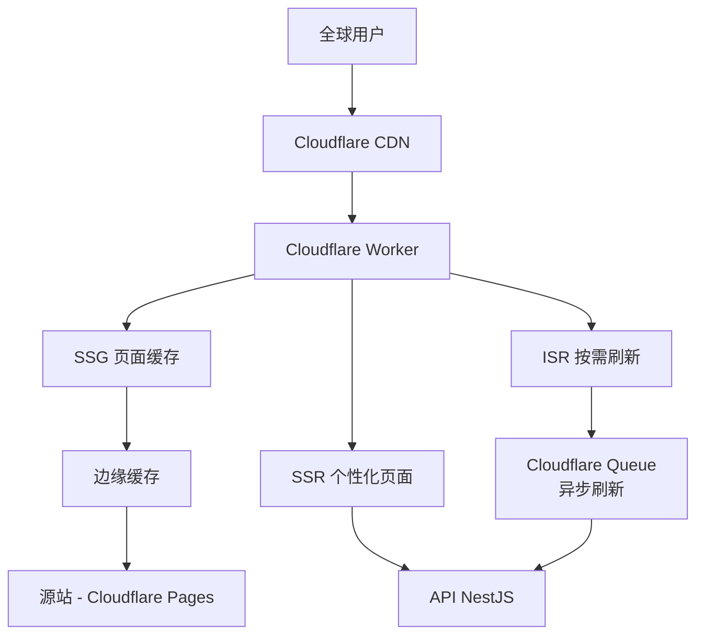
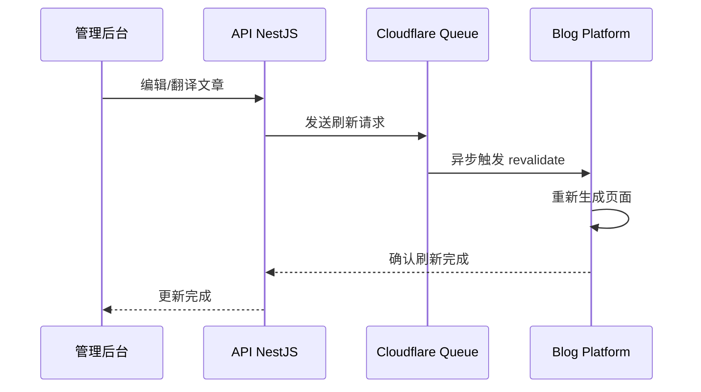
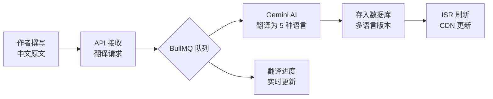

# JoyMini Blog — 多语言博客平台的 SSG/SSR/ISR 混合渲染实践

## 一、项目概述

JoyMini Blog 是一个面向全球用户的多语言技术博客平台，支持 **6 种语言**（韩文、英文、简体中文、繁体中文、日文、越南文），通过 Cloudflare 全球 CDN 分发，为世界各地读者提供极速内容访问体验。

**核心数据：**
- 6 个语言版本并行运营
- SSG 首页首屏加载 < 500ms（全球平均）
- Lighthouse Performance 评分 > 95
- PWA 支持离线阅读
- 自动翻译管道（Gemini API + BullMQ 队列）日均处理数百篇文章

---

## 二、技术架构总览

### 2.1 架构图



### 2.2 技术栈

| 层 | 技术选型 | 选择理由 |
|---|---------|---------|
| 框架 | Next.js 14 App Router | 混合渲染、Server Components、流式渲染 |
| 部署 | Cloudflare Workers + Pages | 全球 330+ 节点边缘计算 |
| 状态管理 | TanStack Query + Zustand | 服务端数据缓存 + 客户端轻量状态 |
| 国际化 | next-intl + 自定义 i18n | 6 语言路由 + 本地化 UI |
| 样式 | Tailwind CSS | 原子化 CSS，构建体积优化 |
| 动画 | Framer Motion | 声明式动画，SSR 安全 |

> 🎥 录屏建议：展示项目目录结构、`apps/frontend-blog` 下的核心文件夹（src/app、src/lib、src/hooks）

---

## 三、渲染策略详解

这是项目最大的技术亮点 —— **同一应用中三种渲染模式共存**，根据页面类型选择最优策略。

### 3.1 SSG — 首页、分类页、标签页

对于内容相对静态的页面，采用**构建时预渲染 + CDN 边缘缓存**的策略：

```typescript
// src/app/[locale]/page.tsx
export const dynamic = 'force-static';

async function HomePage({ params }: { params: { locale: string } }) {
  const articles = await fetchFeaturedArticles(params.locale);
  // 构建时获取数据，生成静态 HTML
  return <HomePageClient articles={articles} />;
}
```

**为什么这么做？**
- 首页、分类/标签页的内容更新频率低（天级）
- 预渲染为静态 HTML 后，CDN 边缘节点直接响应，**无需回源**
- 全球平均加载时间 < 500ms

> 🎥 录屏建议：打开 Chrome DevTools Network 面板，展示 SSG 页面加载速度（静态 HTML 直接从磁盘缓存或 CDN 返回）

### 3.2 ISR — 文章详情页

文章内容需要实时更新（翻译完成、编辑修改），但又不适合每次请求都 SSR。我们采用 **ISR + Stale-While-Revalidate** 策略：

```typescript
// src/app/[locale]/articles/[slug]/page.tsx
export const revalidate = 300; // 5 分钟重新验证
export const dynamicParams = true; // 未预渲染的 slug 也支持

async function ArticlePage({ params }: { params: { locale: string; slug: string } }) {
  const article = await fetchArticle(params.locale, params.slug);
  // 首次访问触发 ISR，后续 5 分钟内用缓存
  return <ArticleClient article={article} />;
}
```

**ISR 刷新架构：**



**为什么用 Cloudflare Queue 而非 API 直接触发？**
- 避免加重 API 服务器的负担
- 队列的**消息持久化**保障不丢失刷新请求
- 削峰填谷，批量处理

> 🎥 录屏建议：展示文章编辑后，ISR 刷新过程（计时观察从编辑到页面更新的延迟）

### 3.3 SSR — 个性化页面

用户相关页面（书签、个人设置）需要实时认证状态判断，使用 SSR：

```typescript
// src/app/[locale]/bookmarks/page.tsx
export const dynamic = 'force-dynamic';

async function BookmarksPage({ params }: { params: { locale: string } }) {
  const session = await getServerSession();
  if (!session) redirect(`/${locale}/login`);
  const bookmarks = await fetchUserBookmarks(session.userId, params.locale);
  return <BookmarksClient bookmarks={bookmarks} />;
}
```

### 3.4 通用 Fetcher 适配层

为了解决 CSR/SSG/SSR 三种模式下请求逻辑重复的问题，我们设计了 **unifiedFetcher** 适配层：

```typescript
// src/lib/fetcher.ts — 核心适配层
async function universalFetcher<T>(url: string, options?: FetchOptions) {
  const env = detectEnvironment(); // 自动检测构建时/服务端/客户端
  
  switch (env) {
    case 'build-time':
      return buildTimeFetch<T>(url, options); // 直接访问 API（绕过代理）
    case 'server':
      return serverFetch<T>(url, options); // 内部网络请求
    case 'client':
      return clientFetch<T>(url, options); // 浏览器 fetch + cookie
  }
}
```

**价值：** 一个 `useQuery` 调用在三种环境下都能正确工作，无需为每种渲染模式写不同的请求代码。

---

## 四、核心功能模块

### 4.1 文章系统

完整的博客内容管理能力：

| 功能 | 实现方式 | 亮点 |
|------|---------|------|
| 文章列表 | TanStack Query + 无限滚动 | IntersectionObserver 自动加载 |
| 文章详情 | ISR + Markdown 渲染 | 代码高亮 + TOC 自动生成 |
| 全文搜索 | API 端搜索（PostgreSQL tsvector） | 支持多语言全文索引 |
| 分类/标签 | SSG 预渲染 + 筛选 | 按文章数量排序 |
| 相关推荐 | 基于标签匹配度排序 | 实时计算 |

> 🎥 录屏建议：展示文章浏览体验 — 快速翻页、搜索功能、分类筛选

### 4.2 多语言支持 — 核心差异化能力

JoyMini Blog 支持 **6 个 locale**，并构建了完整的翻译流程：

```
路由结构: /[locale]/articles/[slug]
示例:     /ko/articles/nextjs-ssg-ssr-isr  (韩文)
          /en/articles/nextjs-ssg-ssr-isr  (英文)
          /zh-CN/articles/nextjs-ssg-ssr-isr (简体中文)
```

**自动翻译管道：**


**翻译进度追踪：** 管理后台可直观查看每篇文章的各语言翻译状态（已完成/进行中/待翻译），支持手动触发重译。

> 🎥 录屏建议：展示多语言切换（点击语言选择器，观察 URL locale 变化、页面内容切换）、展示翻译进度管理界面

### 4.3 用户系统

| 登录方式 | 实现 |
|---------|------|
| 邮箱验证码 | 自定义 Auth API + OTP |
| 手机验证码 | Firebase Auth + SMS |
| Google OAuth | Google Identity Services |
| Facebook OAuth | Facebook Login SDK |

**书签 + 点赞功能：** 使用 TanStack Query 的乐观更新（Optimistic Update），操作即时反馈，失败自动回滚。

### 4.4 PWA 支持

```typescript
// src/hooks/usePWA.ts
export function usePWA() {
  useEffect(() => {
    if ('serviceWorker' in navigator) {
      navigator.serviceWorker.register('/sw.js');
    }
  }, []);
}
```

**PWA 特性：**
- Service Worker 缓存策略：Cache First（静态资源）、Network First（API 请求）
- 离线阅读已缓存文章（IndexedDB 存储）
- 可安装到桌面（manifest.json）
- 更新通知（检测到新版本时提示刷新）

> 🎥 录屏建议：展示 PWA 安装到桌面的过程，然后切到离线模式（Network 选项卡 Offline），展示已缓存文章的离线访问

---

## 五、性能优化

### 5.1 Core Web Vitals

| 指标 | 目标 | 实现策略 |
|------|------|---------|
| LCP | < 1.5s | 图片优化 + Blurhash 占位 + 预加载关键资源 |
| TBT | < 100ms | 代码分割 + 懒加载非关键组件 |
| CLS | < 0.05 | 固定尺寸容器 + 骨架屏 |

### 5.2 Blurhash 模糊占位图

```typescript
// 使用 Blurhash 实现 SSR 安全的图片渐进加载
export function BlurhashImage({ src, hash, alt, width, height }) {
  const isClient = useIsClient();
  
  return (
    <div style={{ position: 'relative', width, height }}>
      {!isClient ? (
        // SSR: 渲染 Blurhash Canvas 的 base64 版本
        
      ) : (
        // Client: Canvas 解码 + 渐进显示
        <BlurhashCanvas hash={hash} />
      )}
      <Image src={src} alt={alt} loading="lazy" />
    </div>
  );
}
```

### 5.3 Lighthouse 评分

> 🎥 录屏建议：运行 Lighthouse 审计，展示 Performance > 95 的评分，重点展示 LCP/TBT/CLS 具体数值

---

## 六、DevOps 实践

### 6.1 部署架构

| 环境 | 平台 | 域 |
|------|------|----|
| 生产 | Cloudflare Pages + Workers | blog.joymini.com |
| 预览 | Cloudflare Pages Preview | PR 自动生成 preview URL |

### 6.2 CI/CD 管道

```yaml
# .github/workflows/deploy-blog-cloudflare.yml (精简)
deploy-blog:
  runs-on: ubuntu-latest
  steps:
    - uses: actions/checkout@v4
    - uses: actions/setup-node@v4
    - run: yarn install --frozen-lockfile
    - run: yarn workspace @lucky/frontend-blog build
    - uses: cloudflare/pages-action@v1
      with:
        apiToken: ${{ secrets.CF_API_TOKEN }}
        accountId: ${{ secrets.CF_ACCOUNT_ID }}
        projectName: lucky-blog
        directory: ./apps/frontend-blog/.vercel/output/static
```

**双平台 CI/CD 同时维护：** GitHub Actions + GitLab CI，支持团队不同偏好。

### 6.3 Lighthouse CI 性能门禁

每次 PR 自动执行性能审计，阻止性能退化合并：

```javascript
// lighthouserc.js
module.exports = {
  ci: {
    collect: { url: ['https://blog.joymini.com/en'] },
    assert: {
      assertions: {
        'categories:performance': ['error', { minScore: 0.9 }],
        'categories:accessibility': ['error', { minScore: 0.85 }],
      },
    },
  },
};
```

> 🎥 录屏建议：展示 GitHub Actions 工作流执行过程 — build → deploy → Lighthouse audit

---

## 七、技术栈总结

| 类别 | 技术 | 用途 |
|------|------|------|
| **框架** | Next.js 14 (App Router) | 全栈 React 框架 |
| **部署** | Cloudflare Workers + Pages | 边缘计算 + 静态托管 |
| **缓存** | TanStack Query | 服务端数据缓存 + 乐观更新 |
| **状态** | Zustand | 轻量客户端状态 |
| **样式** | Tailwind CSS | 原子化 CSS |
| **国际化** | next-intl + Gemini AI | 多语言路由 + 自动翻译 |
| **PWA** | Service Worker + IndexedDB | 离线访问 |
| **动画** | Framer Motion | 声明式动画 |
| **监控** | Sentry | 错误追踪 + 性能监控 |
| **CI/CD** | GitHub Actions + GitLab CI | 双平台自动部署 |
| **性能** | Lighthouse CI | 性能门禁 |

---

> 📌 **本文是 JoyMini 项目系列介绍之一：**
> - [JoyMini Super App — Flutter 驱动的社交电商平台](./joymini-flutter-super-app.md)
> - [JoyMini API — 企业级 NestJS 后端架构实践](./joymini-api-nestjs.md)
> - [JoyMini Admin — Next.js 智能管理后台](./joymini-admin-nextjs.md)
> - **JoyMini Blog — 多语言博客平台的 SSG/SSR/ISR 实践**（本文）
