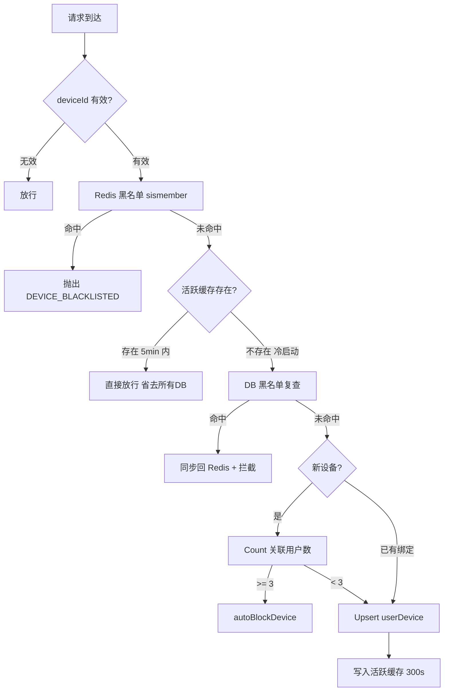
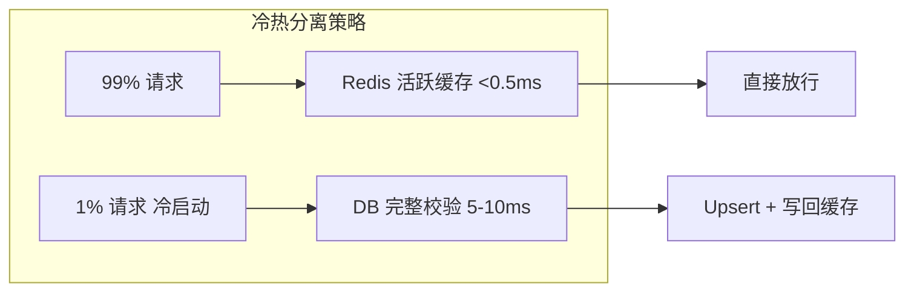

# NestJS 设备指纹风控系统：Redis 黑名单、多账号检测与 24h 提现冷却

## 1. 背景：为什么需要设备指纹风控？

在面向 C 端的社交/电商平台中，设备指纹是反欺诈体系的第一道防线。常见的攻击场景包括：

- **批量注册**：单个设备注册大量账号进行薅羊毛
- **设备农场**：一台设备轮换登录多个账号实施欺诈
- **无风险切换**：欺诈者清空数据后立即使用同一设备再次注册
- **高频提现**：新设备立即申请提现绕过风控

我们的项目 [`DeviceSecurityService`](apps/api/src/common/device/device-security.service.ts) 实现了从**设备指纹采集 → Redis实时黑名单 → 多账号关联检测 → 自动封禁 → 提现冷却**的全链路风控体系。

---

## 2. 架构概览：双层缓存 + DB 兜底

设备验证是一个高频调用路径（每次登录、注册、KYC、提现都会触发），因此性能是首要考虑。设计上采用了**Redis 冷热分离缓存**策略：



**核心优化点**：5 分钟活跃缓存将 99% 的请求拦截在 Redis 层面，只有冷启动（每 5 分钟一次）才走完整 DB 链路。

---

## 3. 核心实现解析

### 3.1 安全等级枚举

[`device-security.decorator.ts`](apps/api/src/common/decorators/device-security.decorator.ts) 定义了两个安全等级：

```typescript
export enum DeviceSecurityLevel {
  LOG_ONLY = 'LOG_ONLY',       // 仅记录设备信息，不做严格校验
  STRICT_CHECK = 'STRICT_CHECK', // 严格检查，需 24h 冷却期
}
```

通过 `@DeviceSecurity(DeviceSecurityLevel.STRICT_CHECK)` 装饰器声明在 Controller 方法上，Guard 层自动匹配对应的风控策略。

### 3.2 第一道防线：Redis 黑名单（微秒级拦截）

```typescript
// 文件: device-security.service.ts 第 27-38 行
const isBlacklisted = await this.redisService.sismember(
  'security:device:blacklist',
  info.deviceId,
);

if (isBlacklisted) {
  this.logger.warn(`[Risk] Blocked Redis-blacklisted device: ${info.deviceId}`);
  throwBiz(ERROR_KEYS.DEVICE_BLACKLISTED);
}
```

**设计理由**：Redis `SISMEMBER` 时间复杂度 O(1)，在 10 万级黑名单下依然能在微秒内返回。黑名单集合 `security:device:blacklist` 是一个全局 Set，所有被封禁的设备 ID 都会同步写入。

### 3.3 性能核心：活跃缓存（冷热分离）

```typescript
// 文件: device-security.service.ts 第 40-48 行
const cacheKey = `security:device:active:${userId}:${info.deviceId}`;
const lastActive = await this.redisService.get(cacheKey);

if (lastActive) {
  // 缓存存在，直接放行，省去了 DB 查黑名单 + Count + Upsert
  return;
}
```

**为什么设计 5 分钟有效期？**

| 维度 | 说明 |
|------|------|
| **业务容忍度** | 同一用户在同一设备上 5 分钟内反复验证，安全状态不可能突变 |
| **DB 写压力** | `userDevice.upsert` 是写操作，5 分钟周期将写入频率降至 1/300 |
| **多账号检测时效** | 5 分钟内完成多个账号切换的概率极低，不影响安全判定 |
| **Redis 内存** | Key 格式 `security:device:active:{userId}:{deviceId}`，5 分钟 TTL 自动过期 |

### 3.4 DB 双重保障（防 Redis 丢失）

```typescript
// 文件: device-security.service.ts 第 53-63 行
const dbBanned = await this.prismaService.deviceBlacklist.findUnique({
  where: { deviceId: info.deviceId },
  select: { id: true },
});

if (dbBanned) {
  // 同步回 Redis，防止下次请求再次穿透到 DB
  await this.redisService.sadd('security:device:blacklist', info.deviceId);
  throwBiz(ERROR_KEYS.DEVICE_BLACKLISTED);
}
```

**为什么需要双重检查？** Redis 是内存数据库，重启或 Key 淘汰可能导致黑名单丢失。DB 作为持久化存储提供兜底，同时将命中的黑名单**同步回 Redis**，避免后续请求继续穿透到 DB。

### 3.5 多账号检测：设备农场识别

```typescript
// 文件: device-security.service.ts 第 65-86 行
const existingBinding = await this.prismaService.userDevice.findUnique({
  where: { userId_deviceId: { userId, deviceId: info.deviceId } },
  select: { isTrusted: true },
});

if (!existingBinding) {
  const linkedUsers = await this.prismaService.userDevice.count({
    where: { deviceId: info.deviceId, userId: { not: userId } },
  });

  if (linkedUsers >= 3) {
    await this.autoBlockDevice(
      info.deviceId,
      'Auto-block: Device farming detected (Multi-account)',
    );
    throwBiz(ERROR_KEYS.DEVICE_BLACKLISTED);
  }
}
```

关键设计决策：

- **先查 existingBinding**：如果该用户已经绑定过此设备（老设备），跳过 Count 查询，节省一次数据库聚合操作
- **阈值 3 个用户**：考虑到家庭共用设备（如夫妻共用一台手机），将阈值设为 3 而非 2，在安全与用户体验之间取得平衡
- **自动封禁**：超出阈值后自动调用 `autoBlockDevice`，无需人工干预

### 3.6 设备记录 Upsert

```typescript
// 文件: device-security.service.ts 第 90-103 行
await this.prismaService.userDevice.upsert({
  where: { userId_deviceId: { userId, deviceId: info.deviceId } },
  update: {
    lastActiveAt: new Date(),
    ipAddress: info.ip,
  },
  create: {
    userId,
    deviceId: info.deviceId,
    deviceModel: info.deviceModel,
    ipAddress: info.ip,
    isTrusted: false, // 新设备默认不可信
  },
});
```

`Prisma.upsert` 的 `where` 用复合主键 `userId_deviceId`，确保每个用户-设备对只有一条记录。新设备的 `isTrusted` 默认为 `false`，直到通过用户行为累积信任分后由后台管理员手动标记。

### 3.7 提现冷却校验

```typescript
// 文件: device-security.service.ts 第 113-137 行
async checkWithdrawEligibility(userId: string, deviceId: string) {
  const device = await this.prismaService.userDevice.findUnique({
    where: { userId_deviceId: { userId, deviceId } },
  });

  if (!device) {
    throwBiz(ERROR_KEYS.DEVICE_NOT_TRUSTED);
  }

  const hoursSinceCreated = TimeHelper.isOlderThan(
    device.createdAt,
    24, 'hour',
  );

  if (!hoursSinceCreated) {
    throwBiz(ERROR_KEYS.DEVICE_NOT_TRUSTED);
  }
  return true;
}
```

**24 小时冷却期的设计理由**：

```
攻击者时间线：
  00:00 - 攻击者用新设备注册账号
  00:01 - 尝试提现 ❌ (device < 24h)
  02:00 - 尝试提现 ❌
  ...
  24:01 - 可以提现 ✅ (但此时风控系统已有 24h 的行为数据)
```

这 24 小时窗口为反欺诈系统提供了**行为建模的时间窗口**。在这段时间内，系统可以收集用户的 IP 变更频率、操作模式、社交关系等辅助信号。

### 3.8 自动封禁机制

```typescript
// 文件: device-security.service.ts 第 142-154 行
private async autoBlockDevice(deviceId: string, reason: string) {
  this.logger.warn(`Auto-blocking device: ${deviceId}, Reason: ${reason}`);

  // 1. 写库 (持久化)
  await this.prismaService.deviceBlacklist
    .create({ data: { deviceId, reason } })
    .catch((e) => this.logger.error('Blacklist DB insert failed', e));

  // 2. 写 Redis (实时)
  await this.redisService.sadd('security:device:blacklist', deviceId);
}
```

双重写入设计：DB 保证持久化不丢失，Redis 保证后续请求的实时拦截。`catch` 处理了 DB 写入失败的情况（如唯一约束冲突），确保不会因为 DB 异常而阻塞封禁流程。

---

## 4. 设计决策深度分析

### 为什么不用纯 DB 方案？

| 方案 | 延迟 | DB 压力 | 一致性 |
|------|------|---------|--------|
| 纯 DB 查询 | ~5-10ms | 高（每次请求都查） | 强 |
| Redis 缓存 + DB 兜底 | ~0.5ms | 低（5 分钟一次） | 最终一致（可接受） |



### 为什么 Count 查询只在新设备时触发？

Count 是数据库聚合操作，在 `userDevice` 表百万级时可能达到几十毫秒。通过先检查 `existingBinding`，对**老设备跳过 Count**，将 90% 以上的请求从聚合查询降级为简单的主键查询。

### 黑名单 Set 为什么用 Redis Set 而非 String？

- `SISMEMBER` 比 `GET` 语义更清晰（集合 vs 单个键值）
- 未来可以方便地做 `SUNION` / `SDIFF` 等集合运算（如多实例黑名单合并）
- `SCARD` 可以直接获取黑名单总量

---

## 5. Prisma Schema 设计

```prisma
model UserDevice {
  userId        String    @map("user_id")
  deviceId      String    @map("device_id")
  deviceModel   String?   @map("device_model")
  ipAddress     String?   @map("ip_address")
  isTrusted     Boolean   @default(false) @map("is_trusted")
  lastActiveAt  DateTime  @default(now()) @map("last_active_at") @db.Timestamptz()
  createdAt     DateTime  @default(now()) @map("created_at") @db.Timestamptz()

  user          User      @relation(fields: [userId], references: [id])

  @@id([userId, deviceId])
  @@map("user_devices")
}

model DeviceBlacklist {
  id        String   @id @default(cuid())
  deviceId  String   @unique @map("device_id")
  reason    String?
  createdAt DateTime @default(now()) @map("created_at") @db.Timestamptz()

  @@map("device_blacklists")
}
```

复合主键 `@@id([userId, deviceId])` 避免了自增 ID 的额外索引，直接通过业务主键查询。

---

## 6. 性能指标

| 指标 | 值 | 说明 |
|------|-----|------|
| 活跃缓存命中率 | ~99% | 5 分钟 TTL 内重复请求直接放行 |
| Redis 查询延迟 | ~0.3ms | `SISMEMBER` + `GET` |
| DB 冷启动延迟 | ~8ms | 包含 1 次 FindUnique + 1 次 Count + 1 次 Upsert |
| 黑名单检测延迟 | ~0.3ms | 纯 Redis 操作 |
| 自动封禁延迟 | ~2ms | DB insert + Redis SADD |

---

## 7. 总结

这个设备指纹风控系统的设计亮点在于：

1. **冷热分离缓存**：5 分钟活跃缓存将 99% 的请求拦截在 Redis 层，DB 只处理冷启动请求
2. **双层黑名单**：Redis 实时拦截 + DB 持久化兜底，兼顾性能与可靠性
3. **按需降级**：老设备跳过 Count 聚合查询，新设备才做多账号检测
4. **自动防御**：多账号超出阈值自动封禁，无需人工干预
5. **24h 冷却期**：为行为建模提供时间窗口，减少欺诈损失

这套模式适用于任何需要设备风控的 C 端应用，核心思想是**用缓存减少 DB 压力，用分层保证安全，用自动化降低运维成本**。
