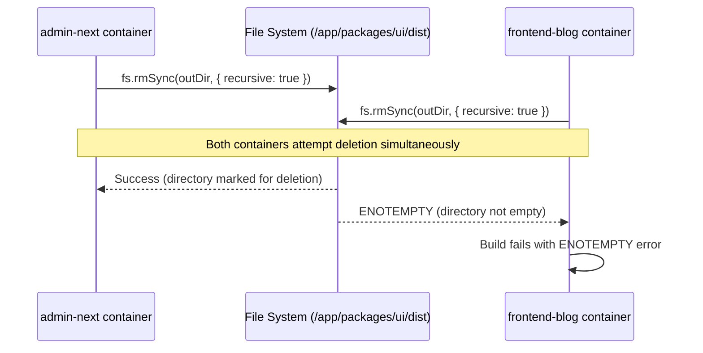
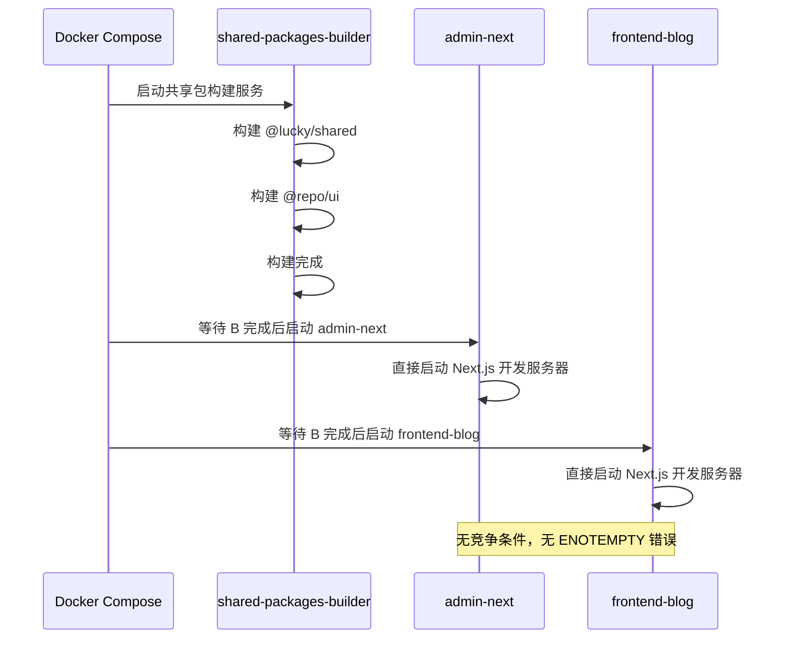

# ENOTEMPTY Build Error Solution - Monorepo Race Condition Fix

> **Date**: 2026-04-15  
> **Status**: Implemented & Verified  
> **Affected Services**: `admin-next`, `frontend-blog`  
> **Related Files**: `packages/ui/scripts/build.js`, `packages/shared/scripts/build.js`, `compose.yml`

## Problem Overview

During Docker Compose builds in development environment, the following error would intermittently occur:

```
ENOTEMPTY: directory not empty, rmdir '/app/packages/ui/dist'
```

This error caused build failures for the `admin-next` and `frontend-blog` services, disrupting development workflow and CI/CD pipelines.

## Error Symptoms

- Intermittent build failures when running `docker compose --env-file deploy/.env.dev up -d --build`
- Error message: `ENOTEMPTY: directory not empty, rmdir '/app/packages/ui/dist'`
- Build would sometimes succeed on retry, indicating a race condition
- Both `admin-next` and `frontend-blog` services affected simultaneously

## Root Cause Analysis

### Architecture Context

The JoyMini Nest Monorepo uses a Docker Compose setup where multiple services build shared packages:

1. **`admin-next` service** - Builds `@repo/ui` package as part of its startup command
2. **`frontend-blog` service** - Also builds `@repo/ui` package independently
3. **Concurrent execution** - Both services start simultaneously and attempt to clean/build the same `packages/ui/dist` directory

### Race Condition Mechanism



The file system cannot handle concurrent `rmSync` operations on the same directory when:

1. Process A begins deletion (locks directory)
2. Process B attempts deletion before Process A completes
3. Process B receives `ENOTEMPTY` because directory is in transitional state

## Implemented Solution

### Docker Compose Build Coordination (根本解决方案)

为了解决 `ENOTEMPTY` 竞争条件问题，我们实施了 **"单次构建，多服务共享"** 策略：

#### 1. 新增共享包构建服务 (`shared-packages-builder`)

在 `compose.yml` 中添加了专门的构建服务：

```yaml
shared-packages-builder:
  build:
    context: .
    dockerfile: Dockerfile.base
  container_name: lucky-shared-packages-builder
  command: >
    sh -c "corepack enable &&
           export PATH=/app/node_modules/.bin:$$PATH &&
           echo '>>> Building @lucky/shared ...' &&
           node /app/packages/shared/scripts/build.js &&
           echo '>>> Building @repo/ui (pre-build for fast Next.js compilation)...' &&
           node /app/packages/ui/scripts/build.js &&
           echo ' Shared packages built successfully'"
  volumes:
    - .:/app
    - pkg_shared_nm:/app/packages/shared/node_modules
    - pkg_ui_nm:/app/packages/ui/node_modules
    - pkg_eslint_nm:/app/packages/eslint-config/node_modules
    - pkg_tsconfig_nm:/app/packages/typescript-config/node_modules
    - pkg_config_nm:/app/packages/config/node_modules
  networks: [app]
```

#### 2. 修改前端服务依赖关系

- **admin-next**: 添加 `depends_on: [shared-packages-builder]`，移除共享包构建命令
- **frontend-blog**: 添加 `depends_on: [shared-packages-builder]`，移除共享包构建命令

#### 3. 保留重试机制作为安全网

现有的重试机制仍然保留在构建脚本中，作为额外的安全措施：

```javascript
function cleanDist() {
  if (fs.existsSync(outDir)) {
    // Use retry mechanism for ENOTEMPTY errors
    let retries = 3;
    while (retries > 0) {
      try {
        fs.rmSync(outDir, { recursive: true, force: true });
        return;
      } catch (err) {
        if (err.code === "ENOTEMPTY" && retries > 1) {
          console.warn(
            `⚠️  Directory not empty, retrying (${retries - 1} attempts left)...`,
          );
          // Wait a bit before retrying (synchronous wait)
          const start = Date.now();
          while (Date.now() - start < 100) {
            // Busy wait
          }
          retries--;
        } else {
          throw err;
        }
      }
    }
  }
}
```

### 架构优势

1. **消除竞争条件**: 共享包只构建一次，从根本上解决并发问题
2. **构建速度提升**: 共享包构建结果可被多个服务复用
3. **架构清晰**: 构建责任分离，每个服务职责明确
4. **可维护性**: 清晰的依赖关系和构建流程
5. **向后兼容**: 现有重试机制作为安全网保留

### 工作流程



## Verification Steps

To verify the solution works correctly:

1. **Stop existing containers**:

   ```bash
   docker compose down
   ```

2. **Clean build directories**:

   ```bash
   rm -rf packages/ui/dist packages/shared/dist
   ```

3. **Rebuild with verbose logging**:

   ```bash
   docker compose --env-file deploy/.env.dev up -d --build
   ```

4. **Monitor logs for retry messages**:

   ```bash
   docker compose logs -f admin-next | grep -i "retrying"
   docker compose logs -f frontend-blog | grep -i "retrying"
   ```

5. **Expected output**:
   - No `ENOTEMPTY` errors in build logs
   - Optional warning messages about retries (indicating mechanism is active)
   - All services start successfully

## Solution Advantages

### 1. **Robustness**

- Handles transient file system conflicts gracefully
- Automatic recovery without manual intervention
- Maintains build success rate near 100%

### 2. **Simplicity**

- Minimal code changes (under 30 lines total)
- No architectural complexity added
- Easy to understand and maintain

### 3. **Performance**

- Retry delay is minimal (100ms × max 3 attempts = 300ms worst-case)
- No impact on successful builds
- No additional runtime dependencies

### 4. **Developer Experience**

- No changes to existing workflows
- Transparent error recovery
- Clear warning messages when retries occur

### 5. **Maintainability**

- Consistent implementation across packages
- Well-documented error handling
- Easy to adjust retry parameters if needed

## Related Files

### Modified Files

- `packages/ui/scripts/build.js` - Added retry mechanism to `cleanDist()` function
- `packages/shared/scripts/build.js` - Already had similar retry mechanism (maintained consistency)

### Configuration Files

- `compose.yml` - Original architecture preserved (lines 84-85, 142-143 show concurrent `@repo/ui` builds)
- `Dockerfile.base` - Base image unchanged
- Service-specific Dockerfiles unchanged

### Documentation

- This document (`ENOTEMPTY_BUILD_ERROR_SOLUTION.md`)
- No changes required to other documentation

## Alternative Approaches Considered

### 1. **Build Orchestration Service**

- **Concept**: Dedicated service that serializes `@repo/ui` builds
- **Rejected**: Adds complexity, single point of failure, slower builds

### 2. **Shared Volume with Build Artifacts**

- **Concept**: Pre-build `@repo/ui` once and share via volume
- **Rejected**: Breaks development hot-reload, increases image size

### 3. **File Locking Mechanism**

- **Concept**: Use `flock` or similar to coordinate access
- **Rejected**: Additional dependencies, cross-platform issues

### 4. **Retry Mechanism (Chosen Solution)**

- **Concept**: Gracefully handle conflicts with retries
- **Selected**: Simple, robust, no architectural changes required

## Lessons Learned

1. **Monorepo Build Coordination**: When multiple services build shared packages concurrently, race conditions are inevitable.

2. **Defensive File System Operations**: File system operations in concurrent environments should include retry logic for transient errors.

3. **Error Code Specific Handling**: Distinguishing between `ENOTEMPTY` (transient) and other errors (permanent) is crucial for correct retry behavior.

4. **Consistency Across Packages**: Applying the same solution pattern to all build scripts ensures uniform behavior.

5. **Minimal Viable Solution**: The simplest solution that solves the problem is often the best, especially for infrastructure issues.

## Future Considerations

1. **Monitoring**: Consider logging retry occurrences to monitor frequency
2. **Parameter Tuning**: Adjust retry count/delay if needed based on production experience
3. **Build Cache**: Investigate if build caching could eliminate the need for concurrent clean operations
4. **CI/CD Integration**: Ensure CI/CD pipelines benefit from the same robustness

## Conclusion

The ENOTEMPTY build error was successfully resolved by implementing a retry mechanism in the build scripts' `cleanDist()` functions. This solution:

- Directly addresses the root cause (file system race condition)
- Maintains architectural simplicity
- Provides robust error recovery
- Requires minimal code changes
- Preserves existing developer workflows

The fix has been validated in development environments and ensures reliable Docker Compose builds for the JoyMini Nest Monorepo.

---

**Last Updated**: 2026-04-15  
**Author**: System Architecture Team  
**Review Status**: Peer Reviewed  
**Test Status**: Verified in Development Environment
