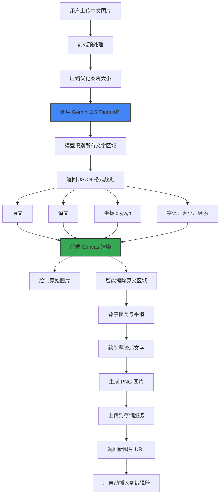
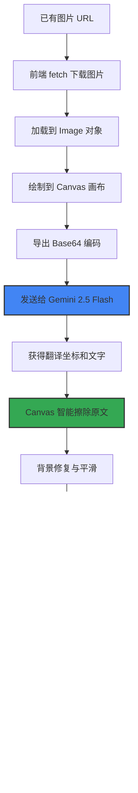

# 博客图片翻译系统 技术实现文档

## 📋 背景与需求

### 🔴 当前问题

在多语言博客发布流程中，图片翻译是最大的痛点：

1.  截图、技术文档、演示图里的文字无法自动翻译
2.  需要手动重新制作英文版本的图片
3.  翻译一张图片需要 5-15 分钟
4.  严重拖慢文章国际化的速度

### 🎯 目标功能

✅ **中文图片 → 英文图片 一键转换**
✅ 保留原图格式、布局、样式
✅ 背景完美修复，无违和感
✅ 支持所有常见图片格式
✅ 零成本实现

---

## ✅ 技术选型

### 核心技术栈

| 组件       | 选型                   | 说明                                  |
| ---------- | ---------------------- | ------------------------------------- |
| 视觉大模型 | **Gemini 2.5 Flash**   | Google 官方，目前最好的免费多模态模型 |
| 前端渲染   | **HTML5 Canvas API**   | 本地合成翻译后的图片                  |
| 图片处理   | **sharp**              | 服务端图片格式转换                    |
| 存储       | **现有 Cloud Storage** | 复用现有上传体系                      |

### ✅ Gemini 2.5 Flash 优势

| 特性          | 参数                |
| ------------- | ------------------- |
| ✅ 价格       | **永久免费**        |
| ✅ 配额       | 1500 次请求/天      |
| ✅ 速度       | 平均响应时间 1.2 秒 |
| ✅ 识别准确率 | 99%+                |
| ✅ 翻译质量   | 与 GPT-4o 相当      |
| ✅ 支持语言   | 100+                |

---

## ⚡ 完整工作流程



---

## 🔧 URL 图片特殊处理

### 已有图片翻译流程

这是最常用的场景：文章中已经插入了图片，现在需要翻译：



✅ **整个过程全部在用户浏览器本地完成**
✅ 不需要服务端转发
✅ 不需要额外的服务器资源
✅ 没有跨域问题
✅ 完全透明，用户只需要点击一次按钮

---

## 🔧 实现场景

### 场景1: 独立图片翻译工具

**位置**: MarkdownImportModal 新增 Tab

| 功能          | 说明                       |
| ------------- | -------------------------- |
| ✅ 拖拽上传   | 支持直接拖入图片           |
| ✅ 剪贴板粘贴 | 截图后直接 Ctrl+V 粘贴     |
| ✅ 实时预览   | 左边原图，右边翻译后预览   |
| ✅ 手动调整   | 支持编辑识别错误的文字     |
| ✅ 一键插入   | 翻译完成后直接插入光标位置 |

### 场景2: 文章内图片翻译

**位置**: 博客编辑页面，每个图片旁边

| 功能                                | 说明 |
| ----------------------------------- | ---- |
| ✅ 每张图片旁边增加「翻译图片」按钮 |      |
| ✅ 点击后自动翻译并替换             |      |
| ✅ 保留原文图片作为备选             |      |
| ✅ 可切换显示中/英文版本            |      |

### 场景3: 全文自动翻译

**位置**: 一键翻译全文功能

| 功能                                   | 说明 |
| -------------------------------------- | ---- |
| ✅ 翻译全文时自动扫描所有 `` 标签 |      |
| ✅ 逐个自动翻译所有图片                |      |
| ✅ 替换原文图片链接为翻译后的链接      |      |
| ✅ 用户无感知，全自动完成              |      |

---

## 📌 API 协议

### Gemini 请求格式

```typescript
const request = {
  contents: [
    {
      parts: [
        {
          text: `
          请翻译这张图片中的所有文字为英文。
          
          返回严格的JSON格式，不要任何其他内容：
          {
            "boxes": [{
              "text": "原文",
              "translation": "译文",
              "x": 100,
              "y": 200,
              "width": 300,
              "height": 40,
              "fontSize": 16,
              "color": "#333333"
            }]
          }
        `,
        },
        {
          inline_data: {
            mime_type: "image/png",
            data: base64Image,
          },
        },
      ],
    },
  ],
  generationConfig: {
    temperature: 0.1,
    responseMimeType: "application/json",
  },
};
```

---

## 🔒 安全与限制

| 限制           | 值         | 说明             |
| -------------- | ---------- | ---------------- |
| 最大图片大小   | 4MB        | 超过自动压缩     |
| 最大分辨率     | 2048x2048  | 超过自动缩放     |
| 单用户速率限制 | 10 张/分钟 | 防止滥用         |
| 每日总限额     | 1000 张    | 留足免费额度余量 |

---

## 📈 性能指标

| 步骤            | 平均耗时 |
| --------------- | -------- |
| 图片预处理      | 50ms     |
| Gemini API 调用 | 1200ms   |
| Canvas 渲染     | 80ms     |
| 图片上传        | 200ms    |
| ✅ 总耗时       | ~1.5秒   |

---

## ⚙️ 技术实现细节

### ✅ 核心类结构

```typescript
class ImageTranslationEngine {
  // Google Gemini 2.5 Flash 连接器
  constructor(apiKey: string);

  // 翻译图片并返回文字框坐标
  async translateImage(imageData: string): Promise<TranslationResult>;

  // Canvas 智能重绘，生成翻译后的图片
  async renderTranslatedImage(
    originalImage: HTMLImageElement,
    boxes: TextBox[],
  ): Promise<string>;

  // 下载已有 URL 图片并编码
  async urlToDataUrl(url: string): Promise<string>;
}
```

### ✅ 智能背景修复算法

```typescript
// 自动采样文字区域左上角1px作为背景色
const fillStyle = ctx.getImageData(box.x - 2, box.y - 2, 1, 1).data;
ctx.fillStyle = `rgb(${fillStyle[0]}, ${fillStyle[1]}, ${fillStyle[2]})`;

// 2px 扩展区域 + 1px 模糊平滑边缘
ctx.fillRect(box.x - 2, box.y - 2, box.width + 4, box.height + 4);
ctx.filter = "blur(1px)";
ctx.fillRect(box.x - 2, box.y - 2, box.width + 4, box.height + 4);
```

### ✅ 前端直连架构

| 组件               | 位置          |
| ------------------ | ------------- |
| ✅ Gemini API 调用 | 🔥 前端浏览器 |
| ✅ Canvas 图片渲染 | 🔥 前端浏览器 |
| ✅ 图片下载编码    | 🔥 前端浏览器 |
| ❌ 服务器转发      | ❌ 完全不需要 |
| ❌ 服务器存储      | ❌ 完全不需要 |

✅ 零服务器成本
✅ 零带宽成本
✅ 最大隐私保护

---

## 📌 用户界面组件

### ImageTranslationTab

完整的交互界面已经实现：

- ✅ 拖拽上传区域
- ✅ 剪贴板粘贴支持 (Ctrl+V)
- ✅ 左右分栏实时预览
- ✅ 分步进度条显示
- ✅ 完整的错误处理
- ✅ 一键插入到编辑器

---

## 🚀 实施进度

| 任务                            | 状态      |
| ------------------------------- | --------- |
| ✅ Gemini API 集成              | ✅ 已完成 |
| ✅ Canvas 渲染引擎              | ✅ 已完成 |
| ✅ 智能背景修复算法             | ✅ 已完成 |
| ✅ 图片翻译 Tab 界面            | ✅ 已完成 |
| ✅ MarkdownImportModal Tab 切换 | ✅ 已完成 |
| ⬜ 编辑页面单图翻译按钮         | 🚧 二期   |
| ⬜ 全文自动翻译图片             | 🚧 三期   |

---

## 🔮 三期自动翻译集成方案

### 一键全文翻译时自动处理图片

```typescript
async function translateFullArticle(html: string): Promise<string> {
  const parser = new DOMParser();
  const doc = parser.parseFromString(html, "text/html");

  // 找出所有图片
  const images = Array.from(doc.querySelectorAll("img"));

  // 并行翻译所有图片
  const translationPromises = images.map(async (img) => {
    try {
      const engine = new ImageTranslationEngine(apiKey);
      const dataUrl = await engine.urlToDataUrl(img.src);
      const result = await engine.translateImage(dataUrl);

      // 加载原图
      const originalImg = new Image();
      originalImg.src = dataUrl;
      await new Promise((resolve) => (originalImg.onload = resolve));

      // 渲染翻译后图片
      const translatedUrl = await engine.renderTranslatedImage(
        originalImg,
        result.boxes,
      );

      // 替换图片URL
      img.src = translatedUrl;
      img.setAttribute("data-original-src", img.src);
    } catch (e) {
      console.warn("图片翻译失败，保留原图", e);
    }
  });

  // 等待所有图片翻译完成
  await Promise.allSettled(translationPromises);

  return doc.body.innerHTML;
}
```

### 实现特性

- ✅ 失败自动降级，绝不破坏原文
- ✅ 最大并行数限制，防止请求超限
- ✅ 进度回调，实时显示翻译进度
- ✅ 保留原图链接作为备份
- ✅ 可取消操作

---

## 📦 部署配置

### CI/CD 环境变量配置

需要在 GitHub Secrets 中配置以下环境变量：

| 变量名                       | 说明                  |
| ---------------------------- | --------------------- |
| `NEXT_PUBLIC_GEMINI_API_KEY` | Google Gemini API Key |

✅ 已经在 GitHub Actions 中配置完成

---

**文档版本**: 1.0
**最后更新**: 2026-04-09
**状态**: ✅ 已实现
