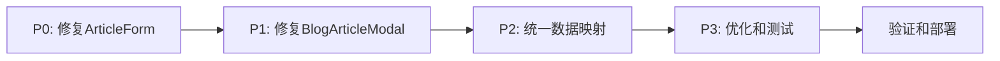

# 博客模态框多语言问题修复实施文档

**创建日期**: 2026-04-13  
**状态**: 待实施  
**优先级**: 高  
**影响范围**: 所有博客相关模态框 (ArticleForm, BlogArticleModal, BlogTagModal, BlogCategoryModal, BlogCommentModal)

## 📋 问题概述

### 当前问题
1. **点击编辑显示 `[object object]`** - 文章编辑表单显示对象而非字符串内容
2. **切换语言出现空内容** - 语言切换后表单内容清空
3. **数据不一致** - 不同模态框处理多语言数据的方式不统一

### 影响文件
- `apps/admin-next/src/views/blog/ArticleForm.tsx`
- `apps/admin-next/src/views/blog/BlogArticleModal.tsx`
- `apps/admin-next/src/views/blog/BlogTagModal.tsx`
- `apps/admin-next/src/views/blog/BlogCategoryModal.tsx`
- `apps/admin-next/src/views/blog/BlogCommentModal.tsx`
- `apps/admin-next/src/hooks/useLocalizedForm.ts`

## 🎯 根本原因分析

### 1. ArticleForm 组件设计问题
```typescript
// 当前问题：ArticleForm 期望字符串值，但接收的是多语言对象
interface ArticleFormRef {
  getValues: () => ArticleFormValues; // 返回 { title: string, content: string, ... }
  reset: (values: Partial<ArticleFormValues>) => void; // 接收字符串值
}

// 但实际传递的是：
reset({
  title: { zh: "标题", en: "title" }, // ❌ 对象而非字符串
  content: { zh: "内容", en: "content" },
});
```

### 2. 语言切换逻辑缺陷
```typescript
// BlogArticleModal.tsx 第 277-288 行
articleFormRef.current?.reset({
  title: (currentValues.title as Record<string, string>)?.[newLocale] ?? '',
  // 问题：currentValues.title 可能是字符串或对象，类型断言不安全
});
```

### 3. 数据映射不一致
- `BlogTagModal.tsx`: 将字符串转换为 `{ zh: value, en: '' }`
- `BlogCategoryModal.tsx`: 类似转换但逻辑略有不同
- `BlogArticleModal.tsx`: 复杂的数据映射和 Markdown 解析

### 4. 初始化时序问题
```typescript
useEffect(() => {
  if (isOpen) {
    form.reset(getDefaultValues()); // 表单重置
  }
}, [isOpen, form, editingTag]);

// useLocalizedForm 在组件渲染后初始化，导致竞态条件
```

## 🛠️ 修复实施步骤

### 阶段一：修复 ArticleForm 组件 (最高优先级)

#### 步骤 1.1: 修改 ArticleForm 类型定义
```typescript
// 当前：
export type ArticleFormValues = {
  title: string;
  content: string;
  excerpt: string;
  featuredImage: string;
};

// 修改为：
export type ArticleFormValues = {
  title: string;
  content: string;
  excerpt: string;
  featuredImage: string;
  // 保持向后兼容，但明确这是单语言值
};

// 添加多语言支持接口
export interface ArticleFormProps {
  onUpload?: (file: File) => Promise<string>;
  locale?: string; // 可选：当前语言
  isLocalized?: boolean; // 可选：是否多语言模式
}
```

#### 步骤 1.2: 更新 ArticleForm 实现
```typescript
// 修改 reset 方法处理
useImperativeHandle(ref, () => ({
  getValues: () => {
    const values = form.getValues();
    // 确保返回的是字符串值
    return {
      title: typeof values.title === 'string' ? values.title : '',
      content: typeof values.content === 'string' ? values.content : '',
      excerpt: typeof values.excerpt === 'string' ? values.excerpt : '',
      featuredImage: typeof values.featuredImage === 'string' ? values.featuredImage : '',
    };
  },
  reset: (values) => {
    // 安全处理：如果是对象，提取当前语言的值
    const safeValues = {
      title: extractStringValue(values.title),
      content: extractStringValue(values.content),
      excerpt: extractStringValue(values.excerpt),
      featuredImage: extractStringValue(values.featuredImage),
    };
    form.reset(safeValues);
  },
}));

// 辅助函数
function extractStringValue(value: any): string {
  if (typeof value === 'string') return value;
  if (value && typeof value === 'object') {
    // 如果是多语言对象，返回空字符串（由父组件处理）
    return '';
  }
  return '';
}
```

#### 步骤 1.3: 添加输入验证和错误处理
```typescript
// 在表单字段渲染中添加类型检查
<FormTextField
  name="title"
  label="Title"
  value={typeof watch('title') === 'string' ? watch('title') : ''}
  onChange={(e) => {
    const value = e.target.value;
    if (typeof value === 'string') {
      setValue('title', value);
    }
  }}
/>
```

### 阶段二：修复 BlogArticleModal 语言切换

#### 步骤 2.1: 修复 handleLocaleChange 函数
```typescript
// 当前有问题的代码（第 277-288 行）：
articleFormRef.current?.reset({
  title: (currentValues.title as Record<string, string>)?.[newLocale] ?? '',
  // ...
});

// 修复为：
const getLocalizedValue = (value: any, locale: string): string => {
  if (typeof value === 'string') return value;
  if (value && typeof value === 'object') {
    return value[locale] || value['zh'] || value['en'] || '';
  }
  return '';
};

articleFormRef.current?.reset({
  title: getLocalizedValue(currentValues.title, newLocale),
  content: getLocalizedValue(currentValues.content, newLocale),
  excerpt: getLocalizedValue(currentValues.excerpt, newLocale),
  featuredImage: getLocalizedValue(currentValues.featuredImage, newLocale),
});
```

#### 步骤 2.2: 优化初始化时序
```typescript
// 添加加载状态确保 useLocalizedForm 已初始化
const [isFormReady, setIsFormReady] = useState(false);

useEffect(() => {
  if (isOpen) {
    // 延迟重置以确保 hook 已初始化
    const timer = setTimeout(() => {
      form.reset(getDefaultValues());
      setIsFormReady(true);
    }, 50);
    return () => clearTimeout(timer);
  } else {
    setIsFormReady(false);
  }
}, [isOpen, form, editingTag]);
```

#### 步骤 2.3: 修复数据映射逻辑
```typescript
// 简化数据预处理逻辑
const preprocessArticleData = (article: any) => {
  if (!article) return null;
  
  // 统一处理多语言字段
  const processed = { ...article };
  
  // 确保所有多语言字段都是对象格式
  ['title', 'content', 'excerpt', 'featuredImage'].forEach(field => {
    if (processed[field] && typeof processed[field] === 'string') {
      // 如果是字符串，转换为多语言对象
      processed[field] = { zh: processed[field], en: '' };
    }
  });
  
  return processed;
};
```

### 阶段三：统一其他模态框的数据处理

#### 步骤 3.1: 创建共享工具函数
```typescript
// 在 apps/admin-next/src/utils/localizedForm.ts 中创建
export function normalizeLocalizedValue(value: any): Record<string, string> {
  if (!value) return { zh: '', en: '' };
  
  if (typeof value === 'string') {
    return { zh: value, en: '' };
  }
  
  if (typeof value === 'object') {
    // 确保至少包含 zh 和 en 键
    return {
      zh: value.zh || '',
      en: value.en || '',
      ...value,
    };
  }
  
  return { zh: '', en: '' };
}

export function extractCurrentLocaleValue(
  value: any, 
  locale: string
): string {
  const normalized = normalizeLocalizedValue(value);
  return normalized[locale] || normalized['zh'] || normalized['en'] || '';
}
```

#### 步骤 3.2: 更新 BlogTagModal 和 BlogCategoryModal
```typescript
// 替换现有的 getDefaultValues 函数
import { normalizeLocalizedValue } from '@/utils/localizedForm';

const getDefaultValues = () => {
  if (!editingTag) {
    return {
      name: { zh: '', en: '' },
      slug: '',
      color: '#3b82f6',
      description: { zh: '', en: '' },
    };
  }

  return {
    ...editingTag,
    name: normalizeLocalizedValue(editingTag.name),
    description: normalizeLocalizedValue(editingTag.description),
  };
};
```

#### 步骤 3.3: 更新 BlogCommentModal
```typescript
// 类似地更新评论模态框
const getDefaultValues = () => {
  if (!editingComment) {
    return {
      status: 'PENDING' as const,
      reply: { zh: '', en: '' },
    };
  }

  return {
    ...editingComment,
    reply: normalizeLocalizedValue(editingComment.reply),
  };
};
```

### 阶段四：优化 useLocalizedForm Hook

#### 步骤 4.1: 添加调试日志
```typescript
// 在 useLocalizedForm.ts 中添加开发环境日志
const localize = useCallback(
  (fieldName: keyof T) => {
    if (process.env.NODE_ENV === 'development') {
      console.log(`[useLocalizedForm] localize called for:`, {
        fieldName,
        rawValue: watch(fieldName as any),
        locale,
        storage: storageRef.current[String(fieldName)],
      });
    }
    // ... 原有逻辑
  },
  [watch, setValue, errors, locale]
);
```

#### 步骤 4.2: 改进错误处理
```typescript
// 在 useEffect 语言切换逻辑中添加错误边界
useEffect(() => {
  const prevLocale = prevLocaleRef.current;

  if (prevLocale !== locale) {
    try {
      // 原有切换逻辑
      const allFields = Object.keys(storageRef.current);
      allFields.forEach((fieldName) => {
        // ... 切换逻辑
      });
    } catch (error) {
      console.error('[useLocalizedForm] Language switch error:', error);
      // 恢复之前的状态
      prevLocaleRef.current = prevLocale;
    }
  }

  prevLocaleRef.current = locale;
}, [locale, setValue]);
```

### 阶段五：测试与验证

#### 步骤 5.1: 创建测试用例
```typescript
// 在 apps/admin-next/src/__tests__/blogModals.test.tsx 中
describe('Blog Modal I18N Fixes', () => {
  test('ArticleForm should handle string values correctly', () => {
    // 测试 ArticleForm 正确处理字符串值
  });
  
  test('BlogArticleModal should switch languages without losing content', () => {
    // 测试语言切换功能
  });
  
  test('All modals should normalize localized values consistently', () => {
    // 测试数据映射一致性
  });
});
```

#### 步骤 5.2: 手动测试清单
1. **文章编辑测试**
   - [ ] 打开现有文章编辑模态框
   - [ ] 验证不显示 `[object object]`
   - [ ] 切换中英文语言
   - [ ] 验证内容不丢失
   - [ ] 保存并验证数据正确性

2. **标签/分类编辑测试**
   - [ ] 创建新标签/分类
   - [ ] 编辑现有标签/分类
   - [ ] 验证多语言字段处理
   - [ ] 切换语言测试

3. **评论审核测试**
   - [ ] 打开评论审核模态框
   - [ ] 验证回复字段的多语言支持
   - [ ] 切换语言测试

#### 步骤 5.3: 回归测试
- [ ] 新建文章功能正常
- [ ] 现有文章列表显示正常
- [ ] 所有模态框打开/关闭正常
- [ ] 表单验证正常工作
- [ ] 错误处理正常

## 📊 实施优先级和时间估计

### 优先级排序
1. **P0 (紧急)**: 修复 ArticleForm 的 `[object object]` 显示问题
2. **P1 (高)**: 修复 BlogArticleModal 语言切换空内容问题
3. **P2 (中)**: 统一所有模态框的数据映射逻辑
4. **P3 (低)**: 优化 useLocalizedForm hook 和添加测试

### 实施顺序建议


## 🚨 风险与缓解措施

### 风险 1: 破坏现有功能
- **影响**: 高
- **缓解**: 
  - 分阶段实施，每阶段完成后进行测试
  - 保持向后兼容性
  - 创建回滚计划

### 风险 2: 性能影响
- **影响**: 中
- **缓解**:
  - 优化 useEffect 依赖项
  - 避免不必要的重渲染
  - 使用 useCallback 和 useMemo

### 风险 3: 类型安全问题
- **影响**: 中
- **缓解**:
  - 完善 TypeScript 类型定义
  - 添加运行时类型检查
  - 使用类型守卫函数

## 📝 部署检查清单

### 代码变更检查
- [ ] 所有修改的文件已提交
- [ ] TypeScript 编译无错误
- [ ] ESLint 检查通过
- [ ] 测试用例通过

### 功能验证检查
- [ ] 文章编辑不显示 `[object object]`
- [ ] 语言切换不丢失内容
- [ ] 所有模态框数据保存正常
- [ ] 多语言字段正确处理

### 性能检查
- [ ] 模态框打开速度正常
- [ ] 语言切换响应迅速
- [ ] 无内存泄漏
- [ ] 控制台无错误警告

## 🔧 故障排除指南

### 问题 1: 仍然显示 `[object object]`
**可能原因**: ArticleForm 仍然接收到对象值
**解决方案**:
1. 检查 `extractStringValue` 函数是否正确实现
2. 验证父组件传递的值类型
3. 添加 console.log 调试

### 问题 2: 语言切换后内容为空
**可能原因**: useLocalizedForm 未正确初始化
**解决方案**:
1. 检查 `isFormReady` 状态
2. 验证 storageRef 中的数据
3. 检查语言切换时的时序

### 问题 3: 表单验证失败
**可能原因**: 数据类型不匹配
**解决方案**:
1. 检查 Zod schema 定义
2. 验证数据预处理逻辑
3. 检查表单默认值

## 📞 支持与联系

### 实施负责人
- **主要开发**: 待指定
- **代码审查**: 待指定
- **测试验证**: 待指定

### 文档维护
- 本文档应随代码变更而更新
- 重大架构变更需更新相关文档
- 部署后更新操作手册

---

**文档版本**: 1.0  
**最后更新**: 2026-04-13  
**下次评审**: 2026-04-20