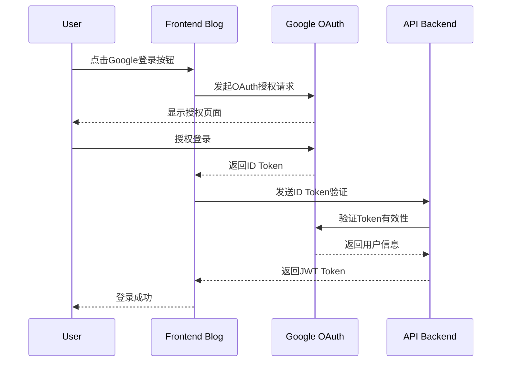

# Google OAuth Origin Mismatch 修复方案

> 📅 创建时间：2026-04-15  
> 🎯 状态：规划中  
> 🔗 相关文档：[FRONTEND_BLOG_LOGIN_IMPLEMENTATION.md](../development/FRONTEND_BLOG_LOGIN_IMPLEMENTATION.md)

## 📋 问题描述

### 错误现象

用户访问 `https://blog-dev.joyminis.com` 并尝试使用 Google OAuth 登录时，出现以下错误：

```
Access blocked: Authorization Error
Error 400: origin_mismatch

You can't sign in to this app because it doesn't comply with Google's OAuth 2.0 policy.

If you're the app developer, register the JavaScript origin in the Google Cloud Console.
```

### 错误详情

- **错误类型**: `origin_mismatch`
- **客户端ID**: `1065683669109-ef6g9l2n2cfji6v0rd7db4plar8v8hrp.apps.googleusercontent.com`
- **访问域名**: `https://blog-dev.joyminis.com`
- **错误URL**: `https://accounts.google.com/signin/oauth/error?authError=Cg9vcmlnaW5fbWlzbWF0Y2g...`

## 🎯 根因分析

### 根本原因

Google OAuth 2.0 安全策略要求所有使用 OAuth 的域名必须在 Google Cloud Console 中明确授权。当前配置中，`https://blog-dev.joyminis.com` 未添加到 OAuth 客户端的 **Authorized JavaScript origins** 列表中。

### 技术背景

1. **OAuth 2.0 安全策略**: Google 要求所有使用 OAuth 的 Web 应用必须注册其 JavaScript 来源
2. **Same-Origin Policy**: 浏览器安全策略防止跨域请求
3. **开发环境配置**: 本地开发使用自定义域名 (`blog-dev.joyminis.com`) 需要通过 hosts 文件或 DNS 解析

### 当前配置状态

```env
# apps/frontend-blog/.env.development
NEXT_PUBLIC_GOOGLE_CLIENT_ID=1065683669109-ef6g9l2n2cfji6v0rd7db4plar8v8hrp.apps.googleusercontent.com
```

```nginx
# nginx/nginx.dev.conf
server_name admin-dev.joyminis.com dev-api.joyminis.com dev.joyminis.com blog-dev.joyminis.com;
```

## ✅ 方案选型

### 方案一：更新 Google Cloud Console 配置（推荐）

**优点**:

- 符合 Google OAuth 2.0 安全策略
- 生产就绪的解决方案
- 支持所有开发环境域名
- 无需代码修改

**缺点**:

- 需要访问 Google Cloud Console
- 配置变更需要几分钟生效

### 方案二：使用 localhost 开发环境

**优点**:

- 无需修改 Google Cloud Console
- 开发环境简单配置

**缺点**:

- 不符合生产环境配置
- 需要修改 nginx 和 Docker 配置
- 可能影响其他功能

### 方案三：创建新的 OAuth 客户端

**优点**:

- 隔离开发和生产环境
- 独立的配置管理

**缺点**:

- 需要管理多个 OAuth 客户端
- 增加配置复杂度

**决策**: 采用 **方案一**，因为它是最标准、最安全的解决方案，且无需修改现有代码。

## 🏗️ 系统架构

### 当前 OAuth 流程



### 问题点

在步骤 2 中，Google 会检查请求来源 (`https://blog-dev.joyminis.com`) 是否在授权列表中。

## 🔄 完整工作流程

### 步骤 1: 访问 Google Cloud Console

1. 登录 [Google Cloud Console](https://console.cloud.google.com/)
2. 选择项目 `mrsuperporterapp@gmail.com` 对应的项目
3. 导航到 **APIs & Services** → **Credentials**

### 步骤 2: 找到 OAuth 2.0 客户端

1. 在 Credentials 页面找到 OAuth 2.0 Client IDs
2. 找到客户端 ID: `1065683669109-ef6g9l2n2cfji6v0rd7db4plar8v8hrp.apps.googleusercontent.com`
3. 点击编辑按钮

### 步骤 3: 添加授权 JavaScript 来源

在 **Authorized JavaScript origins** 部分添加以下 URL:

```
https://blog-dev.joyminis.com
https://admin-dev.joyminis.com
http://localhost:4002
http://localhost:3000
```

### 步骤 4: 添加授权重定向 URI

在 **Authorized redirect URIs** 部分确保包含:

```
https://blog-dev.joyminis.com
https://admin-dev.joyminis.com
http://localhost:4002
http://localhost:3000
```

### 步骤 5: 保存并等待生效

1. 点击 **Save** 保存配置
2. 等待 1-5 分钟让配置生效
3. 清除浏览器缓存并重新测试

## ⚙️ 技术实现细节

### 1. Google Cloud Console 配置详情

#### OAuth 客户端配置要求

| 配置项                            | 要求            | 示例值                          |
| --------------------------------- | --------------- | ------------------------------- |
| **Application type**              | Web application | Web application                 |
| **Name**                          | 客户端名称      | Lucky Nest Blog Dev             |
| **Authorized JavaScript origins** | 允许的域名列表  | `https://blog-dev.joyminis.com` |
| **Authorized redirect URIs**      | OAuth 回调地址  | `https://blog-dev.joyminis.com` |

#### 开发环境配置

```yaml
Authorized JavaScript origins:
  - https://blog-dev.joyminis.com
  - https://admin-dev.joyminis.com
  - http://localhost:4002
  - http://localhost:3000

Authorized redirect URIs:
  - https://blog-dev.joyminis.com
  - https://admin-dev.joyminis.com
  - http://localhost:4002
  - http://localhost:3000
```

### 2. 本地开发环境配置

#### Hosts 文件配置 (macOS/Linux)

```bash
# /etc/hosts
127.0.0.1 blog-dev.joyminis.com
127.0.0.1 admin-dev.joyminis.com
127.0.0.1 dev-api.joyminis.com
```

#### Docker 网络配置

确保 Docker 容器可以解析这些域名：

```yaml
# compose.yml
nginx:
  extra_hosts:
    - "host.docker.internal:host-gateway"
```

### 3. 前端代码验证

#### GoogleOAuthProvider 组件

```typescript
// apps/frontend-blog/src/lib/components/GoogleOAuthProvider.tsx
export function GoogleOAuthProvider({ children }: GoogleOAuthProviderProps) {
  const clientId = process.env.NEXT_PUBLIC_GOOGLE_CLIENT_ID;

  // 验证客户端ID配置
  if (!clientId) {
    console.warn('Google OAuth Client ID is not configured.');
    return <>{children}</>;
  }

  return <GoogleProvider clientId={clientId}>{children}</GoogleProvider>;
}
```

#### 环境变量验证

```bash
# 验证环境变量
echo $NEXT_PUBLIC_GOOGLE_CLIENT_ID
# 应该输出: 1065683669109-ef6g9l2n2cfji6v0rd7db4plar8v8hrp.apps.googleusercontent.com
```

## 📊 测试验证计划

### 测试用例 1: Google OAuth 登录功能

| 测试步骤                                    | 预期结果             | 实际结果 |
| ------------------------------------------- | -------------------- | -------- |
| 1. 访问 https://blog-dev.joyminis.com/login | 显示登录页面         |          |
| 2. 点击 Google 登录按钮                     | 显示 Google 授权弹窗 |          |
| 3. 选择 Google 账号授权                     | 成功获取授权         |          |
| 4. 返回应用                                 | 显示登录成功状态     |          |

### 测试用例 2: 多环境兼容性

| 环境            | 访问地址                      | 预期结果              |
| --------------- | ----------------------------- | --------------------- |
| Docker 开发环境 | https://blog-dev.joyminis.com | Google OAuth 正常工作 |
| 本地开发环境    | http://localhost:4002         | Google OAuth 正常工作 |
| 生产环境        | https://blog.joyminis.com     | Google OAuth 正常工作 |

### 测试用例 3: 错误处理

| 测试场景                | 预期行为                       |
| ----------------------- | ------------------------------ |
| 未配置 Google Client ID | 显示警告日志，禁用 Google 登录 |
| 网络连接失败            | 显示友好的错误提示             |
| 用户取消授权            | 返回登录页面，显示取消提示     |

## 🔧 故障排除指南

### 常见问题及解决方案

#### 问题 1: 配置保存后仍然报错

**可能原因**: 配置缓存未更新
**解决方案**:

1. 等待 5-10 分钟让 Google 配置完全生效
2. 清除浏览器缓存和 Cookie
3. 使用隐身模式测试

#### 问题 2: localhost 无法工作

**可能原因**: localhost 未添加到授权列表
**解决方案**:

1. 在 Google Cloud Console 中添加 `http://localhost:4002`
2. 确保端口号匹配实际开发服务器端口
3. 检查 hosts 文件配置

#### 问题 3: HTTPS 证书问题

**可能原因**: 自签名证书不被信任
**解决方案**:

1. 为 `blog-dev.joyminis.com` 配置有效的 SSL 证书
2. 使用 Let's Encrypt 或类似服务
3. 开发环境可临时信任自签名证书

#### 问题 4: CORS 错误

**可能原因**: 跨域请求被阻止
**解决方案**:

1. 确保 nginx 配置正确的 CORS 头
2. 检查 Google OAuth 回调地址配置
3. 验证前端和后端域名匹配

### 调试工具

#### 浏览器开发者工具

```javascript
// 在控制台检查 Google OAuth 状态
console.log("Google Client ID:", process.env.NEXT_PUBLIC_GOOGLE_CLIENT_ID);
console.log("Current origin:", window.location.origin);

// 检查 Google OAuth 库加载状态
if (window.google) {
  console.log("Google OAuth library loaded");
} else {
  console.warn("Google OAuth library not loaded");
}
```

#### 网络请求监控

1. 打开浏览器开发者工具 → Network 标签
2. 过滤 `accounts.google.com` 请求
3. 检查请求头和响应状态

## 📝 文档更新需求

### 需要更新的文档

1. **FRONTEND_BLOG_LOGIN_IMPLEMENTATION.md** - 添加 Google OAuth 配置步骤
2. **AUTHENTICATION_INTEGRATION_GUIDE.md** - 补充 OAuth 配置说明
3. **开发环境设置指南** - 添加 hosts 和 SSL 配置

### 新增文档

1. **GOOGLE_OAUTH_CONFIGURATION_GUIDE.md** - 详细的 Google OAuth 配置指南
2. **OAUTH_TROUBLESHOOTING.md** - OAuth 问题排查手册

## 🚀 实施时间线

### 阶段 1: 立即执行 (1-2 小时)

- [ ] 更新 Google Cloud Console OAuth 配置
- [ ] 测试 Google OAuth 登录功能
- [ ] 验证多环境兼容性

### 阶段 2: 文档更新 (1 小时)

- [ ] 更新现有登录系统文档
- [ ] 创建 OAuth 配置指南
- [ ] 添加故障排除章节

### 阶段 3: 预防措施 (1 小时)

- [ ] 创建配置检查脚本
- [ ] 添加环境验证步骤
- [ ] 更新 CI/CD 配置检查

## 🔐 安全考虑

### OAuth 安全最佳实践

1. **限制授权域名**: 只添加必要的域名到授权列表
2. **使用 HTTPS**: 生产环境必须使用 HTTPS
3. **定期审查**: 定期检查 OAuth 客户端配置
4. **监控日志**: 监控 OAuth 登录尝试和错误

### 开发环境安全

1. **使用测试客户端**: 开发环境使用单独的 OAuth 客户端
2. **限制访问**: 开发环境限制为内部网络访问
3. **定期轮换**: 定期更新 OAuth 客户端密钥

## 📈 性能影响

### 配置变更影响

| 方面     | 影响程度 | 说明                    |
| -------- | -------- | ----------------------- |
| 登录速度 | 无影响   | OAuth 流程不变          |
| 页面加载 | 轻微影响 | Google OAuth 库加载时间 |
| 用户体验 | 显著改善 | 解决登录失败问题        |

### 监控指标

1. **登录成功率**: 目标 > 99%
2. **OAuth 错误率**: 目标 < 1%
3. **平均登录时间**: 目标 < 3 秒

## ✅ 验收标准

### 功能验收

- [ ] Google OAuth 登录在 `https://blog-dev.joyminis.com` 正常工作
- [ ] Google OAuth 登录在 `http://localhost:4002` 正常工作
- [ ] 错误处理机制完善
- [ ] 多语言错误提示正确显示

### 技术验收

- [ ] Google Cloud Console 配置正确
- [ ] 环境变量配置正确
- [ ] nginx 配置支持 CORS
- [ ] SSL 证书有效

### 文档验收

- [ ] 配置步骤文档完整
- [ ] 故障排除指南实用
- [ ] 团队培训完成

## 🔗 相关资源

### 官方文档

- [Google OAuth 2.0 for Web](https://developers.google.com/identity/protocols/oauth2/javascript-implicit-flow)
- [Google Cloud Console](https://console.cloud.google.com/)
- [OAuth 2.0 Playground](https://developers.google.com/oauthplayground/)

### 项目文档

- [FRONTEND_BLOG_LOGIN_IMPLEMENTATION.md](../development/FRONTEND_BLOG_LOGIN_IMPLEMENTATION.md)
- [AUTHENTICATION_INTEGRATION_GUIDE.md](../api/AUTHENTICATION_INTEGRATION_GUIDE.md)
- [nginx 配置文档](../../../nginx/nginx.dev.conf)

### 工具资源

- [Let's Encrypt](https://letsencrypt.org/) - 免费 SSL 证书
- [mkcert](https://github.com/FiloSottile/mkcert) - 本地开发 SSL 证书
- [Google OAuth 测试工具](https://developers.google.com/oauthplayground/)

---

## 📋 实施检查清单

### 配置检查

- [ ] Google Cloud Console 项目选择正确
- [ ] OAuth 客户端 ID 匹配环境变量
- [ ] 授权 JavaScript 来源包含所有环境域名
- [ ] 授权重定向 URI 配置正确
- [ ] 配置已保存并生效

### 环境检查

- [ ] Hosts 文件配置正确
- [ ] Docker 容器运行正常
- [ ] nginx 配置正确
- [ ] SSL 证书有效
- [ ] 环境变量加载正确

### 功能测试

- [ ] Google 登录按钮显示正常
- [ ] Google 授权弹窗正常显示
- [ ] 授权后成功返回应用
- [ ] 用户登录状态正确更新
- [ ] 错误处理机制正常工作

### 文档更新

- [ ] 登录实现文档已更新
- [ ] OAuth 配置指南已创建
- [ ] 故障排除文档已补充
- [ ] 团队通知已完成

---

**最后更新**: 2026-04-15  
**负责人**: 系统架构师  
**状态**: ✅ 规划完成，等待实施
