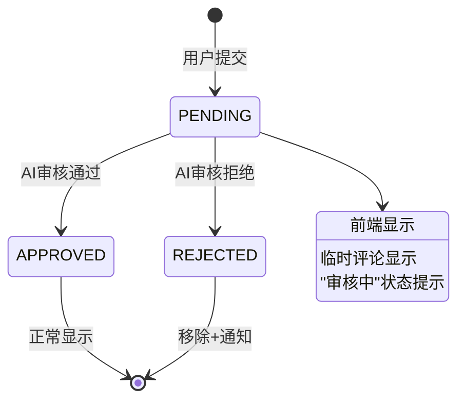

# 评论即时显示与审核回退机制 - 简化实施计划

## 📋 计划概述

**目标**：解决当前评论系统的核心问题 - 临时评论永久显示，即使AI拒绝也不会消失。

**实施策略**：基于主流网站实践（Medium/Reddit风格），采用简化方案，聚焦核心功能。

**时间预期**：2-3周完成核心功能

## 🎯 核心问题

### 当前状态分析
1. ✅ **乐观更新已实现**：评论提交后立即显示临时评论
2. ✅ **AI审核队列已存在**：评论保存为PENDING状态，异步进行AI审核
3. ❌ **核心缺陷**：临时评论(`temp-` ID)永久显示，即使AI拒绝也不会消失
4. ❌ **状态跟踪缺失**：前端无法知道评论的AI审核状态变化
5. ❌ **用户反馈不足**：用户不知道评论是否被拒绝

### 解决方案设计原则
1. **保持乐观更新**：评论立即显示，提供即时反馈
2. **后审核机制**：AI异步审核，不阻塞用户操作
3. **优雅状态处理**：审核通过→正常显示，审核拒绝→移除+通知
4. **最小化修改**：利用现有架构，避免复杂重构

## 🏗️ 技术架构

### 数据流设计
```
用户提交评论
    ↓
前端: 乐观更新显示临时评论 (temp-ID)
    ↓
后端: 保存为PENDING状态，投递到AI队列
    ↓
AI审核 (异步)
    ├── 通过 → 状态更新为APPROVED
    └── 拒绝 → 状态更新为REJECTED
    ↓
前端: 状态轮询检测变化
    ├── 通过 → 移除"审核中"标记
    └── 拒绝 → 移除评论 + 显示通知
```

### 状态转换图


## 📅 实施阶段

### 阶段1: 核心功能实现 (第1周)

#### 1.1 修改 `useComments.ts` - 状态跟踪
**目标**: 添加评论状态轮询机制
**修改文件**: `apps/frontend-blog/src/lib/hooks/useComments.ts`

**关键修改**:
```typescript
// 在usePostComment的onSuccess回调中添加状态检查
onSuccess: (data, variables, context) => {
  console.log('评论提交成功，服务器返回真实ID:', data.id);
  
  // 1. 记录临时评论ID到真实ID的映射
  const tempId = context?.optimisticId; // 需要从context传递
  if (tempId) {
    pendingCommentsMap.set(tempId, data.id);
  }
  
  // 2. 启动状态检查轮询
  startStatusPolling(data.id, tempId);
}

// 状态轮询函数
function startStatusPolling(realCommentId: string, tempId?: string) {
  // 每30秒检查一次，最多检查10次（5分钟）
  const maxAttempts = 10;
  let attempts = 0;
  
  const interval = setInterval(async () => {
    attempts++;
    
    // 检查评论状态
    const status = await checkCommentStatus(realCommentId);
    
    if (status === 'APPROVED') {
      clearInterval(interval);
      // 更新UI：移除"审核中"标记
      updateCommentStatus(realCommentId, 'approved');
    } else if (status === 'REJECTED') {
      clearInterval(interval);
      // 移除评论并显示通知
      removeCommentFromUI(tempId || realCommentId);
      showRejectionNotification();
    } else if (attempts >= maxAttempts) {
      clearInterval(interval);
      // 超时处理：假设通过或显示超时提示
      handlePollingTimeout(realCommentId, tempId);
    }
  }, 30000); // 30秒间隔
}
```

#### 1.2 状态检查工具函数
**目标**: 实现评论状态查询逻辑
**方案**: 利用现有评论列表API或添加简单状态查询

```typescript
// 方案A: 使用现有评论列表API（推荐）
async function checkCommentStatus(commentId: string): Promise<'PENDING' | 'APPROVED' | 'REJECTED' | 'UNKNOWN'> {
  try {
    // 获取最新评论列表
    const comments = await frontendBlogApi.getComments(articleId);
    
    // 检查评论是否在列表中
    const commentExists = comments.items.some(comment => comment.id === commentId);
    
    if (commentExists) {
      return 'APPROVED'; // 在列表中表示已通过审核
    } else {
      // 不在列表中，可能是被拒绝或仍在审核
      // 这里需要后端支持查询单个评论状态，或假设为PENDING
      return 'PENDING';
    }
  } catch (error) {
    console.error('检查评论状态失败:', error);
    return 'UNKNOWN';
  }
}

// 方案B: 添加状态查询端点（可选）
// GET /v1/frontend/blog/comments/{commentId}/status
```

### 阶段2: UI/UX优化 (第2周)

#### 2.1 增强 `CommentList.tsx` - 状态处理
**目标**: 改进评论状态显示和交互
**修改文件**: `apps/frontend-blog/src/components/blog/CommentList.tsx`

**关键修改**:
1. 添加评论状态管理上下文
2. 实现平滑的状态转换动画
3. 添加拒绝评论的移除效果

```tsx
// 在Comment组件中添加状态处理
const Comment = ({ comment, depth = 0, articleId }: CommentProps) => {
  // 检查评论状态
  const [commentStatus, setCommentStatus] = useState<'pending' | 'approved' | 'rejected'>(
    comment.id.startsWith('temp-') ? 'pending' : 'approved'
  );
  
  // 监听状态变化
  useEffect(() => {
    if (comment.id.startsWith('temp-')) {
      // 订阅状态更新
      const unsubscribe = commentStatusStore.subscribe(comment.id, (status) => {
        setCommentStatus(status);
        
        if (status === 'rejected') {
          // 触发移除动画
          triggerRemovalAnimation(comment.id);
        }
      });
      
      return () => unsubscribe();
    }
  }, [comment.id]);
  
  // 渲染状态提示
  const renderStatusBadge = () => {
    if (commentStatus === 'pending') {
      return (
        <div className="mt-2 p-2 bg-yellow-50 dark:bg-yellow-900/20 border border-yellow-200 dark:border-yellow-800 rounded text-xs text-yellow-800 dark:text-yellow-300">
          <div className="flex items-center gap-1.5">
            <Loader2 className="w-3 h-3 animate-spin" />
            <span>评论已提交，正在等待AI审核...</span>
          </div>
        </div>
      );
    }
    
    if (commentStatus === 'rejected') {
      return (
        <div className="mt-2 p-2 bg-red-50 dark:bg-red-900/20 border border-red-200 dark:border-red-800 rounded text-xs text-red-800 dark:text-red-300 animate-fade-out">
          <div className="flex items-center gap-1.5">
            <AlertCircle className="w-3 h-3" />
            <span>评论未通过审核，已自动移除</span>
          </div>
        </div>
      );
    }
    
    return null;
  };
  
  return (
    <div className={`comment-item ${commentStatus === 'rejected' ? 'removing' : ''}`}>
      {/* 现有评论内容 */}
      {renderStatusBadge()}
    </div>
  );
};
```

#### 2.2 添加Toast通知系统
**目标**: 提供用户友好的反馈
**方案**: 使用现有toast系统或实现简单版本

```tsx
// 简单Toast实现
function showRejectionNotification(reason?: string) {
  // 使用现有toast系统（如果可用）
  if (typeof toast !== 'undefined') {
    toast.error(`评论未通过审核${reason ? `: ${reason}` : ''}`, {
      duration: 5000,
      position: 'bottom-right',
    });
  } else {
    // 简单alert作为后备
    alert(`您的评论未通过审核${reason ? `: ${reason}` : ''}`);
  }
}
```

### 阶段3: 测试与优化 (第3周)

#### 3.1 测试场景
1. **正常流程测试**
   - 提交评论 → 显示"审核中" → AI通过 → 正常显示
   - 提交评论 → 显示"审核中" → AI拒绝 → 移除+通知

2. **边缘情况测试**
   - 网络中断后恢复
   - 同时提交多个评论
   - AI服务不可用时的降级处理

3. **性能测试**
   - 轮询频率对服务器的影响
   - 内存使用情况
   - 页面加载性能

#### 3.2 监控与日志
1. 添加状态转换日志
2. 监控轮询请求频率
3. 跟踪用户交互数据

## 🔧 技术细节

### 后端最小化修改

#### 方案A: 利用现有API（推荐）
- 保持现有评论列表API不变（只返回APPROVED评论）
- 前端通过轮询检测评论是否出现在列表中
- 优点：无需后端修改，实现简单

#### 方案B: 添加状态查询端点（可选）
```typescript
// 新增端点：查询单个评论状态
GET /v1/frontend/blog/comments/{commentId}/status

// 响应
{
  "commentId": "xxx",
  "status": "PENDING" | "APPROVED" | "REJECTED",
  "aiModerationReason": "包含敏感词汇",
  "updatedAt": "2026-04-17T02:30:00Z"
}
```

### 前端状态管理

#### 临时评论映射表
```typescript
// 管理临时评论ID到真实ID的映射
const pendingCommentsMap = new Map<string, {
  realId: string;
  tempId: string;
  articleId: string;
  submittedAt: Date;
  status: 'pending' | 'checking' | 'approved' | 'rejected';
}>();

// 添加映射
function addPendingComment(tempId: string, realId: string, articleId: string) {
  pendingCommentsMap.set(tempId, {
    realId,
    tempId,
    articleId,
    submittedAt: new Date(),
    status: 'pending'
  });
}

// 更新状态
function updateCommentStatus(tempId: string, status: 'approved' | 'rejected') {
  const comment = pendingCommentsMap.get(tempId);
  if (comment) {
    comment.status = status;
    
    // 触发UI更新
    commentStatusStore.notify(tempId, status);
    
    // 清理过期的映射（24小时后）
    if (status !== 'pending') {
      setTimeout(() => {
        pendingCommentsMap.delete(tempId);
      }, 24 * 60 * 60 * 1000);
    }
  }
}
```

### 错误处理策略

1. **网络错误**: 自动重试 + 指数退避
2. **轮询超时**: 5分钟后停止轮询，显示适当提示
3. **AI服务不可用**: 保持PENDING状态，超时后假设通过
4. **并发冲突**: 使用乐观锁，最后写入获胜

## 📊 成功指标

### 功能指标
- [ ] 评论提交后1秒内显示"审核中"状态
- [ ] AI审核状态在5分钟内更新到前端
- [ ] 拒绝评论正确移除并显示通知
- [ ] 网络中断后能自动恢复状态检查

### 性能指标
- [ ] 页面加载时间增加 < 50ms
- [ ] 轮询请求对服务器压力可接受
- [ ] 内存使用增加 < 2MB

### 用户体验指标
- [ ] 用户理解评论审核流程
- [ ] 拒绝通知清晰易懂
- [ ] 状态转换平滑自然

## 🚀 部署计划

### 阶段部署
1. **第1周**: 开发环境测试核心功能
2. **第2周**: 预发布环境集成测试
3. **第3周**: 生产环境灰度发布

### 回滚策略
1. 保留原有评论逻辑作为后备
2. 功能开关控制新特性
3. 分阶段用户灰度发布（10% → 50% → 100%）

## 📁 相关文件

### 主要修改文件
- `apps/frontend-blog/src/lib/hooks/useComments.ts` - 核心状态跟踪逻辑
- `apps/frontend-blog/src/components/blog/CommentList.tsx` - UI状态显示
- `apps/frontend-blog/src/lib/utils/commentStatus.ts` - 状态管理工具（新建）

### 参考文件
- `apps/api/src/blog/comment/comment.service.ts` - 后端评论服务
- `apps/api/src/blog/processors/blog-ai.processor.ts` - AI审核处理器
- `docs/blog/features/BLOG_COMMENT_OPTIMIZATION_PLAN.md` - 现有优化计划

## 👥 团队分工建议

### 前端开发 (2人)
- 负责 `useComments.ts` 状态跟踪实现
- 负责 `CommentList.tsx` UI优化
- 负责Toast通知系统

### 后端开发 (1人，可选)
- 负责状态查询端点（如果采用方案B）
- 协助调试API集成问题

### QA测试 (1人)
- 负责测试场景设计
- 负责手动测试执行
- 负责性能监控

## ⚠️ 风险与缓解

### 风险1: 轮询性能影响
- **风险**: 大量用户同时轮询可能增加服务器负载
- **缓解**: 
  - 使用合理的轮询间隔（30秒）
  - 限制最大轮询次数（10次）
  - 考虑使用长轮询或SSE优化

### 风险2: 状态不一致
- **风险**: 前端状态与后端不同步
- **缓解**:
  - 添加状态校验机制
  - 定期全量同步
  - 提供手动刷新选项

### 风险3: 用户体验干扰
- **风险**: 频繁的状态变化干扰用户阅读
- **缓解**:
  - 使用平滑动画过渡
  - 非侵入式通知
  - 允许用户关闭通知

---

**计划创建时间**: 2026-04-17  
**预计开始时间**: 2026-04-17  
**预计完成时间**: 2026-05-07 (3周)  
**优先级**: 高  
**状态**: 待实施  

*基于原始计划 `comment-immediate-display-plan.md` 的简化版本，聚焦核心问题解决。*