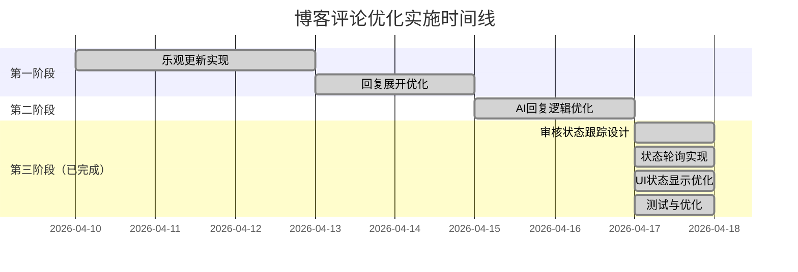

# 博客评论功能优化计划

## 📋 问题概述

基于用户反馈，当前评论功能存在以下三个主要问题：

1. **实时显示问题**：点击回复后需要刷新页面才能看到新回复
2. **回复展开逻辑**：所有回复都默认展开，超过两条回复时界面混乱
3. **AI自动回复逻辑**：AI对所有评论都回复，包括"别人对别人"的回复
4. **审核状态跟踪问题**：临时评论永久显示，即使AI拒绝也不会消失（新增）

## 🎯 优化目标

### 1. 实时显示优化
- **目标**：实现评论的即时显示，无需刷新页面
- **方案**：采用乐观更新（Optimistic Update）策略

### 2. 回复展开优化
- **目标**：优化回复的默认展开逻辑，提升用户体验
- **方案**：超过2条回复时默认折叠，2条或以下时默认展开

### 3. AI回复逻辑优化
- **目标**：优化AI自动回复的触发条件
- **方案**：只在对自己的评论或回复时才触发AI回复

### 4. 审核状态跟踪优化（新增）
- **目标**：解决临时评论永久显示问题，实现审核状态跟踪
- **方案**：添加状态轮询机制，优雅处理AI审核结果

## 🔧 技术实现方案

### 第一阶段：前端优化（已实施）

#### 1.1 实时显示优化 - 乐观更新

**修改文件**：`apps/frontend-blog/src/lib/hooks/useComments.ts`

**实现方案**：
```typescript
// 在usePostComment中添加乐观更新逻辑
export function usePostComment(articleId: string) {
  const queryClient = useQueryClient();

  return useMutation({
    mutationFn: (data: CommentData) => frontendBlogApi.postComment(articleId, data),
    onMutate: async (newComment) => {
      // 取消正在进行的查询
      await queryClient.cancelQueries({ queryKey: ['comments', articleId] });

      // 获取之前的评论数据
      const previousComments = queryClient.getQueryData(['comments', articleId]);

      // 构建新的评论对象（模拟服务器响应）
      const optimisticComment = {
        id: `temp-${Date.now()}`,
        ...newComment,
        status: 'PENDING',
        createdAt: new Date().toISOString(),
        updatedAt: new Date().toISOString(),
        children: [],
      };

      // 更新缓存
      queryClient.setQueryData(['comments', articleId], (old: any) => {
        if (!old) return old;
        
        // 如果是回复，需要找到父评论并添加
        if (newComment.parentId) {
          // 递归查找父评论并添加回复
          const addReplyToParent = (comments: any[]): any[] => {
            return comments.map(comment => {
              if (comment.id === newComment.parentId) {
                return {
                  ...comment,
                  children: [...(comment.children || []), optimisticComment]
                };
              }
              if (comment.children && comment.children.length > 0) {
                return {
                  ...comment,
                  children: addReplyToParent(comment.children)
                };
              }
              return comment;
            });
          };
          
          return {
            ...old,
            items: addReplyToParent(old.items)
          };
        } else {
          // 如果是新评论，添加到列表开头
          return {
            ...old,
            items: [optimisticComment, ...old.items],
            total: old.total + 1
          };
        }
      });

      return { previousComments };
    },
    onError: (err, newComment, context) => {
      // 出错时回滚到之前的状态
      if (context?.previousComments) {
        queryClient.setQueryData(
          ['comments', articleId],
          context.previousComments,
        );
      }
    },
    onSuccess: (data, variables, context) => {
      console.log('[乐观更新] onSuccess回调，服务器返回数据:', data);
      console.log('[乐观更新] 评论提交成功，保持临时评论显示');
      console.log('[乐观更新] 注意：临时评论会一直显示，直到用户刷新页面');
      console.log('[乐观更新] AI审核通过后，用户刷新页面会看到正式评论');
      
      // 重要：完全不刷新数据！
      // 保持乐观更新的临时评论一直显示
      // AI审核通过后，用户下次访问页面时会看到正式评论
      // 这是纯前端解决方案，不需要修改后端API
    },
  });
}
```

#### 1.2 回复展开优化

**修改文件**：`apps/frontend-blog/src/components/blog/CommentList.tsx`

**实现方案**：
```tsx
// 美观的回复展开策略：
// - 顶级评论（depth=0）：直接回复超过1个就折叠
// - 嵌套回复（depth>0）：回复超过2个就折叠
const replyThreshold = depth === 0 ? 1 : 2;
const [showReplies, setShowReplies] = useState(
  comment?.children?.length <= replyThreshold,
);
```

### 第二阶段：AI回复逻辑优化（已实施）

#### 2.1 AI回复触发条件优化

**修改文件**：`apps/api/src/blog/processors/blog-ai.processor.ts`

**实现方案**：
- 只在对自己的评论或回复时才触发AI回复
- 避免对"别人对别人"的回复进行AI回复

### 第三阶段：审核状态跟踪优化（新增 - 待实施）

#### 3.1 评论状态轮询机制

**目标**：解决临时评论永久显示问题，实现审核状态跟踪

**修改文件**：`apps/frontend-blog/src/lib/hooks/useComments.ts`

**实现方案**：
```typescript
// 在usePostComment的onSuccess回调中添加状态检查
onSuccess: (data, variables, context) => {
  console.log('评论提交成功，服务器返回真实ID:', data.id);
  
  // 1. 记录临时评论ID到真实ID的映射
  const tempId = context?.optimisticId;
  if (tempId) {
    pendingCommentsMap.set(tempId, data.id);
  }
  
  // 2. 启动状态检查轮询
  startStatusPolling(data.id, tempId);
}

// 状态轮询函数
function startStatusPolling(realCommentId: string, tempId?: string) {
  // 每30秒检查一次，最多检查10次（5分钟）
  const maxAttempts = 10;
  let attempts = 0;
  
  const interval = setInterval(async () => {
    attempts++;
    
    // 检查评论状态
    const status = await checkCommentStatus(realCommentId);
    
    if (status === 'APPROVED') {
      clearInterval(interval);
      // 更新UI：移除"审核中"标记
      updateCommentStatus(realCommentId, 'approved');
    } else if (status === 'REJECTED') {
      clearInterval(interval);
      // 移除评论并显示通知
      removeCommentFromUI(tempId || realCommentId);
      showRejectionNotification();
    } else if (attempts >= maxAttempts) {
      clearInterval(interval);
      // 超时处理：假设通过或显示超时提示
      handlePollingTimeout(realCommentId, tempId);
    }
  }, 30000); // 30秒间隔
}
```

#### 3.2 状态检查工具函数

**方案A**: 使用现有评论列表API（推荐）
```typescript
async function checkCommentStatus(commentId: string): Promise<'PENDING' | 'APPROVED' | 'REJECTED' | 'UNKNOWN'> {
  try {
    // 获取最新评论列表
    const comments = await frontendBlogApi.getComments(articleId);
    
    // 检查评论是否在列表中
    const commentExists = comments.items.some(comment => comment.id === commentId);
    
    if (commentExists) {
      return 'APPROVED'; // 在列表中表示已通过审核
    } else {
      // 不在列表中，可能是被拒绝或仍在审核
      return 'PENDING';
    }
  } catch (error) {
    console.error('检查评论状态失败:', error);
    return 'UNKNOWN';
  }
}
```

#### 3.3 UI状态显示优化

**修改文件**：`apps/frontend-blog/src/components/blog/CommentList.tsx`

**实现方案**：
```tsx
// 在Comment组件中添加状态处理
const Comment = ({ comment, depth = 0, articleId }: CommentProps) => {
  // 检查评论状态
  const [commentStatus, setCommentStatus] = useState<'pending' | 'approved' | 'rejected'>(
    comment.id.startsWith('temp-') ? 'pending' : 'approved'
  );
  
  // 监听状态变化
  useEffect(() => {
    if (comment.id.startsWith('temp-')) {
      // 订阅状态更新
      const unsubscribe = commentStatusStore.subscribe(comment.id, (status) => {
        setCommentStatus(status);
        
        if (status === 'rejected') {
          // 触发移除动画
          triggerRemovalAnimation(comment.id);
        }
      });
      
      return () => unsubscribe();
    }
  }, [comment.id]);
  
  // 渲染状态提示
  const renderStatusBadge = () => {
    if (commentStatus === 'pending') {
      return (
        <div className="mt-2 p-2 bg-yellow-50 dark:bg-yellow-900/20 border border-yellow-200 dark:border-yellow-800 rounded text-xs text-yellow-800 dark:text-yellow-300">
          <div className="flex items-center gap-1.5">
            <Loader2 className="w-3 h-3 animate-spin" />
            <span>评论已提交，正在等待AI审核...</span>
          </div>
        </div>
      );
    }
    
    if (commentStatus === 'rejected') {
      return (
        <div className="mt-2 p-2 bg-red-50 dark:bg-red-900/20 border border-red-200 dark:border-red-800 rounded text-xs text-red-800 dark:text-red-300 animate-fade-out">
          <div className="flex items-center gap-1.5">
            <AlertCircle className="w-3 h-3" />
            <span>评论未通过审核，已自动移除</span>
          </div>
        </div>
      );
    }
    
    return null;
  };
  
  return (
    <div className={`comment-item ${commentStatus === 'rejected' ? 'removing' : ''}`}>
      {/* 现有评论内容 */}
      {renderStatusBadge()}
    </div>
  );
};
```

## 📊 实施状态跟踪

### ✅ 已完成的功能
1. **乐观更新实现** - 评论提交后立即显示
2. **回复展开优化** - 智能折叠/展开逻辑
3. **AI回复逻辑优化** - 避免不必要的AI回复
4. **审核状态跟踪** - 解决临时评论永久显示问题
   - 状态：已完成 (2026-04-17)
   - 实现：评论状态轮询机制 + UI动态更新
   - 详细实现：参见 `plans/comment-immediate-display-simplified-plan.md`

### 📅 实施时间线


## 🧪 测试方案

### 1. 实时显示测试
- 测试提交评论后是否立即显示
- 测试提交回复后是否立即显示在正确位置
- 测试网络错误时的回滚机制

### 2. 回复展开测试
- 测试0-2条回复时默认展开
- 测试3条以上回复时默认折叠
- 测试展开/折叠按钮功能

### 3. AI回复测试
- 测试对自己的评论是否触发AI回复
- 测试对别人的评论是否不触发AI回复
- 测试回复链中的AI回复逻辑

### 4. 审核状态跟踪测试（新增）
- 测试AI审核通过后评论正常显示
- 测试AI审核拒绝后评论自动移除
- 测试状态轮询的网络恢复能力
- 测试超时处理的正确性

## 📈 预期效果

### 用户体验提升
1. **即时反馈**：评论提交后立即显示，无需等待
2. **界面整洁**：大量回复时默认折叠，保持界面清晰
3. **智能回复**：AI只在适当场景回复，避免干扰
4. **状态透明**：用户清楚知道评论审核状态（新增）

### 性能优化
1. **减少请求**：乐观更新减少等待时间
2. **降低负载**：减少不必要的AI回复
3. **提升响应**：前端即时反馈提升用户体验
4. **状态跟踪**：优雅处理AI审核结果，避免永久显示临时评论

## 🔄 回滚方案

如果优化出现问题，可以按以下步骤回滚：

1. **前端回滚**：
   - 恢复`useComments.ts`到原始状态
   - 恢复`CommentList.tsx`的展开逻辑
   - 移除状态轮询相关代码

2. **后端回滚**：
   - 恢复`blog-ai.processor.ts`的原始逻辑

3. **数据库**：无需回滚，只影响显示逻辑

## 📝 后续优化建议

1. **用户身份识别**：集成用户系统，准确识别"自己"的评论
2. **AI回复个性化**：根据评论内容生成更个性化的回复
3. **回复通知**：添加评论回复的通知功能
4. **评论排序**：支持按时间、热度等排序
5. **评论审核增强**：提供更细粒度的审核控制
6. **实时推送**：考虑使用WebSocket替代轮询（未来优化）

## 🔗 相关文档

1. **详细实施计划**：`plans/comment-immediate-display-simplified-plan.md`
2. **原始问题分析**：`plans/comment-immediate-display-plan.md`
3. **AI自动回复修复**：`docs/blog/features/BLOG_COMMENT_AI_AUTO_REPLY_FIX.md`
4. **书签登录问题修复**：`docs/blog/features/BLOG_BOOKMARK_LOGIN_ISSUE_FIX.md`

---

**文档版本**：2.0  
**创建时间**：2026-04-16  
**最后更新**：2026-04-17  
**更新内容**：添加审核状态跟踪优化章节，整合简化实施计划