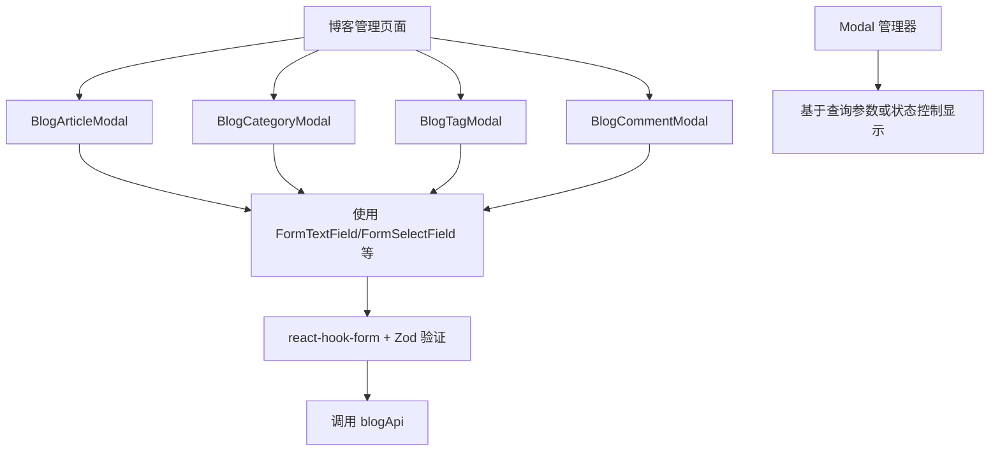

# 博客系统模态框改进计划

## 当前问题分析

### 1. 性能问题

- **`window.location.href` 全页面跳转**：在 `blog/page.tsx` (第197-198行) 和 `blog/articles/page.tsx` (第168-169行) 中使用，导致SPA体验差、加载慢。
- **缺少客户端导航**：未使用 Next.js 的 `useRouter` 进行无刷新跳转。

### 2. 表单验证缺失

- **无 Zod 验证**：博客相关页面（创建/编辑文章、分类、标签）均未使用项目已有的 Zod + react-hook-form 验证方案。
- **原生表单元素**：直接使用 `<input>`、`<textarea>`，缺少统一的错误提示、禁用状态和标签管理。

### 3. 组件使用不一致

- **未使用 `FormTextField` 等封装组件**：项目已在 `packages/ui/src/form/` 下提供了一套完整的表单组件，但博客页面未采用。
- **模态框未普及**：除 `EditAdminUserModal.tsx` 外，博客管理操作均为独立页面或内联表单，导致用户体验割裂。

### 4. 数据管理混乱

- **状态管理分散**：每个页面独立管理 loading、error、data 状态，未利用 `useRequest` 或 SWR 进行缓存和重试。
- **API 调用不一致**：虽然已封装 `blogApi`，但部分页面仍存在模拟数据残留（已在前次修复中清理）。

### 5. 代码结构杂乱

- **类型安全不足**：多处使用 `any`，未充分利用 TypeScript 类型定义。
- **重复代码**：创建/编辑文章、分类、标签的表单逻辑大量重复。

## 解决方案概览

### 核心目标

1. **替换 `location.href` 为客户端导航或模态框**，提升性能与用户体验。
2. **引入 Zod 验证**，统一表单验证逻辑。
3. **采用 `FormTextField` 等封装组件**，保证 UI 一致性。
4. **将管理操作模态框化**，减少页面跳转，保持上下文。
5. **优化数据获取**，使用 `useRequest` 或 SWR 简化状态管理。

### 架构设计

#### 组件层级



#### 新组件列表

1. **`BlogArticleModal`** – 文章创建/编辑
   - 字段：标题、内容（富文本）、摘要、分类、标签、状态、封面图
   - 验证：标题必填、内容必填、分类可选、标签数组
   - 集成现有的 `RichTextEditor` 组件

2. **`BlogCategoryModal`** – 分类创建/编辑
   - 字段：名称、slug、描述
   - 验证：名称必填、slug 格式

3. **`BlogTagModal`** – 标签创建/编辑
   - 字段：名称、颜色（可选）、描述
   - 验证：名称必填

4. **`BlogCommentModal`** – 评论审核/回复
   - 字段：审核状态、回复内容
   - 操作：批准、拒绝、标记为垃圾、删除

#### 表单验证模式

每个模态框对应一个 Zod Schema，例如：

```typescript
const articleSchema = z.object({
  title: z.string().min(1, "标题不能为空").max(200),
  content: z.string().min(1, "内容不能为空"),
  excerpt: z.string().max(500).optional(),
  categoryId: z.string().optional(),
  tagIds: z.array(z.string()).default([]),
  status: z.enum(["draft", "published", "scheduled"]),
  featuredImage: z.string().url().optional(),
});
```

#### 集成方式

- **页面级状态**：每个页面使用 `useState` 控制对应模态框的打开/关闭。
- **查询参数驱动**：可选方案，通过 `useSearchParams` 传递 `modal` 和 `id` 参数，实现深链接。
- **统一模态框管理**：可参考 `packages/ui/src/components/Modal/modal-manager.tsx` 实现集中管理。

## 实施步骤（详细）

### 阶段一：基础架构与 Zod 验证

1. 创建 Zod Schema 定义文件 `apps/admin-next/src/schemas/blog.ts`
2. 创建共享的表单钩子 `useBlogForm`，集成 `react-hook-form` 和 `zodResolver`
3. 创建通用的 `BlogFormFields` 组件，包装 `FormTextField`、`FormSelectField` 等

### 阶段二：模态框组件开发

1. 创建 `BlogCategoryModal`（最简单，用于验证技术方案）
2. 创建 `BlogTagModal`
3. 创建 `BlogArticleModal`（最复杂，需要集成富文本编辑器）
4. 创建 `BlogCommentModal`

### 阶段三：替换 location.href 与集成模态框

1. 修改 `blog/page.tsx`：将 “Write New Article” 按钮的 `window.location.href` 替换为打开 `BlogArticleModal`
2. 修改 `blog/articles/page.tsx`：将 “New Article” 按钮同样改为打开模态框；将每条文章的 “Edit” 按钮改为打开编辑模态框
3. 修改 `blog/categories/page.tsx` 和 `blog/tags/page.tsx`：将内联创建表单替换为 “Create New” 按钮 + 对应模态框
4. 修改 `blog/comments/page.tsx`：将 “Approve”、“Reject” 等操作改为即时请求，可考虑添加批量操作模态框

### 阶段四：性能与体验优化

1. 在所有页面中使用 `useRouter` 替换剩余的任何 `location.href`
2. 引入 `useRequest`（ahooks）或 SWR 优化数据获取，减少重复请求
3. 添加加载状态、错误边界和空状态提示
4. 确保所有模态框支持键盘导航（ESC 关闭、Enter 提交）

### 阶段五：测试与文档

1. 为每个模态框编写单元测试（Jest + React Testing Library）
2. 更新 `.github/copilot-instructions.md` 中的博客系统状态
3. 编写开发者文档，说明如何使用新的模态框组件

## 风险与缓解

| 风险                               | 影响 | 缓解措施                                                                           |
| ---------------------------------- | ---- | ---------------------------------------------------------------------------------- |
| 富文本编辑器在模态框中可能体验不佳 | 中   | 测试现有 `RichTextEditor` 在模态框内的表现；若有问题，考虑使用独立页面或全屏模态框 |
| 模态框深链接支持复杂               | 低   | 第一阶段暂不实现查询参数驱动，仅用组件状态控制                                     |
| 现有页面与模态框并存导致代码重复   | 中   | 抽象共享逻辑（如表单字段、验证、API 调用）到自定义钩子和组件                       |
| 类型定义不完整                     | 低   | 补充 `Article`、`Category`、`Tag`、`Comment` 的完整 TypeScript 接口                |

## 预期收益

1. **性能提升**：消除全页面跳转，减少加载时间。
2. **开发效率**：统一表单模式，减少重复代码。
3. **用户体验**：管理操作更流畅，上下文不丢失。
4. **代码质量**：强类型验证、组件化、易于维护。

## 后续扩展方向

1. **批量操作**：支持批量删除文章、批量审核评论等。
2. **实时预览**：在文章编辑模态框中添加实时 Markdown 预览。
3. **键盘快捷键**：为常用操作（如新建、保存）添加键盘快捷键。
4. **拦截路由**：利用 Next.js 15 的拦截路由实现更自然的模态框体验（如 `/blog/articles/[id]/edit` 在当前页面显示为模态框）。

---

**下一步**：请审阅此计划，确认优先级和范围。若无异议，可切换到代码模式开始实施。
