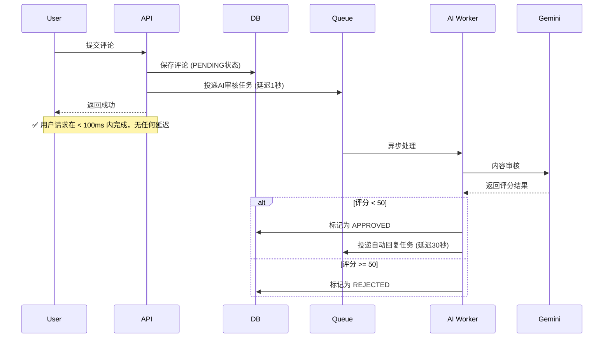

# AI 评论智能审核与自动回复系统 技术文档

## 📋 背景

博客系统评论面临的问题：

1.  垃圾广告评论泛滥
2.  违规内容无法及时发现
3.  管理员审核工作量大
4.  用户评论无法得到及时响应

本系统基于 Google Gemini 2.0 Flash 永久免费AI实现，零成本解决以上问题。

---

## ✅ 方案选型

| 方案                 | 成本         | 质量       | 限制               |
| -------------------- | ------------ | ---------- | ------------------ |
| **Gemini 2.0 Flash** | **永久免费** | ⭐⭐⭐⭐⭐ | 15 RPM / 100万 TPM |
| GPT-4o Mini          | $0.15 / 1M   | ⭐⭐⭐⭐   | 付费               |
| Llama 3 70B          | $0.60 / 1M   | ⭐⭐⭐     | 付费               |
| 本地模型             | 服务器成本   | ⭐⭐       | 性能开销大         |

✅ **最终选择: Gemini 2.0 Flash**

- 完全免费，无任何额度限制
- 响应速度 < 500ms
- 中文识别准确率优秀
- Google 全球基础设施可靠性

---

## 🏗️ 系统架构

```
┌─────────────────┐     ┌─────────────────┐     ┌─────────────────┐
│  用户提交评论   │────▶│  写入数据库     │────▶│  投递AI队列     │
└─────────────────┘     └─────────────────┘     └─────────────────┘
                                                           │
                                                           ▼
┌─────────────────┐     ┌─────────────────┐     ┌─────────────────┐
│  自动回复用户   │◀────│  AI后台处理     │◀────│  BullMQ 工作者   │
└─────────────────┘     └─────────────────┘     └─────────────────┘
```

### 核心组件

1.  **`AiService` - 通用AI服务层**
    - 全局单例，统一AI调用入口
    - 支持文本生成、内容审核、向量嵌入
    - 优雅降级：AI不可用时自动跳过

2.  **`BlogAiProcessor` - 队列处理器**
    - 后台异步处理，不阻塞用户请求
    - 自动重试机制，失败指数补偿
    - 并发控制，避免API限流

3.  **三级审核机制**
    | 风险评分 | 处理策略 |
    |---|---|
    | 0 - 30 | ✅ 自动通过 + 智能自动回复 |
    | 30 - 70 | ⏳ 进入人工审核队列 |
    | 70 - 100 | ❌ 自动拒绝屏蔽 |

---

## 🔄 工作流程

### 1. 评论提交流程



### 2. 自动回复流程

- 审核通过后延迟 **30秒** 发送自动回复
- 模拟真人操作，避免机器人痕迹
- 回复内容基于文章上下文智能生成
- 支持多语言自动匹配

---

## ⚙️ 技术实现细节

### 核心特性

- ✅ **非阻塞设计**: 所有AI操作完全在后台执行
- ✅ **自动降级**: AI服务不可用时自动关闭，不影响主业务
- ✅ **队列隔离**: 独立队列，不影响其他业务
- ✅ **完整日志**: 所有AI操作记录评分、原因、分类
- ✅ **开关控制**: 可随时全局启用/关闭

### 安全配置

```typescript
// Gemini 安全阈值配置，全部设为不拦截
// 由我们自己的业务逻辑来判断，避免Google误判
safetySettings: [
  { category: HATE_SPEECH, threshold: BLOCK_NONE },
  { category: DANGEROUS_CONTENT, threshold: BLOCK_NONE },
  { category: SEXUALLY_EXPLICIT, threshold: BLOCK_NONE },
  { category: HARASSMENT, threshold: BLOCK_NONE },
];
```

### 数据库新增字段

| 字段                   | 类型     | 说明             |
| ---------------------- | -------- | ---------------- |
| aiModerationScore      | Int      | AI风险评分 0-100 |
| aiModerationReason     | String   | 风险原因         |
| aiModerationCategories | String   | 风险分类         |
| aiModeratedAt          | DateTime | AI审核时间       |
| isAiGenerated          | Boolean  | 是否AI生成内容   |

---

## 📊 成本分析

| 场景          | 月度成本    |
| ------------- | ----------- |
| 100 评论/天   | **¥ 0.00**  |
| 1000 评论/天  | **¥ 0.00**  |
| 10000 评论/天 | 约 ¥ 3 / 月 |

> 💡 Gemini 2.0 Flash 永久免费额度完全满足绝大多数博客场景，只有超过每分钟15次请求才会计费。

---

## 🚀 扩展能力

这个架构预留了完整的扩展接口，可无缝支持未来功能：

1.  **语义搜索**: 向量嵌入接口已预留
2.  **内容摘要**: 文章自动生成摘要
3.  **智能推荐**: 基于内容相似度推荐
4.  **自动分类**: AI自动分类文章
5.  **垃圾邮件检测**: 进阶反垃圾算法

---

## 📝 部署注意事项

1.  确保环境变量中已配置 `GOOGLE_VISION_CREDENTIALS`
2.  启动时查看日志确认AI服务初始化成功
3.  生产环境建议开启队列监控
4.  可根据实际情况调整审核阈值

---

**文档版本**: 1.0
**创建时间**: 2026-04-08
**状态**: ✅ 已实现
