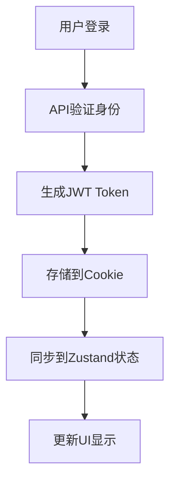
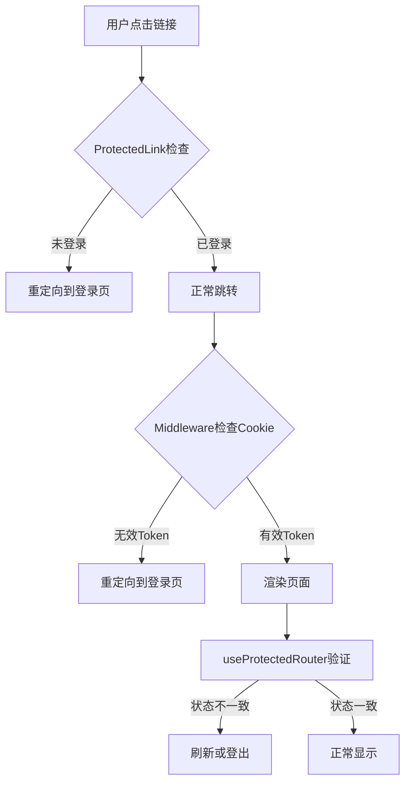

# Blog认证系统文档索引

> 📅 创建时间：2026-04-20
> 🎯 目标：为Blog认证系统提供统一的文档导航和概述
> 🔄 版本：v1.0

## 📋 文档概述

Blog认证系统由三个核心组件构成，每个组件有专门的文档说明：

```
┌─────────────────────────────────────────────────────────┐
│                    Blog认证系统                          │
├──────────────┬──────────────┬───────────────────────────┤
│  Token存储   │  认证拦截     │  JWT权限控制              │
│  策略        │  架构        │  系统                     │
├──────────────┼──────────────┼───────────────────────────┤
│ 存储机制演进  │ 四层防护体系  │ 后端API保护               │
│ 跨平台兼容    │ 零闪烁体验   │ 细粒度权限                 │
│ Cookie统一   │ 客户端拦截    │ 审计日志                  │
└──────────────┴──────────────┴───────────────────────────┘
```

## 📚 核心文档

### 1. [认证Token存储策略](./AUTH_TOKEN_STORAGE_STRATEGY.md)

**版本**: v2.0 (2026-04-20)
**核心内容**: 从双重存储(localStorage + Cookie)到单一Cookie存储的架构演进

#### 关键主题

- **存储机制统一**：完全使用Cookie，与语言设置保持一致
- **跨平台兼容**：Web和App环境使用相同存储策略
- **服务器可读**：Middleware可以正确读取认证状态
- **安全配置**：Cookie安全属性配置矩阵

#### 适用场景

- 需要了解认证状态如何存储和同步
- 需要配置跨平台存储策略
- 需要调试认证状态不一致问题

### 2. [认证拦截四层防护架构](../../nextjs/AUTH_INTERCEPTION_ARCHITECTURE.md)

**版本**: v2.0
**核心内容**: 实现"跳转前拦截"，消除页面闪烁的用户体验问题

#### 关键主题

- **四层防护**：Link → Middleware → Router → Layout
- **零闪烁体验**：用户永远不会看到未授权页面
- **客户端拦截**：ProtectedLink组件和useProtectedRouter Hook
- **服务端拦截**：Middleware的Cookie检查

#### 适用场景

- 需要新增受保护路由
- 需要优化认证拦截用户体验
- 需要理解认证拦截的执行顺序

### 3. [JWT认证与权限系统](./JWT_PERMISSION_IMPLEMENTATION.md)

**版本**: v1.0
**核心内容**: 后端API的JWT验证和细粒度权限控制

#### 关键主题

- **API保护**：所有管理接口都受JWT保护
- **权限控制**：基于角色的细粒度权限系统
- **审计日志**：完整的操作审计和追溯能力
- **安全标准**：遵循行业最佳实践的安全配置

#### 适用场景

- 需要新增受保护的API接口
- 需要配置用户权限和角色
- 需要审计用户操作记录

## 🔄 认证流程总览

### 用户登录流程



### 受保护路由访问流程



## 🛠️ 开发指南

### 新增受保护路由

1. **前端路由保护**

   ```typescript
   // 1. 在protected-routes.ts中添加路由
   export const PROTECTED_ROUTES = [
     '/bookmarks',
     '/profile',
     '/settings',
     // 新增路由
     '/new-protected-route',
   ];

   // 2. 使用ProtectedLink组件
   <ProtectedLink href="/new-protected-route">
     保护的内容
   </ProtectedLink>
   ```

2. **后端API保护**
   ```typescript
   @ApiTags('Admin - 新功能')
   @ApiBearerAuth()
   @UseGuards(JwtAuthGuard, PermissionsGuard)
   @Controller('admin/new-feature')
   export class NewFeatureController {
     @Get()
     @RequirePermission('new-feature', 'view')
     async list() { ... }
   }
   ```

### 调试认证问题

1. **检查Cookie状态**

   ```javascript
   // 浏览器控制台
   console.log(document.cookie); // 查看所有Cookie
   console.log(getTokenCookie()); // 查看认证Token
   ```

2. **检查Zustand状态**

   ```javascript
   // React组件中
   const { accessToken, user, isAuthenticated } = useAuthStore();
   console.log({ accessToken, user, isAuthenticated });
   ```

3. **检查Middleware日志**
   ```typescript
   // middleware.ts中启用调试
   console.log("Middleware检查:", {
     pathname: request.nextUrl.pathname,
     hasToken: !!token,
     isProtected: isProtectedRoute(request.nextUrl.pathname),
   });
   ```

## 📊 监控指标

### 技术指标

- **认证成功率**：登录成功/失败比例
- **拦截准确率**：Middleware正确拦截未授权请求的比例
- **状态一致性**：Cookie和Zustand状态不一致的事件数
- **响应时间**：认证检查的平均响应时间

### 用户体验指标

- ✅ **零闪烁率**：用户看到未授权页面闪烁的比例
- ✅ **登录成功率**：用户首次登录成功的比例
- ✅ **会话保持率**：用户会话保持时间的分布

## 🔗 相关资源

### 代码文件

- `apps/frontend-blog/src/lib/stores/auth.store.ts` - 认证状态管理
- `apps/frontend-blog/src/lib/utils/cookie-manager.ts` - Cookie管理工具
- `apps/frontend-blog/src/lib/stores/cookie-storage.ts` - Cookie存储适配器
- `apps/frontend-blog/middleware.ts` - 认证拦截中间件
- `apps/frontend-blog/src/lib/auth/protected-routes.ts` - 受保护路由定义

### 工具脚本

- `apps/frontend-blog/scripts/test-cookie-auth.js` - 认证存储策略测试
- `scripts/verify-jwt-auth.sh` - JWT认证验证脚本

## 📝 版本历史

### v1.0 (2026-04-20)

- **初始版本**：创建认证系统文档索引
- **包含**：三份核心文档的摘要和导航
- **包含**：认证流程总览和开发指南
- **包含**：监控指标和相关资源

---

> 💡 **使用建议**：新开发者应从本索引文档开始，了解整个认证系统的架构，然后根据需要深入阅读特定文档。

> 🔄 **维护指南**：更新任何认证相关代码时，请同步更新对应的文档，并检查本索引文档是否需要更新。

> 🎯 **目标**：通过清晰的文档结构，降低系统理解成本，提高开发和维护效率。
