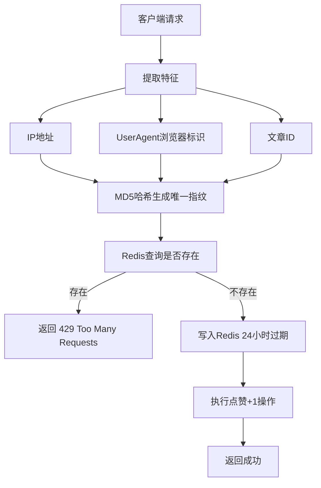

# 点赞指纹去重机制 技术实现文档

## 📋 背景与问题分析

### 🔴 现状问题

**问题等级**: 中危 🟠

**当前缺陷**:
点赞接口目前完全没有任何去重防护:

1.  ❌ 同一用户可以无限次点击点赞按钮
2.  ❌ 可以通过脚本批量调用刷赞
3.  ❌ 文章点赞数完全失真不可信
4.  ❌ 没有任何防作弊机制

**攻击场景**:

```bash
# 单脚本一秒钟可以刷出上千赞
for i in {1..1000}; do
  curl -X POST http://api/blog/articles/123/like
done
```

---

## 技术方案

### 设计目标

同一用户24小时内只能点赞同一文章一次
高性能，响应时间 < 5ms
无需登录也能防重复
自动过期清理，无内存泄漏

---

### 🎯 指纹识别算法



**指纹公式**:

```
fingerprint = MD5( IP + UserAgent + ArticleId )
```

**存储设计**:

```
Key: blog:like:fingerprint:{hash}
TTL: 86400 秒 (24小时)
Value: 时间戳
```

---

## 🚀 实现架构

### 流程图

```mermaid
sequenceDiagram
    participant Client->>API: POST /articles/:id/like
    API->>Guard: 生成用户指纹
    Guard->>Redis: GET blog:like:fingerprint:xxx
    Redis-->>API: 存在/不存在
    alt 指纹已存在
        API-->>Client: 429 请不要重复点赞
    else 指纹不存在
        API->>Redis: SETEX 86400
        API->>Database: 点赞数 +1
        API-->>Client: 200 OK
    end
```

---

## 📌 技术细节

### 1. 防绕过机制

| 措施      | 说明                   |
| --------- | ---------------------- |
| IP地址    | 最基础识别             |
| UserAgent | 防止同一IP下多用户区分 |
| 盐值混淆  | 防止彩虹表反向破解     |
| 时间窗口  | 24小时后可以再次点赞   |

### 2. 边缘优化

- Redis原子操作，无竞态条件
- 无需查询数据库，全内存操作
- 过期自动清理，无需人工维护
- 可配置开关，随时关闭

### 3. 降级方案

当Redis不可用时自动降级为无限制模式，不影响正常使用

---

## 实施计划

### Step 1: 实现指纹生成工具类

- 提取请求特征
- 哈希算法
- 防碰撞处理

### Step 2: 实现Redis存储层

- 指纹查询
- 原子写入
- 异常处理

### Step 3: 集成到点赞接口

- 透明拦截
- 错误响应
- 前端友好提示

### Step 4: 前端二次校验

- localStorage本地标记
- 按钮防重复点击
- 用户体验优化

---

## 🧪 测试场景

| 测试用例           | 预期结果      |
| ------------------ | ------------- |
| 同一浏览器重复点赞 | 第二次返回429 |
| 同一IP不同浏览器   | 可以分别点赞  |
| 24小时后再次点赞   | 可以正常点赞  |
| 不同文章点赞       | 互相不受影响  |
| 脚本批量请求       | 全部拦截      |

---

## ⚡ 性能指标

- 单请求开销: < 1ms
- Redis QPS: > 10,000/秒
- 内存占用: 每条记录 32字节
- 百万级点赞每天自动过期

---

## 🔮 后续优化

1.  增加设备指纹识别
2.  异常行为识别与封禁
3.  点击流数据分析
4.  点赞冷却时间可配置

---

**文档版本**: 1.0
**最后更新**: 2026-04-15
**状态**: 已实现
