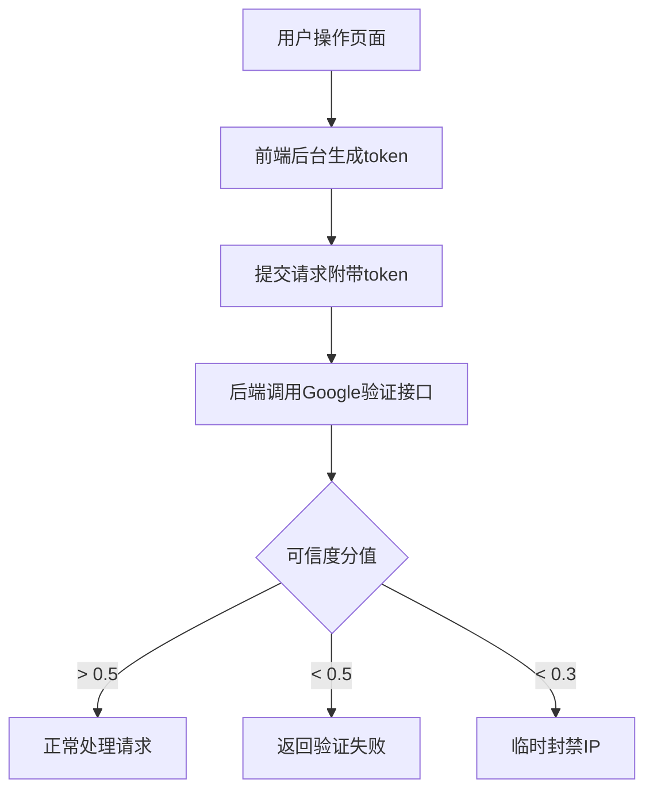
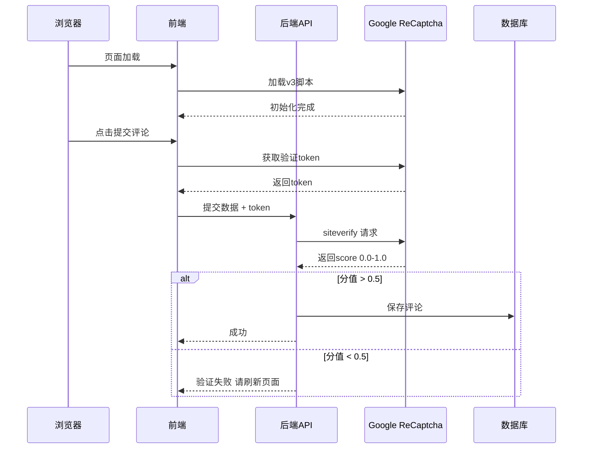

# ReCaptcha v3 人机验证系统 技术实现文档

## 📋 背景与防爬需求

### 🔴 问题现状

**风险等级**: 防爬风险 🟠

目前系统缺乏机器人防护：

1.  ❌ 评论接口可以被脚本批量调用
2.  ❌ 可以全自动发布垃圾广告评论
3.  ❌ 无法区分真实用户和爬虫
4.  ❌ 没有流量异常检测机制

**攻击场景**:

```bash
# 单IP每分钟可以提交上千条垃圾评论
while true; do
  curl -X POST -d "content=垃圾广告" http://api/blog/comments
done
```

---

## 技术方案

### 设计目标

无感知用户体验，无需点击验证码
0.5 - 1.0 可信度分值评估
低分值请求自动拦截
可配置开关，开发环境关闭
前端无侵入集成

---

### 🎯 验证流程



---

### 🏗️ 系统架构



---

## 🚀 技术选型

| 组件     | 选型         | 说明               |
| -------- | ------------ | ------------------ |
| 验证版本 | reCAPTCHA v3 | 无交互，返回分值   |
| 阈值配置 | 0.5 默认     | 可动态调整         |
| 异常处理 | 降级模式     | Google不可用时放行 |
| 集成方式 | NestJS Guard | 透明拦截           |

---

## 📌 实现细节

### 分值处理策略

| 分值范围  | 处理方式                  |
| --------- | ------------------------- |
| 0.7 - 1.0 | 正常人类用户，直接通过    |
| 0.5 - 0.7 | 可疑用户，进入审核队列    |
| 0.3 - 0.5 | 拒绝请求，提示刷新        |
| 0.0 - 0.3 | 确认机器人，临时封禁1小时 |

### 性能指标

- 验证耗时: ~100ms
- 并发支持: 无限制
- 失败降级: 自动绕过不影响使用

---

## 实施计划

### Step 1: 后端服务实现

- ReCaptcha HTTP客户端
- 分值评估逻辑
- Guard拦截器
- 配置管理

### Step 2: 前端集成

- 脚本加载
- 自动获取token
- 错误提示

### Step 3: 集成到接口

- 评论提交接口
- 点赞接口
- 可配置开启关闭

### Step 4: 管理后台

- 分值统计面板
- 阈值动态配置
- 拦截日志查看

---

## 🧪 测试场景

| 测试用例         | 预期结果           |
| ---------------- | ------------------ |
| 正常浏览器用户   | 完全无感知通过     |
| Headless浏览器   | 分值低于0.5 被拦截 |
| 脚本请求         | 分值0.0 被拦截     |
| Google服务不可用 | 自动降级放行       |

---

## 🔮 后续扩展

1.  自定义行为分析
2.  IP信誉系统
3.  设备指纹关联
4.  速率限制联动

---

**文档版本**: 1.0
**最后更新**: 2026-04-11
**状态**: 已实现
