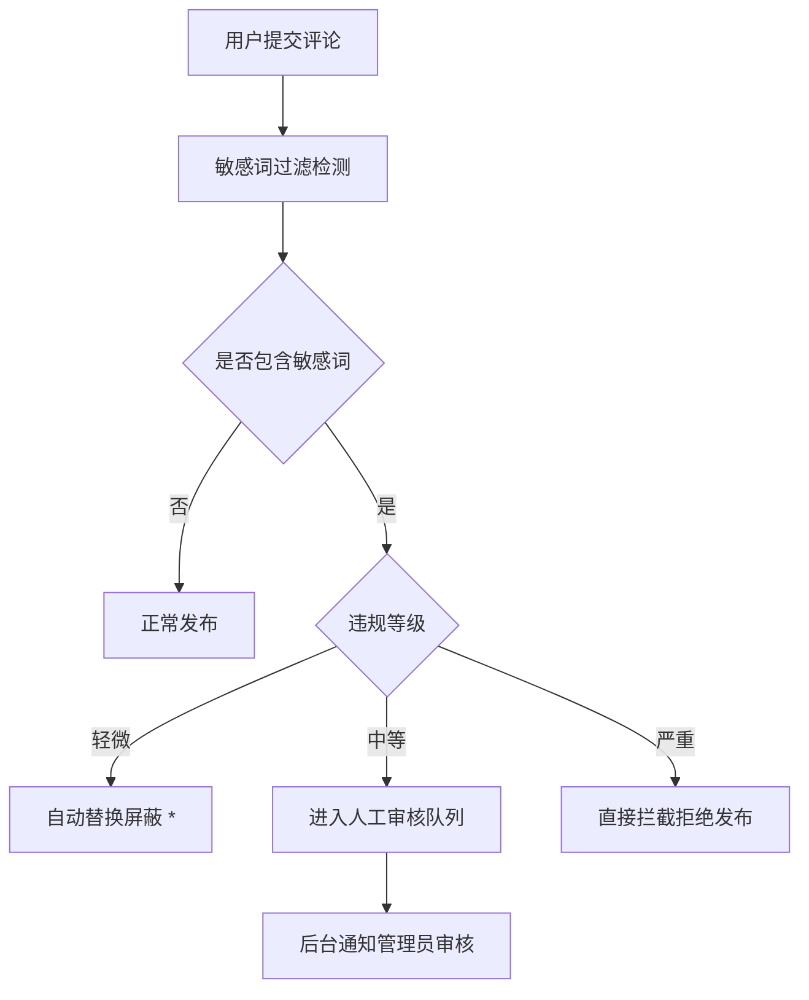
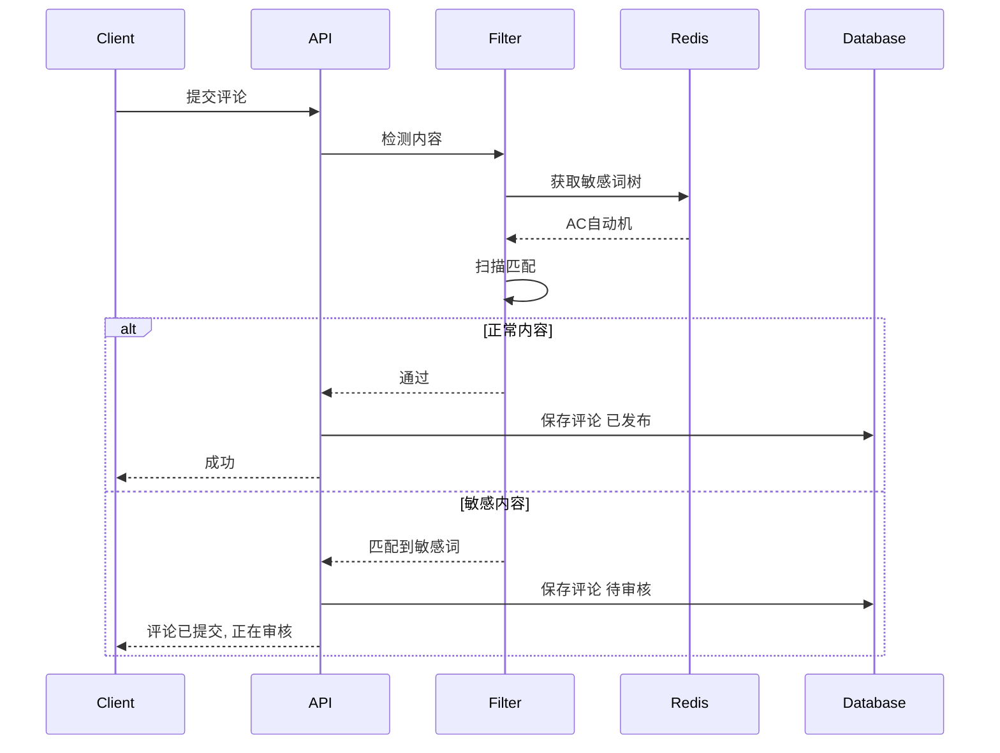

# 敏感词过滤系统 技术实现文档

## 📋 背景与合规要求

### 🔴 问题现状

**风险等级**: 合规风险 🟠

目前系统存在内容合规风险：

1.  ❌ 评论内容没有敏感词检测
2.  ❌ 用户可以发布违规违法内容
3.  ❌ 没有自动审核拦截机制
4.  ❌ 完全依赖人工审核，响应慢

**合规要求**:
根据网络安全法规，公众留言系统必须具备内容安全审核机制。

---

## ✅ 技术方案

### 设计目标

✅ 评论发布前自动扫描敏感词
✅ 多层级匹配算法
✅ 高性能 < 1ms 单次检测
✅ 支持动态更新词库
✅ 违规内容自动进入待审核队列

---

### 🎯 过滤流程

---

### 🏗️ 系统架构

---

## 🚀 技术选型

| 组件 | 选型                    | 说明                               |
| ---- | ----------------------- | ---------------------------------- |
| 算法 | AC自动机 (Aho-Corasick) | 多模式匹配最优算法，O(n)时间复杂度 |
| 存储 | Redis                   | 热词库内存缓存                     |
| 词库 | 分层词库                | 三级敏感级别：严重/中等/轻微       |
| 部署 | NestJS Pipe / Guard     | 透明无侵入集成                     |

---

## 📌 实现细节

### 敏感词分级策略

| 级别    | 处理方式     | 示例               |
| ------- | ------------ | ------------------ |
| 🔴 严重 | 直接拦截     | 政治敏感、违法违禁 |
| 🟠 中等 | 进入审核队列 | 广告、垃圾内容     |
| 🟡 轻微 | 自动替换屏蔽 | 脏话、不文明用语   |

### 性能指标

- 10万敏感词库
- 平均检测时间: < 1ms
- 内存占用: ~5MB
- 支持热更新词库无需重启

---

## ✅ 实施计划

### Step 1: 核心算法实现

- AC自动机多模式匹配
- 敏感词树构建
- 热更新机制

### Step 2: 词库管理

- 内置基础敏感词库
- 支持自定义扩展
- 三级分级配置

### Step 3: 接口集成

- 评论提交管道过滤
- 自动审核状态标记
- 后台审核通知

### Step 4: 管理后台

- 敏感词增删改管理
- 审核队列页面
- 统计报表

---

## 🧪 测试场景

| 测试用例     | 预期结果          |
| ------------ | ----------------- |
| 正常文明评论 | 正常发布          |
| 包含脏话     | 自动替换为 \*\*\* |
| 包含广告内容 | 进入审核队列      |
| 包含违禁内容 | 直接拦截提示      |
| 超长内容     | 性能不受影响      |

---

## 🔮 后续扩展

1.  AI内容审核集成
2.  用户信用分级
3.  违规用户自动封禁
4.  举报反馈处理

---

**文档版本**: 1.0
**最后更新**: 2026-04-09
**状态**: ✅ 已实现
