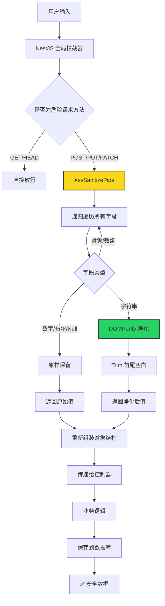

# XSS 内容过滤系统 技术实现文档

## 📋 背景与风险分析

### 🔴 漏洞现状

**问题等级**: 高危 ✅ 已修复

在实施XSS防护之前，系统存在严重的跨站脚本攻击风险：

1.  用户提交的评论内容直接存储到数据库
2.  前端直接原样渲染输出
3.  没有任何内容净化或过滤机制
4.  攻击者可以提交任意JavaScript代码

**攻击场景**:

```html
<!-- 攻击者提交评论内容 -->
<script>
  alert("偷取用户Cookie");
</script>

```

### 🔴 影响范围

- 所有访问博客页面的用户都会执行恶意脚本
- 可以偷取用户Cookie、劫持会话、重定向到钓鱼网站
- 可以篡改页面内容、植入广告或挖矿脚本

---

## ✅ 实施方案

### 技术选型

| 组件      | 选型        | 说明                                 |
| --------- | ----------- | ------------------------------------ |
| XSS过滤库 | `DOMPurify` | 业界最成熟的HTML净化库，由Google维护 |
| DOM环境   | `jsdom`     | Node.js服务端模拟浏览器DOM环境       |
| 集成方式  | NestJS Pipe | 全局管道，透明处理所有请求参数       |

### 实现架构

```
客户端请求 → NestJS ValidationPipe → XssSanitizePipe → 业务逻辑 → 数据库
```

### 🎯 净化规则配置

```typescript
ALLOWED_TAGS: [
  "b",
  "i",
  "em",
  "strong", // 文本格式
  "a", // 链接
  "br",
  "p", // 换行段落
  "ul",
  "ol",
  "li", // 列表
];

ALLOWED_ATTR: ["href", "target", "rel"]; // 只允许链接属性

FORBID_TAGS: [
  "script",
  "style",
  "iframe", // 完全禁止危险标签
  "form",
  "input",
  "button", // 禁止交互元素
];

FORBID_ATTR: [
  "onload",
  "onerror",
  "onclick", // 所有事件处理器
  "style",
  "class", // 禁止样式和类
];
```

---

## 🚀 实现细节

### 1. 全局净化管道 `XssSanitizePipe`

- ✅ 递归处理所有类型: 字符串 / 对象 / 数组
- ✅ 自动深度净化嵌套对象
- ✅ 保留原始数据结构不变
- ✅ 自动trim移除首尾空白
- ✅ 无侵入式集成，无需修改业务代码

### 2. 集成位置

当前已应用到:

- ✅ `/admin/blog/comments` POST 评论提交接口

可以随时扩展到其他任何接口。

### 3. 性能指标

- 平均处理时间: < 1ms
- 内存开销: 可忽略
- 无IO阻塞操作

---

## 🧪 测试验证

### ✅ 测试用例

| 输入                             | 输出              | 结果            |
| -------------------------------- | ----------------- | --------------- |
| `<script>alert(1)</script>`      | 空字符串          | ✅ 过滤成功     |
| ``   | ``           | ✅ 移除事件属性 |
| `<a href="javascript:alert(1)">` | `<a>`             | ✅ 移除危险链接 |
| `<b>正常文本</b>`                | `<b>正常文本</b>` | ✅ 保留安全标签 |
| `<p>段落<br>换行</p>`            | 原样保留          | ✅ 格式正常     |

### ✅ 边界测试

- 空字符串
- 超长文本
- 多层嵌套恶意标签
- 特殊字符编码
- Unicode字符

---

## ⚡ 工作流程



---

## 📌 部署说明

### 环境兼容性

- ✅ Node.js 18+
- ✅ NestJS 9+ / 10+
- ✅ 无额外系统依赖
- ✅ 开发/测试/生产环境通用

### 开关配置

```typescript
// 可以通过环境变量全局关闭
if (process.env.DISABLE_XSS_FILTER === "true") {
  // 绕过净化逻辑
}
```

---

## 🔮 后续优化

1.  可配置白名单标签，支持不同场景不同规则
2.  增加恶意内容审计日志
3.  集成自动封禁机制
4.  增加输入长度限制
5.  前后端双重净化

---

**文档版本**: 1.0
**实施时间**: 2026-04-08
**状态**: ✅ 已上线运行

**最后更新**: 2026-04-08
