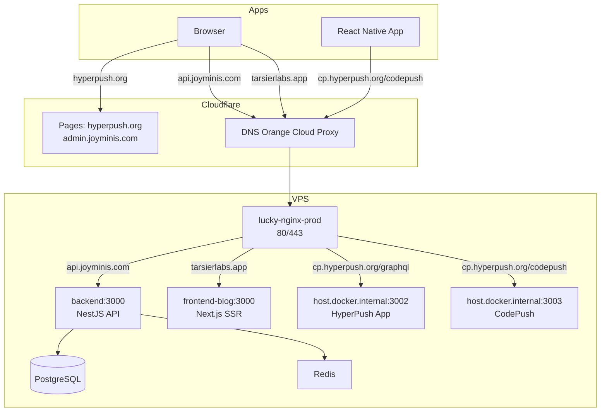

# Full-Stack Deployment & Operations Guide

> 2026-06-04 — Complete postmortem of all production incidents + the perfect deployment workflow

---

## Table of Contents

1. [System Architecture Overview](#1-system-architecture-overview)
2. [Incident Panorama](#2-incident-panorama)
3. [Incident 1: Redis Password Mismatch → Backend Crash → 521](#3-incident-1-redis-password-mismatch--backend-crash--521)
4. [Incident 2: Nginx Volume Mount Conflict → Nginx Crash](#4-incident-2-nginx-volume-mount-conflict--nginx-crash)
5. [Incident 3: Nginx Hard-Depends on Backend Health → Cascade Failure](#5-incident-3-nginx-hard-depends-on-backend-health--cascade-failure)
6. [Incident 4: CI Database Migration Failure](#6-incident-4-ci-database-migration-failure)
7. [Incident 5: HyperPush Pages Function Broken → API 521](#7-incident-5-hyperpush-pages-function-broken--api-521)
8. [Incident 6: init-cert.sh Let's Encrypt Failure](#8-incident-6-init-certsh-lets-encrypt-failure)
9. [Incident 7: Login Stuck on Login Page](#9-incident-7-login-stuck-on-login-page)
10. [Perfect Deployment Flow](#10-perfect-deployment-flow)
11. [Deployment Checklists](#11-deployment-checklists)
12. [Troubleshooting Quick Reference](#12-troubleshooting-quick-reference)

---

## 1. System Architecture Overview

### 1.1 Full Topology

```
                                 Cloudflare
                                    │
                    ┌───────────────┼───────────────┐
                    │               │               │
              Pages Proxy      Orange Cloud    Orange Cloud
                    │               │               │
               hyperpush.org   api.joyminis.com  tarsierlabs.app
                   │          cp.hyperpush.org   blog.joyminis.com
                   │               │               │
                   ▼               ▼               ▼
              ┌─────────────────────────────────────────┐
              │      VPS Nginx (lucky-nginx-prod)        │
              │ 80/443  →  Cloudflare Full SSL           │
              │                                         │
              │ conf.d/                                 │
              │ ├── 00-base.conf    (global base)       │
              │ ├── 10-api.conf     (api.joyminis.com)  │
              │ ├── 20-blog.conf    (tarsierlabs.app)   │
              │ └── 40-hyperpush.conf(hyperpush.org)    │
              └──────────┬──────────────────────────────┘
                         │
          ┌──────────────┼──────────────────┐
          │              │                  │
     backend:3000   frontend-blog:3000   host.docker.internal:3002
     (NestJS API)   (Next.js SSR)       (HyperPush Backend)
          │                              host.docker.internal:3003
     PostgreSQL:5432                     (CodePush Server)
     Redis:6379
```

### 1.2 Domain-to-Service Mapping

| Domain | Purpose | Deployment | Target |
|--------|---------|------------|--------|
| `api.joyminis.com` | Backend API | Cloudflare Orange → VPS nginx → `backend:3000` | VPS Nginx |
| `tarsierlabs.app` | Blog frontend | Cloudflare Orange → VPS nginx → `frontend-blog:3000` | VPS Nginx |
| `blog.joyminis.com` | Blog alias | Cloudflare Orange → VPS nginx → `frontend-blog:3000` | VPS Nginx |
| `admin.joyminis.com` | Admin dashboard | Cloudflare Pages (OpenNext) | Cloudflare |
| `hyperpush.org` | HyperPush dashboard | Cloudflare Pages SPA | Cloudflare Pages |
| `cp.hyperpush.org` | HyperPush API + CodePush | Cloudflare Orange → VPS nginx → `host.docker.internal:3002/3003` | VPS Nginx |

---

## 2. Incident Panorama

### 2.1 Incident Chain

```
09:00  Redis password mismatch
  → Backend crash loop
    → Nginx (depends_on backend:healthy) won't start
      → Port 80/443 down → Cloudflare 521
        → api.joyminis.com / tarsierlabs.app all down

Also: Nginx volume mount conflict (whitelist.conf)
  → After fixing Redis, nginx still crashes due to mount conflict
    → 521 again

Then: HyperPush Pages Function API_ORIGIN Secret deleted
  → hyperpush.org/graphql proxy broken
    → hyperpush.org API down

Then: init-cert.sh Let's Encrypt blocked
  → Cloudflare Orange Cloud resolves DNS to Cloudflare IPs
    → Script DNS check prevents certificate issuance

Ongoing: Login stuck on login page (code bug)
  → Double redirect race condition + locale prefix bug
```

### 2.2 Blast Radius

| Service | Downtime | Root Cause |
|---------|----------|------------|
| `api.joyminis.com` | Several hours | Redis password mismatch → Nginx won't start |
| `tarsierlabs.app` | Several hours | Same (same nginx instance) |
| `hyperpush.org/graphql` | Several hours | Pages Function Secret deleted |
| `hyperpush.org` frontend | Still pending | VITE_API_URL not yet updated to `cp.hyperpush.org` |
| User login | Ongoing | Code bug (stuck on login page after auth) |

---

## 3. Incident 1: Redis Password Mismatch → Backend Crash → 521

### 3.1 Root Cause

**Direct cause:** The `REDIS_PASSWORD` in `deploy/.env.prod` did not match the password the Redis container was actually using.

```yaml
# compose.prod.yml
redis:
  command: redis-server /etc/redis/redis.conf --requirepass "${REDIS_PASSWORD:-changeme}"
```

When `.env.prod` changed the password but the old Redis container kept running with the old password, the backend failed to connect to Redis → crash loop.

### 3.2 Cascade Chain

```
Redis password mismatch
  → Backend healthcheck fails (Redis connection timeout)
    → depends_on condition: service_healthy blocks nginx startup
      → Port 80/443 closed
        → Cloudflare detects closed ports → returns 521
```

### 3.3 Fix

```bash
# 1. Force-recreate Redis container (with new password)
docker compose -f compose.prod.yml --env-file deploy/.env.prod up -d --force-recreate redis

# 2. Verify Redis password
docker exec lucky-redis-prod redis-cli -a "${REDIS_PASSWORD}" ping
# Should return: PONG

# 3. Restart backend
docker compose -f compose.prod.yml --env-file deploy/.env.prod restart backend

# 4. Verify backend health
docker compose -f compose.prod.yml ps backend
# Should show: healthy
```

### 3.4 Architecture Improvement

**Fixed in [`compose.prod.yml`](compose.prod.yml:98-100):**

```yaml
nginx:
  depends_on:
    - backend  # Only controls startup order, does NOT wait for health
```

**Add to [`deploy/deploy.sh`](deploy/deploy.sh):**

```bash
# Verify Redis password, force-recreate if mismatch
docker exec lucky-redis-prod redis-cli -a "${REDIS_PASSWORD}" ping | grep -q PONG || {
  echo "Redis password mismatch, force-recreating..."
  docker compose -f compose.prod.yml --env-file deploy/.env.prod up -d --force-recreate redis
}
```

### 3.5 Prevention

1. Deployment script must verify Redis password before each deploy
2. Any password change must `--force-recreate` the Redis container
3. Nginx must NOT hard-depend on backend health (already fixed)

---

## 4. Incident 2: Nginx Volume Mount Conflict → Nginx Crash

### 4.1 Root Cause

**Direct cause:** [`compose.prod.yml`](compose.prod.yml) mounted both a directory and a file to the same path:

```yaml
volumes:
  - ./nginx/conf.d:/etc/nginx/conf.d:ro          # directory mount
  - ./nginx/whitelist.conf:/etc/nginx/conf.d/whitelist.conf:ro  # file conflict
```

Docker cannot reliably merge these two mount types. The `whitelist.conf` file either doesn't appear inside the container, or the entire mount fails.

### 4.2 Fix

**Fixed in [`compose.prod.yml`](compose.prod.yml:87-93):**

```yaml
volumes:
  - ./nginx/conf.d:/etc/nginx/conf.d:ro  # whitelist.conf moved into conf.d/
```

**File moves:**
- [`nginx/whitelist.conf`](nginx/whitelist.conf) → [`nginx/conf.d/whitelist.conf`](nginx/conf.d/whitelist.conf)
- [`deploy/deploy.sh`](deploy/deploy.sh) scp paths updated accordingly

### 4.3 Prevention

1. Never use separate file mounts to override files inside a directory mount
2. All `.conf` files belong inside `conf.d/`
3. After config changes, run `docker exec lucky-nginx-prod nginx -t` to verify syntax

---

## 5. Incident 3: Nginx Hard-Depends on Backend Health → Cascade Failure

### 5.1 Root Cause

```yaml
# Old config (fixed)
nginx:
  depends_on:
    backend:
      condition: service_healthy  # ★ Problem
```

Whenever the backend was unhealthy, nginx could not start → port 80/443 closed → all domains returned 521.

### 5.2 Fix

```yaml
# New config (fixed)
nginx:
  depends_on:
    - backend  # Only wait for container start, not health
```

### 5.3 Design Principle

```
Backend down → Nginx returns 502 (Bad Gateway)
  → Far better than 521 (Cloudflare can't connect to origin)
    → 502 means "server is running but upstream is broken"
      → Easier to debug, no Cloudflare false alarms
```

**Principle: Nginx must be able to start independently.** It should behave like a door — even if the room behind it is on fire, the door itself must stay open.

---

## 6. Incident 4: CI Database Migration Failure

### 6.1 Root Cause

CI scripts (`.github/workflows/deploy-backend.yml` and `.gitlab/deploy-backend.yml`) assumed `lucky-db-prod` was already running when performing database migrations. But the Docker Compose stack hadn't started yet.

```
1. docker inspect lucky-db-prod
   → Fails: "error: no such object: lucky-db-prod"
2. NETWORK=""  (awk returns empty string)
3. docker run --network "" ...
   → Fails: "docker: no name set for network"
```

The local script [`deploy/deploy.sh`](deploy/deploy.sh:182-211) and [`deploy/init-db.sh`](deploy/init-db.sh) already had correct guard logic (start db+redis first, wait for healthcheck, then run migration).

### 6.2 Fix

```bash
# 1. Ensure db + redis are running first
docker compose -f compose.prod.yml --env-file deploy/.env.prod up -d db redis

# 2. Wait for PostgreSQL readiness
for i in $(seq 1 30); do
  if docker exec lucky-db-prod pg_isready ... >/dev/null 2>&1; then
    break
  fi
  sleep 2
done

# 3. Get the network and run migration
NETWORK=$(docker inspect lucky-db-prod --format '{{range $k,$v := .NetworkSettings.Networks}}{{$k}}{{end}}' 2>/dev/null)

if [ -z "$NETWORK" ]; then
  echo "❌ Cannot determine network"
  exit 1
fi

docker run --rm --network "$NETWORK" ... prisma migrate deploy
```

### 6.3 Prevention

1. CI scripts must maintain consistent logic with local scripts
2. Always verify a container is running before operating on it
3. Use `2>/dev/null` to suppress raw Docker errors; use custom error messages
4. Reference [`deploy/init-db.sh`](deploy/init-db.sh) for the correct pattern

---

## 7. Incident 5: HyperPush Pages Function Broken → API 521

### 7.1 Root Cause

`hyperpush.org` is a Cloudflare **Pages** site. It had a Pages Function `functions/graphql/[[catchall]].ts` that intercepted all `/graphql` requests and proxied them to `API_ORIGIN` (a Cloudflare Secret).

When the `API_ORIGIN` Secret was deleted from the Cloudflare Dashboard, the Pages Function could no longer proxy requests. After deleting the Pages Function, Cloudflare Pages returned the SPA `index.html` for `/graphql` instead of an API response.

### 7.2 Fix

**Create a dedicated API subdomain `cp.hyperpush.org`:**

```
Browser → https://cp.hyperpush.org/graphql
  ↓
Cloudflare DNS (Orange Cloud)
  ↓
VPS Nginx (40-hyperpush.conf)
  ↓
host.docker.internal:3002 (hyperpush-app)
```

**Changes made:**

| File | Change |
|------|--------|
| [`nginx/conf.d/40-hyperpush.conf`](nginx/conf.d/40-hyperpush.conf) | Added `server_name cp.hyperpush.org` |
| [`../HyperPush/frontend/wrangler.toml`](../HyperPush/frontend/wrangler.toml) | Removed `vars` section |
| [`../HyperPush/frontend/functions/graphql/[[catchall]].ts`](../HyperPush/frontend/functions/graphql/[[catchall]].ts) | Deleted Pages Function |
| VPS `/opt/hyperpush/.env` | `CORS_ORIGINS=https://hyperpush.org,https://cp.hyperpush.org` |
| Self-signed cert | SAN includes `cp.hyperpush.org` |

### 7.3 Still Required

**In Cloudflare Dashboard:**
1. Set `VITE_API_URL = https://cp.hyperpush.org/graphql`
2. Redeploy Cloudflare Pages

### 7.4 Prevention

1. ⚠️ **Cloudflare Pages should NOT be used as an API proxy layer**
2. Pages Function Secrets are easy to accidentally delete
3. API gateways should use dedicated subdomains pointing directly to the backend via DNS
4. SPA frontends should call backends through a dedicated API subdomain

---

## 8. Incident 6: init-cert.sh Let's Encrypt Failure

### 8.1 Root Cause

[`deploy/init-cert.sh`](deploy/init-cert.sh) checks DNS resolution before requesting a Let's Encrypt certificate:

```bash
RESOLVED_IP=$(dig +short "$DOMAIN" @1.1.1.1 | tail -1)
SERVER_IP=$(curl -4 -fsSL https://api.ipify.org)

if [ "$RESOLVED_IP" != "$SERVER_IP" ]; then
    echo "❌ $DOMAIN does not point to this server! Update Cloudflare DNS first."
    exit 1
fi
```

All domains use Cloudflare Orange Cloud (proxy) → DNS returns Cloudflare edge IPs (`104.21.x.x`) instead of the VPS IP (`<VPS_IP>`) → script blocks.

### 8.2 Solution

**Use a self-signed certificate instead of Let's Encrypt:**

```bash
# Generate a 10-year self-signed cert (with all domain SANs)
openssl req -x509 -nodes -days 3650 -newkey rsa:2048 \
  -keyout /tmp/server.key \
  -out /tmp/server.crt \
  -subj "/CN=api.joyminis.com" \
  -addext "subjectAltName=\
DNS:api.joyminis.com,\
DNS:hyperpush.org,\
DNS:cp.hyperpush.org,\
DNS:tarsierlabs.app,\
DNS:tarsier.joyminis.com,\
DNS:admin.tarsierlabs.app,\
DNS:app.joyminis.com,\
DNS:admin.joyminis.com,\
DNS:*.joyminis.com"

# Upload to VPS
scp /tmp/server.crt root@<VPS_IP>:/opt/lucky/certs/
scp /tmp/server.key root@<VPS_IP>:/opt/lucky/certs/

# Reload nginx
ssh root@<VPS_IP> "docker exec lucky-nginx-prod nginx -s reload"
```

### 8.3 Why Self-Signed Works

Cloudflare is set to **Full** mode:
- Client ↔ Cloudflare: uses Cloudflare's valid certificate
- Cloudflare ↔ VPS: **does not verify upstream certificate content** (only checks that TLS exists)

So a self-signed certificate is fully sufficient.

### 8.4 If You Really Need Let's Encrypt

Temporarily disable Orange Cloud:
1. Cloudflare DNS → click the orange cloud icon → turns gray
2. Wait for DNS propagation (~1 minute)
3. Run `init-cert.sh`
4. Re-enable Orange Cloud

---

## 9. Incident 7: Login Stuck on Login Page

### 9.1 Root Cause

Three issues combined:

**Issue A: Double Redirect Race Condition**
- `LoginGuard` component (parent) uses `useEffect` to detect auth state and redirect
- `handleSubmit` / `handleOAuthLogin` (child) also redirect via `setTimeout`
- Two `router.push()` calls interfere → neither succeeds

**Issue B: Locale Prefix Bug**
- `redirectAfterLogin` stored in sessionStorage already includes the locale prefix (e.g. `/en/bookmarks`)
- `LoginGuard` uses next-intl's `useRouter()`, which automatically adds the locale prefix
- Result: `/en/en/bookmarks` → 404

**Issue C: Missing Production Logging**
- Many `console.log` calls gated behind `process.env.NODE_ENV === 'development'`
- Production has zero traceability for login flow behavior

### 9.2 Fix

1. Remove `setTimeout` redirect logic from `handleSubmit` and `handleOAuthLogin` in `page.client.tsx`
2. In `LoginGuard`, strip the locale prefix before redirecting
3. Add production-safe diagnostic logging

See [`plans/fix-login-stuck-on-login-page.md`](plans/fix-login-stuck-on-login-page.md) for details.

### 9.3 Prevention

1. Never handle redirect logic in both child and parent components simultaneously
2. When using next-intl router, ensure paths don't contain duplicate locale prefixes
3. Keep critical diagnostic logging in production (without exposing sensitive info)

---

## 10. Perfect Deployment Flow

### 10.1 Daily Deployment (JoyMini)

```bash
# 1. Ensure local code is up to date
git pull

# 2. Verify .env.prod configuration (especially REDIS_PASSWORD)
#    Check deploy/.env.prod

# 3. Sync nginx config (if modified)
scp nginx/conf.d/*.conf root@<VPS_IP>:/opt/lucky/nginx/conf.d/
ssh root@<VPS_IP> "docker exec lucky-nginx-prod nginx -s reload"

# 4. Run deployment script
./deploy/deploy.sh

# 5. Verify
curl -s -o /dev/null -w "HTTP %{http_code}\n" https://api.joyminis.com/api/v1/health
curl -s -o /dev/null -w "HTTP %{http_code}\n" https://tarsierlabs.app/
```

### 10.2 Emergency Recovery (when all sites return 521)

```bash
# 1. SSH to VPS
ssh root@<VPS_IP>

# 2. Check container status
docker ps --format 'table {{.Names}}\t{{.Status}}\t{{.Ports}}'

# 3. If nginx is not running, force-start it
docker compose -f /opt/lucky/compose.prod.yml up -d nginx

# 4. Check backend logs
docker logs --tail 50 lucky-backend-prod

# 5. If Redis password mismatch, force-recreate
docker compose -f /opt/lucky/compose.prod.yml --env-file /opt/lucky/deploy/.env.prod up -d --force-recreate redis
docker compose -f /opt/lucky/compose.prod.yml --env-file /opt/lucky/deploy/.env.prod restart backend

# 6. Verify health
docker ps --format 'table {{.Names}}\t{{.Status}}'
```

### 10.3 HyperPush Deployment

```bash
# 1. Update VITE_API_URL (Cloudflare Dashboard)
#    Set VITE_API_URL = https://cp.hyperpush.org/graphql

# 2. Redeploy Cloudflare Pages
#    Cloudflare Dashboard → Pages → hyperpush → Deployments → Retry

# 3. Verify
curl -s -o /dev/null -w "HTTP %{http_code}\n" https://cp.hyperpush.org/graphql \
  -X POST -H "Content-Type: application/json" -d '{"query":"{ __typename }"}'
```

### 10.4 Adding a New Subdomain — Full Procedure

```
1. Cloudflare DNS: add A record (Orange Cloud)
         ↓
2. Update self-signed cert SAN (include new domain)
         ↓
3. Upload new cert to VPS /opt/lucky/certs/
         ↓
4. Update nginx config (server_name + location block)
         ↓
5. Upload nginx config to VPS /opt/lucky/nginx/conf.d/
         ↓
6. docker exec lucky-nginx-prod nginx -s reload
         ↓
7. Verify cert SAN
         ↓
8. Verify new domain responds
         ↓
9. Update backend CORS_ORIGINS (if needed)
         ↓
10. Restart backend container
```

---

## 11. Deployment Checklists

### 11.1 Before Every Deploy

- [ ] `REDIS_PASSWORD` in `.env.prod` matches the running Redis container
- [ ] nginx config syntax is valid: `docker exec lucky-nginx-prod nginx -t`
- [ ] Self-signed cert SAN includes all domains
- [ ] All modified config files are git-committed

### 11.2 Post-Deployment Verification

- [ ] `https://api.joyminis.com/api/v1/health` → HTTP 200
- [ ] `https://tarsierlabs.app/` → blog homepage loads
- [ ] `https://tarsierlabs.app/api/v1/health` → HTTP 200
- [ ] `https://cp.hyperpush.org/graphql` → HTTP 200
- [ ] `https://cp.hyperpush.org/codepush/` → HTTP 200
- [ ] `https://hyperpush.org/` → SPA loads (requires VITE_API_URL update first)
- [ ] All Docker containers healthy

### 11.3 Weekly Checks

- [ ] Certificate expiry: `openssl x509 -in /opt/lucky/certs/server.crt -noout -enddate`
- [ ] Disk usage: `df -h` (watch `/var/lib/docker`)
- [ ] Container log sizes: `docker system df`
- [ ] All containers running: `docker ps --format 'table {{.Names}}\t{{.Status}}'`

---

## 12. Troubleshooting Quick Reference

### 12.1 HTTP Status Code Diagnosis

| Status | Meaning | Investigation Path |
|--------|---------|-------------------|
| **521** | Cloudflare can't reach origin | 1. Is VPS online? 2. Is nginx running? 3. Are ports 80/443 open? |
| **502** | Nginx can't reach upstream | 1. `docker ps` check target container 2. `docker logs` check errors |
| **504** | Upstream timeout | 1. Increase `proxy_read_timeout` 2. Check backend response time 3. Slow DB queries? |
| **444** | Nginx security rule blocked | Check `00-base.conf` scanner rules |
| **301/302** | Redirect | Check nginx `return 301` or backend redirect logic |
| **CORS** | Cross-origin error | 1. Check `CORS_ORIGINS` config 2. Check OPTIONS preflight request |

### 12.2 Common Problems

| Symptom | Most Likely Cause | Immediate Action |
|---------|------------------|-----------------|
| All sites 521 | Nginx down | `docker compose up -d nginx` |
| API returns 502 | Backend down | `docker compose restart backend` |
| Redis connection failed | Password mismatch | `docker compose up -d --force-recreate redis` |
| Blog loading slow | Slow DB queries | `docker stats` check resources |
| Login stuck on login page | Double redirect bug | Needs code fix (see Incident 7) |
| GraphQL returns 404 | Pages Function issue | Check if using `hyperpush.org` instead of `cp.hyperpush.org` |
| Certificate error | SAN missing domain | Regenerate self-signed cert & reload nginx |
| Docker disk full | Log accumulation | `docker system prune -f` |

### 12.3 Essential Commands

```bash
# === SSH ===
ssh root@<VPS_IP>

# === Containers ===
docker ps --format 'table {{.Names}}\t{{.Status}}\t{{.Ports}}'
docker logs --tail 50 <container>
docker stats

# === Nginx ===
docker exec lucky-nginx-prod nginx -t              # Syntax check
docker exec lucky-nginx-prod nginx -s reload       # Reload config
docker exec lucky-nginx-prod tail -50 /var/log/nginx/access.log

# === Certificate ===
openssl x509 -in /opt/lucky/certs/server.crt -noout -text | grep -A1 "Subject Alternative Name"
openssl x509 -in /opt/lucky/certs/server.crt -noout -enddate

# === Network ===
curl -s -o /dev/null -w "HTTP %{http_code}\n" https://api.joyminis.com/api/v1/health
curl -s -o /dev/null -w "HTTP %{http_code}\n" https://tarsierlabs.app/
curl -s -o /dev/null -w "HTTP %{http_code}\n" -X POST https://cp.hyperpush.org/graphql \
  -H "Content-Type: application/json" -d '{"query":"{ __typename }"}'

# === Docker Compose ===
docker compose -f compose.prod.yml --env-file deploy/.env.prod up -d         # Start
docker compose -f compose.prod.yml --env-file deploy/.env.prod restart <svc> # Restart
docker compose -f compose.prod.yml --env-file deploy/.env.prod down          # Stop
```

---

## Appendix

### A. Key File Index

| File | Description |
|------|-------------|
| [`compose.prod.yml`](compose.prod.yml) | Production Docker Compose (backend/nginx/redis/db) |
| [`nginx/conf.d/00-base.conf`](nginx/conf.d/00-base.conf) | Nginx global base config |
| [`nginx/conf.d/10-api.conf`](nginx/conf.d/10-api.conf) | api.joyminis.com routing |
| [`nginx/conf.d/20-blog.conf`](nginx/conf.d/20-blog.conf) | tarsierlabs.app routing |
| [`nginx/conf.d/40-hyperpush.conf`](nginx/conf.d/40-hyperpush.conf) | hyperpush.org + cp.hyperpush.org routing |
| [`nginx/conf.d/whitelist.conf`](nginx/conf.d/whitelist.conf) | IP whitelist |
| [`deploy/deploy.sh`](deploy/deploy.sh) | Main deployment script |
| [`deploy/init-db.sh`](deploy/init-db.sh) | Manual database initialization |
| [`deploy/init-cert.sh`](deploy/init-cert.sh) | Let's Encrypt first-time issuance |
| [`deploy/renew-cert.sh`](deploy/renew-cert.sh) | Let's Encrypt automatic renewal |
| [`deploy/.env.prod`](deploy/.env.prod) | Production environment variables |
| [`../HyperPush/deploy/compose.prod.yml`](../HyperPush/deploy/compose.prod.yml) | HyperPush production compose |
| [`../HyperPush/frontend/wrangler.toml`](../HyperPush/frontend/wrangler.toml) | HyperPush Pages config |

### B. Architecture Diagram (Mermaid)



---

*Last updated: 2026-06-04*
*Based on the complete postmortem of 7 production incidents*
